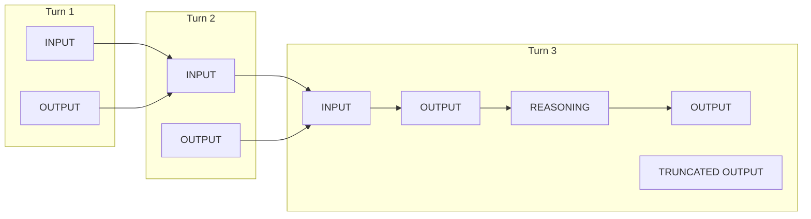
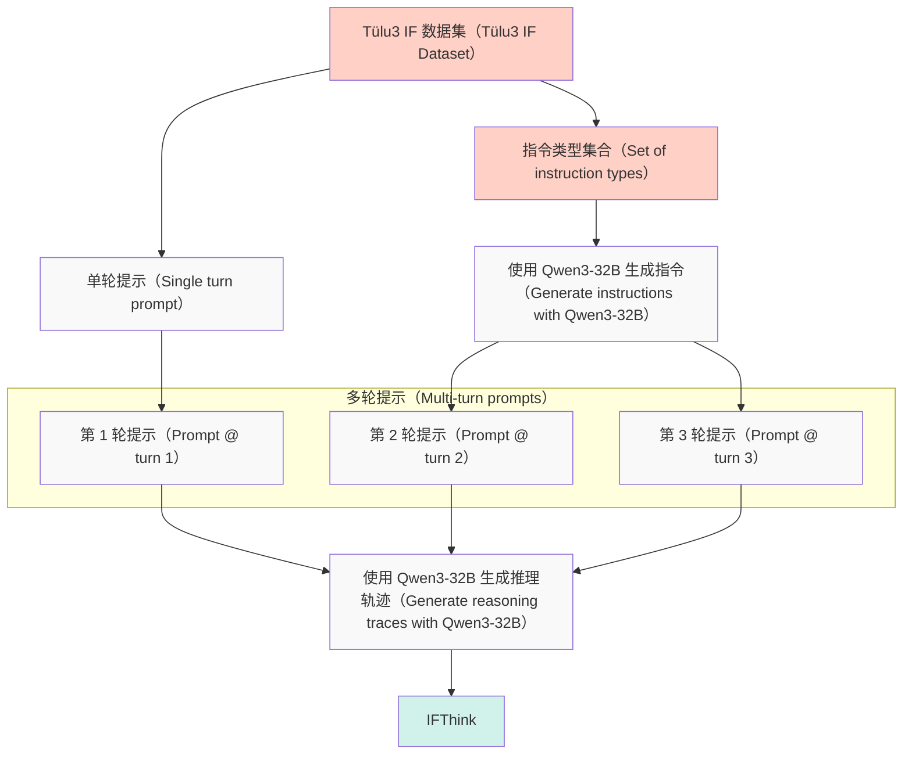
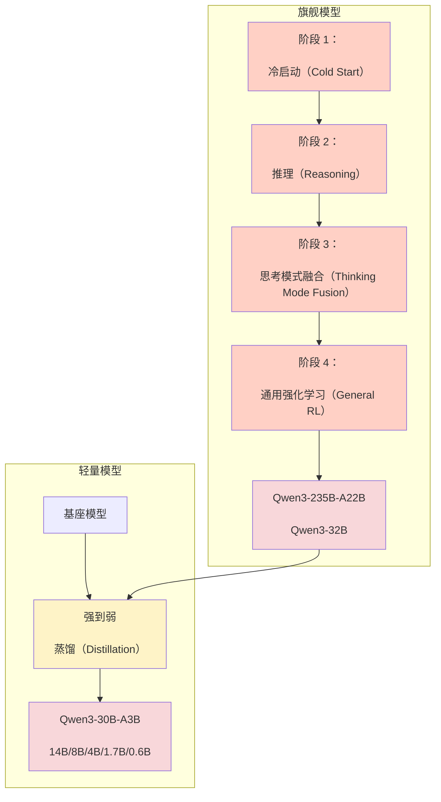

# Smol 训练手册：打造世界级 LLM 的秘诀 (中文翻译版)

URL 来源：https://huggingfacetb-smol-training-playbook.hf.space/

发布时间：2025 年 10 月 30 日

[toc]


[引言](https://huggingfacetb-smol-training-playbook.hf.space/#introduction)
-----------------------------------------------------------------------------------

如今，训练一个高性能的 LLM（Large Language Model，大语言模型）到底需要什么？

已发表的研究让这一切看起来轻而易举：巧妙的架构选择、精心策划的数据集，以及充足的算力。结果光鲜亮丽，消融实验（ablations）结构清晰、干净利落。每个决定在事后看来都显而易见。但这些论文只展示了“奏效”的部分，并带有一点玫瑰色的后见之明——它们没有记录凌晨 2 点调试数据加载器（dataloader）的抓狂、损失飙升（loss spikes）的惊魂，或是那个悄悄毁掉你整个训练的微妙张量并行（tensor parallelism） bug（后文详述！）。现实更加混乱、更加迭代，充斥着大量最终论文里永远不会出现的决策。

请与我们一起走进 [SmolLM3](https://huggingface.co/HuggingFaceTB/SmolLM3-3B) 的训练幕后——这是一个 30 亿参数的多语言推理模型，在 11 万亿 token 上完成训练。这不是一篇普通的博客，而是一张由决策、发现与死胡同交织成的蛛网，我们将其逐条拆解，最终沉淀出打造世界级语言模型的深层洞见。

这也是我们模型训练长文系列的收官之作：我们已陆续探讨了如何大规模构建数据集（[FineWeb](https://huggingface.co/spaces/HuggingFaceFW/blogpost-fineweb-v1)）、如何协调数千块 GPU 齐声合唱（[Ultra Scale Playbook](https://huggingface.co/spaces/nanotron/ultrascale-playbook)），以及如何在每一步挑选最佳评测方案（[Evaluation Guidebook](https://github.com/huggingface/evaluation-guidebook)）。现在，我们将所有环节融会贯通，打造出一个强大的 AI 模型。我们将带你走完完整旅程——不仅分享最终奏效的配方，也揭露那些失败的尝试、基础设施崩溃的瞬间，以及左右每一次决策的调试过程。

这段故事堪比一部戏剧：你会看到，小规模消融实验（ablation）的喜人结果为何在放大后失灵；我们为何在训练了 1T tokens 后重启；如何在多语言、数学与代码的 competing objectives（相互冲突的目标）之间取得平衡，同时保持强劲的英文表现；最终，我们又如何对一款混合推理模型进行 post-training（后训练）。

我们也尽量避免罗列冷冰冰的“我们做了什么”，而是把这段冒险整理成一条有温度的叙事线。把它当成一本指南，献给所有想从“我们有了好数据集和 GPU”走向“我们炼出了真·强模型”的人。我们希望这份开放能缩小研究与生产之间的鸿沟，让你的下一次训练少几分混乱。

### [如何阅读这篇博客文章](https://huggingfacetb-smol-training-playbook.hf.space/#how-to-read-this-blog-post)

你无需从头到尾通读这篇博客文章，实际上它现在已经太长，不太可能一口气读完。整篇文章被拆成若干独立部分，可以按需跳过或单独阅读：

*   训练指南针（Training compass）： 关于是否应该自己预训练模型的高层次讨论。我们会带你梳理在烧光所有风投的钱之前必须问自己的根本问题，并教你如何系统性地思考整个决策流程。这是一个偏战略的部分；如果你想直接看技术内容，可以快速滑过。
*   预训练（Pretraining）： 紧随训练指南针之后的章节涵盖构建专属预训练配方所需的一切：如何运行消融实验（ablations）、选择评估指标、混合数据源、做架构选型、调超参数，并最终扛住训练马拉松。即使你并不打算从零开始预训练，而是想做继续预训练（continued pretraining，又称 mid-training），这部分同样适用。
*   后训练（Post-training）： 在博客的这部分，你将学到把预训练模型潜力发挥到极致的全部技巧。从 SFT、DPO 到 GRPO 的后训练字母表，再到模型合并（model merging）的暗黑艺术与炼金术，一应俱全。让这些算法真正跑通的知识大多来自血泪教训，我们会在此分享经验，希望能帮你少踩几个坑。
*   基础设施（Infrastructure）： 如果说预训练是蛋糕本体，后训练是糖霜和樱桃，那么基础设施就是工业级烤箱。没有它，什么都做不成；一旦它出问题，你愉快的周日烘焙就会变成火灾隐患。如何理解、分析并调试 GPU 集群的知识散落在各种库、文档和论坛中。本部分将带你梳理 GPU 布局、CPU/GPU/节点/存储之间的通信模式，以及如何识别并消除瓶颈。

那么，我们从哪里开始呢？挑一个你最感兴趣的章节，出发吧！

[训练指南针：为什么 → 做什么 → 怎么做](https://huggingfacetb-smol-training-playbook.hf.space/#training-compass-why--what--how)
----------------------------------------------------------------------------------------------------------------------------

机器学习（machine learning）领域对优化（optimisation）有着近乎痴迷的执着。我们紧盯损失曲线（loss curves）、模型架构（model architectures）和吞吐量（throughput）；毕竟，机器学习本质上就是在优化模型的损失函数（loss function）。然而，在深入这些技术细节之前，有一个更根本的问题却常被忽略：我们真的应该训练这个模型吗？

如下热力图所示，开源 AI 生态系统几乎每天都在发布世界级模型：Qwen、Gemma、DeepSeek、Kimi、Llama 🪦、Olmo……这份名单每月都在变长。它们并非研究原型或玩具示例，而是覆盖多语言理解、代码生成、推理等惊人广度用例的生产级模型。大多数模型附带宽松许可证，并拥有活跃社区随时为你提供支持。

这引出了一个令人不安的事实：也许你根本不需要训练自己的模型。

在一篇“LLM 训练指南”里这样开头似乎有些奇怪。但许多失败的训练项目并非因为超参数（hyperparameters）糟糕或代码有 bug，而是因为有人决定训练一个并不需要的模型。因此，在你承诺训练、并深入探讨如何执行之前，必须先回答两个问题：为什么要训练这个模型？训练什么模型？若答案不清，你将浪费数月算力和工程时间，重复世界已有的成果，甚至更糟——造出无人需要的东西。

让我们先从为什么开始，因为若不理解目的，后续任何决策都将失去连贯性。

本节与博客其余部分不同：它较少涉及实验与技术细节，更多关乎战略规划。我们将引导你判断是否需要从头训练（train from scratch）以及该构建怎样的模型。如果你已经深入思考过“为什么”和“做什么”，可直接跳转到[Every big model starts with a small ablation](https://huggingfacetb-smol-training-playbook.hf.space/#every-big-model-starts-with-a-small-ablation)章节进行技术深挖。但若你仍存疑虑，在此投入时间将为你后续节省大量精力。

### [Why：没人愿意回答的问题](https://huggingfacetb-smol-training-playbook.hf.space/#why-the-question-nobody-wants-to-answer)

咱们直说现实里发生了什么。有人（如果走运）搞到了 GPU 集群，也许是靠研究经费，也许是公司闲置算力，然后思路大概是这样的：“我们有 100 张 H100，能用三个月。训个模型吧！”模型尺寸随手定，数据集有啥拼啥。训练开始。六个月后，算力预算烧光、团队士气耗尽，训出来的模型却没人用——因为从一开始就没问过 _为什么_。

下面是你不该训模型的一些理由：

“我们训了自己的模型”这句话确实诱人，但在投入大量时间和资源之前，先问一句：你为什么要训这个模型？

下面的流程图展示了启动大规模预训练（pretraining）项目前应经历的思考过程。从技术角度看，你首先得确认有没有现成的模型可以直接提示（prompt）或微调（fine-tune）来完成任务。

通常只有三种情况值得做自定义预训练：你想做前沿研究、你的生产场景需求极其特殊，或者你想填补开源模型生态的空白。咱们快速过一遍：

#### [研究：你想理解什么？](https://huggingfacetb-smol-training-playbook.hf.space/#research-what-do-you-want-to-understand)

在 LLM（大语言模型，Large Language Model）领域，可以开展的研究非常丰富。LLM 研究项目通常有一个共同点：你首先要提出一个清晰明确的问题：

*   我们能否在这种新优化器（optimiser）上将训练扩展到 10B+ 参数？来自论文 [Muon is Scalable for LLM Training](https://huggingface.co/papers/2502.16982)
*   仅通过强化学习（reinforcement learning），而不使用监督微调（SFT，Supervised Fine-Tuning），能否产生推理能力？来自论文 [DeepSeek-R1: Incentivizing Reasoning Capability in LLMs via Reinforcement Learning](https://huggingface.co/papers/2501.12948)
*   我们能否仅使用合成教科书数据训练出优秀的小模型？来自论文 [Textbooks Are All You Need](https://huggingface.co/papers/2306.11644)
*   仅使用公开许可的数据进行训练，能否达到具有竞争力的性能？来自论文 [The Common Pile v0.1: An 8TB Dataset of Public Domain and Openly Licensed Text](https://huggingface.co/papers/2506.05209)

尽可能具体地提出假设，并思考所需的实验规模，可以显著提高成功的概率。

#### [生产阶段：为什么不能直接复用现有模型？](https://huggingfacetb-smol-training-playbook.hf.space/#production-why-cant-you-use-an-existing-model)

企业无法直接拿现成模型（off-the-shelf model）落地，通常有三类原因：两类是技术性的，另一类关乎治理。

第一，领域特异性（domain specificity）： 当数据或任务包含高度专业化的词汇或结构，而现有模型难以胜任时。例如：

*   DNA 模型需要独特的词表并捕捉长程依赖。  
*   法律或金融模型必须深谙行业术语与逻辑。

第二，部署约束（deployment constraints）： 需要针对自有硬件、延迟或隐私要求定制模型。例如，在无人机或本地部署系统上运行 LLM，且硬件为 FPGA 等定制芯片。

一个简单的自检方法：花几天时间在 Qwen3、Gemma3 或其他当前 SOTA（state-of-the-art，最先进）模型上做提示工程、工具调用或后训练（post-training）。如果仍无法达到性能目标，就该考虑自训模型了。

即使后训练所需预算巨大，通常仍比从零开始训练划算。用 1T token 做微调，比从 0 训到 10T+ token 更经济。

第三，安全与治理（safety and governance）： 身处受监管行业或高 stakes（高风险）场景时，必须完全掌控训练数据、模型行为与更新周期。你需要确切知道模型里放了什么，并能向监管机构证明。某些情况下，自建模型是唯一选择。

以上是企业自训内部模型的主要原因。那么，那些发布开源模型的公司或组织又是出于什么考虑呢？

#### [战略性开源：你发现了可以填补的空白吗？](https://huggingfacetb-smol-training-playbook.hf.space/#strategic-open-source-do-you-see-a-gap-you-can-fill)

经验丰富的 AI 实验室发布新开源模型最常见的原因之一，是他们识别到了开源生态系统中某个具体的空白或新的 AI 使用场景。

典型流程如下：你注意到一个尚未被充分探索的领域——也许市面上缺乏具备超长上下文的强大小模型（on-device models），或者虽然有多语言模型（multilingual models），但在低资源语言（low-resource languages）上表现薄弱；又或者领域正朝着交互式世界模型（interactive world-models）如 [Genie3](https://deepmind.google/discover/blog/genie-3-a-new-frontier-for-world-models/) 发展，却没有优秀的开放权重（open-weight）模型可用。

你有理由相信你能做得更好：也许你整理了更优质的训练数据，开发了更好的训练方案（training recipes），或者拥有别人无法企及的算力来做过度训练（overtrain）。你的目标非常具体：不是“史上最佳模型”，而是“最适合端侧使用的 3B 模型”或“首个支持 1M 上下文的小模型”。

这是一个真实可行的目标，成功就能创造价值：开发者会采用你的模型，它会成为他人的基础设施，或为你建立技术信誉。但成功需要经验。你必须知道什么是真正可实现的，以及如何在一个竞争激烈的空间里可靠地执行。为了具体说明，我们来看看 Hugging Face 内部如何思考这个问题。

#### [Hugging Face 的旅程](https://huggingfacetb-smol-training-playbook.hf.space/#hugging-faces-journey)

Hugging Face 为什么要训练开源模型？答案很简单：我们构建对开源生态系统有用的东西，填补其他人很少填补的空白。

这包括数据集、工具和模型训练。我们启动的每一个大语言模型（LLM, Large Language Model）训练项目，都是源于我们发现了一个空白，并相信我们可以做出有意义的贡献。

在 GPT-3（[Brown 等，2020](https://arxiv.org/abs/2005.14165)）发布后，我们启动了第一个 LLM 项目。当时，感觉没有其他人正在构建一个开放的替代方案，我们担心相关知识最终会被锁在少数几家行业实验室里。因此，我们发起了 [BigScience 研讨会](https://bigscience.huggingface.co/)，以训练一个开放版本的 GPT-3。最终得到的模型是 [Bloom](https://huggingface.co/bigscience/bloom)，它由数十位贡献者历时一年，共同构建训练栈、分词器（tokenizer）和预训练语料库，以预训练一个 175B 参数的模型。

Bloom 的继任者是 2022 年的 StarCoder（[Li et al., 2023](https://arxiv.org/abs/2305.06161)）。OpenAI 已为 GitHub Copilot 开发了 Codex（[Chen et al., 2021](https://arxiv.org/abs/2107.03374)），但它是闭源的。显然，构建一个开源替代方案将为生态系统提供价值。因此，我们与 ServiceNow 合作，在 [BigCode](https://huggingface.co/bigcode) 项目下，构建了 [The Stack](https://huggingface.co/datasets/bigcode/the-stack) 数据集，并训练了 [StarCoder 15B](https://huggingface.co/bigcode/starcoder) 来复现 Codex。[StarCoder2](https://huggingface.co/collections/bigcode/starcoder2-65de6da6e87db3383572be1a)（[Lozhkov et al., 2024](https://arxiv.org/abs/2402.19173)）源于我们认识到可以训练更长时间，并且意识到训练时间更长的小模型可能比一个大模型更有价值。我们在数万亿个 token 上训练了一个模型系列（3B/7B/15B），远超当时任何人对开放代码模型的训练规模。

[SmolLM 系列](https://huggingface.co/HuggingFaceTB) 遵循了类似的模式。我们注意到当时几乎没有强大的小模型，而我们刚刚构建了 [FineWeb-Edu](https://huggingface.co/datasets/HuggingFaceFW/fineweb-edu)（[Penedo et al., 2024](https://arxiv.org/abs/2406.17557)），这是一个强大的预训练数据集。[SmolLM](https://huggingface.co/collections/HuggingFaceTB/smollm-6695016cad7167254ce15966)（135M/360M/1.7B）是我们的第一个版本。[SmolLM2](https://huggingface.co/collections/HuggingFaceTB/smollm2-6723884218bcda64b34d7db9)（[Allal et al., 2025](https://arxiv.org/abs/2502.02737)）专注于更好的数据和更长的训练时间，在多个方面达到了 SOTA（state-of-the-art，最先进）性能。[SmolLM3](https://huggingface.co/HuggingFaceTB/SmolLM3-3B) 扩展到 3B，同时添加了混合推理、多语言和长上下文功能，这些是 2025 年社区所重视的特性。

这种模式不仅限于预训练：我们训练了 [Zephyr](https://huggingface.co/HuggingFaceH4/zephyr-7b-alpha)（[Tunstall 等，2023](https://arxiv.org/abs/2310.16944)）以证明 DPO（Direct Preference Optimization，直接偏好优化）在大规模场景下有效；启动了 [Open-R1](https://github.com/huggingface/open-r1) 来复现 DeepSeek R1 的蒸馏流程；并发布了 [OlympicCoder](https://huggingface.co/open-r1/OlympicCoder-7B) 用于竞技编程，在国际信息学奥林匹克竞赛中取得了 SOTA（State-Of-The-Art，最先进）成绩。我们还将探索扩展到其他模态，包括用于视觉的 [SmolVLM](https://huggingface.co/collections/HuggingFaceTB/smolvlm-6740bd584b2dcbf51ecb1f39)（[Marafioti 等，2025](https://arxiv.org/abs/2504.05299)）和用于机器人学的 [SmolVLA](https://huggingface.co/lerobot/smolvla_base)（[Shukor 等，2025](https://arxiv.org/abs/2506.01844)）。

希望本节已经让你相信，深入思考“为什么要训练模型”是有价值的。

在本文的剩余部分，我们将假设你已经完成了这番灵魂拷问，并且确实有正当的理由去训练模型。

### [What：将目标转化为决策](https://huggingfacetb-smol-training-playbook.hf.space/#what-translating-goals-into-decisions)

既然你已经明确了为什么要训练，那么应该训练什么？这里的“什么”指的是：模型类型（dense（稠密）、MoE（混合专家）、hybrid（混合）、还是全新架构）、模型规模、架构细节以及数据混合比例。一旦确定了“为什么”，就可以推导出“什么”。例如：

*   用于设备端的快速模型 → 小型高效模型  
*   多语言模型 → 大词表分词器（tokenizer）  
*   超长上下文 → 混合（hybrid）架构  

除了受用例驱动的决策外，还有一些选择可以优化训练本身，使其更稳定、样本效率更高或速度更快。这些决策并不总是非黑即白，但你可以大致把决策过程分成两个阶段：

规划（Planning）： 在跑实验之前，把你的用例映射到需要决定的组件上。部署环境决定了模型规模的限制；时间线决定了你能承担哪些架构风险；目标能力决定了数据集需求。这一阶段就是把“为什么”里的每一条约束，具体化为“什么”里的技术规格。

验证（Validation）： 一旦有了起点和一系列潜在改动，就要系统地测试。由于测试代价高昂，应聚焦于那些可能显著提升用例性能或优化训练的改动。这时就需要做消融实验（ablations），详见[消融实验章节](https://huggingfacetb-smol-training-playbook.hf.space/#every-big-model-starts-with-a-small-ablation)。

在无关选择上做得再完美的消融，也和在关键选择上做得粗糙的消融一样浪费算力。

在接下来的章节中，你将了解定义模型时可用的全部选项，以及如何通过系统性实验缩小选择范围。在此之前，我们想分享一些经验：这些经验来自我们训练自有模型以及观察其他优秀团队构建出色 LLM（Large Language Model，大语言模型）的过程中，关于如何组建团队和规划项目的体会。

### [超能力：速度与数据](https://huggingfacetb-smol-training-playbook.hf.space/#super-power-speed-and-data)

通往罗马的路当然有很多条，但我们发现，迭代速度（iteration speed） 才是持续拉开成功 LLM 训练团队差距的关键。训练 LLM 本质上是一门“边训边学”的技艺——训得越多，团队成长越快。因此，一年只训一次模型的团队与每季度就能训一次的团队相比，后者进步会快得多。看看 Qwen 和 DeepSeek 的团队就知道了：如今家喻户晓，他们长期保持快速发布新模型的节奏。

除了迭代速度，数据整理（data curation） 无疑是 LLM 训练中最具影响力的环节。人们天然倾向于扎进架构选择以提升模型，但真正在 LLM 训练上出类拔萃的团队，无一不是对高质量数据近乎偏执。

与迭代速度紧密相关的另一个因素是团队规模：对于主要的预训练任务，只需少数几人，配备足够算力即可。今天预训练一个 Llama 3 级别的模型，大概 $2–3$ 人足矣。只有当你开始涉足更多样化的训练与下游任务（多模态、多语言、后训练等）时，才需要逐步增加人手，以在各领域做到极致。

所以，从一个装备精良的小团队起步，每 2–3 个月打造一个新模型，用不了多久你就能登顶。接下来，本文的其余部分将聚焦这支团队的日常技术实践！

[每个大模型都始于一次小型消融实验](https://huggingfacetb-smol-training-playbook.hf.space/#every-big-model-starts-with-a-small-ablation)
---------------------------------------------------------------------------------------------------------------------------------------------------

在我们开始训练一个 LLM（大语言模型，Large Language Model）之前，需要做出许多将影响模型性能与训练效率的决策：哪种架构（architecture）最能满足我们的用例？该用哪种优化器（optimiser）和学习率调度（learning rate schedule）？又该混合哪些数据源？

这些决策如何做，是常被问到的问题。人们有时以为只要深思熟虑即可。诚然，战略思考至关重要——正如我们在[上一节](https://huggingfacetb-smol-training-playbook.hf.space/#training-compass-why--what--how)中讨论过，如何识别哪些架构改动值得测试——但仅靠推理是不够的。LLM 的许多现象并不直观，关于“应该有效”的假设在实践中往往行不通。

例如，使用看似“最高质量”的数据并不总能带来更强的模型。以 [arXiv](https://arxiv.org/) 为例，它汇集了人类庞大的科学知识。直觉上，用这样丰富的 STEM 数据训练应该能产出更优秀的模型，对吧？实际上却不然，尤其对较小模型，甚至可能损害性能（[Shao et al., 2024](https://arxiv.org/abs/2402.03300)）。为何？原因在于，虽然 arXiv 论文知识密度高，但它们高度专业化，且采用狭窄的学术写作风格，与模型最擅长学习的多样化、通用文本差异很大。

那么，如果苦思冥想也无济于事，我们怎么知道什么才有效？像优秀的经验主义者一样，我们跑大量实验！机器学习并非纯数学，而是一门实验科学。

既然这些实验将指导许多关键决策，好好设计它们就格外重要。我们主要希望实验具备两项核心属性：

1.  速度（Speed）： 它们应尽可能快地运行，以便我们能频繁迭代。能跑的消融（ablation）越多，能验证的假设就越多。  
2.  可靠性（Reliability）： 它们应具备强判别力。如果我们关注的指标在早期无法有意义地区分不同配置，消融就可能收效甚微（如果指标噪声大，我们还会陷入“追噪声”的风险！）。更多细节请参阅 [FineTaks 博客文章](https://huggingface.co/spaces/HuggingFaceFW/blogpost-fine-tasks)。

但在搭建消融实验之前，我们必须先对架构类型（architecture type）和模型规模（model size）做出基础性选择。这些由“指南针”指引的决策，会影响使用哪种训练框架、如何分配算力预算，以及从哪个基线（baseline）出发。

对于 SmolLM3，我们选择了 3B 参数的稠密 Llama 风格架构，因为目标是小型设备端模型。但在[《设计模型架构》章节](https://huggingfacetb-smol-training-playbook.hf.space/#designing-the-model-architecture)中你会看到，MoE（Mixture of Experts，混合专家）或混合架构可能更适合你的场景，而不同模型规模也各有权衡。稍后我们将深入探讨这些选择，并展示如何做出决策。现在，让我们从最实用的第一步开始：选择你的基线。

### [选择你的基线模型](https://huggingfacetb-smol-training-playbook.hf.space/#choosing-your-baseline)

每一个成功的模型都建立在经过验证的基础之上，并针对自身需求进行了修改。当 Qwen 训练其首个模型家族（[Bai et al., 2023](https://arxiv.org/abs/2309.16609)）时，他们从 Llama 的架构起步；当 Meta 训练 Llama 3 时，他们从 Llama 2 出发；Kimi K2 则始于 DeepSeek-V3 的 MoE（Mixture of Experts，混合专家）架构。这种做法不仅适用于架构，也适用于训练超参数（hyperparameters）和优化器（optimisers）。

为什么？优秀的架构和训练设置需要多年、多组织的反复迭代。标准的 Transformer 和 Adam 等优化器已经通过数千次实验被不断打磨。人们已经发现它们的失效模式、调试了不稳定性、优化了实现。从一个经过验证的基础出发，意味着继承所有这些累积的知识；而从零开始，则意味着自己要重新发现每一个问题。

以下是作为架构起点时应具备的条件：

*   符合你的约束：与你的部署目标和使用场景保持一致。
*   在大规模上被验证过：在相同或更大规模的多万亿 token 训练运行中已被证明有效。
*   文档完善：拥有在开源模型中被验证有效的已知超参数。
*   框架支持：最好在你考虑的训练框架以及计划使用的推理框架中都得到支持。

以下是截至 2025 年、适用于不同架构和模型规模的强基线选项的非 exhaustive（非穷尽）列表：

| Architecture Type | Model Family | Sizes |
| --- | --- | --- |
| Dense | [Llama 3.1](https://huggingface.co/collections/meta-llama/llama-31-669fc079a0c406a149a5738f) | 8B, 70B |
| Dense | [Llama 3.2](https://huggingface.co/collections/meta-llama/llama-32-66f448ffc8c32f949b04c8cf) | 1B, 3B |
| Dense | [Qwen3](https://huggingface.co/collections/Qwen/qwen3-67dd247413f0e2e4f653967f) | 0.6B, 1.7B, 4B, 14B, 32B |
| Dense | [Gemma3](https://huggingface.co/collections/google/gemma-3-release-67c6c6f89c4f76621268bb6d) | 12B, 27B |
| Dense | [SmolLM2](https://huggingface.co/collections/HuggingFaceTB/smollm2-6723884218bcda64b34d7db9), [SmolLM3](https://huggingface.co/HuggingFaceTB/SmolLM3-3B) | 135M, 360M, 1.7B, 3B |
| MoE | [Qwen3 MoE](https://huggingface.co/collections/Qwen/qwen3-67dd247413f0e2e4f653967f) | 30B-A3B, 235B-A12B |
| MoE | [GPT-OSS](https://huggingface.co/collections/openai/gpt-oss-68911959590a1634ba11c7a4) | 21B-A3B, 117B-A5B |
| MoE | [Kimi Moonlight](https://huggingface.co/moonshotai/Moonlight-16B-A3B-Instruct) | 16B-A3B |
| MoE | [Kimi-k2](https://huggingface.co/collections/moonshotai/kimi-k2-6871243b990f2af5ba60617d) | 1T-A32B |
| MoE | [DeepSeek V3](https://huggingface.co/deepseek-ai/DeepSeek-V3) | 671B-A37B |
| Hybrid | [Zamba2](https://huggingface.co/Zyphra/models?search=zamba2) | 1.2B, 2.7B, 7B |
| Hybrid | [Falcon-H1](https://huggingface.co/collections/tiiuae/falcon-h1-6819f2795bc406da60fab8df) | 0.5B, 1.5B, 3B, 7B, 34B |
| MoE + Hybrid | [Qwen3-Next](https://huggingface.co/Qwen/Qwen3-Next-80B-A3B-Instruct) | 80B-A3B |
| MoE + Hybrid | [MiniMax-01](https://huggingface.co/MiniMaxAI/MiniMax-Text-01) | 456B-A46B |

因此，请根据你的 架构类型（architecture type） 选择一个与你期望的参数量接近的基线。不必过度纠结，因为你所起始的架构并非一成不变。在下一节中，我们将看到如何从一个基线出发，最终得到一个对你而言最优的架构。

#### [修改你的基线：降低风险的纪律](https://huggingfacetb-smol-training-playbook.hf.space/#modifying-your-baseline-the-discipline-of-derisking)

现在你有了一个可用的基线（baseline），并且它符合你的用例。你可以就此打住，在你的数据混合（data mixture）上训练它（假设数据质量不错），很可能得到一个不错的模型。许多成功的项目就是这么做的。但基线并非为你的具体约束而优化，它们是为构建者自己的用例和部署目标设计的。因此，很可能值得做一些修改，使其更好地契合你的目标。然而，每一次架构改动都伴随着风险：它可能提升性能，也可能拉垮性能，或者毫无效果却白白浪费了你的消融（ablation）算力。

让你保持正轨的纪律是 derisking（降低风险）：除非已验证某改动有益，否则绝不更改任何内容。

当测试表明某改动要么在你关注的能力上提升了性能，要么带来了有意义的收益（例如推理更快、内存更低、稳定性更好），同时没有让性能跌出你可接受的权衡范围，那么该改动就被视为“已降低风险”。

棘手的地方在于，你的基线和训练设置里有许多可以调整的组件：注意力机制（attention mechanisms）、位置编码（positional encodings）、激活函数（activation functions）、优化器（optimisers）、训练超参数（training hyperparameters）、归一化方案（normalisation schemes）、模型布局（model layout）等等。每一个都是潜在的实验对象，而这些组件之间往往以非线性方式相互作用。你既没有时间，也没有算力去测试所有内容或探索每一种交互。

先从有前景的改动开始，与当前基线对比测试。当某个改动奏效时，将其整合进来形成新的基线，然后再针对这个新基线测试下一个改动。如果算力预算允许，你可以单独测试每个改动，并做一次“留一法”（leave-one-out）分析。

不要陷入“对所有超参数（hyperparameters）做穷举网格搜索”或“测试每一个新出的架构变体”的陷阱。

仅仅知道如何跑实验是不够的，还得先判断哪些实验值得跑。在对任何改动动手之前，先问自己两个问题：

*   这个改动是否对我的具体用例（use case）有帮助？
*   它是否能优化我的训练过程？

如果一条修改无法明确回答上述任何一个问题，那就跳过它。

既然你已经学会通过策略规划识别有前景的方向，接下来就该进入实证验证（empirical validation）阶段了。在接下来的几节中，我们会告诉你如何在实践中真正测试这些改动。我们将涵盖如何搭建可靠的实验、解读结果，以及避开常见陷阱。随后几章，我们会手把手演示测试主流架构（architectural）、数据（data）、基础设施（infra）和训练（training）决策的具体示例。

那么，先搭一个可用于实验的简单消融（ablation）框架吧。首先，得决定选用哪个训练框架（training framework）。

### [选择训练框架](https://huggingfacetb-smol-training-playbook.hf.space/#picking-a-training-framework)

我们需要做的第一个决定是使用哪个框架（framework）来训练模型，进而运行所有消融实验（ablations）。这一选择需要平衡三个关键考量：

1. 框架必须支持我们的目标架构，或允许我们轻松扩展。
2. 它需要稳定且可用于生产，不会在训练中途神秘崩溃。
3. 它应提供高吞吐量，以便我们快速迭代并充分利用计算预算。

在实践中，这些要求可能相互冲突，带来权衡。让我们看看可用的选项。

| 框架 | 功能 | 实战检验 | 优化程度 | 代码行数（核心 / 总计） | 可扩展性与调试 |
| --- | --- | --- | --- | --- | --- |
| Megatron-LM | ✅ 丰富 | ✅ Kimi-K2、Nemotron | ✅ 3D 并行先驱 | 93k / 269k | ⚠️ 初学者难以上手 |
| DeepSpeed | ✅ 丰富 | ✅ BLOOM、GLM | ✅ ZeRO 与 3D 并行先驱 | 94k / 194k | ⚠️ 初学者难以上手 |
| TorchTitan | ⚡ 功能持续增加 | ⚠️ 较新，但已获 PyTorch 团队测试 | ⚡ 针对稠密模型优化，MoE 改进进行中 | 7k / 9k | ⚡ 中等：需并行知识 |
| Nanotron | 🎯 极简，专为 HF 预训练定制 | ✅ 已验证（StarCoder、SmolLM） | ✅ 已优化（UltraScale Playbook） | 15k / 66k | ⚡ 中等：需并行知识 |

上表总结了主流框架之间的关键权衡。前三个框架的代码行数来自 TorchTitan 技术报告（[Liang et al., 2025](https://arxiv.org/abs/2410.06511)）。接下来我们逐一详细讨论：

[Megatron-LM](https://github.com/NVIDIA/Megatron-LM) 来自 Nvidia，已问世多年并历经实战检验。它驱动了 Kimi 的 K2（[Team et al., 2025](https://arxiv.org/abs/2507.20534)）等模型，提供稳定的吞吐量，并具备我们所需的大多数生产级特性。但这种成熟度也带来了复杂性：对于新手来说，代码库可能难以导航和修改。

[DeepSpeed](https://github.com/deepspeedai/DeepSpeed) 属于同一类别。它是 ZeRO 优化（ZeRO optimisation）的先驱，驱动了 BLOOM 和 GLM 等模型。与 Megatron-LM 一样，它经过大量实战测试和优化，但也面临同样的复杂性挑战。庞大的代码库（总计 19.4 万行）在入门时可能令人望而生畏，尤其是在实现自定义功能或调试意外行为时。

另一方面，PyTorch 最新的 [TorchTitan](https://github.com/pytorch/torchtitan) 库更加轻量，导航也简单得多，这得益于其紧凑且模块化的代码库。它具备预训练所需的核心功能，非常适合快速实验。然而，由于较新，它尚未经过充分实战检验，且在积极开发中仍可能略显不稳定。

我们选择了另一条路，从零开始构建了自己的框架 nanotron。这让我们拥有完全的灵活性，并对大规模预训练有了深入理解；这些洞见后来演变为 [Ultra Scale Playbook](https://huggingface.co/spaces/nanotron/ultrascale-playbook)。自开源该库以来，我们也从社区获得了宝贵反馈，不过在大多数情况下，我们仍需先自行对功能进行实战测试。该框架现已支持我们训练所需的所有生产级特性，但我们仍在扩展诸如 MoE（Mixture of Experts，混合专家）支持等领域。

从零开始构建在当时是合理的，但这需要大量投入团队的专业知识，以及调试问题和补充缺失功能的时间。一个强有力的替代方案是分叉（fork）一个现有框架，并根据你的需求进行增强。例如，Thinking Machines Lab 将其内部预训练库构建为 TorchTitan 的一个分叉（[来源](https://x.com/cHHillee/status/1949470943291805832)）。

最终，你的选择取决于团队的专业知识、目标功能，以及你愿意投入多少时间进行开发，而不是直接使用最成熟的生产级方案。

如果多个框架都能满足你的需求，请在你的具体硬件上比较它们的吞吐量（throughput）。对于快速实验和速度测试，更简洁的代码库往往更具优势。

### [消融实验设置](https://huggingfacetb-smol-training-playbook.hf.space/#ablation-setup)

框架（framework）选定后，我们现在需要设计消融实验（ablation setup）。我们需要既能快速迭代、又足够大规模以产生有效信号并能迁移到最终模型的实验。下面来看如何搭建。

#### [搭建我们的消融（ablation）框架](https://huggingfacetb-smol-training-playbook.hf.space/#setting-up-our-ablation-framework)

消融（ablation）的目标是在小规模上运行实验，并获得可以可靠外推到最终生产运行的结果。

主要有两种方法。首先，我们可以采用目标模型规模，但只在更少的 token 上训练。对于 SmolLM3 的消融实验，我们在 $100\mathrm{B}$ 个 token 上训练了完整的 $3\mathrm{B}$ 模型，而不是最终的 $11\mathrm{T}$。其次，如果目标模型太大，我们可以训练一个更小的代理（proxy）模型来做消融。例如，当 Kimi 开发其 $1\mathrm{T}$ 参数的 Kimi K2 模型（活跃参数 $32\mathrm{B}$）时，用完整规模做所有消融实验的成本高得令人望而却步，因此他们在一个 $3\mathrm{B}$ 的 MoE（Mixture of Experts，混合专家）模型上运行了部分消融实验，该模型活跃参数仅为 $0.5\mathrm{B}$（[Team et al., 2025](https://arxiv.org/abs/2507.20534)）。

一个关键问题是，这些小规模的发现是否真的能够迁移。根据我们的经验，如果某件事在小规模上损害了性能，你可以自信地将其排除在大规模之外。但如果某件事在小规模上有效，你仍应确保在足够数量的 token 上进行了训练，以便以高概率断定这些发现可以外推到更大规模。训练时间越长，消融模型越接近最终模型，结果就越可靠。

在这篇博客文章中，我们将使用一个基线（baseline）的vanilla transformer进行所有消融实验（ablations）。我们的主要配置是一个1B transformer，遵循 [Llama3.2 1B](https://huggingface.co/meta-llama/Llama-3.2-1B) 的架构，在 45B tokens 上训练。使用这份 nanotron [配置](https://huggingface.co/datasets/HuggingFaceTB/training-guide-nanotron-configs/blob/main/baseline_config_1B.yaml)，在 8×H100 的单节点上训练大约需要 1.5 天（每 GPU 42k tokens/s）。在 SmolLM3 训练期间，我们还在一个 3B 模型上、以 100B tokens 的规模跑了这些消融实验（配置见[此处](https://huggingface.co/datasets/HuggingFaceTB/training-guide-nanotron-configs)）。我们将在每一章末尾分享那些结果（你会发现结论是一致的）。

我们的基线 1B 配置以结构化的 YAML 格式记录了所有关键训练细节。以下是主要章节：

```

## 数据集与混合权重（Datasets and mixing weights）
data_stages:
- data:
    dataset:
      dataset_folder:
      - fineweb-edu
      - stack-edu-python
      - finemath-3plus

      dataset_weights:
      - 0.7
      - 0.2
      - 0.1

## 模型架构（Model architecture），Llama3.2 1B 配置
model:
  model_config:
    hidden_size: 2048
    num_hidden_layers: 16
    num_attention_heads: 32
    num_key_value_heads: 8  
    intermediate_size: 8192
    max_position_embeddings: 4096
    rope_theta: 50000.0
    tie_word_embeddings: true

## 训练超参数（Training hyperparameters），带余弦调度（cosine schedule）的 AdamW
optimizer:
  clip_grad: 1.0
  learning_rate_scheduler:
    learning_rate: 0.0005
    lr_decay_starting_step: 2000
    lr_decay_steps: 18000
    lr_decay_style: cosine
    lr_warmup_steps: 2000
    lr_warmup_style: linear
    min_decay_lr: 5.0e-05
  optimizer_factory:
    adam_beta1: 0.9
    adam_beta2: 0.95
    adam_eps: 1.0e-08
    name: adamW

## 并行策略（Parallelism），单节点
parallelism:
  dp: 8  # 在 8 张 GPU 上做数据并行（Data parallel）
  tp: 1  # 1B 规模无需张量或流水线并行
  pp: 1 

## 分词器（Tokenizer）
tokenizer:
  tokenizer_max_length: 4096
  tokenizer_name_or_path: HuggingFaceTB/SmolLM3-3B

## 30B tokens 的批次大小、序列长度与总训练量
tokens:
  batch_accumulation_per_replica: 16
  micro_batch_size: 3 # GBS（全局批次大小 global batch size）= dp * batch_acc * MBS * sequence = 1.5 M tokens
  sequence_length: 4096
  train_steps: 20000 # GBS * 20000 = 30B

...(truncated)
```

在我们的消融实验（ablations）中，我们会根据测试内容仅修改对应部分，其余配置保持不变：测试[架构选择](https://huggingfacetb-smol-training-playbook.hf.space/#architecture-choices)时修改 `model` 部分，测试[优化器与训练超参数](https://huggingfacetb-smol-training-playbook.hf.space/#optimiser-and-training-hyperparameters)时修改 `optimizer` 部分，测试[数据策展](https://huggingfacetb-smol-training-playbook.hf.space/#the-art-of-data-curation)时修改 `data_stages` 部分。

每次消融只改变一个变量，其余保持不变。如果同时修改多项且性能提升，将无法确定具体原因。应单独测试每项修改，随后合并成功的改动并重新评估。

运行消融实验时，某些架构改动会显著改变参数量。例如，从 tied embeddings（共享嵌入）切换到 untied embeddings（非共享嵌入）会使嵌入参数量翻倍；而从 MHA（Multi-Head Attention，多头注意力）切换到 GQA（Grouped-Query Attention，分组查询注意力）或 MQA（Multi-Query Attention，多查询注意力）则会大幅减少注意力参数量。为确保公平比较，需跟踪参数量，并偶尔调整其他超参数（如 hidden size 或层数），使模型规模大致相同。下面是我们用于估算不同配置参数量的简单函数：

```python
from transformers import LlamaConfig, LlamaForCausalLM

def count_parameters(
    tie_embeddings=True,
    num_key_value_heads=4,
    num_attention_heads=32,
    hidden_size=2048,
    num_hidden_layers=16,
    intermediate_size=8192,
    vocab_size=128256,
    sequence_length=4096,
):
    config = LlamaConfig(
        hidden_size=hidden_size,
        num_hidden_layers=num_hidden_layers,
        num_attention_heads=num_attention_heads,
        num_key_value_heads=num_key_value_heads,
        intermediate_size=intermediate_size,
        vocab_size=vocab_size,
        max_position_embeddings=sequence_length,
        tie_word_embeddings=tie_embeddings,
    )
    model = LlamaForCausalLM(config)  
    return f"{sum(p.numel() for p in model.parameters())/1e9:.2f}B"
```

我们还提供了一个交互式工具，用于可视化密集（dense）transformer 的 LLM 参数分布。在进行架构决策或设置消融实验（ablations）配置时，这会非常方便。

#### [理解什么有效：评估（evaluation）](https://huggingfacetb-smol-training-playbook.hf.space/#understanding-what-works-evaluation)

一旦我们启动了消融实验（ablations），如何判断哪些方法有效、哪些无效？

任何训练模型的人的第一直觉可能是去看损失（loss），确实，这很重要。你希望看到它平稳下降，没有剧烈波动或不稳定。对于许多架构选择，损失与下游性能（downstream performance）相关性良好，通常已经足够（[Y. Chen et al., 2025](https://arxiv.org/abs/2410.08527)）。然而，仅看损失并不总是可靠。以数据消融为例，你会发现用维基百科（Wikipedia）训练的损失低于用网页训练的损失（下一个 token 更容易预测），但这并不意味着你会得到一个更强大的模型。同样，如果我们在不同运行之间更换了分词器（tokenizer），损失就无法直接比较，因为文本被切分的方式不同。某些改动可能专门影响特定能力，如推理（reasoning）和数学（math），在平均损失中被稀释。最后但同样重要的是，模型即使在预训练损失（pretraining loss）收敛后，仍可能在下游任务上继续改进（[Liu et al., 2022](https://arxiv.org/abs/2210.14199)）。

我们需要更细粒度的评估（fine-grained evaluation）来看到全貌，理解这些微妙的影响，而自然的方法就是使用下游评估（downstream evaluations），测试知识、理解、推理以及对我们重要的其他领域。

对于这些消融实验，最好聚焦于能提供良好早期信号的任务，避免嘈杂的基准测试（noisy benchmarks）。在 [FineTasks](https://huggingface.co/spaces/HuggingFaceFW/blogpost-fine-tasks) 和 [FineWeb2](https://arxiv.org/pdf/2506.20920) 中，可靠的评估任务由四项关键原则定义：

*   单调性（Monotonicity）： 随着模型训练时间延长，基准分数应持续提升。
*   低噪声（Low noise）： 在相同配置但不同随机种子下训练模型时，基准分数不应剧烈波动。
*   高于随机性能（Above-random performance）： 许多能力只在训练后期才显现，因此那些长时间保持随机水平表现的任务对消融实验并无帮助。例如，稍后我们将解释，多选题形式的 MMLU 就属于这种情况。
*   排序一致性（Ranking consistency）： 如果某种方法在早期阶段优于另一种方法，那么随着训练继续，这种排序应保持稳定。

任务的质量还取决于任务形式（task formulation，即我们如何向模型提问）和指标选择（metric choice，即我们如何计算答案得分）。

三种常见的任务形式是多选题格式（multiple choice format，MCF）、完形填空形式（cloze formulation，CF）和自由生成（freeform generation，FG）。多选题格式要求模型从提示中明确给出的若干选项中选择，并以 A/B/C/D 为前缀（例如 MMLU 的做法）。在完形填空形式中，我们比较不同选项的似然度，看哪个更可能被生成，而无需在提示中提供这些选项。在 FG 中，我们考察给定提示下贪心解码生成的准确率。FG 需要模型具备大量潜在知识，通常对模型来说过于困难，在完整训练前的小型预训练消融实验中并不实用。因此，在进行小规模消融实验时，我们主要采用多选题格式（MCF 或 CF）。

对于经过后训练的模型，FG 成为主要形式，因为我们希望评估模型能否实际生成有用的回答。我们将在[后训练章节](https://huggingfacetb-smol-training-playbook.hf.space/#beyond-base-models--post-training-in-2025)中介绍这些模型的评估方法。

研究还表明，模型在训练早期难以掌握 MCF（多选填空，Multiple-Choice Fill-in-the-blank），只有在经过大量训练后才会习得这一技能，因此 CF（完形填空，Cloze Formulation）更适合提供早期信号（[Du et al., 2025](https://arxiv.org/abs/2403.15796)；[Gu et al., 2025](https://arxiv.org/abs/2406.08446)；J. [Li et al., 2025](https://arxiv.org/abs/2406.11794)）。因此，我们在小规模消融实验中使用 CF，并在主训练流程中集成 MCF，因为一旦模型越过某一阈值、MCF 的信噪比足够高，它就能在中期训练阶段提供更优的信号。顺便说明，为了在类似 CF 的序列似然评估中为模型答案打分，我们将准确率定义为：在全部问题中，正确答案的对数概率按字符数归一化后最高的问题占比。该归一化可避免对较短答案的偏好偏差。

我们的消融评估套件包含 [FineWeb](https://huggingface.co/spaces/HuggingFaceFW/blogpost-fineweb-v1) 消融实验中的基准，但去掉了我们发现噪声过大的 SIQA。我们额外加入了数学与代码基准（如 GSM8K 和 HumanEval）以及长上下文基准 RULER，用于长上下文消融实验。这一任务集合以多种格式测试世界知识、推理与常识，如下表所示。为加快评估速度（牺牲一定信噪比），我们仅从每个基准中抽取 1,000 题进行评估（GSM8K、HumanEval 与 RULER 除外：在 3B SmolLM3 消融实验中我们使用了全部题目，但在下文 1B 实验中予以省略）。对于所有多选基准，我们同样采用上述 CF 评估方式。注意，在多语言消融及实际训练中，我们会增加更多基准以测试多语言能力，详情后述。这些评估通过 [LightEval](https://github.com/huggingface/lighteval) 运行，下表总结了各基准的关键特性：

| 基准测试 | 领域 | 任务类型 | 题目数量 | 测试内容 |
| --- | --- | --- | --- | --- |
| MMLU（Massive Multitask Language Understanding） | 知识 | 多项选择 | 14k | 涵盖 57 个学科的广泛学术知识 |
| ARC（AI2 Reasoning Challenge） | 科学与推理 | 多项选择 | 7k | 小学水平的科学推理 |
| HellaSwag | 常识推理 | 多项选择 | 10k | 日常情境的常识推理（故事补全） |
| WinoGrande | 常识推理 | 二选一 | 1.7k | 需要世界知识的代词消解 |
| CommonSenseQA | 常识推理 | 多项选择 | 1.1k | 日常概念的常识推理 |
| OpenBookQA | 科学 | 多项选择 | 500 | 结合推理的小学科学事实 |
| PIQA（Physical Interaction QA） | 物理常识 | 二选一 | 1.8k | 日常物品的物理常识 |
| GSM8K（Grade School Math 8K） | 数学 | 自由生成 | 1.3k | 小学数学应用题 |
| HumanEval | 代码 | 自由生成 | 164 | 根据文档字符串生成完整 Python 函数 |

让我们从每个基准中挑几道示例题目，具体感受一下这些评估到底在测什么：

浏览上面的示例，可以看到各基准的题目类型。注意 MMLU 和 ARC 用多项选择考查事实知识，GSM8K 要求计算数学题并给出数值答案，而 HumanEval 则需要生成完整的 Python 代码。这种多样性确保我们在消融实验（ablation study）中能够全面检验模型能力的不同方面。

消融实验用哪种数据混合？

对于架构消融（architecture ablations），我们在一组固定的高质量数据集上训练，这些数据集能在广泛任务中提供早期信号。我们使用英语（[FineWeb-Edu](https://huggingface.co/datasets/HuggingFaceFW/fineweb-edu)）、数学（[FineMath](https://huggingface.co/datasets/HuggingFaceTB/finemath)）和代码（[Stack-Edu-Python](https://huggingface.co/datasets/HuggingFaceTB/stack-edu)）。架构方面的发现应能很好地推广到其他数据集和领域，包括多语言数据，因此我们可以保持数据混合简单。

对于数据消融（data ablations），我们采取相反的方法：固定架构，系统地改变数据混合比例，以了解不同数据源如何影响模型性能。

一个可靠的消融设置带来的真正价值，远不止于构建一个好模型。当我们在主训练运行中不可避免地遇到问题（无论准备多充分，它们都会出现）时，我们希望对自己做出的每一个决定都有信心，并能迅速识别哪些组件没有经过充分测试，可能是问题的根源。这种准备能节省调试时间，并为我们将来的心理健康保驾护航。

#### [估算消融实验成本](https://huggingfacetb-smol-training-playbook.hf.space/#estimating-ablations-cost)

消融实验（ablations）非常棒，但它们需要 GPU 时间，因此了解这些实验的成本是值得的。下表展示了我们为 SmolLM3 预训练所做的完整算力分解：主运行（包含偶发的停机时间）、训练前与训练中的消融实验，以及因意外的扩展问题被迫重启和调试所耗费的算力（稍后详述）。

| 阶段 | GPU 数量 | 天数 | GPU 小时 |
| --- | --- | --- | --- |
| 主预训练运行 | 384 | 30 | 276,480 |
| 消融实验（预训练） | 192 | 15 | 69,120 |
| 消融实验（训练中） | 192 | 10 | 46,080 |
| 训练重启与调试 | 384/192 | 3/4 | 46,080 |
| 总成本 | - | - | 437,760 |

这些数字揭示了一个重要事实：消融实验和调试总共消耗了 161,280 GPU 小时，超过主训练运行成本的一半（276,480 GPU 小时）。我们在 SmolLM3 的整个开发过程中共运行了 100 多次消融实验：预训练消融实验耗时 20 天，训练中消融实验耗时 10 天，另有 7 天用于从意外的训练问题中恢复并重启和调试（稍后详述）。

这凸显了为何必须将消融实验成本纳入算力预算：请为训练成本、消融实验以及应对意外的缓冲预留预算。如果你追求 SOTA（state-of-the-art）性能、实施新的架构改动，或尚未拥有经过验证的方案，消融实验将成为一项重大成本中心，而非小规模实验。

在进入下一节之前，让我们先确立每位运行实验的人都应遵守的一些基本规则。

### [参与规则](https://huggingfacetb-smol-training-playbook.hf.space/#rules-of-engagement)

> 太长不看：保持偏执。

验证你的评估套件（evaluation suite）。在训练任何模型之前，确保你的评估套件能够复现你将要对比的模型已发表的结果。如果任何基准测试（benchmark）是生成式的（例如 GSM8k），请格外偏执，手动检查几个样本，确保提示（prompt）格式正确，并且任何后处理（post-processing）都能提取到正确的信息。由于评估将指导每一个决策，做好这一步对项目的成功至关重要！

测试每一次改动，无论多小。不要低估看似无害的库升级或“只改了两行”的提交带来的影响。这些微小的改动可能会引入难以察觉的错误或性能变化，从而污染你的结果。你需要一个在对你重要的用例上有强大测试套件的库，以避免回归（regression）。

一次只改一件事。在实验之间保持其他所有条件完全相同。某些改动可能会以意想不到的方式相互作用，因此我们首先要评估每个改动的单独贡献，然后再尝试将它们组合起来，观察整体影响。

在足够多的 token 上训练，并使用充分的评估。如前所述，我们需要确保评估套件有良好的覆盖，并训练足够长的时间以获得可靠的信号。在这里走捷径会导致结果嘈杂和错误决策。遵循这些规则可能显得过于谨慎，但另一种选择是花费数天时间去调试神秘的性能下降，最终发现是几天前某个无关的依赖更新导致的。黄金原则：一旦你有了一个好的设置，任何改动都必须经过测试！

[设计模型架构](https://huggingfacetb-smol-training-playbook.hf.space/#designing-the-model-architecture)
---------------------------------------------------------------------------------------------------------------------------

既然实验框架已经就绪，是时候做出将定义我们模型的重大决策了。从模型大小到注意力机制，再到分词器（tokenizer）的选择，每一个决定都会带来约束与机遇，进而影响模型的训练与使用。

请记住[训练指南针](https://huggingfacetb-smol-training-playbook.hf.space/#training-compass-why--what--how)：在做出任何技术选择之前，我们必须先明确为什么（why）和是什么（what）。我们为什么要训练这个模型？它应该长什么样？

听起来显而易见，但正如我们在训练指南针中解释的，在此处的审慎思考会塑造后续决策，并防止我们在无尽的实验空间中迷失。我们是想打造一个英文 SOTA（state-of-the-art，最先进）模型？长上下文是否是优先事项？还是我们试图验证一种新架构？在这些情况下，训练循环可能看起来相似，但我们运行的实验以及愿意接受的权衡将有所不同。尽早回答这个问题，有助于我们决定如何在数据工作与架构工作之间分配时间，以及在开始训练前各自投入多少创新。

因此，让我们以身作则，回顾指导 SmolLM3 设计的目标。我们希望得到一个适用于端侧应用的强模型，具备有竞争力的多语言性能、扎实的数学与编程能力，以及稳健的长上下文处理能力。如前所述，这促使我们选择了 30 亿（$3B$）参数的稠密（dense）模型：足够大以获得强劲能力，又足够小以舒适地运行在手机上。鉴于边缘设备的内存限制以及我们的项目周期（约 3 个月），我们选择了稠密 Transformer，而非 MoE（Mixture of Experts，混合专家）或 Hybrid（混合）架构。

我们手上有 SmolLM2 在较小规模（$1.7B$ 参数）下针对英文的成熟配方，但放大模型规模意味着要重新验证所有环节，并迎接多语言（multilinguality）和更长上下文长度（extended context length）等新挑战。一个具体例子足以说明“明确目标”如何左右我们的策略：在 SmolLM2 中，我们直到预训练尾声才尝试扩展上下文长度，结果举步维艰；因此在 SmolLM3 中，我们从一开始就做了架构层面的选择——例如采用 NoPE（NoPE）以及 intra-document masking（文档内掩码，详见后文）——以最大化成功概率，最终奏效。

目标一旦清晰，我们就可以着手做出能够实现这些目标的技术决策。本章将系统梳理我们在三大核心决策上的方法论：架构（architecture）、数据（data）和超参数（hyperparameters）。可以把这看作战略规划阶段——把这些基础打牢，就能在真正的训练马拉松中避免代价高昂的错误。

### [架构选择](https://huggingfacetb-smol-training-playbook.hf.space/#architecture-choices)

如果你看看最近的模型，比如 Qwen3、Gemma3 或 DeepSeek v3，你会发现尽管它们各有差异，但都共享同一个基础——2017 年提出的 transformer 架构（[Vaswani et al., 2023](https://arxiv.org/abs/1706.03762)）。多年来发生变化的并非其基本结构，而是对核心组件的精细打磨。无论你构建的是稠密模型（dense model）、专家混合模型（Mixture of Experts，MoE）还是混合架构，使用的都是这些相同的构建块。

这些改进源于各团队对更高性能的追求以及对特定挑战的应对：推理时的内存限制、大规模训练的不稳定性，或处理更长上下文的需求。有些改动，例如从多头注意力（Multi-Head Attention，MHA）转向更节省算力的注意力变体如分组查询注意力（Grouped Query Attention，GQA）（[Ainslie et al., 2023](https://arxiv.org/abs/2305.13245)），已被广泛采用。另一些，比如不同的位置编码方案，仍在讨论之中。最终，今天的实验将固化为明天的基线。

那么，如今的现代大语言模型（LLM）到底在用什么呢？让我们看看领先模型已趋同的选择。遗憾的是，并非所有模型都公开训练细节，但 DeepSeek、OLMo、Kimi 和 SmolLM 等家族提供了足够的透明度，使我们得以窥见当前格局：

| 模型 | 架构 | 参数量 | 训练 token 数 | 注意力机制 | 上下文长度（最终） | 位置编码 | 精度 | 初始化（标准差） | 优化器 | 最大学习率 | 学习率调度 | 预热步数 | 批量大小 |
| --- | --- | --- | --- | --- | --- | --- | --- | --- | --- | --- | --- | --- | --- |
| DeepSeek LLM 7B | Dense | 7B | 2T | GQA | 4K | RoPE | BF16 | 0.006 | AdamW | $4.2 \times 10^{-4}$ | Multi-Step | 2K | 9.4M |
| DeepSeek LLM 67B | Dense | 67B | 2T | GQA | 4K | RoPE | BF16 | 0.006 | AdamW | $3.2 \times 10^{-4}$ | Multi-Step | 2K | 18.9M |
| DeepSeek V2 | MoE | 236B（21B 激活） | 8.1T | MLA | 128K | Partial RoPE | — | 0.006 | AdamW | $2.4 \times 10^{-4}$ | Multi-Step | 2K | 9.4M→37.7M（预热 225B） |
| DeepSeek V3 | MoE | 671B（37B 激活） | 14.8T | MLA | 129K | Partial RoPE | FP8 | 0.006 | AdamW | $2.2 \times 10^{-4}$ | Multi-Step + Cosine | 2K | 12.6M→62.9M（预热 469B） |
| MiniMax-01 | MoE + Hybrid | 456B（45.9B 激活） | 11.4T | Linear attention + GQA | 4M | Partial RoPE | — | Xavier init + deepnorm scaling | AdamW | $2 \times 10^{-4}$ | Multi-Step | 500 | 16M→32M→64M→128M |
| Kimi K2 | MoE | 1T（32B 激活） | 15.5T | MLA | 128K | Partial RoPE | BF16 | 约 0.006 | MuonClip | $2 \times 10^{-4}$ | WSD | 500 | 67M |
| OLMo 2 7B | Dense | 7B | 5T | MHA | 4K | RoPE | BF16 | 0.02 | AdamW | $3 \times 10^{-4}$ | Cosine | 2K | 4.2M |
| SmolLM3 | Dense | 3B | 11T | GQA | 128K | NoPE | BF16 | 0.02 | AdamW | $2 \times 10^{-4}$ | WSD | 2K | 2.3M |

如果你现在还不理解其中的一些术语，比如 MLA、NoPE 或 WSD，别担心。我们会在本节逐一解释。此刻只需留意它们的多样性：不同的注意力机制（MHA、GQA、MLA）、位置编码（RoPE、NoPE、Partial RoPE）以及学习率调度策略（Cosine、Multi-Step、WSD）。

面对这一长串架构选择，我们难免会感到无从下手。和大多数类似情况一样，我们将循序渐进，逐步积累所需的全部知识。首先聚焦最简单的基线架构（dense model，稠密模型），并逐一深入探究每个架构细节。随后，我们将深入 MoE（Mixture of Experts，混合专家）和 Hybrid（混合）模型，并讨论何时选用它们才是明智之举。最后，我们将探索 tokenizer（分词器）——一个常被忽视却至关重要的组件。我们应该直接用现有的，还是训练自己的？又该如何评估分词器的好坏？

在本章的其余部分，我们将通过消融实验（ablations）验证大多数架构选择，实验设置如上一章所述：以 1B 参数的基线模型（遵循 Llama3.2 1B 架构）在 45B token 的混合数据（FineWeb-Edu、FineMath 与 Python-Edu）上训练。对于每项实验，我们同时展示训练损失曲线与下游评测分数，以衡量每次改动的影响。所有运行的配置均可在 [HuggingFaceTB/training-guide-nanotron-configs](https://huggingface.co/datasets/HuggingFaceTB/training-guide-nanotron-configs/tree/main) 中找到。

现在，让我们从每个 LLM 的核心开始：attention mechanism（注意力机制）。

#### [注意力（Attention）](https://huggingfacetb-smol-training-playbook.hf.space/#attention)

Transformer 架构中最活跃的研究领域之一就是注意力机制。虽然在预训练阶段前馈层（feedforward layers）主导了计算量，但在推理阶段，注意力成为主要瓶颈（尤其是在长上下文场景），它会推高计算成本，并且 KV 缓存（KV cache）迅速消耗 GPU 显存，从而降低吞吐量。让我们快速浏览一下主要的注意力机制以及它们在容量与速度之间的权衡。

我的注意力需要多少个头？

_多头注意力（Multi-head attention，MHA）_ 是最初的 Transformer 论文（[Vaswani et al., 2023](https://arxiv.org/abs/1706.03762)）中提出的标准注意力机制。其核心思想是：你有 N 个注意力头，每个头独立执行相同的检索任务——将隐藏状态转换为查询（queries）、键（keys）和值（values），然后利用当前查询通过与键的匹配来检索最相关的 token，最后将匹配到的 token 对应的值向前传递。在推理阶段，我们无需重新计算过去 token 的 KV 值，而是可以复用它们。用于存储过去 KV 值的内存称为 _KV-Cache_。随着上下文窗口的增长，该缓存很快就会成为推理瓶颈，并占用大量 GPU 显存。下面是一个简单计算，用于估算在 Llama 3 架构下使用 MHA、序列长度为 8192 时的 KV-Cache 内存 $s_{KV}$：

$$
\begin{aligned}
s_{KV} &= 2 \times n_{bytes} \times seq \times n_{layers} \times n_{heads} \times dim_{heads} \\
&= 2 \times 2 \times 8192 \times 32 \times 32 \times 128 = 4 \text{ GB} \textit{ (Llama 3 8B)} \\
&= 2 \times 2 \times 8192 \times 80 \times 64 \times 128 = 20 \text{ GB} \textit{ (Llama 3 70B)}
\end{aligned}
$$

注意，最前面的系数 2 来自于同时存储 key（键）和 value（值）缓存。如你所见，缓存随序列长度线性增长，但上下文窗口却呈指数级扩展，如今已可达数百万个 token。因此，提升缓存效率将使在推理时扩展上下文变得更加容易。

自然会问：我们真的需要为每个注意力头（head）都准备一组新的 KV 值吗？大概不需要。Multi-Query Attention（MQA，多查询注意力）（[Shazeer, 2019](https://arxiv.org/abs/1911.02150)）和 Grouped Query Attention（GQA，分组查询注意力）（[Ainslie et al., 2023](https://arxiv.org/abs/2305.13245)）都解决了这一问题。最简单的情况是在所有头之间共享 KV 值，从而将 KV 缓存大小除以 $n_{heads}$，例如对 Llama 3 70B 而言可减少 64 倍！这就是 MQA 的思想，并已在诸如 StarCoder 等模型中用作 MHA（Multi-Head Attention，多头注意力）的替代方案。然而，我们可能会因此牺牲过多的注意力容量，于是可以考虑折中方案：在若干头组成的组内共享同一组 KV 值，例如 4 个头共享一组 KV。这就是 GQA 方法，在 MQA 与 MHA 之间取得了平衡。

最近，DeepSeek-v2（也在 v3 中使用）引入了 Multi-Latent Attention (MLA，多潜在注意力)（[DeepSeek-AI et al., 2024](https://arxiv.org/abs/2405.04434)），它采用了一种不同的策略来压缩缓存：不是减少 KV 值的数量，而是减小它们的大小，仅存储一个潜在变量，该变量可在运行时解压为 KV 值。借助这种方法，他们成功地将缓存降低到相当于 GQA 2.25 组的规模，同时性能还优于 MHA！为了与 RoPE 兼容，需要用一个额外的小潜在向量进行微调。在 DeepSeek-v2 中，主潜在变量维度选为 $4\times dim_{head}$，RoPE 部分为 $1/2\times dim_{head}$，因此总共是 $4.5\times dim_{head}$，同时用于 K 和 V，从而去掉了前面的系数 2。

你可以在下面的图示中直观地了解每种注意力机制：

本节讨论的注意力机制对比如下表所示。为简化起见，我们比较每个 token 使用的参数量；若要计算总内存，只需乘以每个参数的字节数（通常为 2）和序列长度即可：

| Attention Mechanism（注意力机制） | KV-Cache parameters per token（每个 token 的 KV 缓存参数量） |
| --- | --- |
| MHA | $=2×n_{heads}×n_{layers}×dim_{head}$ |
| MQA | $=2×1×n_{layers}×dim_{head}$ |
| GQA | $=2×g×n_{layers}×dim_{head}$（通常 $g=2,4,8$） |
| MLA | $=4.5×n_{layers}×dim_{head}$ |

现在让我们看看这些注意力机制在真实实验中的表现！

Ablation - GQA beats MHA（消融实验 - GQA 优于 MHA）

下面我们来比较不同的注意力机制。我们的[基线](https://huggingface.co/datasets/HuggingFaceTB/ablations-training-configs/blob/main/baseline_config_1B.yaml)模型使用 32 个 Query 头（查询头）和 8 个 KV 头（键值头），对应 GQA（Grouped Query Attention，分组查询注意力）的压缩比为 $32/8=4$。如果改用 MHA（Multi-Head Attention，多头注意力），或者进一步减少 KV 头数量、提高 GQA 压缩比，性能会如何变化？

改变 KV 头数量会显著影响参数量，尤其在 MHA 场景下。为保持一致，我们对 MHA 实验减少了层数，否则其参数量将多出 1 亿以上；其余配置均保持默认的 16 层。

| 注意力类型 | Query 头 | KV 头 | 层数 | 参数量 | 备注 |
| --- | --- | --- | --- | --- | --- |
| MQA（Multi-Query Attention，多查询注意力） | 32 | 1 | 16 | 1.21B |  |
| GQA（压缩比 16） | 32 | 2 | 16 | 1.21B |  |
| GQA（压缩比 8） | 32 | 4 | 16 | 1.22B | 基线 |
| GQA（压缩比 4） | 32 | 8 | 16 | 1.24B |  |
| GQA（压缩比 2） | 32 | 16 | 15 | 1.22B | 减少层数 |
| MHA | 32 | 32 | 14 | 1.20B | 减少层数 |
| GQA（压缩比 2） | 32 | 16 | 16 | 1.27B | 过大 - 未消融 |
| MHA | 32 | 32 | 16 | 1.34B | 过大 - 未消融 |

因此，我们比较了 MHA、MQA 以及 4 种 GQA 配置（压缩比 2、4、8、16）。对应的 nanotron 配置文件可在此[获取](https://huggingface.co/datasets/HuggingFaceTB/training-guide-nanotron-configs/tree/main/attention)。

从消融结果看，MQA 和仅保留 $1 \sim 2$ 个 KV 头的 GQA（$16$ 组）相比 MHA 显著落后；而 GQA 在 $2$、$4$、$8$ 组配置下则与 MHA 性能大致相当。

这一结论在损失曲线和下游评测中均保持一致。我们在 HellaSwag、MMLU、ARC 等基准上能清晰观察到该趋势，而 OpenBookQA 和 WinoGrande 的波动则稍大。

基于这些消融实验（ablations），GQA（Grouped Query Attention，分组查询注意力）是 MHA（Multi-Head Attention，多头注意力）的一个可靠替代方案。它在保持性能的同时，在推理阶段更加高效。一些近期模型采用了 MLA（Multi-Head Latent Attention，多头潜在注意力）以实现更大的 KV 缓存压缩，不过它尚未被广泛采用。由于在进行消融实验时 nanotron 尚未实现 MLA，我们并未对其进行消融。对于 SmolLM3，我们使用了 $4$ 个组的 GQA。

除了注意力架构本身，训练期间使用的注意力模式也很重要。让我们来看看注意力掩码（attention masking）。

文档掩码（Document masking）

我们在训练序列中如何应用注意力，既影响计算效率，也影响模型性能。这就引出了*文档掩码（document masking）*以及更广泛的、如何在数据加载器（dataloader）中构造训练样本的问题。

在预训练阶段，我们使用固定序列长度进行训练，但文档长度各异。一篇研究论文可能有 $10k$ 个词元（tokens），而一段简短的代码片段只有几百个词元。我们如何将可变长度的文档装入固定长度的训练序列？将较短文档填充（padding）到目标长度会浪费算力在无意义的填充词元上。相反，我们使用打包（packing）：打乱并将文档用序列结束（EOS）词元拼接，然后将结果切分成与序列长度匹配的固定长度块。

实际过程如下：

```
File 1: "Recipe for granola bars..." (400 tokens) <EOS>
File 2: "def hello_world()..." (300 tokens) <EOS>  
File 3: "Climate change impacts..." (1000 tokens) <EOS>  
File 4: "import numpy as np..." (3000 tokens) <EOS>  
...

After concatenation and chunking into 4k sequences:  
Sequence 1: [File 1] + [File 2] + [File 3] + [partial File 4]  
Sequence 2: [rest of File 4] + [File 5] + [File 6] + ...
```

如果某个文件足够长，能够填满我们的 $4k$ 上下文，那么一个训练序列可能只包含一个完整文件；但在大多数情况下文件较短，因此序列会包含多个随机文件的拼接。

在标准的因果掩码（causal masking）机制下，token（词元）可以访问打包序列中所有之前的 token。在上面的示例中，文件 4 里那段 Python 函数的某个 token 就能“看到”燕麦棒食谱、气候变化文章，以及任何其他被一起打包的内容。我们先快速瞥一眼典型的 4k 预训练上下文里都会有什么。一项[分析](https://www.harmdevries.com/post/context-length/)显示，CommonCrawl 和 GitHub 中大约 80–90% 的文件都短于 2k token。

下图考察了本文通篇使用的更新数据集的 token 分布：

在 FineWeb-Edu、DCLM、FineMath 和 Python-Edu 中，超过 80% 的文档不足 2k token。这意味着，在 2k 或 4k 的训练序列里使用标准因果掩码时，绝大多数 token 的计算量都花在关注无关的打包文档上。

尽管大多数基于网络的数据集由短文档组成，基于 PDF 的数据集却包含明显更长的内容。[FinePDFs](https://huggingface.co/datasets/HuggingFaceFW/fineweb-2) 的文档平均长度是网页文本的 2 倍，当与 FineWeb-Edu 和 DCLM 混合时还能提升性能。

除了计算效率低下，[Zhao et al. (2024)](https://doi.org/10.18653/v1/2024.acl-long.427) 还发现，这种方法会引入来自无关内容的噪声，从而损害性能。他们建议使用文档内掩码（_intra-document masking_）：修改注意力掩码，使 token 只能关注同一文档内的前文 token。下图可视化了这一差异：

[Zhu et al. (2025)](https://arxiv.org/abs/2503.15450) 在 SkyLadder 中也发现了文档内掩码的类似好处，但给出了不同解释：他们发现更短的上下文长度在训练时效果更好，而文档内掩码实际上降低了平均上下文长度。


SkyLadder 的这些图表展示了多项发现：(a) 在预训练阶段，较短的上下文（shorter contexts）通常表现更好（验证集困惑度更低），(b) 文档内掩码（IntraDoc，intra-document masking）的困惑度低于随机打包（Random，random packing）和语义分组（BM25，semantic grouping），(c) 即使在没有位置编码（positional encoding）的情况下，较短上下文的优势依然存在，以及 (d) IntraDoc 使得有效上下文长度的分布向更短的方向倾斜。

Llama3（[Grattafiori 等，2024](https://arxiv.org/abs/2407.21783)）同样采用了文档内掩码进行训练，他们发现，在短上下文预训练阶段影响有限，但在长上下文扩展阶段收益显著，因为此时注意力开销（attention overhead）变得更为关键。此外，ProLong 论文（[Gao 等，2025](https://arxiv.org/abs/2410.02660)）表明，在持续预训练（continual pretraining）中利用文档掩码将 Llama3 8B 的上下文长度进行扩展，既提升了长上下文基准，也改善了短上下文基准。

我们决定在 1B 基线模型上进行消融实验（ablation），测试文档掩码是否会影响短上下文性能。配置文件见[此处](https://huggingface.co/datasets/HuggingFaceTB/training-guide-nanotron-configs/blob/main/doc_masking/doc_masking.yaml)。结果显示，与标准因果掩码（causal masking）相比，损失曲线和下游评估分数完全一致，如下图所示。

若要在 nanotron 中启用文档掩码，只需在模型配置中将该标志设为 `true`：

```
model_config:
  _attn_implementation: flash_attention_2
  _fused_rms_norm: true
  _fused_rotary_emb: true
- _use_doc_masking: false
+ _use_doc_masking: true
```

与 Llama3 类似，在短上下文任务中我们并未观察到明显影响，仅在 PIQA 上略有提升。然而，当扩展到长序列时，文档掩码（document masking） 对加速训练至关重要。这一点在我们将上下文从 4k 扩展到 64k token 的长上下文扩展中尤为关键（详见 [Training marathon](https://huggingfacetb-smol-training-playbook.hf.space/#the-training-marathon) 章节）。因此，我们在 SmolLM3 的整个训练过程中都采用了这一策略。

本节我们已介绍了注意力机制如何处理序列。接下来，让我们看看 transformer 中的另一个主要参数模块：嵌入（embeddings）。

#### [Embedding sharing（嵌入共享）](https://huggingfacetb-smol-training-playbook.hf.space/#embedding-sharing)

如果你查看我们基线消融（ablation）模型的 [config](https://huggingface.co/datasets/HuggingFaceTB/training-guide-nanotron-configs/blob/main/baseline_config_1B.yaml)，会发现与标准 transformer 的一个不同之处在于，通过 `tie_word_embeddings` 标志启用了嵌入共享。

LLM 有两个嵌入组件：输入嵌入（input embeddings）充当 token 到向量的查找表（大小为 $vocab\_size \times hidden\_dim$），以及输出嵌入（output embeddings），即最后一个线性层，将隐藏状态映射到词汇表 logits（$hidden\_dim \times vocab\_size$）。在经典情况下，这两者是独立的矩阵，因此嵌入参数总量为 $2 \times vocab\_size \times hidden\_dim$。于是，在小型语言模型中，嵌入可能占总参数量的很大比例，尤其在词汇表较大时。这使得嵌入共享（在输出层复用输入嵌入）成为小模型的自然优化手段。

更大的模型通常不使用该技术，因为嵌入在其参数预算中占比更小。例如，在不共享的情况下，总嵌入参数仅占 Llama3.2 8B 的 13%，以及 Llama3.1 70B 的 3%，如下饼图所示。

消融实验——共享嵌入的模型性能与更大但不共享的变体相当

接下来，我们将评估嵌入共享对我们消融模型的影响。我们借鉴 [MobileLLM](https://arxiv.org/abs/2402.14905) 在 125M 规模上对此技术的全面消融实验：他们证明共享可减少 11.8% 的参数，且精度下降极小。

由于取消嵌入绑定（untied embeddings）会将参数量从 1.2B 增加到 1.46B，我们将训练另一个同样取消绑定但层数更少的模型，使其总参数量仍与基线 1.2B 保持一致。我们会比较两个 1.2B 模型：采用绑定嵌入（tied embeddings）的基线（16 层）与取消绑定但层数更少（12 层）的版本，后者在相同参数预算下保持 1.2B；同时额外参考一个 1.46B 模型，它取消嵌入绑定且层数与基线相同（16 层）。你可以在[这里](https://huggingface.co/datasets/HuggingFaceTB/training-guide-nanotron-configs/blob/main/baseline_config_1B.yaml)找到 nanotron 配置。

损失与评估结果表明，尽管参数量少了 18%，我们的基线 1.2B 模型（绑定嵌入）在除 WinoGrande 外的所有基准上都与 1.46B 取消绑定版本表现相当。而参数量同为 1.2B 但取消嵌入绑定且层数减少（12 层 vs 16 层）的模型则表现最差，损失更高，下游评估分数也更低。这说明在相同参数预算下，增加模型深度比取消嵌入绑定带来的收益更大。

基于这些结果，我们在 SmolLM3 3B 模型中继续沿用绑定嵌入策略。

至此，我们已经探讨了嵌入共享策略及其权衡。然而，嵌入本身无法捕捉序列中 token 的顺序信息；提供这一信息是位置编码（positional encodings）的职责。下一节，我们将回顾位置编码策略的演进，从标准的 RoPE 到更新颖的 NoPE（No Position Embedding），后者能更高效地对长上下文进行建模。

#### [位置编码与长上下文](https://huggingfacetb-smol-training-playbook.hf.space/#positional-encodings--long-context)

当 Transformer 处理文本时，它们面临一个根本挑战：由于通过并行注意力（attention）操作一次性消费整个序列，模型天然没有词序概念。这使得训练高效，却也带来问题——如果没有显式的位置信息，在模型看来，“Adam beats Muon” 与 “Muon beats Adam” 几乎一样。

解决方案是位置嵌入（positional embeddings）：一种数学编码，为序列中的每个词元（token）赋予唯一的“地址”。然而，随着我们把上下文长度不断推升——从早期 BERT 的 512 个词元到如今百万词元级别——位置编码（positional encoding）的选择对性能与计算效率都变得愈发关键。

**位置编码的演进**

早期 Transformer 使用简单的绝对位置嵌入（Absolute Position Embeddings, APE）（[Vaswani et al., 2023](https://arxiv.org/abs/1706.03762)），本质上是可学习的查找表，将每个位置（1、2、3…）映射为一个向量，再加到词元嵌入上。这在短序列上表现良好，但有一个重大局限：模型的最大输入序列长度受限于训练时的最大长度，无法直接泛化到更长的序列。

领域随后转向相对位置编码（relative position encodings），它捕捉的是词元之间的距离，而非绝对位置。这更符合直觉：两个词相隔 3 个位置，比它们究竟位于 (5,8) 还是 (105,108) 更重要。

ALiBi（Attention with Linear Biases，线性偏置注意力）（[Press 等，2022](https://arxiv.org/abs/2108.12409)）特别之处在于，它根据 token 之间的距离修改注意力分数。两个 token 相距越远，其注意力就会通过施加在注意力权重上的简单线性偏置而受到越大的惩罚。如需查看 ALiBi 的详细实现，可访问此[资源](https://nn.labml.ai/transformers/alibi/index.html)。

但近期大型语言模型中最主流的技术是旋转位置编码（Rotary Position Embedding，RoPE）（[苏 等，2023](https://arxiv.org/abs/2104.09864)）。

**RoPE：将位置视为旋转**

RoPE 的核心洞见是将位置信息编码为高维空间中的旋转角度。它不是把位置向量加到 token 嵌入上，而是将 query 和 key 向量旋转一个与其绝对位置相关的角度。

其直观思路是：把嵌入中的每一对维度看作圆上的坐标，并按以下因素决定的角度进行旋转：

*   token 在序列中的位置
*   当前处理的是哪一对维度（不同维度对以不同频率旋转，这些频率是基准/参考频率的指数）

```python
import torch

def apply_rope_simplified(x, pos, dim=64, base=10000):
    """
    Rotary Position Embedding (RoPE)

    Idea:
    - Each token has a position index p (0, 1, 2, ...).
    - Each pair of vector dimensions has an index k (0 .. dim/2 - 1).
    - RoPE rotates every pair [x[2k], x[2k+1]] by an angle θ_{p,k}.

    
    Formula:
      θ_{p,k} = p * base^(-k / (dim/2))

    - Small k (early dimension pairs) → slow oscillations → capture long-range info.
    - Large k (later dimension pairs) → fast oscillations → capture fine detail.

    """
    rotated = []
    for i in range(0, dim, 2):
        k = i // 2  # index of this dimension pair
        # 频率项：k 越大 → 振荡越快
        inv_freq = 1.0 / (base ** (k / (dim // 2)))
        theta = pos * inv_freq  # 位置 p 与配对 k 的旋转角

        cos_t = torch.cos(torch.tensor(theta, dtype=x.dtype, device=x.device))
        sin_t = torch.sin(torch.tensor(theta, dtype=x.dtype, device=x.device))

        x1, x2 = x[i], x[i+1]

        # 应用二维旋转
        rotated.extend([x1 * cos_t - x2 * sin_t,
                        x1 * sin_t + x2 * cos_t])

    return torch.stack(rotated)

## Q, K: [batch, heads, seq, d_head]
Q = torch.randn(1, 2, 4, 8)
K = torch.randn(1, 2, 4, 8)

## 👉 在点积*之前*对 Q 和 K 应用 RoPE
Q_rope = torch.stack([apply_rope(Q[0,0,p], p) for p in range(Q.size(2))])
K_rope = torch.stack([apply_rope(K[0,0,p], p) for p in range(K.size(2))])

scores = (Q_rope @ K_rope.T) / math.sqrt(Q.size(-1))
attn_weights = torch.softmax(scores, dim=-1)
```

这段代码看起来可能比较复杂，所以我们用一个具体例子来拆解。考虑句子 _“The quick brown fox”_ 中的单词 _“fox”_。在我们的基线 1B 模型中，每个注意力头（attention head）处理的是 64 维的 query/key 向量。RoPE（Rotary Position Embedding，旋转位置编码）会把该向量拆成 32 对：(x₁, x₂)、(x₃, x₄)、(x₅, x₆)……之所以按“对”处理，是因为我们在二维空间里做旋转。为简单起见，只看第一对 (x₁, x₂)。单词 “fox” 在句中处于第 3 个位置，因此 RoPE 会把这对维度旋转：

$$
\text{rotation\_angle} = \text{position} \times \theta₀ 
                        = 3 \times \left(\frac{1}{10000^{0/32}}\right)
                        = 3 \times 1.0 
                        = 3.0 \text{ 弧度} 
                        = 172°
$$

基频（base frequency）是 10000，但对第一维对（k=0）而言指数为零，因此基频不影响计算（任何数的 0 次方都是 1）。下图可视化这一过程：

当两个 token 通过注意力交互时，“魔法”就出现了。它们旋转后表示的点积，直接通过旋转角的相位差编码了相对距离（其中 `m` 和 `n` 为 token 位置）：

$$
\text{dot\_product}(\text{RoPE}(x, m), \text{RoPE}(y, n)) = \sum_k [x_k \cdot y_k \cdot \cos((m-n) \cdot \theta_k)]
$$

注意力模式仅取决于 $(m-n)$，因此相隔 5 个位置的 token 无论处于序列的哪个绝对位置，其角度关系都相同。于是，模型学到的是基于距离的模式，可在序列的任何绝对位置生效，并能外推到更长的序列。

如何设置 RoPE 频率？

在实践中，大多数 LLM（大语言模型）预训练都从较短的上下文长度（2K–4K tokens）开始，使用几万量级的 RoPE（旋转位置编码）基础频率，如 10K 或 50K。一开始就使用非常长的序列进行训练会因注意力（attention）随序列长度呈二次方扩展而变得计算昂贵，并且长上下文数据（>4K 上下文长度的样本）也有限，这一点我们在 [Attention](https://huggingfacetb-smol-training-playbook.hf.space/#attention) 的文档掩码部分已经见过。研究还表明，这可能会损害短上下文性能（[Zhu et al., 2025](https://arxiv.org/abs/2503.15450)）。模型通常先学习单词之间的短程相关性，因此长序列帮助不大。典型的做法是先使用较短序列完成大部分预训练，然后进行持续预训练（continual pretraining），或在最后几千亿 tokens 上改用更长序列。然而，随着序列长度增加，与 token 位置成比例的旋转角度会变大，可能导致远距离 token 的注意力分数过快衰减（[Rozière et al., 2024](https://arxiv.org/abs/2308.12950)；[Xiong et al., 2023](https://arxiv.org/abs/2309.16039)）：

$$
\theta = \text{position} \times \frac{1}{\text{base}^{(k/(\text{dim}/2))}}
$$

解决方法是，在增加序列长度的同时提高基础频率，以防止这种衰减，可采用 ABF（Adjusted Base Frequency）和 YaRN（Yet another RoPE extensioN）等方法。

RoPE ABF（RoPE with Adjusted Base Frequency，调整基频的 RoPE）（[Xiong et al., 2023b](https://arxiv.org/abs/2309.16039)）：通过提高 RoPE 公式中的基频（base frequency）来解决长上下文中的注意力衰减问题。这一调整减缓了 token 位置之间的旋转角度，防止远距离 token 的注意力得分过快衰减。ABF 可一次性应用（直接提升频率），也可多阶段进行（随上下文增长逐步提升）。该方法实现简单，使嵌入向量分布更精细，便于模型区分远距离位置。尽管简单有效，ABF 在所有维度上的均匀缩放（uniform scaling）在极长上下文中可能并非最优。

YaRN（Yet another RoPE extensioN，又一种 RoPE 扩展）（[Peng et al., 2023](https://arxiv.org/abs/2309.00071)）：采用更精细的策略，通过斜坡或缩放函数对 RoPE 各维度进行非均匀频率插值。与 ABF 的均匀调整不同，YaRN 为不同频率分量应用不同缩放因子，以优化扩展后的上下文窗口。它还引入动态注意力缩放（dynamic attention scaling）和注意力 logits 的温度调整（temperature adjustment）等技术，在极大上下文尺寸下保持性能。YaRN 支持高效的“短训练、长测试”（train short, test long）策略，只需更少 token 和微调即可实现稳健外推。虽然比 ABF 复杂，YaRN 通常能在极长上下文中通过更平滑的缩放和缓解灾难性注意力丢失（catastrophic attention loss）带来更优的实证性能，也可仅在推理阶段使用，无需任何微调。

这些频率调整方法减缓了注意力分数衰减效应，并保留了远距离 token 的贡献。例如，Qwen3 的训练在序列长度从 4k 扩展到 32k 上下文时，通过 ABF（Attention with Linear Biases，线性偏置注意力）将频率从 10k 提升到 1M（随后团队应用 YaRN 达到 131k，即 4 倍外推）。请注意，目前尚无关于最优值的强共识，在上下文扩展阶段通常值得尝试不同的 RoPE（Rotary Position Embedding，旋转位置编码）值，以找到最适合你特定设置与评估基准的方案。

如今大多数主流模型都使用 RoPE：Llama、Qwen、Gemma 等。该技术已被证明在不同模型规模与架构（dense、MoE、Hybrid）下均表现稳健。让我们看看最近出现的几种 RoPE 变体。

**混合位置编码方法**

然而，随着模型向越来越大的上下文推进（[Meta AI, 2025](https://ai.meta.com/blog/llama-4-multimodal-intelligence/)；[Yang et al., 2025](https://arxiv.org/abs/2501.15383)），即便是 RoPE 也开始面临性能挑战。在比“针里寻针”（Needle in the Haystack，NIAH）更具挑战性的长上下文基准（如 Ruler 和 HELMET）（[Hsieh et al., 2024](https://arxiv.org/abs/2404.06654)；[Yen et al., 2025](https://arxiv.org/abs/2410.02694)）上评估时，单纯增加 RoPE 频率的标准长上下文扩展方法存在局限。为此，研究者引入了更新的技术。

本节伊始我们提到，Transformer 需要位置信息才能理解 token 顺序，但最新研究对这一假设提出了挑战：如果显式位置编码终究并非必需呢？

NoPE（No Position Embedding，无位置嵌入）（[Kazemnejad et al., 2023](https://arxiv.org/abs/2305.19466)）在训练 Transformer 时完全不使用显式的位置编码，而是让模型通过因果掩码（causal masking）和注意力模式隐式地学习位置信息。作者表明，与 ALiBi 和 RoPE 相比，该方法在长度外推（length generalization）方面表现更佳。由于没有显式的位置编码可外推至训练长度之外，NoPE 天然地能够处理更长的上下文。然而在实际应用中，NoPE 模型在短上下文推理和知识任务上往往弱于 RoPE（[Yang et al](https://arxiv.org/pdf/2501.18795)）。这表明，尽管显式位置编码可能限制外推能力，但它们为训练上下文长度内的任务提供了有益的归纳偏置（inductive bias）。

RNoPE 混合方案： 鉴于上述权衡，[B. Yang et al. (2025)](https://arxiv.org/abs/2501.18795) 提出结合不同的位置编码策略或许值得探索。他们引入的 RNoPE 在模型中交替使用 RoPE 层和 NoPE 层。RoPE 层提供显式的位置信息，并对局部上下文施加近因偏置（recency bias）；NoPE 层则提升远距离信息检索能力。该技术近期已被用于 Llama4、Command A 和 SmolLM3。

为简化起见，本文后续将 RNoPE 简称为 “NoPE”。（在讨论中，人们常用 “NoPE” 指代 RNoPE）。

消融实验 —— NoPE 在短上下文上与 RoPE 持平

我们来测试混合 NoPE 方案。我们将纯 RoPE 1B 的消融基线与两种变体对比：一种在每第 4 层移除位置编码（NoPE 变体），另一种将 NoPE 与文档掩码（document masking）结合，以探究这些技术间的交互。核心问题是：能否在保持强短上下文性能的同时，获得长上下文能力？

损失与评估结果显示，三种配置的性能相近，表明 NoPE（No Position Embedding，无位置编码） 在保持强劲短上下文能力的同时，也为更好的长上下文处理奠定了基础。基于这些结果，我们在 SmolLM3 中采用了 NoPE + 文档掩码（document masking） 的组合。

**部分/分块 RoPE（Partial/Fractional RoPE）**：  
另一种互补思路是只对模型维度的一个子集应用 RoPE。与 RNoPE（Remove NoPE） 在整层之间交替使用 RoPE 和 NoPE 不同，Partial RoPE 在同一层内混合二者。近期模型如 GLM-4.5（[5 Team et al., 2025](https://arxiv.org/abs/2508.06471)）或 Minimax-01（[MiniMax et al., 2025](https://arxiv.org/abs/2501.08313)）采用了这一策略，但早在 gpt-j（[Wang & Komatsuzaki, 2021](https://github.com/kingoflolz/mesh-transformer-jax)）等旧模型中就已出现。此外，所有使用 MLA（Multi-head Latent Attention，多头隐式注意力） 的模型都必须采用 Partial RoPE，否则推理成本将高得难以接受。

MLA 通过投影吸收（projection absorption）实现高效推理：不再为每个头存储独立的键 $k_i^{(h)}$，而是缓存一个小的共享隐向量 $c_i = x_i W_c \in \mathbb{R}^{d_c}$，并将头的查询/键映射合并，使得每次打分都很廉价。令 $q_t^{(h)} = x_t W_q^{(h)}$ 与 $k_i^{(h)} = c_i E^{(h)}$，定义 $U^{(h)} = W_q^{(h)} E^{(h)}$，可得：

$$
s_{t,i}^{(h)} = \frac{1}{\sqrt{d_k}} \big(q_t^{(h)}\big)^\top k_i^{(h)} = \frac{1}{\sqrt{d_k}} \big(x_t U^{(h)}\big)^\top c_i
$$

于是只需用 $\tilde{q}_t^{(h)} = x_t U^{(h)} \in \mathbb{R}^{d_c}$ 与微小的缓存 $c_i$ 计算（无需存储每个头的 $k$）。RoPE 会破坏这一过程，因为它在两个映射之间插入了依赖位置的旋转：若使用全维度 RoPE，则……

$$
s_{t,i}^{(h)} = \frac{1}{\sqrt{d_k}}\bigl(x_t W_q^{(h)}\bigr)^\top
\underbrace{R_{t-i}}_{\text{depends on }t-i}\bigl(c_i E^{(h)}\bigr)
$$

因此，你无法将 $W_q^{(h)}$ 和 $E^{(h)}$ 预先合并成一个固定的 $U^{(h)}$。  
解决方案：部分 RoPE（Partial RoPE）。  
将头维度拆分为 $d_k = d_{\text{nope}} + d_{\text{rope}}$，在大块上不施加旋转（像以前一样吸收：$(x_t U_{\text{nope}}^{(h)})^\top c_i$），仅在小块上应用 RoPE。

**限制长上下文的注意力范围**

到目前为止，我们已经探讨了如何处理长上下文的位置信息：激活 RoPE、禁用它（NoPE）、仅在部分层上应用（RNoPE）或仅在某些隐藏维度上应用（Partial RoPE），或者调整其频率（ABF、YaRN）。这些方法通过修改模型如何编码位置，来处理比训练时更长的序列。但还有一种互补策略：与其调整位置编码，不如限制哪些 token 可以相互关注。

要理解为什么这很重要，考虑一个用 8 个 token 的序列预训练的模型。在推理时，我们想处理 16 个 token（超过训练长度）。位置 8–15 对模型的位置编码来说是分布外（out-of-distribution）的。虽然像 RoPE ABF 这样的技术通过调整位置频率来解决这个问题，但注意力范围（attention scope）方法采取了不同的路径：它们战略性地限制哪些 token 可以相互关注，在仍能处理整个序列的同时，将注意力模式保持在熟悉的范围内。这同时降低了计算成本和内存需求。下图比较了在预训练窗口为 8 的情况下，处理 16 个 token 序列的五种策略：

分块注意力（Chunked Attention） 将序列划分为固定大小的块（chunk），每个 token 只能关注自己所在块内的其他 token。在我们的示例中，16 个 token 被拆成两个 8 token 的块（0–7 和 8–15），每个 token 只能看到同一块内的其他 token。注意，token 8 到 15 完全无法回看前面的块。这样在块边界处形成隔离的注意力窗口并重置。Llama 4（[Meta AI, 2025](https://ai.meta.com/blog/llama-4-multimodal-intelligence/)）在 RoPE 层（四分之三的解码层）使用 8192 token 的分块注意力，而 NoPE 层则保持对完整上下文的访问。通过限制每层的 KV 缓存大小，这降低了内存需求，但也意味着 token 无法关注之前的块，可能会影响某些长上下文任务。

滑动窗口注意力（Sliding Window Attention, SWA），由 Mistral 7B（[Child et al., 2019](https://huggingfacetb-smol-training-playbook.hf.space/#bib-child2019generating)；[Jiang et al., 2023](https://arxiv.org/abs/2310.06825)）推广，采用不同的思路：基于“最近的 token 最相关”的直觉。它没有硬性的块边界，而是让每个 token 只关注最近的 $N$ 个 token。在图中，每个 token 最多能看到往前 8 个位置，形成在序列上连续滑动的窗口。注意，token 15 可以关注位置 8–15，而 token 10 可以关注位置 3–10。窗口不断前移，在整个序列上保持局部上下文，而没有分块带来的人为屏障。Gemma 3 将 SWA 与全注意力交替使用，类似于混合位置编码策略将不同方法结合的做法。

双块注意力（Dual Chunk Attention, DCA）（[An et al., 2024](https://arxiv.org/abs/2402.17463)）是一种无需训练的方法，它在保留跨块信息流动的同时扩展了分块注意力（chunked attention）。在我们的示例中，使用块大小 $s=4$，将 16 个 token 分成 4 块（沿对角线可视化为 $4\times4$ 的方块）。DCA 结合了三种机制：(1) 块内注意力（Intra-chunk attention）：token 在其所属块内正常进行注意力计算（对角线模式）。(2) 块间注意力（Inter-chunk attention）：查询使用位置索引 $c-1=7$ 关注前面的块，生成被限制在 7 以内的相对位置。(3) 连续块注意力（Successive chunk attention）：使用局部窗口 $w=3$，保留相邻块之间的局部性。这样所有相对位置都保持在训练分布范围内（0 到 7），同时在块边界处实现平滑过渡。DCA 使 Qwen2.5 等模型在推理时无需对百万级 token 序列进行持续训练，即可支持最长 100 万 token 的上下文窗口。

在长上下文 Transformer 模型中会出现一个有趣现象：模型会给序列开头的 token 分配异常高的注意力分数，即使这些 token 在语义上并不重要。这种行为被称为注意力汇聚（attention sinks）（[Xiao et al.](https://arxiv.org/abs/2309.17453)）。这些初始 token 充当注意力分布的“汇聚点”，起到稳定注意力分布的作用。

其实用洞见在于：当上下文超过缓存大小时，只需保留最初几个 token 的 KV 缓存，再加上一个最近 token 的滑动窗口，就能在很大程度上恢复模型性能。这一简单修改使模型无需微调即可处理更长的序列，且不会降低性能。

现代实现以不同方式利用注意力汇聚（attention sinks）。原始研究建议在预训练期间添加一个专用的占位符标记（placeholder token），作为显式的注意力汇聚。最近，像 gpt-oss 这样的模型将注意力汇聚实现为可学习的每头偏置逻辑值（learned per-head bias logits），这些值被追加到注意力分数中，而不是作为输入序列中的实际标记。这种方法在不修改分词输入的情况下实现了相同的稳定化效果。

有趣的是，gpt-oss 还在注意力层本身使用了偏置单元（bias units），这是自 GPT-2 以来罕见的设计选择。虽然这些偏置单元通常被认为对标准注意力操作是冗余的（[Dehghani 等人](https://arxiv.org/pdf/2302.08626)的实证结果表明对测试损失影响极小），但它们可以实现注意力汇聚这一专门功能。关键洞察在于：无论实现为特殊标记、可学习偏置还是每头逻辑值，注意力汇聚都能在长上下文场景中为注意力分布提供稳定的“锚点”，使模型即使在上下文任意增长时也能存储关于整个序列的通用有用信息。

至此，我们已经涵盖了注意力的核心组件：平衡内存与计算的不同头配置（MHA、GQA、MLA），帮助模型理解标记顺序的位置编码策略（RoPE、NoPE 及其变体），以及使长上下文可处理的注意力范围技术（滑动窗口、分块和注意力汇聚）。我们还探讨了嵌入层应如何配置和初始化。这些架构选择定义了模型如何处理和表示序列。

但拥有正确的架构只是成功的一半。即使是设计良好的模型也可能在训练过程中出现不稳定，尤其是在大规模情况下。让我们来看看有助于保持训练稳定的技术。

#### [提升稳定性](https://huggingfacetb-smol-training-playbook.hf.space/#improving-stability)

现在让我们聚焦 LLM 预训练中最棘手的挑战之一：不稳定性（instability）。这些问题通常表现为损失尖峰（loss spikes）或训练损失的突然跳变，在大规模训练时尤为常见。

虽然我们将在 [Training Marathon](https://huggingfacetb-smol-training-playbook.hf.space/#the-training-marathon) 章节深入探讨不同类型的尖峰及其应对策略（涉及浮点精度、优化器和学习率），但某些架构（architectural）和训练技巧也能有效降低不稳定性，因此我们先在这里简要梳理。下文将介绍近期大规模训练（如 Olmo2（[OLMo et al., 2025](https://arxiv.org/abs/2501.00656)）和 Qwen3（[A. Yang, Li, et al., 2025](https://arxiv.org/abs/2505.09388)））中用于提升稳定性的几项简单技术：Z-loss、移除嵌入层权重衰减（removing weight decay from embeddings） 以及 QK-norm。

Z-loss

Z-loss（[Chowdhery et al., 2022](https://arxiv.org/abs/2204.02311)）是一种正则化（regularisation）技术，通过在损失函数中增加惩罚项，防止最终输出的 logits 过大。该正则化鼓励 softmax 分母保持在合理范围内，从而在训练过程中维持数值稳定性。

$$
\mathcal{L}_{\text{z-loss}} = \lambda \cdot \log^2(Z)
$$

下方在我们 1B 模型上的消融实验（ablation）表明，加入 Z-loss 既不会干扰训练损失，也不影响下游任务表现。对于 SmolLM3，我们最终没有启用它，因为当时的 Z-loss 实现引入了额外训练开销，而我们在开训前尚未完成针对性优化。

移除嵌入层权重衰减

权重衰减（weight decay）通常作为一种正则化技术应用于所有模型参数，但 [OLMo et al. (2025)](https://arxiv.org/abs/2501.00656) 发现将嵌入（embeddings）排除在权重衰减之外能够提升训练稳定性。其理由是，权重衰减会导致嵌入范数在训练过程中逐渐减小，而由于层归一化（layer normalization）的雅可比矩阵（Jacobian）与输入范数成反比，这可能会使早期层的梯度变大（[Takase et al., 2025](https://arxiv.org/abs/2312.16903)）。

我们通过训练三种配置来验证这一做法：基线配置使用标准权重衰减；第二种变体对嵌入不使用权重衰减；第三种配置则综合所有已采纳的改动（对嵌入不使用权重衰减 + NoPE + 文档掩码），以确保各项技术之间没有负面交互。三种配置的损失曲线和评估结果几乎完全一致。因此，我们在 SmolLM3 的训练中采纳了全部 3 项改动。

QKnorm

QK-norm（[Dehghani et al., 2023](https://arxiv.org/abs/2302.05442)）在计算注意力之前，对查询（query）和键（key）向量都应用层归一化。该技术有助于防止注意力 logits 过大，并被许多近期模型采用以提升稳定性。

然而，[B. Yang et al. (2025)](https://arxiv.org/abs/2501.18795) 发现 QK-norm 会损害长上下文任务的表现。他们的分析表明，QK-norm 会导致相关 token（needle）上的注意力质量降低，而不相关上下文上的注意力质量升高。他们认为，这是因为归一化操作从 query-key 点积中移除了幅度信息，使得注意力 logits 在幅度上更加接近。基于这一原因，我们未在 SmolLM3 中使用 QK-norm。此外，作为一款仅 3B 参数的小模型，它面临训练不稳定的风险也低于那些已证明 QK-norm 最有益的大模型。

#### [其他核心组件](https://huggingfacetb-smol-training-playbook.hf.space/#other-core-components)

除了我们已经介绍的组件外，还有几个架构决策值得补充说明，以确保完整性。

在参数初始化方面，现代模型通常使用截断正态初始化（mean=0，std=0.02 或 std=0.006）或类似 muP（[G. Yang & Hu, 2022](https://arxiv.org/abs/2011.14522)）的初始化方案，例如 Cohere 的 Command A（[Cohere et al., 2025](https://arxiv.org/abs/2504.00698)）。这也可以成为消融实验（ablation）的另一个主题。

在激活函数方面，SwiGLU 已成为现代大语言模型（LLM）的事实标准（除了 Gemma2 使用 GeGLU 以及 nvidia 使用 relu^2（[Nvidia et al., 2024](https://arxiv.org/abs/2406.11704)；[NVIDIA et al., 2025](https://arxiv.org/abs/2508.14444)）），取代了 ReLU 或 GELU 等旧有选择。

在更宏观的层面，架构布局的选择也会影响模型行为。尽管总参数量在很大程度上决定了语言模型的容量，但这些参数在深度（depth）和宽度（width）上的分布方式同样重要。[Petty et al. (2024)](https://arxiv.org/abs/2310.19956) 发现，在语言建模和组合任务上，更深的模型优于同等规模但更宽的模型，直到收益饱和。这种“深而窄”的策略在 MobileLLM 的消融实验（[Z. Liu et al., 2024](https://arxiv.org/abs/2402.14905)）中对十亿参数以下的 LLM 表现良好，而更宽的模型则因更高的并行度而倾向于提供更快的推理速度。现代架构在不同程度上反映了这种权衡，如这篇[博客文章](https://sebastianraschka.com/blog/2025/the-big-llm-architecture-comparison.html)所述。

我们已经涵盖了在你训练过程中最值得优化的稠密 Transformer（dense transformer）架构的核心要点。然而，近来又出现了一些针对模型整体的新型架构改进，即 MoE（Mixture of Experts，混合专家）与混合模型（hybrid models）。让我们先看看 MoE 能带来什么，从它开始。

#### [走向稀疏：MoE](https://huggingfacetb-smol-training-playbook.hf.space/#going-sparse-moe)

_Mixture-of-Experts（MoE，混合专家）_ 的直觉在于，我们并不需要为每个 token 预测都动用整个模型，就像人脑会根据当前任务（如视觉或运动）只激活对应区域一样。对 LLM 而言，这意味着当模型执行翻译任务时，那些专门学习过代码语法的部分无需参与。如果能做好这一点，就能在推理时只运行部分模型，从而节省大量算力。

从技术角度看，MoE 的目标很简单：在不增加每个 token“活跃”参数数量的前提下，扩大总参数量。简化来说，总参数影响模型的整体学习能力，而活跃参数决定了训练成本与推理速度。因此，如今许多前沿系统（如 DeepSeek V3、K2，以及闭源模型 Gemini、Grok 等）都采用了 MoE 架构。下图来自 Ling 1.5 论文（[L. Team et al., 2025](https://arxiv.org/abs/2503.05139)），对比了 MoE 与稠密模型的扩展规律：


如果你是第一次接触 MoE，别担心，其机制并不复杂。我们先从标准稠密架构出发，再看转向 MoE 需要做哪些改动（下图由 [Sebastian Raschka](https://github.com/rasbt/LLMs-from-scratch/tree/main/ch04/07_moe) 绘制）：


使用 MoE（Mixture of Experts，混合专家）时，我们将单个 MLP 替换为多个 MLP（称为“experts，专家”），并在 MLP 之前添加一个可学习的 router（路由器）。对于每个 token，router 只选择一小部分专家执行。这就是“总参数”与“活跃参数”区别的来源：模型拥有大量专家，但任意给定 token 仅使用其中少数。

设计一个 MoE 层会引出几个核心问题：

*   Expert shape & sparsity（专家规模与稀疏度）：应该使用许多小专家，还是少量大专家？每个 token 应激活多少专家？总共需要多少专家（即稀疏度或“top-k”）？是否应让某些专家始终激活，成为通用专家？
*   Utilization & specialization（利用率与专业化）：如何挑选被路由的专家，并确保它们被充分利用（避免闲置容量），同时仍鼓励其专业化？实践中这是一个负载均衡问题，对训练与推理效率影响显著。

本文聚焦一个目标：在给定固定计算预算下，如何选择 MoE 配置以最小化 loss（损失）？这与纯系统效率（throughput/latency，吞吐/延迟）不同，后者我们稍后再谈。本节大部分内容参考了蚂蚁集团 MoE scaling laws 论文（[Tian et al., 2025](https://arxiv.org/abs/2507.17702)）。

我们将采用他们提出的 Efficiency Leverage（EL，效率杠杆） 概念。简言之，EL 衡量“需要多少 dense（稠密）计算才能匹配某 MoE 设计达到的 loss”，单位为 FLOPs。EL 越高，意味着该 MoE 配置每单位计算带来的 loss 改善优于 dense 训练。

下面深入探讨如何设置 MoE 的稀疏度以提升效率杠杆。

Sparsity / activation ratio（稀疏度 / 激活比例）

> TL;DR： 稀疏度越高 → FLOPs 效率越好 → 极高稀疏度时收益递减 → 最佳点取决于你的计算预算。

在本节中，我们想找出哪种 MoE（Mixture of Experts，混合专家）配置最佳。从渐近角度看，很容易发现两个极端都不是理想设置。一方面，始终激活所有专家会让我们回到稠密（dense）模式，即所有参数始终被使用。另一方面，如果活跃参数非常少（极端情况下只激活 1 个参数），显然即使在狭窄领域也不足以解决任务。因此，我们显然需要找到某种中间地带。

在深入寻找最优配置之前，先定义两个量会很有用：激活比例（activation ratio） 及其倒数 稀疏度（sparsity）：

$$
\begin{aligned}
\text{activation ratio} &= \frac{\#\text{activated experts}}{\#\text{total experts}} \\[6pt]
\text{sparsity} &= \frac{\#\text{total experts}}{\#\text{activated experts}} = \frac{1}{\text{activation ratio}}
\end{aligned}
$$

从计算角度看，成本仅由活跃参数驱动。如果保持激活专家的数量（和大小）不变，同时增加专家总数，你的推理/训练 FLOPs 预算大致保持不变，但你增加了模型容量，因此只要训练时间足够长，模型通常会变得更好。

如果你梳理最近的 MoE 论文，会发现一些有趣的实证结论：在保持活跃专家的数量和大小不变的情况下，增加专家总数（即降低激活比例 / 提高稀疏度）会降低损失，但当稀疏度非常高时，收益会递减。

两个例子：

*   Kimi K2 图表（[K. Team et al., 2025](https://arxiv.org/abs/2507.20534)）：同时展示了这两种效应：更高的稀疏度提升性能，但随着稀疏度继续增大，收益逐渐减弱。
*   蚂蚁集团图表（[Tian et al., 2025](https://arxiv.org/abs/2507.17702)）：与 K2 结论一致，并额外指出，更高稀疏度的 MoE 从增加算力中获益更多。


以下是若干混合专家模型稀疏度的对比表格：

| 模型名称 | 专家总数 | 每令牌激活数（含共享） | 稀疏度 |
| --- | --- | --- | --- |
| Mixtral-8×7B | 8 | 2 | 4.0 |
| Grok-1 | 8 | 2 | 4.0 |
| Grok-2 | 8 | 2 | 4.0 |
| OLMoE-1B-7B-0924 | 64 | 8 | 8.0 |
| gpt-oss 20b | 32 | 4 | 8 |
| Step-3 | 48路由+1共享=49 | 3路由+1共享=4 | 12.25 |
| GLM-4.5-Air | 128路由+1共享=129 | 8路由+1共享=9 | 14.3 |
| Qwen3-30B-A3B | 128 | 8 | 16.0 |
| Qwen3-235B-A22B | 128 | 8 | 16.0 |
| GLM-4.5 | 160路由+1共享=161 | 8路由+1共享=9 | 17.8 |
| DeepSeek-V2 | 160路由+2共享=162 | 6路由+2共享=8 | 20.25 |
| DeepSeek-V3 | 256路由+1共享=257 | 8路由+1共享=9 | 28.6 |
| gpt-oss 120b | 128 | 4 | 32 |
| Kimi K2 | 384路由+1共享=385 | 8路由+1共享=9 | 42.8 |
| Qwen3-Next-80B-A3B-Instruct | 512路由+1共享=513 | 10总激活+1共享=11 | 46.6 |

当前趋势非常明显：混合专家模型正朝着更高稀疏度的方向发展。不过最优稀疏度仍取决于硬件条件与端到端效率。例如Step-3模型以峰值效率为目标，特意未追求极限稀疏度以适应其特定硬件与带宽限制；而gpt-oss-20b因受终端设备内存限制（未激活专家仍会占用部分内存），其稀疏度设置相对较低。

粒度

除了稀疏性（sparsity）之外，我们还需要决定每个专家（expert）应该有多大。这由“粒度”（granularity）这一指标来衡量，该指标由蚂蚁集团（Ant Group）提出。我们先明确这个术语的含义。不同论文中的术语略有差异，有些使用了稍有不同的公式。这里我们采用与所引用图表一致的定义：

$$
G=\frac{\alpha \cdot d_{\text{model}}}{d_{\text{expert}}} \quad \text{with } \alpha = 2 \text{ or } 4
$$

较高的粒度值意味着在（固定参数总量的情况下）使用更多但维度更小的专家。该指标是专家维度（$d_{\text{expert}}$）与模型维度（$d_{\text{model}}$）的比值。

在稠密（dense）模型中，一个常见的经验法则是将 MLP 的维度设为 $d_{\text{intermediate}} = 4 \cdot d_{\text{model}}$。如果 $\alpha=4$（如 [Krajewski et al. (2024)](https://arxiv.org/abs/2402.07871)），你可以粗略地把粒度理解为需要多少个专家才能与稠密 MLP 的宽度相匹配（$4\, d_{\text{model}} = d_{\text{intermediate}} = G\, d_{\text{expert}}$）。

这种解释只是一个粗略的启发式方法：现代 MoE 设计通常分配的总容量远大于单个稠密 MLP，因此一对一的对应关系在实践中并不成立。蚂蚁团队的设置选择 $\alpha=2$，这仅仅是一种不同的归一化方式。为了保持一致，我们将采用这一约定并沿用下去。

下面是一张表格，列出了部分已发布 MoE 模型的不同取值：

| 模型 | $d_{\text{model}}$ | $d_{\text{expert}}$ | $G = 2 d_{\text{model}} / d_{\text{expert}}$ | 年份 |
| --- | --- | --- | --- | --- |
| Mixtral-8×7B | 4,096 | 14,336 | 0.571 | 2023 |
| gpt-oss-120b | 2880 | 2880 | 0.5 | 2025 |
| gpt-oss-20b | 2880 | 2880 | 0.5 | 2025 |
| Grok 2 | 8,192 | 16,384 | 1.0 | 2024 |
| StepFun Step-3 | 7,168 | 5,120 | 2.8 | 2025 |
| OLMoE-1B-7B | 2,048 | 1,024 | 4.0 | 2025 |
| Qwen3-30B-A3B | 2,048 | 768 | 5.3 | 2025 |
| Qwen3-235B-A22B | 4,096 | 1,536 | 5.3 | 2025 |
| GLM-4.5-Air | 4,096 | 1,408 | 5.8 | 2025 |
| DeepSeek V2 | 5,120 | 1,536 | 6.6 | 2024 |
| GLM-4.5 | 5,120 | 1,536 | 6.6 | 2025 |
| Kimi K2 | 7,168 | 2,048 | 7.0 | 2025 |
| DeepSeek V3 | 7168 | 2048 | 7.0 | 2024 |
| Qwen3-Next-80B-A3B | 2048 | 512 | 8.0 | 2025 |

让我们聊聊“粒度（granularity）”如何塑造行为（摘自[蚂蚁集团的论文](https://arxiv.org/pdf/2507.17702)）：


粒度看起来并不是EL（expected loss，期望损失）的主要驱动因素——它有帮助，尤其是在超过2之后，但并不是决定损失的主导因子。不过存在一个甜蜜点：把粒度继续推高，收益会在某一点后趋于平缓。因此，粒度是一个有用的调参旋钮，在近期的发布中明显呈现“越大越好”的趋势，但不应孤立地单独优化。

另一种被广泛用于改进MoE（Mixture of Experts，混合专家）的方法是“共享专家（shared experts）”的概念。让我们来看一看！

Shared experts（共享专家）

共享专家（shared-expert）配置会把每个 token 都路由到一小部分始终激活的专家。这些共享专家吸收数据中基础且反复出现的模式，从而让其余专家能够更激进地专业化。实践中，你通常不需要很多共享专家；模型设计者一般选 1 个，最多 2 个。随着粒度增加（例如从类似 Qwen3 的设置过渡到更接近 Qwen3-Next 的配置），共享专家往往变得更有用。从下图可见，整体影响较为温和，并不会显著改变 EL（Expert Load）。一条简单的经验法则在大多数情况下都适用：只用 1 个共享专家即可，这与 DeepSeek V3、K2 和 Qwen3-Next 等模型的选择一致，能在不引入不必要复杂度的前提下最大化效率。下图引自 [Tian et al. (2025)](https://arxiv.org/abs/2507.17702)。


因此，共享专家就是“某些 token 永远会被路由通过”的专家。那其他专家呢？我们该如何学习何时把 token 路由给哪个专家，并确保不会只用到少数几个？接下来我们将讨论负载均衡（load balancing），它正是解决这一问题的关键。

负载均衡

负载均衡是 MoE（Mixture of Experts）中的核心环节。如果设置不当，它会毁掉所有其他设计选择。通过下面这个例子，我们可以看到糟糕的负载均衡为何会带来巨大麻烦。考虑一个非常简单的分布式训练场景：我们有 4 张 GPU，把模型的 4 个专家均匀分到每张卡上。如果路由崩溃，所有 token 都被路由到专家 1，那就意味着只有 1/4 的 GPU 被利用，这对训练和推理效率都极其不利。此外，模型的有效学习容量也会下降，因为并非所有专家都被激活。

为了解决这一问题，我们可以在路由（router）上增加一个额外的损失项。下面给出了标准的基于辅助损失的负载均衡（auxiliary loss–based load balancing，LBL）公式：

$$
\mathcal{L}_{\text{Bal}} = \alpha \sum_{i=1}^{N_r} f_i\,P_i
$$

这个简单公式只用到三个因子：系数 $\alpha$ 决定损失的强度；$f_i$ 是流量比例（traffic fraction），即流经专家（expert）i 的 token 占比；最后是 $P_i$，即概率质量（probability mass），简单地对流经该专家的 token 概率求和。二者缺一不可：$f_i$ 对应实际的均衡，而 $P_i$ 平滑且可微，使梯度能够流动。若实现完美负载均衡，则有 $f_i=P_i=1/N_r$。不过，我们需要小心调节 $\alpha$：值太小会无法充分引导路由，值太大则路由均匀性会比主语言模型损失（language model loss）更重要。

也可以在不引入显式损失项的情况下实现均衡。DeepSeek v3（[DeepSeek-AI et al., 2025](https://arxiv.org/abs/2412.19437)）在送入路由 softmax 的亲和度得分（affinity scores）上增加了一个简单的偏置项。如果某个路由过载，就把得分稍微降低（一个常数因子 $\gamma$），使其被选中的概率变小；若专家利用率不足，则增加 $\gamma$。通过这一简单的自适应规则，他们同样实现了负载均衡。

一个关键细节是计算路由统计量的作用域（scope）：$f_i$ 和 $P_i$ 是在本地批次（local batch，每个 worker 的 mini-batch）内计算，还是在全局（global，跨 worker/设备聚合）计算？Qwen 团队的分析（[Qiu et al., 2025](https://arxiv.org/abs/2501.11873)）指出，当每个本地批次中的 token 多样性不足时，本地计算会损害专家特化（expert specialization，衡量路由健康度的良好代理指标）以及整体模型性能。专家特化指的是一个或多个专家在特定领域被更频繁激活的现象。换句话说，如果本地批次过于狭窄，其路由统计量就会变得嘈杂/有偏，无法实现良好的负载均衡。这意味着我们应尽可能使用全局统计量（或至少跨设备聚合）。值得注意的是，在该论文发表时，许多框架——包括 Megatron——默认都在本地计算这些统计量。

下图来自 Qwen 论文，展示了 micro-batch 与 global batch 聚合方式的差异及其对性能和特化的影响：


总体而言，对 MoE 的架构选择进行消融（ablating）颇为棘手，因为诸多因素相互交织。例如，共享专家（shared expert） 的有用性可能取决于模型的粒度（granularity）。因此，值得花些时间设计一组扎实的实验，真正获得你想要的洞察！

至此，我们已经覆盖了 MoE 的基础知识，但仍有更多内容值得探索。以下是一份非穷尽的研究清单：

*   零计算专家（Zero-computation experts）、MoE 层重缩放（MoE layer rescaling）与训练监控（LongCat-Flash 论文）。

*   正交损失负载均衡（Orthogonal loss load balancing，如 ERNIE 4.5 中所用）。

*   在训练过程中调度负载均衡系数（Scheduling the load-balancing coefficient over training）。

*   与 MoE（混合专家模型，Mixture-of-Experts）相关的架构/优化交互，例如：

    *   优化器排名是否因 MoE 而改变。
    *   如何将 MuP（最大更新参数化，Maximal Update Parametrization）应用于 MoE。
    *   如何为 MoE 调整学习率（因为它们在每个批次中看到的 token 数量不同）。

*   起始密集层的数量。

*   还有很多……

我们把这些留给渴望深入的你，亲爱的读者，去继续沿着兔子洞一探究竟；现在，我们将转向最后一个重大架构选择：混合模型！

#### [拓展：混合模型（Hybrid Models）](https://huggingfacetb-smol-training-playbook.hf.space/#excursion-hybrid-models)

最近的趋势是在标准稠密（dense）或混合专家（MoE, Mixture-of-Experts）架构中引入状态空间模型（SSM, State Space Models）或线性注意力机制（linear attention mechanisms）（[MiniMax et al., 2025](https://arxiv.org/abs/2501.08313)；[Zuo et al., 2025](https://arxiv.org/abs/2507.22448)）。这些新模型试图解决 Transformer 的一些根本弱点：高效处理超长上下文。它们在循环模型（recurrent models）与 Transformer 之间取折中——前者可线性扩展、高效处理任意长度上下文，但难以充分利用上下文信息；后者在长上下文下代价高昂，却能很好地捕捉上下文模式。

已有研究（[Waleffe et al., 2024](https://arxiv.org/abs/2406.07887)) 探讨了 Mamba 模型（一种 SSM）的弱点，发现其在许多基准上表现良好，但在 MMLU 上却逊色，推测原因在于缺乏上下文内学习（in-context learning）能力。因此，人们将 SSM 块与稠密或 MoE 块结合，以兼得两者之长，故名“混合模型”。

线性注意力方法的核心思想是重排计算顺序，使注意力代价不再是 O(n²d)，从而在长上下文下依然可行。具体怎么做？先回顾推理时的注意力公式。为第 t 个 token 生成输出：

$$
\mathbf{o}_{t}=\sum_{j=1}^{t} \frac{\exp\!\bigl(\mathbf{q}_{t}^{\top}\mathbf{k}_{j}\bigr)\,\mathbf{v}_{j}}{\sum_{l=1}^{t}\exp\!\bigl(\mathbf{q}_{t}^{\top}\mathbf{k}_{l}\bigr)}
$$

现在去掉 softmax：

$$
o_t = \sum_{j=1}^{t} (q_t^\top k_j)\, v_j
$$

重排后得到：

$$
\sum_{j=1}^{t}(q_t^\top k_j)\,v_j = \Bigl(\sum_{j=1}^{t} v_j k_j^\top\Bigr) q_t.
$$

定义运行状态（running state）：

$$
S_t \triangleq \sum_{j=1}^{t} k_j v_j^\top = K_{1:t}^\top V_{1:t} \in \mathbb{R}^{d\times d}
$$

其简单更新方式为：

$$
S_t = S_{t-1} + k_t v_t^\top
$$

于是可写成：

$$
o_t = S_t q_t = S_{t-1} q_t + v_t (k_t^\top q_t)
$$

为何重排（reordering）如此重要：左侧形式 $\sum_{j\le t}(q_t^\top k_j)v_j$ 的含义是“对每个过去的 token j，计算点积 $q_t^\top k_j$（一个标量），用它缩放 $v_j$，再把这 t 个向量相加”——在第 t 步需要约 $O(t d)$ 的计算量。右侧形式将其重写为 $\bigl(\sum_{j\le t} v_j k_j^\top\bigr) q_t$：你只需维护一个运行状态矩阵 $S_t=\sum_{j\le t} v_j k_j^\top\in\mathbb{R}^{d\times d}$，它已经汇总了所有过去的 $(k_j,v_j)$。每遇到一个新 token，就用一次外积 $v_t k_t^\top$ 更新它，代价 $O(d^2)$，然后输出只需一次矩阵–向量乘法 $S_t q_t$（再花 $O(d^2)$）。因此，从头开始用左侧形式生成 T 个 token 的复杂度是 $O(T^2 d)$，而维护 $S_t$ 并使用右侧形式只需 $O(T d^2)$。直观地说：左侧 = “每步多次小规模点积–缩放–相加”；右侧 = “一次预先汇总的矩阵乘以查询”，把对序列长度的依赖换成了对维度的依赖。本文聚焦推理（inference）与递归形式（recurring form），但在训练（training）中它同样更高效，重排只需如下方程：

$$
\underset{n\times n}{(QK^\top)}\,V = Q\,\underset{d\times d}{(K^\top V)}
$$

可以看出，这看起来已经非常类似于 RNN（循环神经网络）的结构。这样我们的问题就解决了吗？差不多。但在实践中，softmax 起到了重要的稳定作用，而朴素的线性形式如果没有某种归一化可能会不稳定。这就催生了一个实用的变体——闪电注意力（Lightning Attention） 或 范数注意力（Norm Attention）！

Lightning and norm attention（闪电注意力与范数注意力）

这一家族出现在 Minimax01（[MiniMax et al., 2025](https://arxiv.org/abs/2501.08313)）以及更近的 Ring-linear（[L. Team, Han, et al., 2025](https://arxiv.org/abs/2510.19338)）中，基于 Norm Attention（范数注意力）的思想（[Qin et al., 2022](https://arxiv.org/abs/2210.10340)）。关键步骤很简单：对输出做归一化。“Lightning” 变体专注于让实现更快更高效，并让公式略有不同。两者的公式如下：

NormAttention（范数注意力）：

$$
\text{RMSNorm}(Q(K^TV))
$$

LightningAttention（闪电注意力）：

$$
Q= \text{Silu(Q)}, \; K = \text{Silu(K)}, \; V = \text{Silu(V)}
$$

$$
O = \text{SRMSNorm}(Q(KV^T))
$$

根据 Minimax01 的实验，采用 Norm Attention 的混合模型在大多数任务上都能与 softmax 注意力打成平手。

有趣的是，在诸如 Needle in a Haystack（NIAH，草垛寻针） 这样的检索任务上，它的表现可以远远优于完整的 softmax 注意力，这看似令人惊讶，但或许暗示了当 softmax 与线性层协同工作时，存在某种协同效应！

令人意外的是，刚刚发布的 MiniMax M2 并未采用混合（hybrid）或线性注意力（linear attention）。据其 [预训练负责人](https://huggingfacetb-smol-training-playbook.hf.space/[https://x.com/zpysky1125/status/1983383094607347992](https://x.com/zpysky1125/status/1983383094607347992)) 透露，虽然早期 MiniMax M1 在较小规模、当时流行的基准（MMLU、BBH、MATH）上尝试 Lightning Attention 时表现亮眼，但在更大规模上却发现它在“复杂的多跳推理任务”中存在明显缺陷。他们还指出，RL 训练期间的数值精度问题以及基础设施成熟度是主要阻碍。他们总结道：在大规模下做架构设计是一个多变量问题，既困难又算力密集，因为它对数据分布、优化器等其他参数极其敏感……

不过他们也承认，“随着 GPU 算力增长放缓而序列长度持续增加，线性和稀疏注意力（linear and sparse attention）的优势将逐步显现。” 这再次凸显了架构消融（architecture ablations）的复杂性，以及研究与生产现实之间的差距。

现在，让我们看看更多这类方法，并借助一个统一框架来理解它们。

高级线性注意力（Advanced linear attention）

循环模型的一条宝贵经验是：让状态偶尔“放下过去”。在实践中，这意味着为前一状态引入一个门控（gate） $\mathbf{G}_t$：

$$\mathbf{S}_t \;=\; \mathbf{G}_t \odot \mathbf{S}_{t-1} \;+\; \mathbf{v}_t \mathbf{k}_t^{\top}$$

几乎所有最新的线性注意力方法都包含这种门控组件，只是 $\mathbf{G}_t$ 的实现方式各异。以下是 [该论文](https://huggingfacetb-smol-training-playbook.hf.space/arxiv.org/abs/2312.06635) 列出的不同门控变体及其对应架构：

| Model | Parameterization | Learnable parameters |
| --- | --- | --- |
| Mamba ([A. Gu & Dao, 2024](https://arxiv.org/abs/2312.00752)) | $$\mathbf{G}_t = \exp(-(\mathbf{1}^\top \boldsymbol{\alpha}_t) \odot \exp(\mathbf{A})), \quad \boldsymbol{\alpha}_t = \text{softplus}(\mathbf{x}_t \mathbf{W}_{\alpha_1} \mathbf{W}_{\alpha_2})$$ | $$\mathbf{A} \in \mathbb{R}^{d_k \times d_v}, \quad \mathbf{W}_{\alpha_1} \in \mathbb{R}^{d \times \frac{d}{16}}, \quad \mathbf{W}_{\alpha_2} \in \mathbb{R}^{\frac{d}{16} \times d_v}$$ |
| Mamba-2 ([Dao & Gu, 2024](https://arxiv.org/abs/2405.21060)) | $$\mathbf{G}_t = \gamma_t \mathbf{1}^\top \mathbf{1}, \quad \gamma_t = \exp(-\text{softplus}(\mathbf{x}_t \mathbf{W}_{\gamma})\exp(a))$$ | $$\mathbf{W}_{\gamma} \in \mathbb{R}^{d \times 1}, \quad a \in \mathbb{R}$$ |
| mLSTM ([Beck et al., 2025](https://arxiv.org/abs/2503.14376); H. [Peng et al., 2021](https://arxiv.org/abs/2103.02143)) | $$\mathbf{G}_t = \gamma_t \mathbf{1}^\top \mathbf{1}, \quad \gamma_t = \sigma(\mathbf{x}_t \mathbf{W}_{\gamma})$$ | $$\mathbf{W}_{\gamma} \in \mathbb{R}^{d \times 1}$$ |
| Gated Retention ([Sun et al., 2024](https://arxiv.org/abs/2405.05254)) | $$\mathbf{G}_t = \gamma_t \mathbf{1}^\top \mathbf{1}, \quad \gamma_t = \sigma(\mathbf{x}_t \mathbf{W}_{\gamma})^{\frac{1}{\tau}}$$ | $$\mathbf{W}_{\gamma} \in \mathbb{R}^{d \times 1}$$ |
| DFW (Mao, 2022; Pramanik et al., 2023) ([Mao, 2022](https://arxiv.org/abs/2210.04243)) | $$\mathbf{G}_t = \boldsymbol{\alpha}_t^\top \boldsymbol{\beta}_t, \quad \boldsymbol{\alpha}_t = \sigma(\mathbf{x}_t \mathbf{W}_{\alpha}), \quad \boldsymbol{\beta}_t = \sigma(\mathbf{x}_t \mathbf{W}_{\beta})$$ | $$\mathbf{W}_{\alpha} \in \mathbb{R}^{d \times d_k}, \quad \mathbf{W}_{\beta} \in \mathbb{R}^{d \times d_v}$$ |
| GateLoop ([Katsch, 2024](https://arxiv.org/abs/2311.01927)) | $$\mathbf{G}_t = \boldsymbol{\alpha}_t^\top \mathbf{1}, \quad \boldsymbol{\alpha}_t = \sigma(\mathbf{x}_t \mathbf{W}_{\alpha_1})\exp(\mathbf{x}_t \mathbf{W}_{\alpha_2} \mathrm{i})$$ | $$\mathbf{W}_{\alpha_1} \in \mathbb{R}^{d \times d_k}, \quad \mathbf{W}_{\alpha_2} \in \mathbb{R}^{d \times d_k}$$ |
| HGRN-2 ([Qin et al., 2024](https://arxiv.org/abs/2404.07904)) | $$\mathbf{G}_t = \boldsymbol{\alpha}_t^\top \mathbf{1}, \quad \boldsymbol{\alpha}_t = \gamma + (1-\gamma)\sigma(\mathbf{x}_t \mathbf{W}_{\alpha})$$ | $$\mathbf{W}_{\alpha} \in \mathbb{R}^{d \times d_k}, \quad \gamma \in (0,1)^{d_k}$$ |
| RWKV-6 ([B. Peng et al., 2024](https://arxiv.org/abs/2404.05892)) | $$\mathbf{G}_t = \boldsymbol{\alpha}_t^\top \mathbf{1}, \quad \boldsymbol{\alpha}_t = \exp(-\exp(\mathbf{x}_t \mathbf{W}_{\alpha}))$$ | $$\mathbf{W}_{\alpha} \in \mathbb{R}^{d \times d_k}$$ |
| Gated Linear Attention (GLA) | $$\mathbf{G}_t = \boldsymbol{\alpha}_t^\top \mathbf{1}, \quad \boldsymbol{\alpha}_t = \sigma(\mathbf{x}_t \mathbf{W}_{\alpha_1} \mathbf{W}_{\alpha_2})^{\frac{1}{\tau}}$$ | $$\mathbf{W}_{\alpha_1} \in \mathbb{R}^{d \times 16}, \quad \mathbf{W}_{\alpha_2} \in \mathbb{R}^{16 \times d_k}$$ |

近期模型的门控线性注意力（Gated linear attention）形式，其差异主要体现在 $\mathbf{G}_t$ 的参数化上。偏置项已省略。

其中值得注意的一个变体是 Mamba-2（[Dao & Gu, 2024](https://arxiv.org/abs/2405.21060)），它被广泛应用于许多混合模型，如 Nemotron-H（[NVIDIA, :, Blakeman, et al., 2025](https://arxiv.org/abs/2504.03624)）、Falcon H1（[Zuo et al., 2025](https://arxiv.org/abs/2507.22448)）以及 Granite-4.0-h（[IBM Research, 2025](https://www.ibm.com/new/announcements/ibm-granite-4-0-hyper-efficient-high-performance-hybrid-models)）。

然而，目前仍处于早期阶段，在扩展到大型混合模型（hybrid model）时，还需考虑一些重要的细微差别。尽管它们展现出潜力，MiniMax 在 [M2](https://x.com/zpysky1125/status/1983383094607347992) 上的经验表明，小规模的优势并不总能迁移到大规模生产系统，尤其是在复杂推理任务、强化学习（RL）训练稳定性以及基础设施成熟度方面。话虽如此，混合模型发展迅速，依然是前沿训练中的可靠选择。Qwen3-Next（采用门控 DeltaNet 更新）（[Qwen Team, 2025](https://qwen.ai/blog?id=4074cca80393150c248e508aa62983f9cb7d27cd&from=research.latest-advancements-list)）报告称，其在长上下文推理速度更快、训练更快，并在常规基准测试中表现更强。我们也期待 Kimi 的下一款模型，该模型极有可能采用他们新的 [“Kimi Delta Attention”](https://github.com/fla-org/flash-linear-attention/pull/621)。此外，还要提到稀疏注意力（Sparse Attention），它通过选择块或查询来计算注意力，从而解决与线性注意力相同的长上下文问题。一些例子包括 Native Sparse Attention（[Yuan et al., 2025](https://arxiv.org/abs/2502.11089)）、DeepSeek Sparse Attention（[DeepSeek-AI, 2025](https://github.com/deepseek-ai/DeepSeek-V3.2-Exp/blob/main/DeepSeek_V3_2.pdf)）和 InfLLM v2（[M. Team, Xiao, et al., 2025](https://arxiv.org/abs/2506.07900)）。

在进入分词器（tokenizer）之前，我们将通过构建一个小型决策树来总结架构选择，以确定是训练稠密（dense）模型、MoE 模型还是混合模型。

#### [To MoE or not MoE：选择基础架构](https://huggingfacetb-smol-training-playbook.hf.space/#to-moe-or-not-moe-choosing-a-base-architecture)

我们已经了解了稠密（dense）、混合专家（MoE, Mixture of Experts）和混合（hybrid）模型，你可能自然想知道该用哪一种？架构选择通常取决于模型部署位置、团队经验以及时间线。我们快速回顾每种架构的优缺点，并给出一个简单的决策流程，帮你找到合适的架构。

Dense transformers（稠密 Transformer）  

标准的纯解码器 Transformer，每个 token 都会激活所有参数。数学推导见 [The Annotated Transformers](https://nlp.seas.harvard.edu/2018/04/03/attention.html)，直观理解可参考 [The Illustrated Transformers](https://jalammar.github.io/illustrated-transformer/)。

优点：生态成熟、理解充分、训练稳定，单位参数性能高。  
缺点：计算量随规模线性增长，70B 模型的成本约为 3B 模型的 23 倍。

在内存受限场景或 LLM 初学者手中，这通常是默认选择。

Mixture of Experts (MoE，混合专家)  

将 Transformer 中的前馈层替换为多个“专家（experts）”。对每个 token，门控网络（gating network）只把它路由到少数几个专家。结果是用一小部分计算量获得大网络的容量。例如 [Kimi K2](https://huggingface.co/moonshotai/Kimi-K2-Instruct) 总参数量 1T，但每个 token 只激活 32B。代价是所有专家都必须加载到内存。可视化指南见[这篇博客](https://newsletter.maartengrootendorst.com/p/a-visual-guide-to-mixture-of-experts)。

优点：训练与推理的单位计算性能更高。

缺点：内存占用高（必须加载所有专家）。训练比稠密 Transformer 更复杂。框架支持正在改善，但仍不如稠密模型成熟。分布式训练更是噩梦，涉及专家放置、负载均衡以及全对全通信等挑战。

适用场景：内存不受限且希望每单位计算获得极致性能时。

混合模型（Hybrid models） 将 Transformer 与状态空间模型（State Space Models, SSMs）如 Mamba 结合，在某些操作上实现线性复杂度，而注意力机制为二次方缩放。（[数学博客](https://srush.github.io/annotated-mamba/hard.html) | [可视化指南](https://newsletter.maartengrootendorst.com/p/a-visual-guide-to-mamba-and-state)）

优点：在长上下文处理上潜力更大；对极长序列更高效。

缺点：相比稠密和 MoE 仍不成熟，缺乏经过验证的训练方案；框架支持有限。

适用场景：希望扩展到极大上下文，同时降低标准 Transformer 的推理开销。

回顾一下：先问模型部署在哪里，再结合团队经验和训练周期，评估你能承担多少探索：

对于 SmolLM3，我们想为端侧部署打造一款强大的小模型，周期约 3 个月，过去主要训练稠密模型。这排除了 MoE（内存限制）和混合架构（时间太短，无法探索新架构，且稠密模型已能达到我们目标的 128k token 长上下文），于是我们选择了 llama 风格的稠密模型。

现在我们已经研究了模型架构的内部，接下来看看分词器（tokenizer），它是数据与模型之间的桥梁。

#### [分词器（tokenizer）](https://huggingfacetb-smol-training-playbook.hf.space/#the-tokenizer)

尽管它很少像架构创新那样成为焦点，但分词（tokenization）方案很可能是任何语言模型中最被低估的组件之一。可以把它看作是人类语言与模型所处的数学世界之间的翻译器；正如任何翻译器一样，翻译质量至关重要。那么，我们如何为需求构建或选择合适的分词器呢？

分词器基础

本质上，分词器通过将连续文本切分成可单独处理的最小单位——称为 token（词元）——把原始文本转换成模型能处理的数字序列。在深入技术细节之前，我们应首先回答一些根本性问题，这些问题将指导我们的分词器设计：

*   我们要支持哪些语言？ 如果我们正在构建多语言模型，但分词器只见过英语，那么遇到非英语文本时，模型效率会很低，文本会被切分成远多于必要的 token，直接影响性能、训练成本与推理速度。
*   哪些领域对我们重要？ 除语言外，数学和代码等领域需要仔细表示数字。
*   我们是否了解目标数据混合比例？ 如果计划从头训练分词器，理想情况下应在能反映最终训练混合比例的样本上进行训练。

回答完这些问题后，我们可以审视主要的设计决策：

词汇表大小

词汇表本质上是一本字典，列出了模型能识别的所有 token（最小文本单位，如单词、子词或符号）。

更大的词表（vocabulary）可以更有效地压缩文本，因为每句话生成的 token 更少，但存在计算上的权衡。词表大小直接影响嵌入矩阵（embedding matrices）的尺寸。若词表大小为 $V$，隐藏维度为 $h$，则输入嵌入有 $V \times h$ 个参数，输出层另有 $V \times h$ 个参数。对于较小的模型，如“Embedding Sharing”一节所述，这部分会占据总参数的显著比例；但随着模型规模增大，其相对成本会下降。

最佳平衡点取决于我们的目标覆盖率（coverage）和模型规模。仅支持英语的模型通常约 5 万个 token 就够，而多语言模型往往需要 10 万以上，才能高效处理多样的书写系统和语言。现代最先进（state-of-the-art）模型如 Llama3 已采用 12.8 万+的词表，以提升跨语言的 token 效率。同一家族的小模型通过嵌入共享（embedding sharing）降低嵌入参数占比，同时仍能受益于更大的词表。[Dagan et al. (2024)](https://arxiv.org/abs/2402.01035) 分析了词表大小对压缩、推理和内存的影响。他们观察到，随着词表增大，压缩收益呈指数下降，表明存在最优大小。在推理阶段，更大的模型因压缩带来的前向计算节省超过 softmax 中额外嵌入 token 的开销，从而受益于更大的词表。在内存方面，最优大小取决于序列长度和批次大小：更长的上下文和更大的批次因 token 减少带来的 KV 缓存节省，而更适合使用更大的词表。

Tokenization algorithm

BPE（Byte-Pair Encoding，字节对编码）（[Sennrich et al., 2016](https://arxiv.org/abs/1508.07909)）仍然是最受欢迎的选择，其他算法如 WordPiece 或 SentencePiece 也存在，但采用度较低。同时，研究界对“无需分词器”（tokenizer-free）的方法兴趣日增，这类方法直接作用于字节或字符，有望彻底省去分词步骤。

在了解了定义分词器的关键参数之后，我们面临一个实际抉择：是使用现成的分词器，还是从头训练？答案取决于“覆盖度”：现有的分词器在目标词汇量下，能否很好地处理我们的语言和领域。

下图对比了 GPT-2 的纯英语分词器（[Radford et al., 2019](https://huggingfacetb-smol-training-playbook.hf.space/#bib-gpt2)）与 Gemma 3 的多语言分词器（[G. Team, Kamath, et al., 2025](https://arxiv.org/abs/2503.19786)）对同一句英语和阿拉伯语句子的切分效果。

虽然两者在英语上表现相近，但在阿拉伯语上差异显著：GPT-2 将文本拆成一百多个片段，而 Gemma 3 由于多语言训练数据及更大、更包容的词汇表，生成的 token 数量远少于此。

然而，衡量分词器质量不能仅凭肉眼观察几个切分示例就下结论，正如我们不能仅凭直觉做架构改动而不做消融实验一样。我们需要具体的指标来评估分词器质量。

衡量分词器质量

为了评估分词器的表现，我们可以采用 FineWeb2（[Penedo et al., 2025](https://arxiv.org/abs/2506.20920)）中使用的两项关键指标。

Fertility（生成密度）：

它衡量编码一个单词所需的平均 token 数。生成密度越低，压缩率越高，训练与推理速度也越快。可以这样理解：如果某个分词器对大多数单词需要多一两个 token，而另一个分词器用更少的 token 就能完成，那么后者显然更高效。

衡量 fertility（生成密度）的标准做法是计算 words-to-tokens ratio（词-词元比，即 word fertility），它衡量平均每个词需要多少个词元。该指标围绕“词”这一概念定义，因为在具备合适分词器（word tokenizer）的情况下，它能在跨语言比较中提供有意义的结果，例如在 [Spacy](https://spacy.io/) 和 [Stanza](https://stanfordnlp.github.io/stanza) 中（[Penedo et al., 2025](https://arxiv.org/abs/2506.20920)）。

在单一语言内比较不同 tokenizer（分词器）时，也可以用字符数或字节数代替词数，得到 characters-to-tokens ratio（字符-词元比）或 bytes-to-tokens ratio（字节-词元比）（[Dagan et al., 2024](https://arxiv.org/abs/2402.01035)）。然而，这些指标在跨语言比较中存在局限：字节数可能因不同文字的字节表示不同而失真（例如，汉字在 UTF-8 中占 3 字节，而拉丁字母占 1–2 字节）；同样，仅用字符数无法反映不同语言单词长度差异巨大——例如，中文词通常比德语复合词短得多。

Proportion of continued words（分词率）：

该指标告诉我们有多少比例的词被切分成多段。比例越低越好，意味着更少词被碎片化，从而使分词更高效。

下面实现这些指标：

```python
import numpy as np

def compute_tokenizer_metrics(tokenizer, word_tokenizer, text):
    """
    Computes fertility and proportion of continued words.
    
    Returns:
        tuple: (fertility, proportion_continued_words)
            - fertility: average tokens per word (lower is better)
            - proportion_continued_words: percentage of words split into 2+ tokens (lower is better)
    """
    words = word_tokenizer.word_tokenize(text)
    tokens = tokenizer.batch_encode_plus(words, add_special_tokens=False)
    tokens_per_word = np.array(list(map(len, tokens["input_ids"])))
    
    fertility = np.mean(tokens_per_word).item()
    proportion_continued_words = (tokens_per_word >= 2).sum() / len(tokens_per_word)
    
    return fertility, proportion_continued_words
```

对于代码和数学等专业领域，除了生成密度（fertility）之外，我们还需要更深入地研究分词器（tokenizer）处理领域特定模式的能力。大多数现代分词器会对单个数字进行拆分（例如将“123”拆分为[“1”, “2”, “3”]）（[Chowdhery et al., 2022](https://arxiv.org/abs/2204.02311)；[DeepSeek-AI et al., 2024](https://arxiv.org/abs/2405.04434)）。将数字拆分开来可能看起来有违直觉，但实际上这有助于模型更有效地学习算术模式。如果“342792”被编码为一个不可分割的token（词元），那么模型必须记住该特定token与其他所有数字token相加、相减或相乘的结果。但当它被拆分时，模型就能学习数字级别的运算规律。一些分词器（如Llama3，[Grattafiori et al., 2024](https://arxiv.org/abs/2407.21783)）会将1到999的数字编码为唯一token，其余数字则由这些token组合而成。

因此，我们可以通过测量目标领域的生成密度（fertility）来评估分词器的优缺点。下表比较了不同流行分词器在多种语言和领域中的生成密度。

评估分词器（Evaluating tokenizers）

为了比较不同语言的分词器，我们将采用[FineWeb2](https://arxiv.org/abs/2506.20920)分词器分析中的设置，使用维基百科文章作为评估语料库。对于每种语言，我们将采样100篇文章，以获得具有代表性的样本，同时保持计算量可控。

首先，安装依赖项并定义我们要比较的分词器和语言：

```
pip install transformers datasets sentencepiece 'datatrove[multilingual]'

## 我们需要 datatrove 来加载 word tokenizers（词元分析器）

tokenizers = [
    ("Llama3", "meta-llama/Llama-3.2-1B"),
    ("Gemma3", "google/gemma-3-1b-pt"),
    ("Mistral (S)", "mistralai/Mistral-Small-24B-Instruct-2501"),
    ("Qwen3", "Qwen/Qwen3-4B")
]

languages = [
    ("English", "eng_Latn", "en"),
    ("Chinese", "cmn_Hani", "zh"),
    ("French", "fra_Latn", "fr"),
    ("Arabic", "arb_Arab", "ar"),
]
```

现在加载 Wikipedia 样本，我们使用流式（streaming）方式以避免下载整个数据集：

```python
from datasets import load_dataset

wikis = {}
for lang_name, lang_code, short_lang_code in languages:
    wiki_ds = load_dataset("wikimedia/wikipedia", f"20231101.{short_lang_code}", streaming=True, split="train")
    wiki_ds = wiki_ds.shuffle(seed=42, buffer_size=10_000)
    # 每种语言采样 100 篇文章
    ds_iter = iter(wiki_ds)
    wikis[lang_code] = "\n".join([next(ds_iter)["text"] for _ in range(100)])
```

数据就绪后，即可评估每种 tokenizer（词元分析器）在各语言上的表现。对于每种组合，我们从 [datatrove](https://github.com/huggingface/datatrove) 加载相应的 word tokenizer（词元分析器）并计算两项指标：

```python
from transformers import AutoTokenizer
from datatrove.utils.word_tokenizers import load_word_tokenizer
import pandas as pd

results = []

for tokenizer_name, tokenizer_path in tokenizers:
    tokenizer = AutoTokenizer.from_pretrained(tokenizer_path, trust_remote_code=True)
    
    for lang_name, lang_code, short_lang_code in languages:
        word_tokenizer = load_word_tokenizer(lang_code)
        
        # 在 Wikipedia 上计算指标
        fertility, pcw = compute_tokenizer_metrics(tokenizer, word_tokenizer, wikis[lang_code])
        
        results.append({
            "tokenizer": tokenizer_name,
            "language": lang_name,
            "fertility": fertility,
            "pcw": pcw
        })

df = pd.DataFrame(results)
print(df)
```

```
tokenizer    language  fertility       pcw
0        Llama3     English   1.481715  0.322058
1        Llama3     Chinese   1.601615  0.425918
2        Llama3      French   1.728040  0.482036
3        Llama3     Spanish   1.721480  0.463431
4        Llama3  Portuguese   1.865398  0.491938
5        Llama3     Italian   1.811955  0.541326
6        Llama3      Arabic   2.349994  0.718284
7        Gemma3     English   1.412533  0.260423
8        Gemma3     Chinese   1.470705  0.330617
9        Gemma3      French   1.562824  0.399101
10       Gemma3     Spanish   1.586070  0.407092
11       Gemma3  Portuguese   1.905458  0.460791
12       Gemma3     Italian   1.696459  0.484186
13       Gemma3      Arabic   2.253702  0.700607
14  Mistral (S)     English   1.590875  0.367867
15  Mistral (S)     Chinese   1.782379  0.471219
16  Mistral (S)      French   1.686307  0.465154
17  Mistral (S)     Spanish   1.702656  0.456864
18  Mistral (S)  Portuguese   2.013821  0.496445
19  Mistral (S)     Italian   1.816314  0.534061
20  Mistral (S)      Arabic   2.148934  0.659853
21        Qwen3     English   1.543511  0.328073
22        Qwen3     Chinese   1.454369  0.307489
23        Qwen3      French   1.749418  0.477866
24        Qwen3     Spanish   1.757938  0.468954
25        Qwen3  Portuguese   2.064296  0.500651
26        Qwen3     Italian   1.883456  0.549402
27        Qwen3      Arabic   2.255253  0.660318
```

结果显示，根据你的优先级，存在一些优胜者和权衡取舍：

- 生成密度（tokens per word）越低越好

- 分词率（%）越低越好

Gemma3 分词器（tokenizer）在多种语言上实现了较低的“生成密度”（fertility）和分词率，尤其在英语、法语和西班牙语上表现突出，这可以归因于其分词器训练数据以及高达 262k 的超大词表规模，约为 Llama3 128k 的两倍。Qwen3 分词器在中文上表现优异，但在英语、法语和西班牙语上落后于 Llama3 的分词器。Mistral Small 的分词器（[Mistral AI, 2025](https://mistral.ai/news/mistral-small-3-1)）在阿拉伯语上表现最佳，但在英语和中文上不及其他分词器。

在现有分词器与自定义分词器之间做选择目前，已有不少优秀的分词器可供选择。许多近期模型以 GPT4 的分词器（[OpenAI et al., 2024](https://arxiv.org/abs/2303.08774)）为起点，并额外扩充多语言词元（token）。如上表所示，Llama 3 的分词器在多语言文本和代码上的平均表现良好，而 Qwen 2.5 在中文及某些低资源语言上尤为出色。

*   何时使用现有分词器（tokenizer）： 如果我们的目标用例与上述最佳分词器（Llama、Qwen、Gemma）的语言或领域覆盖范围相匹配，那么它们都是经过实战检验的可靠选择。在 SmolLM3 的训练中，我们选择了 Llama3 的分词器：它在我们的目标语言（英语、法语、西班牙语、葡萄牙语、意大利语）上提供了具有竞争力的分词质量，且词汇表大小适中，非常适合我们这种小模型。对于更大的模型，当嵌入（embeddings）占总参数的比例较小时，Gemma3 的效率优势就更有吸引力。
*   何时训练自己的分词器： 如果我们要为低资源语言训练模型，或者数据混合比例非常不同，则很可能需要训练自己的分词器以确保良好的覆盖。在这种情况下，务必在与最终训练混合比例尽可能接近的数据集上训练分词器。这会带来“鸡生蛋还是蛋生鸡”的问题：我们需要一个分词器才能运行数据消融（data ablations）并确定混合比例。但我们可以在启动最终训练前重新训练分词器，并验证下游性能是否提升、 fertility（ fertility）指标是否仍然良好。

分词器的选择看似只是技术细节，却会波及模型性能的方方面面。因此，别怕花时间把它做对。

#### [SmolLM3](https://huggingfacetb-smol-training-playbook.hf.space/#smollm3)

在探索了架构版图并完成了系统性消融实验（ablations）之后，让我们看看这一切如何在 SmolLM3 这样的模型中落地。

SmolLM 系列致力于突破小模型的能力边界。SmolLM2 推出了 135M、360M 与 1.7B 三个参数规模的高效端侧模型。对于 SmolLM3，我们希望在保持手机可部署体积的同时进一步提升性能，并重点补足 SmolLM2 的短板：多语言（multilinguality）、超长上下文处理与强推理能力。我们最终选择 3B 参数作为兼顾性能与体积的最佳平衡点。

由于是对成熟方案进行放大，我们自然沿用了稠密（dense）Transformer 架构。此时 nanotron 尚未支持 MoE（Mixture of Experts，混合专家），而我们在训练小型稠密模型方面已具备成熟经验与基础设施。更重要的是，边缘设备部署受内存限制，即使 MoE 仅激活少量参数，仍需将全部专家加载进内存，这对我们的边缘部署目标并不友好，因此稠密模型更为实际。

消融实验： 我们以 SmolLM2 1.7B 的架构为起点，先用 Qwen2.5-3B 的排布训练了一个 3B 参数的消融模型，数据量为 100B token，作为测试各项改动的坚实基线。每一项架构变动必须要么在英语基准上降低损失并提升下游性能，要么在不影响质量的前提下带来可量化的收益（如推理加速）。

以下是我们最终敲定训练方案前所做的测试：

- 分词器（Tokenizer）： 在深入架构修改之前，我们需要选择一个分词器。我们找到了一组覆盖目标语言和领域的优秀分词器。基于我们的生成密度（fertility）分析，Llama3.2 的分词器在 6 种目标语言之间提供了最佳权衡，同时将词汇表保持在 128k——足够大以实现多语言效率，但又不会大到让嵌入权重膨胀我们的 3B 参数量。

- 分组查询注意力（Grouped Query Attention, GQA）： 我们再次证实了此前的发现：在 3B 规模、100B token 的条件下，4 组 GQA 的性能与多头注意力（Multi-Head Attention）相当。KV 缓存的效率提升实在无法忽视，尤其是在内存宝贵的设备端部署场景。

- 用于长上下文的 NoPE： 我们通过在每第 4 层移除 RoPE 实现了 NoPE。我们的 3B 消融实验证实了上一节的发现：NoPE 在提升长上下文处理能力的同时，没有牺牲短上下文性能。

- 文档内注意力掩码（Intra-document attention masking）： 训练时我们阻止跨文档注意力，以在超长序列训练时提升训练速度与稳定性；再次发现这不会影响下游性能。

- 模型布局优化（Model layout optimization）： 我们比较了文献中近期 3B 模型的布局，有的优先深度，有的优先宽度。我们在自己的训练设置上测试了 Qwen2.5-3B（3.1B）、Llama3.2-3B（3.2B）和 Falcon3-H1-3B（3.1B）的布局，其中深度和宽度各不相同。结果很有趣：尽管 Qwen2.5-3B 的实际参数量更少，所有布局在损失和下游性能上几乎一致。但 Qwen2.5-3B 更深的架构与研究显示“网络深度有益于泛化”（[Petty et al., 2024](https://arxiv.org/abs/2310.19956)）相符。因此，我们选择了更深的布局，押注它在训练推进过程中会带来帮助。

- 文档内注意力掩码（Intra-document attention masking）： 训练时我们阻止跨文档注意力，以在超长序列训练时提升训练速度与稳定性；再次发现这不会影响下游性能。

- 稳定性改进：我们保留了 SmolLM2 的 tied embeddings（共享嵌入），但借鉴 OLMo2 的做法增加了一个新技巧——对 embeddings（嵌入）不再施加 weight decay（权重衰减）。我们的消融实验表明，这样做既不会损害性能，又能降低嵌入的范数，有助于防止训练发散。

这种系统性消融实验的美妙之处在于，我们可以放心地将所有这些改动组合在一起，因为每一项都经过了验证。

在实践中，我们增量地测试改动：一旦某个特性被验证，它就成为测试下一个特性的基线。测试顺序很重要：先采用那些久经考验的特性（共享嵌入 → GQA → 文档掩码 → NoPE → 移除权重衰减）。

#### [参与规则](https://huggingfacetb-smol-training-playbook.hf.space/#rules-of-engagement-1)

> 太长不看：你的用例驱动你的选择。

让部署目标指导架构决策。 在评估新的架构创新时，考虑模型实际运行的时间和地点。

在创新与务实之间取得平衡。 我们不能忽视重大架构进步——在今天仍使用 Multi-Head Attention（多头注意力）而 GQA（Grouped Query Attention，分组查询注意力）等更优方案已经存在，会是糟糕的技术选择。及时了解最新研究，采用那些在大规模场景下提供明确、已验证收益的技术。但要抵制追逐每一篇承诺边际提升的新论文的诱惑（除非你有资源这么做，或者你的目标就是架构研究）。

系统化优于直觉。 验证每一次架构改动，无论它在纸面上看起来多么有希望。在组合修改之前，先单独测试它们，以了解其影响。

规模效应真实存在——尽可能在目标规模重新消融。 不要假设小规模的消融结果在目标模型规模下完全成立。如果有算力，尽量重新确认它们。

在实际领域验证分词器效率。 在目标语言和领域上的 fertility（生成密度）指标比追随最新模型使用的方案更重要。一个 50k 的英文分词器无法胜任严肃的多语言工作，但如果你并未覆盖那么多语言，也不需要 256k 的词表。

既然模型架构已定，接下来就该解决驱动学习过程的优化器与超参数了。

### [优化器与训练超参数](https://huggingfacetb-smol-training-playbook.hf.space/#optimiser-and-training-hyperparameters)

拼图逐渐完整。我们已经完成了消融实验（ablations），确定了架构，也选好了分词器（tokenizer）。但在真正启动训练之前，仍有几块关键拼图缺失：该用哪个优化器（optimizer）？学习率（learning rate）和批量大小（batch size）取多少？训练过程中如何调度学习率？

此时最诱人的做法，是直接照搬文献中某个强模型的数值。毕竟，大厂能成，我们也能成，对吧？如果借用的架构和模型规模相近，多数情况下确实可行。

然而，若不针对自身具体设置调优，就可能白白损失性能。文献里的超参数是为特定数据和约束优化的，有时那些约束甚至与性能无关。也许那个学习率早在开发初期就定下了，之后再没回头审视。即便作者做了彻底的超参数搜索，那些“最优”值也是针对他们当时的架构、数据与训练流程，而非我们的。文献值永远是好起点，但在附近再探一探，看能否找到更优值，总是明智之举。

本章我们将盘点最新优化器（看看老牌 AdamW（[Kingma, 2014](https://huggingfacetb-smol-training-playbook.hf.space/#bib-kingma2014adam)）是否仍[经得起时间考验](https://blog.iclr.cc/2025/04/14/announcing-the-test-of-time-award-winners-from-iclr-2015/) 🎉），深入超越标准余弦衰减（cosine decay）的学习率调度方案，并弄清楚如何根据模型和数据规模来调学习率与批量大小。

先从“优化器之战”说起。

#### [优化器：AdamW 及其之后](https://huggingfacetb-smol-training-playbook.hf.space/#optimizers-adamw-and-beyond)

优化器（optimizer）是整个大语言模型（LLM）训练流程的核心。它根据过去的更新、当前权重以及从损失（loss）计算出的梯度，为每个参数决定实际的更新步长。与此同时，它也是一个[内存和算力消耗大户](https://huggingface.co/spaces/nanotron/ultrascale-playbook?section=profiling_the_memory_usage)，因此会影响你需要多少张 GPU 以及训练速度。

我们不惜余力地梳理了当前用于 LLM 预训练的优化器格局：

| 模型 | 优化器 |
| --- | --- |
| Kimi K2, GLM 4.5 | Muon |
| 其他所有 | AdamW |

于是你可能会问：为什么大家都在用 AdamW？

撰写这部分博客的人认为是因为“人们太懒”（嗨，我是 [Elie](https://x.com/eliebakouch)），但更现实的人可能会说，AdamW 在不同规模下长期表现良好/更好，而且更改如此核心的组件总是有点吓人，尤其是如果很难（也就是昂贵）在超长训练中测试它的效果。

此外，公平地比较优化器比看起来更难。规模会以难以在小规模消融实验（ablations）中模拟的方式改变动态，因此超参数调优（hyperparameter tuning）很复杂。你可能会说：_“没关系，我已经花了几周调好 AdamW，可以直接复用同样的超参数来比较！”_——我们多么希望这是真的。但不幸的是，对于每个优化器，你都需要做适当的超参数搜索（1D？2D？3D？），这使得优化器研究既困难又昂贵。

那么，让我们从经典开始，也是 Durk Kingma 令人敬畏的 [Google Scholar](https://scholar.google.com/citations?user=yyIoQu4AAAAJ&hl=en) 统治力的基石：AdamW。

AdamW

Adam（Adaptive Momentum Estimation，自适应动量估计）是一种一阶（first order）优化技术。这意味着除了查看梯度本身，我们还会考虑权重在前几步中的变化量。这使得每个参数的学习率能够根据动量（momentum）自适应调整。

细心的读者可能会问：嘿，你是不是漏掉了一个 W？确实如此！我们特意加上 W（=weight decay，权重衰减）的原因如下。在标准 SGD 中，我们只需在损失函数里加上 $\lambda \theta^2$（其中 $\theta$ 为权重）即可应用 L2 正则化。然而，如果在 Adam 中同样这么做，自适应学习率也会影响到 L2 正则化。这意味着正则化强度会变得依赖于梯度大小，从而削弱其效果。这不是我们想要的，因此 AdamW 将其与主优化循环解耦（decoupled）以解决这一问题。

有趣的是，在过去几年里，AdamW 的超参数几乎纹丝不动：

*   $\beta_1 = 0.9$，$\beta_2 = 0.95$  
*   grad norm clipping（梯度范数裁剪）= 1.0  
*   weight decay（权重衰减）= 0.1（Llama-3-405B 将其降至 0.01）

从 Llama 1、2、3 到 DeepSeek-V1、2、3 671B，这三元组几乎原封不动地复用。Durk Kingma 一直是对的吗？还是我们还能做得更好？

Muon 一句话总结

Adam 是一阶方法，因为它只使用梯度。Muon 是一个二阶优化器，它对参数张量的矩阵视图进行操作。

$$
G_t &= \nabla_{\theta}\mathcal{L}_t(\theta_{t-1}) \\
B_t &= \mu\, B_{t-1} + G_t \\
O_t &= \mathrm{NewtonSchulz5}(B_t) \ \approx\ U V^\top \quad \text{if } B_t = U\Sigma V^\top \text{ (SVD)} \\
\theta_t &= \theta_{t-1} - \eta\, O_t
$$

看到这些公式，你可能会疑惑：这为什么是二阶方法？我只看到了梯度，没看到更高阶项。实际上，二阶优化发生在 Newton-Schulz 步骤内部，但这里不再深入展开。已经有高质量的博客深入解释了 Muon，因此这里只列出 Muon 的三个核心思想：

1. 矩阵级几何 vs. 参数级更新： AdamW 对每个参数（对角二阶矩）做预处理。Muon 把每个权重矩阵视为一个整体对象，并沿着 $G=U V^\top$ 更新，从而捕捉行/列子空间结构。
2. 通过正交化实现各向同性步长： 用奇异值分解（SVD）将 $G=U \Sigma V^\top$ 分解后，幅度（$\Sigma$）与方向（左右子空间 $U,V$）被分离。用 $U V^\top$ 替换 $G$ 会丢弃奇异值，使得步长在活跃子空间内各向同性。起初这有些反直觉——因为丢弃 $\Sigma$ 看似丢失信息——但它减少了轴对齐偏差，并鼓励探索那些因奇异值极小而被抑制方向。这种探索是否会在模型中植入仅凭损失无法察觉的不同能力，仍是一个开放问题。
3. 对大 batch size 的实证容忍度： 实践中，Muon 通常能容忍更大的 batch size。我们将在 batch size 章节深入讨论，但这可能是 Muon 被采用的关键点！

多年来，社区基本默认使用 AdamW（Adam with Weight decay，带权重衰减的 Adam），而前沿实验室的优化器配方往往秘而不宣（例如 Qwen 从未透露其方案）。不过最近，Muon 已在多个重磅发布中崭露头角（如 Kimi K2、GLM-4.5）。希望未来能看到更多开放且鲁棒的配方可供使用。

优化器堪称“狂野动物园”，研究者最富创意的并非把各种动量（momentum）和导数（derivative）组合个遍，而是给它们起名字：Shampoo、SOAP、PSGD、CASPR、DION、Sophia、Lion……就连 AdamW 也衍生出 NAdamW、StableAdamW 等变体。深入盘点这些优化器值得单独写一篇博客，我们留待下次。与此同时，推荐一篇由斯坦福 / Marin 团队撰写的精彩论文（[Wen et al., 2025](https://arxiv.org/abs/2509.02046)），他们系统评测了多种优化器，表明在做对比时超参数调优有多关键。

几乎伴随每个优化器的核心问题是：我们该以多大强度更新权重——这由学习率（learning rate）决定，它通常以标量形式出现在优化器公式中。接下来，我们就看看这个看似简单的主题究竟还有多少门道。

#### [学习率（Learning Rate）](https://huggingfacetb-smol-training-playbook.hf.space/#learning-rate)

学习率是我们必须设置的最重要超参数（hyperparameter）之一。在每一步训练中，它控制着我们根据计算出的梯度（gradients）调整模型权重的幅度。如果学习率选得太低，训练会变得极其缓慢，我们可能被困在糟糕的局部极小值（local minima）中。损失曲线（loss curves）看起来会很平坦，我们会在没有实质进展的情况下耗尽计算预算。另一方面，如果学习率设得太高，优化器（optimizer）会迈出过大的步伐，越过最优解且永远无法收敛，或者更糟——损失发散（loss diverges），损失值直冲云霄。

但最佳学习率甚至不是恒定的，因为学习动态在训练过程中会发生变化。在远离优质解的早期阶段，高学习率效果良好，但在接近收敛时会引起不稳定。这时就需要学习率调度（learning rate schedules）：从零开始预热（warmup）以避免早期混乱，然后衰减（decay）以稳定进入良好的极小值。这些模式（例如预热+余弦衰减）已在神经网络训练中验证多年。

大多数现代大语言模型（LLMs）使用固定数量的预热步数（例如2000步），无论模型大小和训练时长如何，如[表1](https://huggingfacetb-smol-training-playbook.hf.space/#llms-landscape-pretrain)所示。我们发现，对于长期训练，增加预热步数不会对性能产生影响，但对于非常短的训练，人们通常使用训练步数的1%到5%。

让我们看看常见的调度方式，然后讨论如何选择峰值。

学习率调度：超越余弦衰减

多年来人们已经知道，改变学习率（learning rate）有助于收敛（[Smith & Topin, 2018](https://arxiv.org/abs/1708.07120)），而余弦衰减（cosine decay）（[Loshchilov & Hutter, 2017](https://arxiv.org/abs/1608.03983)）一直是训练大语言模型（LLMs）的首选调度策略：在预热（warmup）后达到峰值学习率，然后沿余弦曲线平滑下降。它简单且效果良好。但其主要缺点是不灵活；我们必须提前知道总训练步数，因为余弦周期长度必须与总训练时长匹配。这在常见场景中会成为问题：模型尚未趋于平稳，或者你获得了更多算力想继续训练，又或者你在做扩展定律（scaling laws）研究，需要在不同 token 数量上训练同一模型。余弦衰减会迫使你从头开始。

如今许多团队采用无需在预热后立即开始衰减的调度策略。例如下图所示的 Warmup-Stable-Decay（WSD）（[Hu et al., 2024](https://arxiv.org/abs/2404.06395)）和 Multi-Step（[DeepSeek-AI 等, 2024](https://arxiv.org/abs/2401.02954)）变体。你在大部分训练时间内保持恒定的高学习率，然后在最后阶段（通常是最后 10–20% 的 token）对 WSD 进行急剧衰减，或者像 [DeepSeek LLM](https://arxiv.org/abs/2401.02954) 的 Multi-Step 调度那样，在训练 80% 和 90% 处进行离散下降（steps）以降低学习率。

这些调度方案相比余弦衰减（cosine decay）具有实际优势。我们可以在训练中途延长训练而无需重启，无论是因为我们打算比最初计划训练更久，还是提前衰减以便更好地衡量训练进展，并且我们可以通过一次主要训练运行在不同 token 数量下进行扩展定律（scaling law）实验。此外，研究表明，WSD 和 Multi-Step 都能与余弦衰减媲美（DeepSeek-AI, :, et al., 2024；Hägele et al., 2024[)](https://arxiv.org/abs/2401.02954)[](https://arxiv.org/abs/2405.18392)，同时在真实训练场景中更实用。

但你可能已经注意到，与余弦相比，这些调度方案引入了新的超参数：WSD 中的衰减阶段应该持续多久？Multi-Step 变体中的每一步又该持续多久？

*   对于 WSD：随着训练运行时间变长，匹配余弦性能所需的冷却（cooldown）持续时间会减少，建议将总 token 的 10–20% 分配给衰减阶段（[Hägele et al., 2024](https://arxiv.org/abs/2405.18392)）。我们将在下面的消融实验（ablations）中确认此设置与余弦相当。
*   对于 Multi-Step：DeepSeek LLM 的消融实验发现，虽然其基线 80/10/10 分割（稳定到 80%，第一步 80–90%，第二步 90–100%）与余弦匹配，但调整这些比例甚至可以超越余弦，例如使用 70/15/15 和 60/20/20 分割。

但我们还可以在这些调度方案上发挥更多创意。让我们看看 DeepSeek 模型家族各自使用的调度方案：

DeepSeek LLM 使用了基准的 Multi-Step 调度（80/10/10）。[DeepSeek V2](https://arxiv.org/abs/2405.04434) 将比例调整为 60/30/10，给第一个衰减步留出更多时间。[DeepSeek V3](https://arxiv.org/abs/2412.19437) 则采用了最具创意的方案：不再保持恒定学习率后接两次陡降，而是从恒定阶段过渡到余弦衰减（cosine decay，训练进度的 67%–97%），接着在最终陡降前加入一段短暂的恒定阶段。

DeepSeek-V2 与 V3 的技术报告中并未对这些调度变化做消融实验（ablation）。对于你的实验，建议先使用简单的 WSD 或 Multi-Step 调度，再通过消融调参。

exotic（奇异的）学习率调度就调研到这里，去烧点 GPU 小时，看看实践中什么有效吧！

消融实验 —— WSD 媲美 Cosine

是时候做消融了！我们验证 WSD 在实践中是否真的能与 cosine 性能持平。此处不展示 Multi-Step 的消融，但推荐参考 DeepSeek LLM 的实验，他们已证明 Multi-Step 在不同阶段划分下可与 cosine 匹配。本节将对比 cosine 衰减与 WSD，分别采用 10% 和 20% 的衰减窗口。

评估结果显示，三种配置的最终性能相近。观察损失与评估曲线（以 HellaSwag 为例），发现一个有趣现象：在稳定阶段（WSD 衰减开始前），cosine 的损失和评估分数更优；然而一旦 WSD 进入衰减阶段，损失与下游指标几乎线性改善，最终在训练结束时追平 cosine。

这证实 WSD 的 10–20% 衰减窗口足以匹配 cosine 的最终性能，同时保留中途延长训练的灵活性。我们在 SmolLM3 中选择了 10% 衰减的 WSD。

如果你在稳定阶段比较 cosine（余弦）和 WSD（Warm-Stable-Decay，预热-稳定-衰减）之间的中间检查点，请务必对 WSD 检查点施加衰减，以保证比较的公平性。

在了解了常用的学习率调度器之后，下一个问题是：峰值学习率到底应该设为多少？

寻找最优学习率（Learning Rate）

如何为特定的学习率调度器和训练配置选择合适的学习率？

我们可以像选择架构时那样，在短时的消融实验（ablation）上做学习率扫描（sweep）。但最优学习率与训练时长有关：在短时消融实验中收敛最快的学习率，未必适用于完整训练。而我们又无法承担为了测试不同学习率而多次运行昂贵、长达数周的训练。

我们先来看一些可以快速运行的简单扫描，它们能帮我们排除明显过高或过低的学习率；随后再讨论超参数的缩放定律（scaling laws）。

消融实验 - 学习率扫描

为了说明不同学习率的影响，我们来看一个在 1B 消融模型上、训练 45B token 的扫描实验。在完全相同的设置下，我们用 4 个不同的学习率训练同一模型：$1 \times 10^{-4}$、$5 \times 10^{-4}$、$5 \times 10^{-3}$、$5 \times 10^{-2}$。结果清晰地展示了两个极端的风险：

- 学习率 $5 \times 10^{-2}$ 几乎立即发散（diverge），损失（loss）早期飙升且从未恢复，模型完全不可用。
- 学习率 $1 \times 10^{-4}$ 过于保守，虽然训练稳定，但收敛速度远慢于其他学习率。
- 中间的 $5 \times 10^{-4}$ 和 $5 \times 10^{-3}$ 表现出更好的收敛性，且性能相当。

然而，为每个模型规模都运行扫描很快变得昂贵；更重要的是，如前所述，它并未考虑计划中的训练 token 数量。此时，缩放定律就显得尤为宝贵。

对于 SmolLM3，我们在 100B tokens 上训练了 3B 规模的模型，使用 AdamW（Adam with decoupled weight decay，解耦权重衰减的 Adam）优化器并采用 WSD（Warm-up, Steady, Decay，预热-稳定-衰减）学习率调度，比较了多个学习率。我们发现 $2 \times 10^{-4}$ 在损失和下游性能上都比 $1 \times 10^{-4}$ 收敛得快得多，而 $3 \times 10^{-4}$ 仅比 $2 \times 10^{-4}$ 略好。$3 \times 10^{-4}$ 带来的边际增益伴随着长训练过程中更高的不稳定风险，因此我们选择 $2 \times 10^{-4}$ 作为最佳平衡点。

这些扫描（sweeps）有助于我们排除明显过高（导致发散）或过低（收敛缓慢）的学习率，但为每个模型规模都运行扫描会迅速变得昂贵，更重要的是，它无法像我们之前所说的那样考虑计划的训练 token 数量。这正是 scaling laws（扩展规律）发挥巨大价值的地方。

但在深入探讨超参数的扩展规律之前，让我们先讨论另一个与学习率相互作用的关键超参数：batch size（批大小）。

#### [批大小（Batch size）](https://huggingfacetb-smol-training-playbook.hf.space/#batch-size)

批大小（batch size）是指在更新模型权重之前处理的样本数量。它直接影响训练效率和最终模型性能。如果你的硬件和训练栈在设备间扩展良好，增大批大小可以提高吞吐量。但超过某个点后，更大的批大小开始损害数据效率：模型需要更多总 token 才能达到相同的损失。这个转折点被称为临界批大小（critical batch size）（[McCandlish et al., 2018](https://arxiv.org/abs/1812.06162)）。

*   在低于临界值时增大批大小： 增大批大小并重新调整学习率后，你可以用与较小批大小运行相同的 token 数达到相同的损失，没有数据浪费。
*   在高于临界值时增大批大小： 更大的批大小开始牺牲数据效率；现在要达到相同的损失需要更多总 token（因此花费更多钱），即使因为更多芯片忙碌而墙钟时间下降。

让我们尝试给出一些直观理解，说明为什么需要重新调整学习率，以及如何估算临界批大小应该是多少。

当批大小增大时，每个小批梯度都是对真实梯度更好的估计，因此你可以安全地采取更大的步长（即增大学习率），并在更少的更新次数内达到目标损失。问题是如何缩放它。

对 $B$ 个样本取平均

*   批梯度：$\tilde{g}_{B} = \frac{1}{B}\sum_{i=1}^{B} \tilde{g}^{(i)}$
*   均值保持不变：$\mathbb{E}\!\left[\tilde{g}_{B}\right] = g$
*   但协方差缩小：$\mathrm{Cov}\!\left(\tilde{g}_{B}\right) = \frac{\Sigma}{B}$

SGD 参数更新为：

*   $\Delta w = -\,\eta \,\tilde{g}_{B}$

该更新的方差与以下成正比：

*   $\mathrm{Var}(\Delta w) \propto \eta^{2}\,\frac{\Sigma}{B}$

因此，为了保持更新方差大致不变，如果将批量大小（batch size）缩放 $k$ 倍，你就需要将学习率（learning rate）缩放 $\sqrt{k}$ 倍。假设你已经计算出了最优的批量大小和学习率，并且发现可以增加到临界批量大小（critical batch size）以提高吞吐量，那么你也需要相应地调整最优学习率。

$$B_{\text{critical}} \rightarrow kB_{\text{optimal}} \quad\Rightarrow\quad \eta_{\text{critical}} \rightarrow \sqrt{k}\eta_{\text{optimal}}$$

对于 AdamW 或 Muon 这类优化器（optimizers），一个实用的经验法则是：随着批量大小增长，采用 _平方根_ _学习率缩放（square-root LR scaling）_，但这也会因优化器而异。例如，使用 AdamW 时，`beta1` / `beta2` 之间可能存在交互，导致行为差异很大。另一种务实的做法是在短时间内并行训练：保留一个原始批量的运行，同时启动一个更大批量并重新缩放学习率的运行；只有当两条损失曲线在重新缩放后对齐时，才采用更大的批量（[Merrill et al., 2025](https://arxiv.org/abs/2505.23971)）。在该论文中，他们在切换批量大小时重新预热（re-warm up）学习率并重置优化器状态。他们还设定了容差和时间窗口来判断损失是否“匹配”，这两个参数都是凭经验选择的。他们发现，$B_{\text{simple}}$ 估计值——本身也有噪声——会低估“实际”的临界批量大小。这为你提供了一种快速、低风险的检查方式，确保新的批量/学习率组合能够保留训练动态。

关键批大小（critical batch size）并非一成不变，它会随着训练进程而增长。训练初期，模型迈出的梯度步幅很大，因此 $\|g\|^2$ 较大，这意味着 $B_{\text{simple}}$ 较小，于是模型的关键批大小也较小。随后，随着模型更新趋于稳定，更大的批变得更为有效。正因如此，一些大规模训练并不会把批大小固定，而是采用所谓的批大小热身（batch-size warmup）。例如，DeepSeek-V3 在前约 469 B 个 token 使用 12.6 M 的批大小，然后在剩余训练中提升到 62.9 M。这样的批大小热身调度与学习率热身（learning-rate warmup）目的相同：随着梯度噪声尺度（gradient noise scale）增大，让模型始终处于高效前沿，保持整个训练过程的稳定与高效。

另一种有趣的思路是把损失（loss）当作关键批大小的代理指标。Minimax01 就采用了这一策略，在最后阶段甚至用到了 128 M 的批大小！这略有不同，因为他们并未同步提高学习率，于是他们的批大小调度实际上起到了学习率衰减（learning-rate decay）的作用。

在实践中，可按如下方式选择批大小和学习率：

*   首先，根据扩展定律（scaling laws）（见后文！）或文献，选出你认为最优的批大小和学习率。  
*   接着，可微调批大小，看能否进一步提升训练吞吐量（training throughput）。

核心洞见在于：从初始批大小到关键批大小之间通常存在一个区间，你可以在此区间内增大批大小以提高硬件利用率，而无需牺牲数据效率；但必须相应地重新调节学习率。如果吞吐量提升不明显，或者测试更大的批大小（并重缩放学习率）后数据效率反而下降，那就沿用初始值即可。

如上文注释所述，选择批量大小（batch size）和学习率（learning rate）起始值的一种方法是借助扩展律（scaling laws）。下面我们来了解这些扩展律如何运作，以及它们如何根据你的计算预算（compute budget）预测这两个超参数（hyperparameters）。

#### [超参数缩放定律（Scaling laws for hyperparameters）](https://huggingfacetb-smol-training-playbook.hf.space/#scaling-laws-for-hyperparameters)

最优学习率（learning rate）和批量大小（batch size）不仅取决于模型架构和规模，还取决于我们的计算预算（compute budget），后者结合了模型参数数量和训练词元（token）数量。在实践中，这两个因素共同决定了我们的参数更新应该激进还是保守。这正是缩放定律（scaling laws）发挥作用的地方。

缩放定律建立了描述模型性能如何随训练规模提升而演进的经验关系，无论是通过更大的模型还是更多的训练数据（详见本章末尾的“缩放定律”部分了解完整历史）。但缩放定律也能帮助我们预测在扩大训练规模时如何调整关键超参数（如学习率和批量大小），正如 [DeepSeek](https://arxiv.org/abs/2401.02954) 和 [Qwen2.5](https://arxiv.org/abs/2412.15115) 最近的工作所做的那样。这为我们提供了有理论依据的默认值，而不必完全依赖超参数搜索（hyperparameter sweeps）。

要在此情境下应用缩放定律，我们需要一种量化训练规模的方法。标准指标是计算预算（compute budget），记为 $C$，以 FLOPs（floating-point operations，浮点运算次数）为单位，可近似为：

$$C \approx 6 \times N \times D$$

其中 $N$ 是模型参数数量（例如 1B = $1 \times 10^9$），$D$ 是训练词元数量。这通常以 FLOPs 衡量，是一种与硬件无关的量化实际计算量的方式。但如果 FLOPs 显得过于抽象，可以这样想：在 100B 词元上训练 1B 参数模型所消耗的 FLOPs，大约是在 100B 词元上训练 2B 参数模型，或在 200B 词元上训练 1B 参数模型的一半。

常数 6 来自对训练 Transformer 所需浮点运算次数的经验估计，大约为每个参数每个词元 6 次 FLOP。

那么，这与学习率（learning rate）有何关系？我们可以推导出扩展定律（scaling laws），用来预测最优学习率和批量大小（batch size）如何随总算力预算（$C$）变化。它们能回答如下问题：

*   当我把参数量从 1B 扩展到 7B 时，学习率该如何调整？  
*   如果训练数据量翻倍，我是否需要修改学习率？

让我们通过 DeepSeek 采用的方法来具体看看：  
首先，选定学习率调度策略，最好选用 WSD（Warm-up, Stable, Decay） 因其灵活。接着，在一系列算力预算（如 $1e17$, $5e17$, $1e18$, $5e18$, $1e19$, $2e19$ FLOPs）下，用不同的批量大小与学习率组合训练模型。简单说：用不同规模的模型、不同数量的 token 进行训练，并测试各种超参数设置。这正是 WSD 调度的优势——无需重启即可将同一次训练扩展到不同的 token 数量。

对每种设置，我们在学习率和批量大小上做网格搜索（sweep），找出那些接近最优的配置，通常定义为验证损失（validation loss）与最佳值差距很小（例如 $0.25\%$ 以内）。验证损失在独立验证集上计算，其分布与训练集类似。每个近优配置提供一个数据点——一个元组（算力预算 $C$，最优学习率 $\eta$）或（$C$，最优批量大小 $B$）。在双对数坐标（log-log scale）下，这些关系通常呈幂律（power-law）行为，近似为直线（如上图所示）。通过拟合这些数据点，我们就能提取出描述最优超参数如何随算力演化的扩展定律。

一个重要的发现是：在固定的模型规模（model size）和计算预算（compute budget）下，性能在很宽的超参数（hyperparameters）范围内都能保持稳定。这意味着存在一个宽阔的“甜点区”，而非狭窄的“最优点”。我们无需找到完美值，只需足够接近即可，这让整个过程更具实操性。

下图展示了 DeepSeek 推导出的缩放定律（scaling laws）结果，每个点代表一个接近最优的配置：


这些结果背后的核心直觉是：随着训练规模变大、时间变长，我们希望更新更稳定（因此学习率更小），同时梯度估计更高效（因此批量更大）。

这些缩放定律为我们提供了学习率（learning rate）和批量大小（batch size）的初始值。但目标并非“每次梯度更新的最优样本数”，而是“在时间和 GPU 数量（GPUd）约束下能达到的更低损失”，同时仍能从每个 token 中榨取全部信号。

实践中，你可以把批量大小提高到超出预测最优值，从而显著提升吞吐量，而数据效率不会受到明显损害——直到我们之前讨论过的临界批量大小（critical batch size）为止。

#### [SmolLM3](https://huggingfacetb-smol-training-playbook.hf.space/#smollm3-1)

那么，我们最终为 SmolLM3 选用了什么？在 SmolLM3 发布前的消融实验（ablations）阶段，我们在 1B 模型、100B token 的训练规模上比较了 AdamW、AdEMAMix 和 Muon。经过精细调参后，Muon 可以超越 AdamW，但对学习率敏感且容易发散；AdEMAMix 则不那么敏感，且能达到与 Muon 相近的 loss。AdamW 最稳定，但最终 loss 高于调优后的替代方案。

然而，当我们把规模扩大到 3B 时，Muon 和 AdEMAMix 出现更频繁的发散。这可能源于我们在完成消融实验后发现的一个并行性 bug（见“训练马拉松”章节），但我们尚未确认。我们最终决定使用 AdamW（beta1: 0.9，beta2: 0.95），权重衰减（weight decay）0.1，梯度裁剪（gradient clipping）1——整体是非常“香草”的配置。

对于学习率调度器（learning rate schedule），我们选择了 WSD。我们在 SmolLM2 中已成功使用过，事实证明这是我们在易用性、总训练时长灵活性以及中途衰减实验能力方面最明智的决策之一。我们做了学习率扫描，最终定为 $2e-4$。全局批次大小（global batch size）方面，我们测试了 $2M$ 到 $4M$ token 的范围，发现对 loss 或下游性能影响极小，于是选择了 $2.36M$ token——该大小带来了最佳吞吐。

#### [参与规则](https://huggingfacetb-smol-training-playbook.hf.space/#rules-of-engagement-2)

> 太长不看： 平衡探索与执行，完成比完美更重要。

我们已经谈了很多“做什么”（优化器 optimizer、学习率 learning rate、批次大小 batch size），但同样重要的是怎么做。我们如何判断哪些实验值得做？如何安排时间？何时停止探索、直接开训？

在探索与执行之间合理分配时间。 花几周时间把某种新方法带来的微小提升打磨到极致，不如把同样的算力投入到更好的数据整理 data curation 或更彻底的架构消融实验 architecture ablations 中。根据我们的经验——虽然这可能让架构爱好者失望——最大的性能提升通常来自数据整理。

犹豫不决时，选择灵活性与稳定性，而非峰值性能。 如果两种方法表现相当，就选那个更灵活、实现更成熟、更稳定的方法。像 WSD（Warm-up, Steady, Decay）这种可以随时延长训练或中途做实验的学习率策略，比那种收敛略好但死板得多的策略更有价值。

知道何时停止优化、开始训练。 总还有一个超参数 hyperparameter 可调，总还有一个优化器 optimizer 可试。给探索阶段设个截止日期并严格执行——真正完成训练的模型，永远胜过那个我们从未开始训练的“完美”模型。


“再来一次消融实验不会有事的”（剧透：真有事）。感谢 [sea_snell](https://huggingfacetb-smol-training-playbook.hf.space/[https://x.com/sea_snell/status/1905163154596012238](https://x.com/sea_snell/status/1905163154596012238))

完美是良好的敌人，尤其在算力预算和截止日期都有限的情况下。

### [扩展定律：需要多少参数，多少数据？](https://huggingfacetb-smol-training-playbook.hf.space/#scaling-laws-how-many-parameters-how-much-data)

在深度学习早期，语言模型（language models）及其训练集群尚未“变大”时，训练往往不受算力（compute）限制。那时只需在硬件可容纳范围内选最大的模型和批次大小，一直训练到模型开始过拟合（overfitting）或数据耗尽。然而，即便在当时，人们已隐约感到“规模”有益——例如，[Hestness 等人](https://arxiv.org/abs/1712.00409) 2017 年发表的一系列全面结果表明，用更长时间训练更大的模型会带来可预期的收益。

进入大语言模型（large language models）时代后，我们永远受算力限制。为何？早期关于可扩展性的直觉被 [Kaplan 等人关于神经语言模型扩展定律（Scaling Laws for Neural Language Models）的研究](https://arxiv.org/abs/2001.08361)正式化，该研究指出，语言模型的性能在多个数量级的规模范围内都表现出惊人的可预测性。这一发现引发了模型规模和训练时长的爆发式增长，因为它提供了一种准确预测性能随规模提升的方法。于是，打造更优语言模型的竞赛，演变为在日益增长的算力预算下，用更多数据训练更大模型的竞赛，语言模型的发展迅速陷入算力受限的局面。

当面临算力（compute）约束时，最关键的问题是：应该训练一个更大的模型，还是应该在更多数据上训练？令人惊讶的是，Kaplan 等人的扩展定律（scaling laws）表明，将更多算力分配给模型规模比之前的最佳实践更有利——这促使人们训练了庞大的（175B 参数）GPT-3 模型，却只用了相对适中的 token 预算（300B tokens）。重新审视后，[Hoffman 等人](https://arxiv.org/abs/2203.15556) 发现 Kaplan 等人的方法存在方法论问题，最终重新推导出的扩展定律建议将更多算力分配给训练时长，并指出例如对 175B 参数的 GPT-3 进行算力最优（compute-optimal）训练时，本应消耗 3.7T tokens！

这一发现将领域风向从“把模型做大”转变为“训练得更久、更好”。然而，大多数现代训练仍然并未严格遵循 Chinchilla 定律，因为它们有一个缺陷：这些定律旨在预测在给定算力预算下，训练阶段能达到最佳性能的模型规模和训练时长，却忽略了更大的模型在训练后推理成本更高的事实。换句话说，我们可能更愿意用给定的算力预算去训练一个更小的模型更长时间——即使这在“算力最优”意义上并非最优——因为这样能降低推理成本（[Sardana 等人](https://arxiv.org/abs/2401.00448)、[de Vries](https://www.harmdevries.com/post/model-size-vs-compute-overhead/)）。如果我们预期模型会经历大量推理调用（例如因为它将开源发布 🤗），这种情况就可能发生。最近，这种“过度训练”（overtraining）——即超出扩展定律建议的训练时长——已成为行业惯例，我们在开发 SmolLM3 时也采用了这一做法。

尽管扩展定律（scaling laws）为给定算力预算下的模型规模与训练时长提供了参考，但若选择过度训练（overtrain），你就得自行决定这些因素。对于 SmolLM3，我们首先将目标模型规模定为 30 亿（3B）参数。参考近期同量级模型，如 Qwen3 4B、Gemma 3 4B 与 Llama 3.2 3B，我们认为 3B 既足以具备有意义的能力（如推理与工具调用），又足够小，可实现超快推理与高效的本地部署。为确定训练时长，我们注意到近期模型已被极度过度训练——例如，前述 Qwen3 系列据称训练了 36T（36 万亿）token！因此，训练时长往往由可用算力决定。我们大约租到了 384 张 H100，为期一个月，按约 30% 的 MFU（Model FLOPs Utilization，模型浮点利用率）估算，可支持训练 11 万亿 token。

尽管存在这些偏离，扩展定律仍具实际价值：它们为实验设计提供基线，人们常用 Chinchilla-optimal（Chinchilla 最优）设置来获得消融实验的信号，并帮助预测某一模型规模能否达到目标性能。正如 de Vries 在[这篇博客](https://huggingfacetb-smol-training-playbook.hf.space/[https://www.harmdevries.com/post/model-size-vs-compute-overhead/](https://www.harmdevries.com/post/model-size-vs-compute-overhead/))中所指出的，通过缩小模型规模，你可以命中一个临界模型规模：达到给定损失所需的最小容量，低于此规模便会开始遭遇收益递减。

既然我们已经确定了模型架构、训练配置、模型规模和训练时长，接下来就必须准备两个关键组件：用于“教学”的数据配比，以及能够可靠完成训练的基础设施。SmolLM3 的参数量定为 3B，我们需要精心调配一份能在多语言、数学和代码方面带来强劲表现的数据配比，并搭建足够稳健、可支撑 11 万亿（trillion）个 token 训练的基础设施。把这些基础打牢至关重要——哪怕架构再优秀，也救不了糟糕的数据策划或不稳定的训练系统。

[数据策划的艺术（The art of data curation）](https://huggingfacetb-smol-training-playbook.hf.space/#the-art-of-data-curation)
-----------------------------------------------------------------------------------------------------------

想象一下：你花了数周打磨架构、调优超参数（hyperparameters），并搭建了最稳健的训练基础设施。模型收敛得非常漂亮，结果……它写不出连贯的代码，基本数学也搞不定，甚至一句话里还会中途切换语言。哪里出了问题？答案通常就在数据。我们痴迷于花哨的架构创新和超参数搜索，却常常忽略数据策划——它决定了模型最终是真正好用，还是又一场昂贵的实验。区别就在于：是随便拿网络爬来的数据训练，还是使用经过精心筛选、高质量、真正能教会模型所需技能的数据集。

如果模型架构（model architecture）定义了模型如何学习，那么数据就定义了它学什么；一旦训练内容选错，再多的算力或优化器调参都无法弥补。此外，把训练数据“做对”不仅仅是拥有优质数据集，更在于拼出正确的混合比例（mixture）：在彼此冲突的目标之间（如强英语能力 vs. 多语言鲁棒性）取得平衡，并按我们的性能目标调整各类数据的比例。这一过程与其说是寻找放之四海而皆准的“最佳配方”，不如说是提出正确的问题，并制定可落地的方案去回答它们：

*   我们希望模型擅长什么？
*   每个领域该用哪些数据集，又如何混合？
*   针对目标训练规模，我们是否有足够的高质量数据？

本节将带你用一套兼顾原理的方法、消融实验（ablation experiments）以及一点点“炼金术”，把一堆出色的数据集炼成一份出色的训练混合料。

### [什么是好的数据配比，以及它为何至关重要](https://huggingfacetb-smol-training-playbook.hf.space/#whats-a-good-data-mixture-and-why-it-matters-most)

我们对语言模型（language models）寄予厚望：它们应该能帮我们写代码、提供建议、回答几乎任何问题、使用工具完成任务等等。像网络这样丰富的预训练（pre-training）数据来源并不能完全覆盖这些任务所需的全部知识与能力。因此，最近的模型还会额外依赖更具针对性的预训练数据集，这些数据集专注于数学、编程等特定领域。我们过去在数据集策划（dataset curation）方面做了大量工作，但对于 SmolLM3，我们主要使用了已有的数据集。若想深入了解数据集策划，请查看我们关于构建 [FineWeb 和 FineWeb-Edu](https://huggingface.co/spaces/HuggingFaceFW/blogpost-fineweb-v1)、[FineWeb2](https://arxiv.org/abs/2506.20920)、[Stack-Edu 和 FineMath](https://arxiv.org/abs/2502.02737) 的报告。

#### [数据混合的反直觉特性](https://huggingfacetb-smol-training-playbook.hf.space/#the-unintuitive-nature-of-data-mixtures)

如果你刚开始训练语言模型（language model），找到一个好的数据混合（data mixture）方案似乎很简单：确定目标能力，为每个领域收集高质量数据集，然后把它们组合起来。现实却更复杂，因为某些领域可能会相互争夺训练预算。当专注于某项特定能力（如编程）时，你可能会忍不住提高相关任务数据（如源代码）的权重。然而，提高某一数据源的权重会间接降低其他所有数据源的权重，从而损害语言模型在其他场景下的能力。因此，在多种不同来源的数据上进行训练，需要在下游能力之间取得某种平衡。

此外，在所有这些来源和领域中，往往存在一部分“高质量”数据，对提升语言模型能力特别有帮助。为什么不干脆扔掉所有低质量数据，只训练最高质量的数据呢？对于 SmolLM3 高达 11T tokens 的大规模训练预算，如此极端的过滤会导致数据被重复多次。已有研究表明，这种重复可能有害（[Muennighoff et al., 2025](https://arxiv.org/abs/2305.16264)），因此我们理想的做法是，在同时利用高、低质量数据的前提下，仍然最大化模型性能。

为了在数据源之间取得平衡并充分利用高质量数据，我们需要精心设计混合比例（mixture）：即每个来源的训练文档所占的相对比例。由于语言模型在某一特定任务或领域上的表现，很大程度上取决于它见过多少与该任务相关的数据，因此调整混合权重（mixing weights）可以直接平衡模型在各领域的能力。由于这些权衡具有模型依赖性且难以预测，消融实验（ablations）至关重要。

但混合比例不必在整个训练过程中保持不变。通过在训练过程中动态调整混合比例——我们称之为多阶段训练（multi-stage training）或课程学习（curriculum）——可以更好地同时利用高质量和较低质量的数据。

#### [训练课程表的演进](https://huggingfacetb-smol-training-playbook.hf.space/#the-evolution-of-training-curricula)

在大语言模型（large language model, LLM）训练的早期，标准做法是在整个训练过程中固定单一的数据混合比例。像 GPT3 和早期版本的 Llama 都是从始至终使用静态数据混合进行训练。近年来，领域已转向多阶段训练（multi-stage training）（[Allal et al., 2025](https://arxiv.org/abs/2502.02737)），即在训练过程中动态调整数据混合比例。其主要动机在于，语言模型的最终行为强烈受到训练末期所见数据的影响（[Y. Chen et al., 2025b](https://arxiv.org/abs/2410.08527)）。这一洞察带来了一种实用策略：在训练早期提高更丰富数据源的权重，而在接近结束时引入规模较小但质量更高的数据源。

一个常见问题是：如何决定何时更换混合比例？虽然没有放之四海而皆准的规则，但我们通常遵循以下原则：

1. 性能驱动的干预：监控关键基准上的评估指标，并针对特定能力瓶颈调整数据集混合比例。例如，若数学性能出现平台期，而其他能力仍在提升，这就是引入更高质量数学数据的信号。
2. 将高质量数据留到后期：小规模、高质量的数学与代码数据集在退火阶段（annealing phase，即学习率衰减的最后阶段）引入时最具影响力。

既然我们已经明确了混合比例为何重要以及课程表如何运作，接下来讨论如何对两者进行调优。

### [消融实验设置：如何系统地测试数据配方](https://huggingfacetb-smol-training-playbook.hf.space/#ablation-setup-how-to-systematically-test-data-recipes)

在测试数据混合比例时，我们的方法与架构消融（ablation）类似，但有一个区别：我们尽量在目标模型规模下进行实验。小模型和大模型的容量不同，例如非常小的模型可能难以处理多种语言，而较大的模型可以在不牺牲其他性能的情况下吸收它们。因此，在过小的规模下进行数据消融实验可能会得出关于最佳混合比例的错误结论。

对于 SmolLM3，我们直接在 3B 模型上进行了主要的数据消融实验，使用较短的训练过程，分别为 50B 和 100B 个 token。我们还使用了另一种消融实验设置：退火实验（annealing experiments）。我们不是从头开始使用不同的数据混合比例进行训练，而是从主训练过程中的一个中间检查点（例如在 7T 个 token 时）开始，继续使用修改后的数据组成进行训练。这种方法允许我们测试数据混合比例的变化，以进行多阶段训练（即在训练中期改变训练混合比例），并在 SmolLM2、Llama3 和 Olmo2 等近期工作中得到了应用。在评估方面，我们扩展了基准测试套件，除了标准的英文评估外，还包括了多语言任务，确保我们能够正确评估不同语言比例之间的权衡。

近期工作提出了自动寻找最佳数据比例的方法，包括：

*   DoReMi（[Xie et al., 2023](https://arxiv.org/abs/2305.10429)）：利用一个小型代理模型（proxy model）学习域权重（domain weights），以最小化验证损失（validation loss）  
*   Rho Loss（[Mindermann et al., 2022](https://arxiv.org/abs/2206.07137)）：基于留出损失（holdout loss）挑选单个训练样本，优先选择模型可学习、与任务相关且尚未学会的样本  
*   RegMix（[Q. Liu et al., 2025](https://arxiv.org/abs/2407.01492)）：通过带正则化的回归（regularized regression）确定最优数据混合比例，在多个评估目标（evaluation objectives）和数据域（data domains）之间平衡性能  

我们在以往项目中实验了 DoReMi 和 Rho Loss，但发现它们往往收敛到大致反映数据集自然规模分布的权重，本质上就是“有什么就用更多什么”。虽然理论上很吸引人，但在我们的场景下并未胜过细致的人工消融（manual ablations）。最新的 SOTA 模型仍依赖通过系统性消融（systematic ablations）和退火实验（annealing experiments）进行人工混合调优，这也是我们在 SmolLM3 中采用的方法。

### [SmolLM3：策划数据混合（web、多语言、数学、代码）](https://huggingfacetb-smol-training-playbook.hf.space/#smollm3-curating-the-data-mixture-web-multilingual-math-code)

对于 SmolLM3，我们希望模型既能处理英语，也能处理多种其他语言，并在数学和代码方面表现优异。这些领域——网页文本、多语言内容、代码和数学——在大多数 LLM（大语言模型）中都很常见，但这里描述的过程同样适用于训练低资源语言或金融、医疗等特定领域。方法是一样的：识别优质候选数据集，进行消融实验（ablations），并设计一个平衡所有目标域的混合方案。

本文不会介绍如何构建高质量数据集，因为我们已在先前的工作中详细阐述（FineWeb、FineWeb2、FineMath 和 Stack-Edu）。相反，本节重点介绍如何将这些数据集组合成一个有效的预训练（pretraining）混合。

#### [在成熟基础上构建](https://huggingfacetb-smol-training-playbook.hf.space/#building-on-proven-foundations)

在预训练数据方面，好消息是我们很少需要从零开始。开源社区已经为大多数常见领域构建了强大的数据集。有时我们确实需要创建新数据集——正如我们在 Fine 系列（FineWeb、FineMath 等）所做的那样——但更多时候，挑战在于选择和组合现有资源，而非重新发明它们。

这正是 SmolLM3 面临的情况。SmolLM2 已在 1.7B 参数规模上为英语网页数据确立了强有力的配方，并找出了我们所能获取的最佳数学和代码数据集。我们的目标是将这一成功扩展到 3B 参数，同时增加以下能力：稳健的多语言性、更强的数学推理能力，以及更优的代码生成能力。

#### [英文网页数据：基础层](https://huggingfacetb-smol-training-playbook.hf.space/#english-web-data-the-foundation-layer)

网页文本是任何通用大语言模型（LLM, Large Language Model）的支柱，但质量与数量同样重要。

在 SmolLM3 阶段，我们已知 FineWeb-Edu 和 DCLM 是当时最强的开放英文网页数据集。两者合计为我们提供了 5.1 T tokens 的高质量英文网页数据。问题在于：最优的混合比例是多少？FineWeb-Edu 有助于教育和 STEM（科学、技术、工程、数学）基准测试，而 DCLM 则能提升常识推理能力。

沿用 SmolLM2 的方法论，我们在 3B 模型上、以 100 B tokens 的规模进行扫描，测试了 20/80、40/60、50/50、60/40 和 80/20（FineWeb-Edu/DCLM）的比例。将两者混合（约 60/40 或 50/50）可获得最佳权衡。我们在 3B 模型上重新运行了与 [SmolLM2 论文](https://arxiv.org/abs/2502.02737v1) 相同的消融实验（ablations），训练 100 B tokens 后得出了相同结论。

使用 60/40 或 50/50 的比例在各项基准测试中提供了最佳平衡，与我们的 SmolLM2 发现一致。我们在第一阶段采用了 50/50 的比例。

我们还加入了其他数据集，如 [Pes2o](https://huggingface.co/datasets/allenai/dolmino-mix-1124/tree/main/data/pes2o)、[维基百科与维基教科书](https://huggingface.co/datasets/allenai/dolmino-mix-1124/tree/main/data/wiki) 以及 [StackExchange](https://huggingface.co/datasets/HuggingFaceTB/stackexchange_2025_md)。这些数据集对性能没有显著影响，但我们仍将其纳入以提高多样性。

#### [多语言网络数据](https://huggingfacetb-smol-training-playbook.hf.space/#multilingual-web-data)

为了获得多语言能力，我们额外瞄准了 5 种语言：法语（French）、西班牙语（Spanish）、德语（German）、意大利语（Italian）和葡萄牙语（Portuguese）。这些语料选自 FineWeb2-HQ，总计 628B 个 token。我们还按较小比例加入了另外 10 种语言，如中文（Chinese）、阿拉伯语（Arabic）和俄语（Russian），目的并非在这些语言上达到最先进性能，而是方便用户后续在 SmolLM3 上轻松进行持续预训练（continual pretraining）。对于 FineWeb2-HQ 不覆盖的语言，我们使用 FineWeb2 作为来源。

关键问题在于：我们的网络数据里应该有多少是非英语的？我们知道，模型在某种语言或领域上见到的数据越多，其在该语言或领域上的表现就越好。然而，由于计算预算固定，为某一语言增加数据量就意味着要减少包括英语在内的其他语言的数据量。

通过对 3B 模型的消融实验（ablations），我们发现网络混合语料中 12% 的多语言内容能够达到最佳平衡：在提升多语言性能的同时，不降低英语基准测试的表现。这也符合 SmolLM3 的预期使用场景——英语仍是主要语言。值得注意的是，非英语数据仅有 628B token，而英语数据高达 5.1T token；若进一步提高多语言比例，就必须对多语言数据进行更多重复。

#### [代码数据](https://huggingfacetb-smol-training-playbook.hf.space/#code-data)

我们在第一阶段使用的代码来源提取自 [The Stack v2 与 StarCoder2](https://arxiv.org/abs/2402.19173) 训练语料：

*   以 [The Stack v2](https://huggingface.co/datasets/bigcode/the-stack-v2)（16 种语言）为基础，并按 StarCoder2Data 的方式过滤。
*   StarCoder2 GitHub Pull Request，用于真实场景的代码审查推理。
*   Jupyter 与 [Kaggle notebooks](https://huggingface.co/datasets/HuggingFaceTB/issues-kaggle-notebooks)，提供可执行的逐步工作流。
*   [GitHub issues](https://huggingface.co/datasets/HuggingFaceTB/issues-kaggle-notebooks) 与 [StackExchange](https://huggingface.co/datasets/HuggingFaceTB/stackexchange_2025_md) 讨论串，围绕代码的上下文讨论。

[Aryabumi 等（2024）](https://arxiv.org/abs/2408.10914)指出，代码能提升语言模型在编程之外的表现，例如自然语言推理（natural language reasoning）与世界知识（world knowledge），并建议在训练混合数据中保留 25% 的代码。受此启发，我们最初在混合数据中尝试 25% 的代码比例。然而，我们观察到英语基准（HellaSwag、ARC-C、MMLU）显著下降。将代码比例降至 10% 后，与 0% 代码相比，英语基准套件未见提升，但我们仍保留了代码，因为代码能力对模型极为重要。

我们遵循“在训练后期才引入高质量数据以最大化影响”的原则，将 Stack-Edu（StarCoder2Data 中经教育场景过滤的子集）推迟到后续阶段再加入。

#### [数学数据](https://huggingfacetb-smol-training-playbook.hf.space/#math-data)

数学（Math）遵循了与代码类似的理念。早期，我们使用了更大、更通用的 FineMath3+ 和 InfiWebMath3+ 数据集，随后对 FineMath4+ 和 InfiWebMath4+ 进行了上采样（upsampled），并引入了新的高质量数据集：

*   MegaMath（[Zhou 等，2025](https://arxiv.org/abs/2504.02807)）
*   指令与推理数据集，如 OpenMathInstruct（[Toshniwal 等，2024](https://arxiv.org/abs/2402.10176)）和 OpenMathReasoning（[Moshkov 等，2025](https://arxiv.org/abs/2504.16891)）

在第 1 阶段（Stage 1），我们使用 3% 的数学数据，平均分配在 FineMath3+ 和 InfiWebMath3+ 之间。由于仅有 54B 个可用 token，而第 1 阶段预计为 8T 到 9T 个 token，若使用超过 3% 的数学数据，将需要在该数据集上训练超过 5 个 epoch。

#### [为新阶段找到合适的配比](https://huggingfacetb-smol-training-playbook.hf.space/#finding-the-right-mixture-for-new-stages)

虽然我们是从零开始跑消融实验（ablations）来确定阶段 1 的配比，但在测试新阶段的新数据集时（本例中新增了两个阶段），我们采用了退火消融（annealing ablations）：在阶段 1 后期、约 7T tokens 处取一个检查点（checkpoint），然后跑 50B tokens 的退火实验，设置如下：

*   40% 基线配比：我们当时正在训练的确切阶段 1 配比  
*   60% 新数据集：想要评估的候选数据集  

例如，为了验证 MegaMath 能否提升数学能力，我们跑了 40% 阶段 1 配比（保持 75/12/10/3 的域切分）+ 60% MegaMath。

3 个阶段的具体构成可在下一节找到。

数据已精心策划，配比也通过消融实验验证，我们即将踏上真正的训练之旅。接下来的章节讲述了 SmolLM3 为期一个月的训练历程：准备工作、意外挑战以及一路走来的经验教训。

[训练马拉松](https://huggingfacetb-smol-training-playbook.hf.space/#the-training-marathon)
-----------------------------------------------------------------------------------------------------

你已经走到这里，恭喜！真正的乐趣即将开始。

此时，我们已万事俱备：经过验证的架构、最终敲定的数据配比、调优的超参数。只剩搭建基础设施，然后按下“训练”按钮。

对于 SmolLM3，我们在 384 张 H100 GPU（48 个节点）上训练了近一个月，共处理了 11 万亿（trillion）个 token。本节将带你了解一次长时间训练运行中真正发生的事情：起飞前的检查、不可避免的意外，以及我们如何保持稳定。你将亲眼看到扎实的消融（ablation）实践和可靠的基础设施为何同样重要。我们在[最后一章](https://huggingfacetb-smol-training-playbook.hf.space/#infrastructure---the-unsung-hero)中详细介绍了 GPU 硬件、存储系统以及优化吞吐量的技术基础设施细节。

我们的团队已经历过多次这样的过程：从 StarCoder 和 StarCoder2，到 SmolLM、SmolLM2，再到如今的 SmolLM3。每一次运行都各不相同。即使你已训练过十几个模型，每一次新运行仍会找到新的方式给你惊喜。本节旨在帮你把胜算堆高，让你为这些意外做好准备。

### [起飞前检查清单：点击“训练”之前要验证什么](https://huggingfacetb-smol-training-playbook.hf.space/#pre-flight-checklist-what-to-verify-before-hitting-train)

在点击“训练”之前，我们会逐项检查，确保端到端流程一切正常：

基础设施就绪：

*   如果你的集群支持 Slurm 预留（reservation），就用它。对于 SmolLM3，我们整段训练都固定预留了 48 个节点，这意味着没有排队延迟、吞吐量稳定，还能持续追踪节点健康。
*   启动前对 GPU 做压力测试（我们用 [GPU Fryer](https://github.com/huggingface/gpu-fryer) 和 [DCGM Diagnostics](https://docs.nvidia.com/datacenter/dcgm/latest/user-guide/dcgm-diagnostics.html)），提前发现降频或性能衰退。SmolLM3 训练前我们找到两块 GPU 在降频，及时更换后才开跑。
*   避免存储膨胀：我们的系统会把每个 checkpoint 上传到 S3，并在保存下一个 checkpoint 后立即删除本地副本，因此高速本地 GPU SSD 上永远只存一份。评估（evaluation）配置： 评估其实非常耗时。即使代码都写好了，每次手动跑、记录结果、画图仍可能花掉数小时。因此务必完全自动化，并在训练开始前确认它们能正确运行并记录。对于 SmolLM3，每保存一个 checkpoint 都会自动在集群上触发评估任务，结果记录到 Wandb 和 [Trackio](https://github.com/gradio-app/trackio)。

Checkpoint 与自动恢复系统： 确认 checkpoint 能正确保存，且训练任务无需人工干预即可从最新 checkpoint 恢复。在 Slurm 上，我们使用 `--requeue` 选项，作业失败后会自动重新提交，并从最近的 checkpoint 继续训练。

指标记录（Metrics logging）： 确认你正在记录所有关心的指标：评估分数（evaluation scores）、吞吐量（throughput，tokens/sec）、训练损失（training loss）、梯度范数（gradient norm）、节点健康状态（node health，GPU 利用率、温度、内存占用）以及任何针对本次运行的自定义调试指标。

训练配置完整性检查（Training configuration sanity check）： 再次核对训练配置、启动脚本以及 Slurm 提交命令。

有关 GPU 测试、存储基准测试、监控搭建以及构建高可用训练系统的详细指南，请参阅 [基础设施章节](https://huggingfacetb-smol-training-playbook.hf.space/#infrastructure---the-unsung-hero)。

### [扩展中的意外](https://huggingfacetb-smol-training-playbook.hf.space/#scaling-surprises)

在为 SmolLM3 进行了广泛的消融实验（ablations）后，我们准备进行全规模训练。我们在 100B tokens 上进行的 3B 模型消融实验看起来很有前景。与 SmolLM2 相比，架构上的变化（详见[架构选择](https://huggingfacetb-smol-training-playbook.hf.space/#architecture-choices)：GQA、NoPE、文档掩码、分词器）要么提升了性能，要么保持了性能，并且我们找到了一个很好的数据混合比例，能够平衡英语、多语言、代码和数学性能（参见[数据策划的艺术](https://huggingfacetb-smol-training-playbook.hf.space/#smollm3-curating-the-data-mixture-web-multilingual-math-code)）。我们针对 384 个 GPU（48 个节点）上约 30% 的 MFU（Model FLOPs Utilization，模型浮点运算利用率）优化了我们的配置。

我们准备好了迎接真正的挑战：11T tokens。就在这时，现实开始给我们出难题了。

#### [谜题 #1 —— 消失的吞吐量](https://huggingfacetb-smol-training-playbook.hf.space/#mystery-1--the-vanishing-throughput)

上线仅数小时，吞吐量（throughput）便直线下跌。先是大幅跃升，随后接连出现断崖式下降。

吞吐量衡量的是系统在训练期间每秒能处理多少个 token，它直接影响训练时长；吞吐量下降 50%，原本一个月的实验就要拖到两个月。在“基础设施”章节，我们会展示如何在正式开跑前为 SmolLM3 优化吞吐量。

此前的消融实验（ablation run）从未出现这种现象，到底哪里变了？有三点：

1. 硬件状态会随时间变化。消融阶段表现良好的 GPU 可能在持续负载下失效，网络连接也可能劣化。
2. 训练数据集的规模。我们不再使用消融实验的小规模子集，而是启用了完整的约 24 TB 训练集，尽管数据来源本身相同。
3. 训练步数。我们把真实步数设为 11 T token，而非消融实验的 100 B token 短程 horizon。

其余一切——节点数量、dataloader 配置、模型布局、并行策略——都与吞吐量消融实验完全一致……

直观上，数据集大小和步数都不该导致吞吐量下跌，于是我们首先怀疑硬件。查看节点监控指标后，我们发现吞吐量的大幅跳升与磁盘读取延迟飙升高度相关，这直接把矛头指向了数据存储。

我们的集群为训练数据准备了三级存储：

*   FSx：网络附加存储（Network-attached storage），采用 [Weka](https://www.weka.io/)，一种“保持热”缓存模型，会将频繁访问的文件本地保存，并在容量不足时将不活跃的“冷”文件逐出至 S3。
*   Scratch（本地 NVMe RAID）：每个节点上的高速本地存储（8×3.5 TB NVMe 硬盘组成 RAID），速度优于 FSx，但仅限本地节点访问。
*   S3：用于冷数据与备份的远程对象存储（Remote object storage）。

更多细节见 [Infrastructure 章节](https://huggingfacetb-smol-training-playbook.hf.space/#infrastructure---the-unsung-hero)。

对于 SmolLM3 的 24 TB 数据集，我们最初将数据存放在 FSx（Weka）中。24 TB 的训练数据，再加上其他团队已占用的空间，我们把 Weka 的存储逼到了极限。于是它在训练中途开始逐出数据集分片（dataset shards），迫使我们重新拉回，造成停顿，也就解释了吞吐量的陡增。更糟的是，没有办法在整个训练期间把我们的数据集文件夹“钉”在热区。

修复方案 #1——更换数据存储

我们没找到在 Weka 里把数据集文件夹全程锁定为热区的方法，于是尝试更换存储方式。直接从 S3 流式读取太慢，于是决定把数据存到每个节点的本地存储 `/scratch` 中。

但这有个隐患：如果某个节点宕机并被替换，新的 GPU 节点上没有数据。用 `s5cmd` 从 S3 下载 24 TB 需要 3 小时。我们通过 `fpsync` 从另一台健康节点复制，而不是走 S3，把时间缩短到 1.5 小时——毕竟所有节点都在同一数据中心，速度更快。

即便如此，每次节点故障仍要停机 1.5 小时，还得立即手动把数据拷到新节点，非常痛苦。最终让这事可忍受的“黑科技”是：在 Slurm 预留资源里保留一台已预载数据集的备用节点。一旦有节点宕机，我们立即用备用节点替换，恢复延迟为零。空闲时，这台备用节点跑评估或开发任务，不会浪费。

这就解开了谜团 #1……至少我们当时是这么认为的。

#### [谜题 #2 – 持续出现的吞吐量下降](https://huggingfacetb-smol-training-playbook.hf.space/#mystery-2--the-persisting-throughput-drops)

即便迁移到了本地高速盘（scratch），单个 GPU 的吞吐量仍会间歇性骤降，而硬件监控指标却一切正常。下图橙色曲线为修复存储问题后的吞吐量，蓝色曲线为消融实验（ablations）期间的吞吐量；可见骤降变得更加尖锐。

我们仍怀疑硬件，于是决定减少节点再做测试。384 张 GPU 的规模下，任何部件都可能出故障。令人惊讶的是，无论选哪一台节点，单节点就能复现完全相同的吞吐量骤降，从而排除了硬件问题。

还记得与消融实验相比改动的三处吗？  
1. 数据存储——已通过迁到本地节点存储解决；  
2. 硬件——已排除；  
3. 步数（step count）——成为仅剩的变量。  

我们把训练步数从 3 M 回退到 32 k，骤降幅度立刻变小；步数越大，骤降越尖锐、越频繁。

为验证这一点，我们保持其余配置完全一致，仅把训练步数从 32 k 调到 3.2 M。所用配置见[此处](https://huggingface.co/datasets/HuggingFaceTB/ablations-training-configs/tree/main/throughput_debugging)：

短期 (32k steps)
- "lr_decay_starting_step": 2560000
- "lr_decay_steps": 640000
- "train_steps": 3200000

长周期运行（3.2 M steps）
+ "lr_decay_starting_step": 26000
+ "lr_decay_steps": 6000
+ "train_steps": 32000

下图所示的结果一目了然：短周期运行只出现小幅吞吐下降，而步数越长，下降越剧烈、越频繁。因此问题不在硬件，而在软件瓶颈，很可能就在数据加载器（dataloader）！毕竟大多数其他训练组件对每个 batch 的处理与步数无关。

这时我们才意识到，我们从未用 nanotron 的数据加载器做过大规模预训练。SmolLM2 在训练时始终使用基于 Megatron-LM 的数据加载器（[TokenizedBytes](https://github.com/huggingface/nanotron/blob/7bc9923285a03069ebffe994379a311aceaea546/src/nanotron/data/tokenized_bytes.py#L80)），通过内部封装在 nanotron 上运行，吞吐稳定。到了 SmolLM3，我们切换到了 nanotron 内置的数据加载器（`nanosets`）。

深入源码后我们发现，它天真地在每一步训练时都构建一个随步数增长的巨型索引。步数极大时，这会导致更高的共享内存占用，从而触发吞吐骤降。

修复 #2——引入 TokenizedBytes 数据加载器

为了确认数据加载器就是罪魁祸首，我们用内部 SmolLM2 框架的 `TokenizedBytes` 数据加载器重新跑了一遍相同配置。没有下降。即便在 48 个节点、使用相同数据集的情况下也稳如老狗。

最快的解决方案：把该数据加载器直接搬进 nanotron。下降消失，吞吐回到目标值。

我们正准备重新启动……直到下一个 curveball 出现。

#### [谜题 #3 – 噪声损失](https://huggingfacetb-smol-training-playbook.hf.space/#mystery-3--the-noisy-loss)

换了新的数据加载器（dataloader）后，吞吐量不再下降，但损失曲线（loss curve）却变得更“嘈杂”。

`nanosets` 原本产生的损失曲线更平滑，这一差异让我们想起一场陈年调试大战：几年前，我们在预训练代码里发现一个洗牌（shuffling） bug——文档被洗牌了，但 batch 内的序列却没有，导致损失出现小尖峰。

检查新数据加载器后确认：它正按顺序从每个文档里读取序列。对短文件这没问题，可遇到代码这类领域时，一份又长又低质的文件就能填满整个 batch，造成损失尖峰。

修复 #3 – 在序列层面洗牌

我们有两个选择：

1.  改造数据加载器，实现随机访问（风险：内存占用更高）。
2.  离线提前把已分词的序列洗牌好。

时间紧迫，集群预约又正在跑，我们选了方案 #2，既安全又快。各节点上已有分词数据，本地重洗牌成本很低（约 1 小时）。我们还为每个 epoch 用不同种子生成洗牌后的序列，避免跨 epoch 重复洗牌模式。

面对紧急 deadline 时，采用经过验证的方案或快速变通，往往比死磕自己坏掉的实现更快。之前我们就直接用了 TokenizedBytes 数据加载器，而不是去修 nanosets 的索引实现；这里又选择离线预洗牌，而非改动数据加载器。但要知道何时该走捷径，否则最终会得到一个难以维护、难以优化的“补丁系统”。

#### [第二次启动](https://huggingfacetb-smol-training-playbook.hf.space/#launch-take-two)

至此，我们已经拥有：

*   稳定的吞吐（临时存储 + 备用节点策略）
*   无步数导致的掉速（`TokenizedBytes` 数据加载器）
*   干净、序列级洗牌（每轮离线预洗牌）

我们重新启动。这一次，一切正常。损失曲线平滑，吞吐稳定，终于可以专注训练，而不是四处救火。

谜题 #4 —— 性能不达标

修复吞吐和数据加载器问题后，我们再次启动训练，前两天一切顺利。吞吐稳定，损失曲线符合预期，日志中也没有任何异常。然而，在大约 1T token 时，评估结果出乎意料。

作为监控的一部分，我们会评估中间检查点，并与历史运行对比。例如，我们有在相似配方下训练的 SmolLM2（1.7B）[中间检查点](https://huggingface.co/HuggingFaceTB/SmolLM2-1.7B-intermediate-checkpoints)，因此可以比较两个模型在相同训练阶段的表现。结果令人困惑：尽管 3B 模型参数量更大、数据配比更优，但在同一训练节点上，其表现却逊于 1.7B。损失仍在下降，基准分数也在提升，但提升速度明显低于预期。

鉴于我们已彻底测试了 SmolLM3 相比 SmolLM2 引入的所有架构与数据变更，并验证了训练框架，两个训练设置之间仅剩少数未验证的差异。最明显的是张量并行（tensor parallelism，TP）。SmolLM2 可单卡放下，训练时未使用 TP；而 SmolLM3 需要 TP=2 才能装进显存。此前我们并未怀疑它，也未想到要测试，因为在 3B 的消融实验（ablations）中已使用 TP，且结果合理。

修复 #4 —— 最终修复

为了验证 TP（Tensor Parallelism，张量并行） bug 的假设，我们使用与 SmolLM3 完全相同的配置训练了一个 1.7B 模型——相同的架构改动（文档掩码、NoPE）、相同的数据混合、相同的超参数——分别开启和关闭 TP。差异立竿见影：开启 TP 的版本损失始终更高，下游性能也更低。这证实了我们面对的是与 TP 相关的 bug。

随后，我们详细检查了 TP 的实现，对比了开启与关闭 TP 时的权重。问题虽然微妙，却影响重大：我们在所有 TP rank 上使用了相同的随机种子，而每个 rank 本应使用不同的种子初始化。这导致分片之间的权重初始化出现相关性，影响了收敛。影响并非灾难性的——模型仍能训练并提升——但引入了足够的低效性，足以解释我们在规模上观察到的差距。以下是修复代码：

```diff
diff --git a/src/nanotron/trainer.py b/src/nanotron/trainer.py
index 1234567..abcdefg 100644
--- a/src/nanotron/trainer.py
+++ b/src/nanotron/trainer.py
@@ -185,7 +185,10 @@ class DistributedTrainer:
     ):
         # Set random states
-        set_random_seed(self.config.general.seed)
+        # Set different random seed for each TP rank to ensure diversity
+        tp_rank = dist.get_rank(self.parallel_context.tp_pg)
+        set_random_seed(self.config.general.seed + tp_rank)
```

一旦我们修复了随机种子（seed），使每个 TP rank 使用不同的种子后，我们重新进行了消融实验（ablation experiments），并确认 TP 和非 TP 的运行在损失曲线（loss curves）和下游性能（downstream performance）上现在完全一致。为了确保没有其他隐藏问题，我们额外做了几项健全性检查（sanity checks）：一次是 3B 参数规模的 SmolLM2 风格（架构和数据层面）运行，另一次是独立的 3B 参数规模 SmolLM3 运行，并将两者都与 SmolLM2 的 checkpoint 进行对比。结果现在符合预期：1.7B 的 SmolLM2 表现比 3B 的 SmolLM2 差，而 3B 的 SmolLM2 又低于 SmolLM3 的 3B 性能。

这次调试过程再次印证了我们早在博客中提出的核心原则之一：

> “一个扎实的消融设置（ablation setup）的真正价值，远不止于构建一个好模型。当主训练运行中不可避免地出现问题时（无论我们准备得多充分，问题都会出现），我们希望对自己做出的每一个决策都有信心，并能迅速识别哪些组件没有经过充分测试，可能是问题的根源。这种准备能节省调试时间，也让我们保持清醒。最糟糕的情况莫过于盯着神秘的训练失败，却完全不知道 bug 可能藏在哪里。”

由于训练中的其他所有组件都已验证，我们能在发现性能差距的当天就锁定 TP 是唯一可能的原因，并修复该 bug。

至此，我们解决了自启动以来接连出现的最后一个意外问题。第三次终于成功，从那之后，剩余一个月的训练相对风平浪静，只是稳定地将数万亿个 token 转化为最终模型，偶尔因节点故障而重启。

### [保持航向](https://huggingfacetb-smol-training-playbook.hf.space/#staying-the-course)

正如上一节所示，从消融实验（ablations）扩展到完整预训练（pretraining）并非“即插即用”。它带来了意想不到的挑战，但我们成功识别并解决了每一个问题。本节将介绍大规模训练运行所必需的监控设置与注意事项。我们将回答关键问题：遇到问题时何时应重启训练？运行深入阶段后如何处理浮现的问题？哪些指标才是真正重要的？是否应在整个训练过程中保持固定的数据混合比例？

#### [训练监控：超越损失曲线](https://huggingfacetb-smol-training-playbook.hf.space/#training-monitoring-beyond-loss-curves)

我们之所以能发现张量并行（tensor-parallelism） bug，并非因为损失曲线——它看起来正常——而是因为下游评估（downstream evaluations）的表现落后于预期。此外，拥有 SmolLM2 中间检查点（intermediate checkpoints）的评估结果至关重要：它们让我们及早确认 3B 模型并未走上正轨。因此，如果你正在训练大模型，请尽早开始运行下游评估；如果你在与开源模型对比，不妨询问作者能否提供中间检查点，这些检查点作为参考点可能价值连城。

在基础设施层面，最重要的指标是吞吐量（throughput），以每秒词元数（tokens per second）衡量。对于 SmolLM3，我们期望整个运行期间吞吐量稳定在 13,500–14,000 tokens/sec，任何持续的偏离都是危险信号。但仅凭吞吐量还不够：你还需要持续监控硬件健康，以预判并检测硬件故障。我们追踪的关键指标包括：GPU 温度、内存使用率与计算利用率。我们将它们记录到 Grafana 仪表板，并为硬件异常设置实时 Slack 警报。

#### [修复后重启 vs 运行时修复](https://huggingfacetb-smol-training-playbook.hf.space/#fix-and-restart-vs-fix-on-the-fly)

鉴于我们在 1T tokens 后重启了训练，一个重要的问题随之而来：出问题时是否总要重启？答案取决于问题的严重程度与根本原因。

在我们的案例中，TP（Tensor Parallelism，张量并行）种子 bug 意味着我们一开始就“起跑失误”，有一半权重未被正确初始化。模型表现与 SmolLM2 类似，并在相近位置趋于平缓，这意味着我们最终可能得到性能相同、但训练成本几乎翻倍的模型。此时重启是合理的。然而，许多问题可以在训练中途“纠偏”，避免浪费算力。最常见的情况涉及 loss spikes（损失尖峰）——训练损失突然跳升，可能只是小插曲，也可能预示模型发散。

正如 [Stas Bekman](https://media.istockphoto.com/id/486869012/fr/photo/ch%C3%A8vre-est-%C3%A0-nous.jpg?s=612x612&w=0&k=20&c=F26PCPZiy1P3FLZS23GWhKcQ8Buqfx8StHYoX85hq-s%3D) 在《[Machine Learning Engineering Open Book](https://github.com/stas00/ml-engineering/blob/master/training/instabilities/training-loss-patterns.md)》中所说：  
“训练损失曲线就像心跳图——有好的，有坏的，还有你该担心的。”

损失尖峰分为两类：

*   可恢复尖峰（Recoverable spikes）：模型能迅速（尖峰后立即）或缓慢（需再训练若干步）回到尖峰前的轨迹。通常可直接继续训练；若恢复过慢，可回退到更早的 checkpoint（检查点）跳过问题批次。
*   不可恢复尖峰（Non-recoverable spikes）：模型要么发散，要么在比尖峰前更差的性能平台停滞。这类情况需要比“回退 checkpoint”更激进的干预手段。

虽然我们尚未完全理解训练不稳定性（training instabilities），但已知它们在大规模训练中愈发频繁。在采用保守架构与优化器（optimizer）的前提下，常见元凶包括：

*   高学习率（learning rate）：会在训练早期引发不稳定，可通过降低学习率解决。  
*   劣质数据：通常是可恢复尖峰（recoverable spikes）的主因，尽管恢复可能缓慢。这种情况可能发生在训练后期，当模型遇到低质量数据时。  
*   数据–参数状态交互：PaLM（[Chowdhery et al., 2022](https://arxiv.org/abs/2204.02311)）观察到，尖峰往往源于特定数据批次与模型参数状态（parameter states）的组合，而不仅仅是“坏数据”。从不同检查点（checkpoint）训练同一批有问题的数据，并未复现尖峰。  
*   糟糕的初始化：OLMo2 的最新工作（[OLMo et al., 2025](https://arxiv.org/abs/2501.00656)）表明，将缩放初始化（scaled initialisation）改为简单正态分布（均值=0，标准差=0.02）可提升稳定性。  
*   精度问题：虽然已无人再用 FP16 训练，但 [BLOOM](https://arxiv.org/abs/2211.05100) 发现其相比 BF16 极不稳定。

在尖峰出现前，内置稳定性：

采用保守学习率与优质数据的小模型很少出现尖峰，但更大模型需主动采取稳定性措施。随着更多团队开展大规模训练，我们已积累一套防止训练不稳定的工具：

数据过滤与洗牌：读到这里，你已注意到我们反复回到数据。确保数据干净且充分洗牌，可预防尖峰。例如，OLMo2 发现移除包含重复 n-gram（1–13 个 token 片段重复 32 次以上）的文档，可显著降低尖峰频率。

训练修改：Z-loss 正则化（Z-loss regularisation）可在不影响性能的前提下，防止输出 logits 过大。此外，对嵌入（embeddings）排除权重衰减（weight decay）也有帮助。

架构调整：QKNorm（在注意力前对 query 和 key 投影做归一化）已被证明有效。OLMo2 及其他团队发现它有助于稳定性，有趣的是，[Marin 团队](https://wandb.ai/marin-community/marin/reports/Marin-32B-Work-In-Progress--VmlldzoxMzM1Mzk1NQ)发现甚至可以在训练中途引入该操作，直接修复发散问题。

当 spike 仍出现时——损失控制：

即使采取了上述预防措施，spike 仍可能发生。以下是几种修复方案：

*   跳过有问题的 batch：回退到 spike 之前，跳过导致问题的 batch。这是最常见的 spike 修复手段。Falcon 团队（[Almazrouei et al., 2023](https://arxiv.org/abs/2311.16867)）通过跳过 10 亿（1B）个 token 解决了他们的 spike，而 PaLM 团队（[Chowdhery et al., 2022](https://arxiv.org/abs/2204.02311)）发现跳过 spike 位置前后 200–500 个 batch 可防止复发。
*   收紧梯度裁剪：临时降低梯度范数阈值。
*   引入架构修复，如 Marin 所做的 QKNorm。

我们已经走过了扩展路上的种种挑战——从吞吐量下降到 TP bug，从早期发现问题所需的监控实践，到防止与修复 loss spike 的策略。让我们以多阶段训练（multi-stage training）如何提升模型最终性能的探讨，为本章画上句号。

### [中期训练](https://huggingfacetb-smol-training-playbook.hf.space/#mid-training)

现代大语言模型（LLM, Large Language Model）预训练通常包含多个阶段，每个阶段使用不同的数据混合（data mixture），最后往往还会增加一个扩展上下文长度的阶段。例如，Qwen3（[A. Yang, Li, et al., 2025](https://arxiv.org/abs/2505.09388)）采用三阶段方案：第一阶段在 30T token、4k 上下文长度上进行通用训练；第二阶段用 5T 更高质量的 token 重点强化 STEM 和编程；最后以数百亿 token、32k 上下文长度完成长上下文阶段。SmolLM3 遵循类似理念，计划性地引入更高质量的数据集并延长上下文，同时根据性能监控做出动态调整。

正如我们在数据策划（data curation）章节所述，训练全程不必固定数据混合比例。多阶段训练（Multi-stage training）让我们能够在训练进程中策略性地调整数据集比例。有些干预是预先规划的：SmolLM3 一开始就决定在第二阶段引入更高质量的 FineMath4+ 和 Stack-Edu，然后在最终衰减阶段加入精选的问答与推理数据。另一些干预则是反应式的，由训练过程中的性能监控驱动。例如，在 SmolLM2 中，当我们发现数学和代码性能落后于目标时，我们全新策划了 FineMath 和 Stack-Edu 数据集，并在训练中途引入。无论是按计划课程推进，还是针对新出现的问题灵活调整，这种灵活性都能让我们最大化计算预算的价值。

#### [阶段2和阶段3的混合数据](https://huggingfacetb-smol-training-playbook.hf.space/#stage-2-and-stage-3-mixtures)

下图展示了我们3个训练阶段以及在训练过程中 web/code/math 比例的演变。每个阶段的 SmolLM3 训练配置可在[此处](https://github.com/huggingface/smollm/tree/main/text/pretraining/smollm3)获取，包含精确的数据权重。有关每个阶段背后的原理和构成的更多详细信息，请参阅数据整理部分。

阶段1：基础训练（8T tokens，4k 上下文） 

基础阶段使用我们的核心预训练混合数据：web 数据（FineWeb-Edu、DCLM、FineWeb2、FineWeb2-HQ）、来自 The Stack v2 和 StarCoder2 的代码（code），以及来自 FineMath3+ 和 InfiWebMath3+ 的数学（math）数据。所有训练均在 4k 上下文长度下进行。

阶段2：高质量注入（2T tokens，4k 上下文） 

我们引入更高质量过滤后的数据集：用于代码的 Stack-Edu、用于数学的 FineMath4+ 和 InfiWebMath4+，以及用于高级数学推理的 MegaMath（我们添加了 Qwen Q&A 数据、合成重写以及文本-代码交错块）。

阶段3：带推理与 Q&A 数据的学习率衰减（1.1T tokens，4k 上下文） 

在学习率衰减阶段，我们进一步上采样高质量的代码和数学数据集，同时引入指令和推理数据，如 OpenMathReasoning、OpenCodeReasoning 和 OpenMathInstruct。Q&A 样本仅通过换行符拼接并分隔。

#### [长上下文扩展：从 4k 到 128k tokens](https://huggingfacetb-smol-training-playbook.hf.space/#long-context-extension-from-4k-to-128k-tokens)

上下文长度（context length）决定了模型一次能处理多少文本，对于分析长文档、维持多轮连贯对话或处理整个代码库等任务至关重要。SmolLM3 最初以 4k tokens 开始训练，但为了满足实际应用需求，我们需要将其扩展到 128k。

为何要在训练中途扩展上下文？

从一开始就训练长上下文计算开销巨大，因为注意力机制（attention mechanisms）的计算量随序列长度呈二次方增长。此外，研究表明，在训练末尾或持续预训练（continual pretraining）阶段，仅用几百亿到一千亿 tokens 进行长上下文扩展，就足以获得良好的长上下文性能（[Gao et al., 2025](https://arxiv.org/abs/2410.02660)）。

顺序扩展：4k→32k→64k

我们没有直接跳到 128k，而是分阶段逐步扩展上下文，让模型在每个长度上先适应，再进一步扩展。我们进行了两个长上下文阶段：首先从 4k 到 32k，然后从 32k 到 64k（128k 能力来自推理时的外推，而非训练）。我们发现，在每个阶段重新开始一个 50B tokens 的学习率调度（learning rate schedule），效果优于在主衰减阶段最后 100B tokens 内直接扩展上下文。在每个阶段，我们都会进行消融实验（ablations），寻找合适的长上下文数据配比和 RoPE theta 值，并在 Ruler 基准上评估。

在长上下文消融过程中，我们发现 [HELMET](https://arxiv.org/abs/2410.02694) 基准在基础模型上波动很大（相同训练、不同种子结果差异显著）。[Gao et al.](https://arxiv.org/abs/2410.02660) 建议在其基础上进行 SFT（Supervised Fine-Tuning，监督微调）以降低基准任务的方差。而我们选择了 RULER，因为它在基础模型层面给出的信号更稳定可靠。

在此阶段，通常会上采样（upsample）长上下文文档（如冗长网页和书籍），以提升长上下文性能（[Gao et al., 2025](https://arxiv.org/abs/2410.02660)）。我们进行了若干组消融实验（ablations），对书籍、文章乃至合成生成（synthetically generated）的文档进行上采样，用于检索和中间填充（fill-in-the-middle）等任务，参考了 Qwen2.5-1M 的方法（[A. Yang, Yu, et al., 2025](https://arxiv.org/abs/2501.15383)），使用了 FineWeb-Edu 和 Python-Edu。出乎意料的是，相比仅使用第 3 阶段的基线混合（baseline mixture），我们并未观察到任何提升；而该基线混合在 RULER 上已与 Llama 3.2 3B 和 Qwen2.5 3B 等最先进（state-of-the-art）模型相当。我们推测，这是因为基线混合天然包含了来自网页数据和代码的长文档（约占 10% 的 token），并且使用了 NoPE（No Positional Encoding，无位置编码） 起到了帮助。

RoPE ABF（RoPE with Adjusted Base Frequency，带调整基频的 RoPE）： 当上下文从 4k 扩展到 32k 时，我们将 RoPE theta（基频）提高到 2M；再从 32k 扩展到 64k 时，将其提高到 5M。我们发现，使用更大的值（如 10M）会略微提升 RULER 分数，但会损害 GSM8k 等短上下文任务，因此我们保留了不影响短上下文的 5M。在此上下文扩展阶段，我们还借机进一步上采样了数学、代码和推理问答数据，并以 ChatML 格式新增了数十万个样本。

YARN 外推：直达 128k  

即便已在 64k 上下文上完成训练，我们仍希望 SmolLM3 在推理时能处理 128k。与其在 128k 序列上继续训练（成本过高），我们采用了 YARN（Yet Another RoPE extensioN method，又一种 RoPE 扩展方法）（[B. Peng et al., 2023](https://arxiv.org/abs/2309.00071)），它允许模型在训练长度之外进行外推。理论上，YARN 可将序列长度提升四倍。我们发现，使用 64k 检查点在 128k 上的表现优于 32k 检查点，这证实了“训练长度越接近目标推理长度，效果越好”。然而，当继续外推到 256k（从 64k 再翻四倍）时，Ruler 指标出现下降，因此我们建议将模型使用上限控制在 128k。

至此，我们已完整回顾了 SmolLM3 的预训练之旅——从规划与消融实验，到最终训练运行，以及一路上的幕后挑战。

### [预训练收尾](https://huggingfacetb-smol-training-playbook.hf.space/#wrapping-up-pretraining)

我们已经走过了漫长的旅程。从帮助我们决定“为何训练、训练什么”的训练指南针，到战略规划、系统化的消融实验（ablations）验证每一个架构选择，再到真正的训练马拉松——在规模扩大时意外频出（吞吐量神秘暴跌、数据加载器瓶颈、以及一个微妙的张量并行（tensor parallelism）bug 迫使我们 1T tokens 时重启）。

那些光鲜技术报告背后的混乱现实如今已清晰可见：训练大语言模型（LLMs）既需要严谨的实验和快速调试，也离不开架构创新与数据整理。 规划指明值得测试的方向；消融验证每一步决策；监控及早发现问题；而当事情不可避免地崩溃时，系统化的风险降低（derisking）告诉你该往哪儿看。

具体到 SmolLM3，这一过程最终交付了我们最初的目标：一个 3B 参数、在 11T tokens 上训练的模型，在数学、代码、多语言理解和长上下文任务上具备竞争力，处于 Qwen3 模型的帕累托前沿（Pareto frontier）。

基础模型在以下基准上的胜率：HellaSwag、ARC、Winogrande、CommonsenseQA、MMLU-CF、MMLU Pro CF、PIQA、OpenBookQA、GSM8K、MATH、HumanEval+、MBPP+

保存好基础模型检查点（checkpoint）、训练完成、GPU 终于降温，我们或许会想就此收工。毕竟，我们得到了一个文本预测表现良好、基准分数亮眼、且具备目标能力的模型。

还没完。因为今天人们想要的是助手和编程代理，而不是原始的下一个 token 预测器。

于是，后训练（post-training）登场。和预训练一样，现实比论文里描述的更加凌乱。

[超越基础模型 —— 2025 年的后训练](https://huggingfacetb-smol-training-playbook.hf.space/#beyond-base-models--post-training-in-2025)
----------------------------------------------------------------------------------------------------------------------------------------------

> 预训练（pre-training）一结束，我们应该在一天内拿到 SFT 基线

选择你自己的（后训练）冒险。

预训练赋予了 SmolLM3 原始能力，但在 GPU 还没完全冷却之前，我们就进入了模型能力的下一个前沿：后训练（post-training）。这包括监督微调（supervised fine-tuning, SFT）、强化学习（reinforcement learning, RL）、模型合并（model merging）等——所有这些都是为了把“会预测文本的模型”变成“人们真正可以用的模型”。如果说预训练是把知识暴力塞进权重，那么后训练就是把这种原始能力雕刻成可靠且可控的形态。和预训练一样，光鲜的后训练论文也写不尽深夜的惊吓：GPU 过热、挑剔的数据配比，或者一个看似微不足道的聊天模板（chat template）决定如何在下游基准（benchmark）上掀起涟漪。本节将展示我们如何在后训练的混沌世界中航行，把 SmolLM3 从一个强大的基础模型变成最先进的混合推理模型。

混合推理模型（hybrid reasoning model）在两种截然不同的模式下运行：一种给出简洁直接的回答，另一种进行多步推理。通常，运行模式由用户在系统消息（system message）中设定。借鉴 Qwen3，我们用轻量级指令显式控制：`/think` 触发扩展推理，`/no_think` 强制简洁回答。这样，用户就能决定模型优先深度还是速度。

### [后训练指南针：为什么 → 做什么 → 怎么做](https://huggingfacetb-smol-training-playbook.hf.space/#post-training-compass-why--what--how)

与预训练（pre-training）一样，后训练（post-training）也需要一个清晰的指南针，以避免浪费研究和工程周期。以下是构建思路：

1. 为什么要后训练？  
   我们在[预训练指南针](https://huggingfacetb-smol-training-playbook.hf.space/#training-compass-why--what--how)中提到的三大训练动机——研究（research）、生产（production）和战略开源（strategic open-source）——同样适用于后训练。例如，你可能在探索强化学习（RL, Reinforcement Learning）能否在现有模型中解锁新的推理能力（研究），或者出于延迟原因需要将大模型蒸馏（distill）成小模型（生产），又或者你发现针对某一特定用例尚无强大的开放模型（战略开源）。区别在于，后训练是在已有能力之上进行构建，而非从零开始创造能力。然而，在动用 GPU 之前，请先自问：

   - 你真的需要后训练吗？如今许多开放权重模型在广泛任务上已能与专有模型媲美，有些甚至可通过量化（quantisation）在本地以适度算力运行。如果你只是想要一个通用助手，[Hugging Face Hub](https://huggingface.co/models) 上的现成模型可能已经满足需求。  
   - 你是否拥有高质量、领域特定的数据？后训练最有意义的情境是：你瞄准的特定任务或领域通用模型表现不佳。有了合适的数据，你就能将模型调优，使其在你最关心的应用上输出更准确的结果。  
   - 你能衡量成功吗？没有明确的评估标准，你就无法知道后训练是否真的有效。

2. 后训练应该达成什么？  
   这取决于你的优先级：

*   你想要一个指令遵循精准、几乎不跑题的模型吗？
    *   一个能按需切换语气和角色的多功能助手？
    *   一个能攻克数学、代码或代理（agentic）问题的推理引擎？
    *   一个能用多语言对话的模型？

3.   如何达成？这就轮到“配方”登场了。我们将涵盖：
    *   监督微调（Supervised Fine-Tuning, SFT）以灌输核心能力。
    *   偏好优化（Preference Optimisation, PO）直接学习人类或 AI 的偏好。
    *   强化学习（Reinforcement Learning, RL）在监督数据之外进一步打磨可靠性与推理能力。
    *   数据策展（Data Curation）在多样性与质量之间取得平衡。
    *   评估（Evaluation）追踪进展并及早发现回退。

这枚“指南针”让后训练（post-training）的混乱保持脚踏实地。_为什么_ 提供方向，_做什么_ 设定优先级，_怎么做_ 把雄心转化为可落地的训练循环。

接下来看看我们如何在 SmolLM3 上回答这些问题：

*   为什么？对我们来说，“为什么”很直接：我们有一个基座模型需要在发布前进行后训练。同时，像 Qwen3 这样的混合推理（hybrid reasoning）模型越来越火，却鲜有开源配方展示如何训练它们。SmolLM3 让我们一举两得：既准备好一个可投入实战的模型，又贡献一套完全开源的配方，与 Qwen3 的 1.7B 和 4B 模型一起站在帕累托前沿（Pareto front）。
*   做什么？我们立志训练一个针对 SmolLM3 优势量身定制的混合推理模型，首要目标是推理质量在英语之外的语言中依旧坚挺。既然现实场景越来越依赖工具调用（tool calling）和长上下文（long-context）工作流，它们也成了我们后训练配方的核心需求。
*   怎么做？这就是本章剩下的内容 😀。

就像预训练（pre-training）时一样，我们从基础开始：评估（evals）和基线（baselines），因为每一个大模型都始于一次小小的消融实验（ablation）。但我们在消融方式上有一个关键区别。在预训练阶段，“小”通常指更小的模型和数据集；而在后训练（post-training）阶段，“小”指更小的数据集和更简单的算法（simpler algorithms）。我们几乎从不会为了消融而换用不同的基础模型，因为行为与模型高度相关，且实验周期足够短，可以直接在目标模型上迭代。

让我们先从一个许多模型训练者直到项目后期才愿意面对的话题开始：评估（evals）。

### [首要之事：先搞评估，再做其他](https://huggingfacetb-smol-training-playbook.hf.space/#first-things-first-evals-before-everything-else)

后训练（post-training）的第一步——与预训练（pre-training）一样——是选定一套合适的评估（evals）。如今大多数大语言模型（LLM）都被用作助手，我们发现把目标定为“好用”比追逐[ARC-AGI](https://arcprize.org/arc-agi)这类抽象的“智能”基准更实际。那么，一个合格的助手至少需要做到：

*   处理模糊指令  
*   逐步规划  
*   编写代码  
*   适时调用工具  

这些行为综合了推理、长上下文处理，以及数学、代码和工具使用等技能。参数规模小到 3B 甚至更低的模型也能当好助手，不过一旦低于 1B，性能通常会急剧下降。

在 Hugging Face，我们采用分层评估套件，延续预训练原则（单调性、低噪声、高于随机的信号、排序一致性），这些原则在[消融实验章节](https://huggingfacetb-smol-training-playbook.hf.space/#every-big-model-starts-with-a-small-ablation)中已有详述。

随着模型能力不断提升，待评估的列表也在持续演进；下文提到的评估反映了我们 2025 年中期的关注点。详见[[评估手册](https://github.com/huggingface/evaluation-guidebook/blob/main/yearly_dives/2025-evaluations-for-useful-models.md)](https://github.com/huggingface/evaluation-guidebook/blob/main/yearly_dives/2025-evaluations-for-useful-models.md)，获取后训练评估的全面概览。

以下是评估后训练模型的多种方式：

1.   能力评估（Capability evals）

这类评估针对基础技能，如推理、竞赛级数学与编程。

*   知识（Knowledge）。我们目前使用 GPQA Diamond（Rein et al., 2024）作为科学知识的主要评测基准。该基准包含研究生水平的选择题。对于小模型而言，它远未饱和，比 MMLU 及其同类测试提供更强的信号，同时运行速度更快。另一个衡量事实性的好测试是 SimpleQA（Wei et al., 2024），不过小模型由于知识有限，在该基准上往往表现吃力。

*   数学（Math）。为了衡量数学能力，如今大多数模型都会在最新版 AIME（目前是 2025 版）上进行评估。MATH-500（Lightman et al., 2023）对小模型来说仍是一个有用的快速验证测试，但推理模型已基本将其饱和。如需更全面的数学评测，我们推荐使用 MathArena 提供的测试集。

*   代码（Code）。我们使用最新版 LiveCodeBench 来跟踪编程能力。尽管它面向的是竞赛编程题目，我们发现 LiveCodeBench 上的提升确实能转化为更优的代码模型，尽管仅限于 Python。SWE-bench Verified 是衡量编程技能更精细的指标，但对小模型来说通常太难，因此我们一般不将其纳入考量。

*   多语言（Multilinguality）。遗憾的是，测试模型多语言能力的选项并不多。我们目前依赖 Global MMLU（Singh et al., 2025）来覆盖我们模型应表现良好的主要语言，并辅以 MGSM（Shi et al., 2022）作为多语言数学能力的测试。

2. 综合任务评测（Integrated task evals）

这些评测测试的内容与我们即将发布的功能非常接近：多轮推理（multi-turn reasoning）、长上下文（long-context）使用，以及半真实场景下的工具调用（tool calls）。

*   长上下文（Long context）。 长上下文检索最常用的测试是“大海捞针”（Needle in a Haystack，NIAH）（[Kamradt, 2023](https://github.com/gkamradt/LLMTest_NeedleInAHaystack)），即在一份长文档（“草堆”）的某个位置插入一条随机事实（“针”），要求模型将其检索出来。然而，该基准过于表面，难以区分真正的长上下文理解能力，因此社区又提出了更全面的评测，如 RULER（[Hsieh et al., 2024](https://arxiv.org/abs/2404.06654)）和 HELMET（[Yen et al., 2025](https://arxiv.org/abs/2410.02694)）。最近，OpenAI 发布了 [MRCR](https://huggingface.co/datasets/openai/mrcr) 和 [GraphWalks](https://huggingface.co/datasets/openai/graphwalks) 基准，进一步提升了长上下文评测的难度。

*   指令遵循（Instruction following）。IFEval（[J. Zhou et al., 2023](https://arxiv.org/abs/2311.07911)）目前是衡量指令遵循能力最受欢迎的评估方法，它通过自动评分来验证“可验证指令”的执行情况。IFBench（[Pyatkin et al., 2025](https://arxiv.org/abs/2507.02833)）是 Ai2 推出的新扩展，相比 IFEval 包含更多样化的约束条件，并缓解了近期模型发布中出现的一些“刷榜（benchmaxxing）”现象。对于多轮指令遵循，我们推荐使用 Multi-IF（[He et al., 2024](https://arxiv.org/abs/2410.15553)）或 MultiChallenge（[Sirdeshmukh et al., 2025](https://arxiv.org/abs/2501.17399)）。
*   对齐（Alignment）。衡量模型与用户意图的对齐程度通常依赖人工标注者或公共排行榜（如 [LMArena](https://lmarena.ai/)）。这是因为自由形式生成、风格或整体有用性等品质难以用自动化指标量化。然而，在所有情况下，运行这些评估都非常昂贵，因此社区转而使用大语言模型（LLM）作为人类偏好的代理。此类最受欢迎的基准包括 AlpacaEval（[Dubois et al., 2025](https://arxiv.org/abs/2404.04475)）、ArenaHard（[T. Li et al., 2024](https://arxiv.org/abs/2406.11939)）和 MixEval（[Ni et al., 2024](https://arxiv.org/abs/2406.06565)），其中后者与 LMArena 上的人类 Elo 评分相关性最强。
*   工具调用（Tool calling）。[BFCL](https://gorilla.cs.berkeley.edu/leaderboard.html) 提供了全面的工具调用测试，尽管它往往很快就被“刷饱和”。TAU-Bench（[Barres et al., 2025](https://arxiv.org/abs/2506.07982)）则测试模型在模拟客服场景中使用工具并解决用户问题的能力，也已成为常被引用的热门基准。

3. 防过拟合评估（Overfitting-prevention evals）

为了测试模型是否对某项特定技能过拟合，我们在评估集中加入了一些鲁棒性或适应性评估，例如 GSMPlus（[Q. Li 等，2024](https://arxiv.org/abs/2402.19255)），它通过对 GSM8k（[Cobbe 等，2021](https://arxiv.org/abs/2110.14168)）中的题目进行扰动，来检验模型是否仍能解决难度相当的问题。

4. 内部评估（Internal evals）

尽管公开基准（public benchmarks）在模型开发过程中能提供一定参考，但它们无法替代针对特定能力自行实现的内部评估，也无法替代让内部专家直接与模型交互。

例如，针对 SmolLM3，我们需要一个基准来评估模型是否具备多轮推理（multi-turn reasoning）能力，于是我们实现了一个 Multi-IF 的变体来衡量这一点。

5. 氛围评估与竞技场（Vibe evaluations and arenas）

同样，我们发现对中间检查点进行“氛围测试”（vibe testing，即与模型交互）对于发现评估分数无法捕捉的模型行为中的细微怪癖至关重要。正如我们稍后讨论的，氛围测试曾发现数据处理代码中的一个 bug：所有系统消息（system messages）都从语料中被删除了！这也可以在大规模上进行，以衡量人类偏好，例如流行的 [LMArena](https://lmarena.ai/)。然而，众包人类评估往往不够稳定（倾向于讨好和华丽辞藻而非实际有用性），因此应将其视为低信号反馈。

依赖公开基准的一个风险是，模型很容易对它们过拟合，尤其是在使用合成数据（synthetic data）生成与目标基准相似的提示和响应时。因此，必须对训练数据进行去污染（decontaminate），以排除将用于指导模型开发的评估数据。你可以使用 N-gram 匹配来完成这一操作，例如使用 [Open-R1](https://github.com/huggingface/open-r1/blob/main/scripts/decontaminate.py) 中的脚本。

针对 SmolLM3，我们希望得到一个混合推理模型（hybrid reasoning model），它既能可靠地遵循指令，又能在数学和代码等热门领域进行良好推理。同时，我们还要确保保留基础模型的多语言能力（multilinguality）与长上下文检索（long-context retrieval）能力。

这促使我们设计了以下评测集：

| Benchmark | Category | Number of prompts | Metric |
| --- | --- | --- | --- |
| AIME25 | 竞技数学（Competitive mathematics） | 30 | avg@64 |
| LiveCodeBench（验证用 v4，最终发布用 v5） | 竞技编程（Competitive programming） | 100（268） | avg@16 |
| GPQA Diamond | 研究生级推理（Graduate-level reasoning） | 198 | avg@8 |
| IFEval | 指令遵循（Instruction following） | 541 | accuracy |
| MixEval Hard | 对齐（Alignment） | 1000 | accuracy |
| BFCL v3 | 工具使用（Tool use） | 4441 | mixed |
| Global MMLU（验证用 lite 版） | 多语言问答（Multilingual Q&A） | 590,000（6,400） | accuracy |
| GSMPlus（验证用 mini 版） | 鲁棒性（Robustness） | 10,000（2,400） | accuracy |
| RULER | 长上下文（Long context） | 6,500 | accuracy |

下面挑几道示例题，具体看看这些评测到底在测什么：

浏览上面的示例，即可了解各 benchmark 的题型。注意，评测领域足够多样，才能确保我们在消融实验（ablations）中全面检验模型的不同能力。

对于我们所做的 3B 规模模型，这些评测既能提供可操作的信号，运行速度也快于训练本身，还能让我们确信改进是真实有效，而非采样带来的噪声。我们还同步跟踪了预训练阶段的评测（完整列表见[消融实验章节](https://huggingfacetb-smol-training-playbook.hf.space/#every-big-model-starts-with-a-small-ablation)），以确保基础模型性能不会大幅回退。

上面的故事让人觉得我们整个团队先是一起确定了一套评测（evals），并在开始训练任何模型之前就已经准备就绪。现实却混乱得多：由于时间紧迫，我们在许多上述评测尚未实现的情况下就匆忙开始了模型训练（例如，RULER 直到模型发布前几天才可用 🙈）。事后看来，这是一个错误；我们本应与预训练团队讨论哪些核心评测需要在后训练阶段保留，并优先在基础模型完成训练前就实现它们。换句话说，要把评测置于一切之上！

#### [参与规则](https://huggingfacetb-smol-training-playbook.hf.space/#rules-of-engagement-3)

让我们用几条来之不易的经验来总结本节，这些经验来自对数千个模型（model）的评估：

*   在模型开发过程中，使用小规模子集来加速评估（evals）。例如，LiveCodeBench v4 与 v5 高度相关，但运行时间只需一半。或者，采用 tinyBenchmarks（[Polo et al., 2024](https://arxiv.org/abs/2402.14992)）等方法，寻找能与完整评估可靠匹配的最小提示子集。
*   对于推理模型（reasoning models），从被评分（scored）的输出中去掉思维链（chain-of-thought）。这能消除假阳性，也直接影响 IFEval 等基准，这些基准会惩罚违反“写一首少于 50 字的诗”等约束的回复。
*   如果评估使用LLM 评判器（LLM judges），请固定评判器及其版本，以便随时间进行苹果对苹果的比较。更好的是，使用开源权重模型，这样即使提供商弃用评判模型，评估仍可复现。
*   警惕基础模型中的污染（contamination）。例如，大多数在 AIME 2025 之前发布的模型在 AIME 2024 上表现差得多，表明可能存在刷榜（benchmaxxing）行为。
*   如果可能，将消融实验（ablations）中使用的任何数据视为验证集（validation），而非测试集（test）。这意味着为最终模型报告保留一组未使用的基准，类似于 Tulu3 评估框架（[Lambert et al., 2025](https://arxiv.org/abs/2411.15124)）。
*   始终在自己的数据和任务上加入一小套“氛围评估（vibe evals）”，以捕捉对公开基准的过拟合。
*   对于题目数量较少的评估（通常少于约 2k），采样 $k$ 次并报告 $\text{avg}@k$ 准确率。这对缓解噪声至关重要，否则可能在开发阶段导致错误决策。
*   实现新评估时，务必能复现若干已发布模型的结果（在误差范围内）。若做不到，后期修复实现并重新评估多个检查点将浪费大量时间。
*   有疑问时，务必回到评估数据本身，尤其要检查你向模型输入的提示内容。

有了评估（evals）之后，就该开始训练模型了！在此之前，我们首先需要选择一个后训练（post-training）框架。

### [行业工具](https://huggingfacetb-smol-training-playbook.hf.space/#tools-of-the-trade)

每个后训练（post-training）配方背后，都有一整套框架和库的工具箱，支持大规模实验。每个框架都自带一套支持的算法、微调（fine-tuning）方法和可扩展性特性。下表总结了从监督微调（supervised fine-tuning，SFT）到偏好优化（preference optimisation，PO）和强化学习（reinforcement learning，RL）等主要支持领域：

| Framework | SFT | PO | RL | Multi-modal | FullFT | LoRA | Distributed |
| --- | --- | --- | --- | --- | --- | --- | --- |
| [TRL](https://github.com/huggingface/trl) | ✅ | ✅ | ✅ | ✅ | ✅ | ✅ | ✅ |
| [Axolotl](https://github.com/axolotl-ai-cloud/axolotl) | ✅ | ✅ | ✅ | ✅ | ✅ | ✅ | ✅ |
| [OpenInstruct](https://github.com/allenai/open-instruct) | ✅ | ✅ | ✅ | ❌ | ✅ | ✅ | ✅ |
| [Unsloth](https://github.com/unslothai/unsloth) | ✅ | ✅ | ✅ | ✅ | ✅ | ✅ | ❌ |
| [vERL](https://github.com/volcengine/verl) | ✅ | ❌ | ✅ | ✅ | ✅ | ✅ | ✅ |
| [Prime RL](https://github.com/PrimeIntellect-ai/prime-rl) | ✅ | ❌ | ✅ | ❌ | ✅ | ✅ | ✅ |
| [PipelineRL](https://github.com/ServiceNow/PipelineRL) | ❌ | ❌ | ✅ | ❌ | ✅ | ✅ | ✅ |
| [ART](https://github.com/OpenPipe/ART/tree/main) | ❌ | ❌ | ✅ | ❌ | ❌ | ✅ | ❌ |
| [TorchForge](https://github.com/meta-pytorch/torchforge) | ✅ | ❌ | ✅ | ❌ | ✅ | ❌ | ✅ |
| [NemoRL](https://github.com/NVIDIA-NeMo/RL) | ✅ | ✅ | ✅ | ❌ | ✅ | ❌ | ✅ |
| [OpenRLHF](https://github.com/OpenRLHF/OpenRLHF) | ✅ | ✅ | ✅ | ❌ | ✅ | ✅ | ✅ |

这里的 _FullFT_ 指的是full fine-tuning（全参数微调），即在训练过程中更新模型的所有参数。_LoRA_ 代表 Low-Rank Adaptation（低秩适配），一种参数高效的方法，仅更新少量低秩矩阵，同时保持基础模型冻结。_Multi-modal（多模态）_ 指的是是否支持在文本之外的模态（如图像）上进行训练，而 _Distributed（分布式）_ 则表示是否可以在多个 GPU 上训练模型。

在 Hugging Face，我们开发并维护 TRL（Transformer Reinforcement Learning），因此它是我们的首选框架，也是我们用于对 SmolLM3 进行后训练的工具。

鉴于该领域发展迅猛，我们发现直接在 TRL 的内部 fork 上运行实验非常高效。这使我们能够快速添加新功能，随后再将其上游合并到主库中。如果你对自己所用框架的内部机制足够熟悉，采用类似的工作流程将是一种强大的快速迭代方法。

#### [我们到底为什么还要用框架？](https://huggingfacetb-smol-training-playbook.hf.space/#why-bother-with-frameworks-at-all)

有一类研究人员总爱哀叹使用训练框架，主张凡事都应从零手写。其潜台词是：只有亲手重实现每一种强化学习（Reinforcement Learning，RL）算法、手动编码每一个分布式训练原语，或者拼凑一次性评估工具，才算“真正”理解。

但这种立场忽视了现代科研与生产的现实。以 RL 为例，像 PPO（Proximal Policy Optimization）和 GRPO 这类算法出了名的难写对（[Huang et al., 2024](https://arxiv.org/abs/2403.17031)），归一化或 KL 惩罚里一个微小错误就能浪费数天算力与精力。

同样，虽然把某个算法写成单文件脚本很诱人，可同一套脚本能从 10 亿参数无缝扩展到 1000 亿以上吗？

框架之所以存在，正是因为底层原理早已成熟，反复造轮子纯属浪费时间。这并不是说底层折腾毫无价值：亲手实现一次 PPO 是极佳的学习经历；不用框架写个玩具级 transformer 能让你真正理解注意力机制。但在绝大多数场景下，挑个喜欢的框架，然后按需魔改即可。

牢骚发完，接下来看看我们通常从哪里开始一次训练。

### [为何（几乎）所有后训练流程都从 SFT 开始](https://huggingfacetb-smol-training-playbook.hf.space/#why-almost-every-post-training-pipeline-starts-with-sft)

如果你最近在 X 上花时间浏览，可能会以为强化学习（Reinforcement Learning, RL）是唯一的玩法。每天都有新的缩写、[算法微调](https://x.com/agarwl_/status/1981518825007853891)，以及关于 RL 能否激发新能力的热烈争论（[Chu et al., 2025](https://arxiv.org/abs/2501.17161)；[Yue et al., 2025](https://arxiv.org/abs/2504.13837)）。当然，RL 并非新鲜事物。OpenAI 和其他实验室早在早期模型对齐中就大量依赖基于人类反馈的强化学习（RLHF, Reinforcement Learning from Human Feedback）（[Lambert et al., 2022](https://huggingfacetb-smol-training-playbook.hf.space/#bib-rlhf)），但直到 DeepSeek-R1 发布（[DeepSeek-AI, Guo, et al., 2025](https://arxiv.org/abs/2501.12948)），基于 RL 的后训练才真正在开源生态中流行起来。

然而有一件事始终未变：几乎所有高效的后训练流程仍然以监督微调（Supervised Fine-Tuning, SFT）为起点。原因很直接：

*   成本低： 与 RL 相比，SFT 所需的算力非常有限。你通常无需烧掉一堆显卡就能获得显著提升，而且耗时仅为 RL 的一小部分。
*   稳定性高： 与对奖励设计和超参数极其敏感的 RL 不同，SFT“开箱即用”。
*   基准正确： 一个好的 SFT 检查点通常就能带来你想要的大部分收益，并且让后续方法（如 DPO 或 RLHF）事半功倍。

在实践中，这意味着 SFT 之所以成为第一步，并非仅仅因为它简单；而是因为它在尝试任何更复杂的方法之前，持续带来性能提升。这一点在使用基础模型（base models）时尤为明显。除少数例外，基础模型过于粗糙，难以直接从高级后训练方法中受益。

在前沿（frontier）阶段，通常选择从监督微调（SFT, Supervised Fine-Tuning）入手的理由并不总是成立：没有更强的模型可供蒸馏（distill），而像长链思维（long chain-of-thought）这类复杂行为的人类标注又过于嘈杂。正因如此，DeepSeek 直接跳过 SFT，用 R1-Zero 直奔强化学习（RL, Reinforcement Learning），以期发现（discover）那些标准监督无法教授的推理行为。

如果你正处于这种情境，从 RL 起步可能合情合理。不过，真到了那一步……你大概也不会在读这篇博客了 😀。

既然大多数流程仍从 SFT 开始，下一个问题就是：该微调什么？ 答案的第一步，是选对基座模型（base model）。

#### [选择基础模型](https://huggingfacetb-smol-training-playbook.hf.space/#picking-a-base-model)

在为后训练（post-training）选择基础模型（base model）时，有几个最实用的维度需要考虑：

*   模型大小（Model size）： 尽管小型（smol）模型近年来进步显著，但目前更大的模型依然泛化能力更强，且通常只需更少样本。请选择一个与你训练后计划使用或部署方式相符的模型规模。在 [Hugging Face Hub](https://huggingface.co/models?pipeline_tag=text-generation&num_parameters=min%3A0%2Cmax%3A32B&sort=trending) 上，你可以按模态和参数规模筛选模型，找到合适的候选：


*   架构（Architecture，MoE vs dense）： MoE（Mixture of Experts，混合专家）模型对每个 token 只激活部分参数，在单位计算量下提供更高容量，非常适合大规模服务，但在我们经验中微调更复杂。相比之下，dense（稠密）模型训练更简单，在较小规模下往往优于 MoE。
*   后训练履历（Post-training track record）： 基准（benchmarks）有用，但如果基础模型已经催生出一系列受社区认可的强后训练模型，那就更好了，这可以作为该模型是否易于训练的一个代理指标。

根据我们的经验，Qwen、Mistral 和 DeepSeek 的基础模型最易于后训练，其中 Qwen 尤为突出，因为每个系列通常覆盖广泛的参数范围（例如 Qwen3 模型从 0.6B 到 235B！）。这一特性让扩展变得更加直接。

一旦选定了符合部署需求的基础模型，下一步就是建立一个简单、快速的 SFT（Supervised Fine-Tuning，监督微调）基线，以探测其核心能力。

#### [训练简单基线模型](https://huggingfacetb-smol-training-playbook.hf.space/#training-simple-baselines)

对于 SFT（Supervised Fine-Tuning，监督微调），一个好的基线模型应当训练迅速、聚焦模型的核心能力，并且在某项能力不足时，能够简单地通过追加数据来扩展。为初始基线挑选数据集时，需要一定的品味，并熟悉那些可能高质量的数据集。总体而言，不要过度依赖在学术基准上得分很高的公开数据集，而应关注那些已被用于训练出色模型的数据集，例如 [OpenHermes](https://huggingface.co/datasets/teknium/OpenHermes-2.5)。例如，在开发 SmolLM1 时，我们最初使用 [WebInstruct](https://huggingface.co/datasets/TIGER-Lab/WebInstructFull) 进行 SFT，该数据集在纸面上看起来很棒。然而，在我们的“氛围测试”（vibe tests）中，我们发现它过于偏重科学，因为模型会对“你好吗？”这样的简单问候回复一堆方程式。

这促使我们创建了 [Everyday Conversations](https://huggingfacetb-smol-training-playbook.hf.space/2421384ebcac800cb22cdf0bb34c69f7) 数据集，结果证明该数据集对于向小模型灌输基本聊天能力至关重要。

对于 SmolLM3，我们着手训练一个混合推理（hybrid reasoning）模型，最初挑选了一小部分数据集，分别针对推理、指令遵循（instruction following）和可引导性（steerability）。下表展示了每个数据集的统计信息：[1](https://huggingfacetb-smol-training-playbook.hf.space/#user-content-fn-f1)

| 数据集 | 推理模式 | 样本数 | 样本占比 | 词元数（百万） | 词元占比 | 每样本平均词元数 | 上下文平均词元数 | 回复平均词元数 | 平均轮数 |
| --- | --- | --- | --- | --- | --- | --- | --- | --- | --- |
| Everyday Conversations | /no_think | 2,260 | 2.3 | 0.6 | 0.8 | 260.2 | 222.3 | 94.0 | 7.8 |
| SystemChats 30k | /no_think | 33,997 | 35.2 | 21.5 | 28.2 | 631.9 | 422.8 | 267.7 | 6.3 |
| Tulu 3 SFT Personas IF | /no_think | 29,970 | 31.0 | 13.3 | 17.5 | 444.5 | 119.8 | 380.7 | 2 |
| Everyday Conversations (Qwen3-32B) | /think | 2,057 | 2.1 | 3.1 | 4.1 | 1,522.4 | 376.8 | 1,385.6 | 4 |
| SystemChats 30k (Qwen3-32B) | /think | 27,436 | 28.4 | 29.4 | 38.6 | 1070.8 | 84.6 | 1,042.7 | 2 |
| s1k-1.1 | /think | 835 | 0.9 | 8.2 | 10.8 | 8,859.3 | 370.9 | 9,728.5 | 2 |
| 总计 | - | 96,555 | 100.0 | 76.1 | 100.0 | 2,131.5 | 266.2 | 2,149.9 | 4.0 |

混合推理基线的数据配比

在 SmolLM3 的整个开发过程中，我们认识到训练混合推理模型（hybrid reasoning models）比标准监督微调（SFT, Supervised Fine-Tuning）更棘手：你不能简单地把数据集混在一起，而必须成对组织不同模式的数据。每个样本都必须明确指示模型是进行扩展推理（extended reasoning）还是给出简洁回答（concise answer），理想情况下还应有平行样本，教会它何时切换模式。上表还提示了另一点：应按词元（tokens）而非样本数来平衡数据配比——例如，s1k-1.1 仅占总样本的约 1%，却因推理回复极长，占据了总词元的约 11%。

这为我们最关心的技能提供了基本覆盖，但也带来了新挑战：根据是否需要启用扩展思考，每个数据集必须采用不同的格式。为了统一这些格式，我们需要一个一致的对话模板（chat template）。

#### [挑选合适的聊天模板（chat template）](https://huggingfacetb-smol-training-playbook.hf.space/#picking-a-good-chat-template)

在选择或设计聊天模板时，并没有放之四海而皆准的答案。实践中，我们建议先问自己几个问题：

*   用户能否自定义系统角色（system role）？  
  如果用户应该能够定义自己的系统提示（例如“扮演海盗”），模板需要干净地支持这一点。

*   模型是否需要工具（tools）？  
  如果你的模型需要调用 API，模板必须能容纳工具调用及其响应的结构化输出。

*   它是否是推理模型（reasoning model）？  
  推理模型会使用类似 `<think> ... </think>` 的模板，把模型的“思考”与最终答案分开。有些模型在对话轮次中会丢弃推理 token，聊天模板需要处理这一逻辑。

*   能否与推理引擎（inference engines）兼容？  
  vLLM 和 SGLang 等推理引擎针对推理和工具提供了专用解析器[2](https://huggingfacetb-smol-training-playbook.hf.space/#user-content-fn-f2)。与这些解析器兼容能省去大量麻烦，尤其在需要一致工具调用的复杂智能体基准测试中至关重要。[3](https://huggingfacetb-smol-training-playbook.hf.space/#user-content-fn-f3)

下表列出了几种流行的聊天模板，并就上述关键考量点进行了对比：

| 对话模板（Chat template） | 系统角色自定义（System role customisation） | 工具（Tools） | 推理（Reasoning） | 推理兼容性（Inference compatibility） | 备注（Notes） |
| --- | --- | --- | --- | --- | --- |
| ChatML | ✅ | ✅ | ❌ | ✅ | 简单且适用于大多数场景。 |
| Qwen3 | ✅ | ✅ | ✅ | ✅ | 混合推理模板 |
| DeepSeek-R1 | ❌ | ❌ | ✅ | ✅ | 预填充 `<think>` 推理内容。 |
| Llama 3 | ✅ | ✅ | ❌ | ✅ | 内置 Python 代码解释器等工具。 |
| Gemma 3 | ✅ | ❌ | ❌ | ❌ | 系统角色自定义在首轮用户输入时定义。 |
| Command A Reasoning | ✅ | ✅ | ✅ | ❌ | 每个模型支持多种对话模板。 |
| GPT-OSS | ✅ | ✅ | ✅ | ✅ | 基于 [Harmony 响应格式](https://cookbook.openai.com/articles/openai-harmony)。复杂但通用。 |

在大多数情况下，我们发现 ChatML 或 Qwen 的对话模板是极佳的起点。对于 SmolLM3，我们需要一个支持混合推理的模板，而 Qwen3 是为数不多在我们关注的维度上取得良好平衡的模板之一。然而，它有一个我们不太满意的小问题：除最后一次对话外，其余轮次的推理内容都会被丢弃。如下图所示，这与 [OpenAI 的推理模型工作方式](https://platform.openai.com/docs/guides/reasoning/how-reasoning-works) 类似：



T3_Output2_Top -->|CONTEXT WINDOW ✂️| TruncatedOutput

    classDef input fill:#e8f5e8,stroke:#4caf50,stroke-width:2px
    classDef output fill:#e3f2fd,stroke:#2196f3,stroke-width:2px
    classDef reasoning fill:#f5f5f5,stroke:#999,stroke-width:1px
    classDef truncated fill:#ffebee,stroke:#f44336,stroke-width:3px
    classDef subgraphStyle fill:#f8f9fa,stroke:#dee2e6,stroke-width:1px
    classDef linkLabel fill:#f8f9fa,stroke:#dee2e6,stroke-width:1px
    
    class T1_Input,T2_Input,T3_Input input
    class T1_Output,T2_Output,T3_Output1,T3_Output2_Top output
    class Reasoning reasoning
    class TruncatedOutput truncated
    class Turn1,Turn2,Turn3 subgraphStyle
    linkStyle 4 stroke:#333,stroke-width:2px,fill:#f8f9fa

尽管这对于推理（inference）来说是有道理的（以避免上下文爆炸），但我们得出结论，对于训练（training）而言，保留所有轮次的推理（reasoning）token对于适当地条件化模型至关重要。

因此，我们决定设计自己的聊天模板，具备以下特性：

*   结构化的系统提示（system prompt），类似于 [Llama 3 的](https://huggingface.co/spaces/huggingfacejs/chat-template-playground?modelId=meta-llama%2FLlama-3.1-8B-Instruct)以及那些[从专有模型越狱而来的](https://github.com/elder-plinius/CL4R1T4S)。我们还希望提供完全覆盖系统提示的灵活性。
*   支持[代码代理（code agents）](https://huggingface.co/learn/agents-course/en/unit2/smolagents/code_agents)，它们执行任意 Python 代码而不是进行 JSON 工具调用。
*   通过系统消息（system message）对推理模式进行显式控制。

为了迭代聊天模板（chat template）的设计，我们使用了 [Chat Template Playground](https://huggingface.co/spaces/huggingfacejs/chat-template-playground)。这个方便的小应用由 Hugging Face 的同事们开发，能够轻松预览消息如何被渲染，并调试格式问题。下面嵌入了该 Playground，你可以直接上手体验：

从下拉菜单中选择不同示例，即可查看聊天模板在多轮对话、推理（reasoning）或工具调用（tool-use）场景下的表现。你甚至可以手动修改 JSON 输入，以启用不同的行为。例如，试试把 `enable_thinking: false` 写进去，或者在系统消息末尾追加 `/no_think`，看看会发生什么。

一旦确定了初始数据集和聊天模板，就该开始训练一些基线（baselines）模型了！

#### [Baby baselines（婴儿基线）](https://huggingfacetb-smol-training-playbook.hf.space/#baby-baselines)

在深入优化并榨干每一点性能之前，我们需要先建立一些“婴儿基线”。这些基线并不是为了立刻达到 state-of-the-art（SOTA，当前最优水平），而是为了验证 chat template（聊天模板）是否按预期工作，以及初始的超参数（hyperparameters）能否带来稳定的训练。只有打好这个基础，我们才能开始大力调整超参数和训练混合策略。

在训练 SFT（Supervised Fine-Tuning，监督微调）基线时，主要需要考虑以下几点：

*   你会使用全参数微调（FullFT）还是参数高效方法，如 LoRA 或 QLoRA？正如 Thinking Machines 的精彩[博客文章](https://thinkingmachines.ai/blog/lora/)所述，在某些条件下（通常由数据集大小决定），LoRA（Low-Rank Adaptation，低秩适配）可以达到与 FullFT 相当的效果。
*   你需要哪种类型的并行？对于小模型或使用 LoRA 训练的模型，通常数据并行（data parallel）就足够了。对于更大的模型，你需要 FSDP2 或 DeepSpeed ZeRO-3 来共享模型权重和优化器状态。对于使用长上下文训练的模型，请使用[上下文并行（context parallelism）](https://huggingface.co/docs/trl/v0.23.0/en/reducing_memory_usage#context-parallelism)等方法。
*   如果你的硬件支持，请使用 FlashAttention 和 Liger 等内核。其中许多内核托管在 [Hugging Face Hub](https://huggingface.co/models?other=kernel) 上，可以通过 TRL 中的[简单参数](https://huggingface.co/docs/trl/kernels_hub)进行设置，从而显著降低 VRAM 使用量。
*   屏蔽损失（mask the loss），使其[仅对助手 token 进行训练](https://huggingface.co/docs/trl/sft_trainer#train-on-assistant-messages-only)。如下文所述，这可以通过在聊天模板中使用特殊的 `` 关键字包裹助手回合来实现。
*   调整学习率；除了数据之外，这是决定模型表现“一般”还是“出色”的最重要因素。
*   [打包训练样本](https://huggingface.co/docs/trl/v0.23.0/en/reducing_memory_usage#packing)并调整序列长度以匹配数据分布。这将显著加快训练速度。TRL 提供了一个便捷的[应用](https://huggingface.co/docs/trl/v0.23.0/en/reducing_memory_usage#how-to-choose-the-maxlength-value)来帮你完成这一任务。

让我们看看其中一些选择在 SmolLM3 上的实际效果。作为首批基线实验，我们只想做一个简单的合理性检查：聊天模板（chat template）是否真的能够激发混合推理（hybrid reasoning）？为此，我们对比了来自[表格](https://huggingfacetb-smol-training-playbook.hf.space/#sft-datasets)的三种数据混合方式：

*   Instruct（指令）： 仅使用非推理样本进行训练。
*   Thinking（思考）： 仅使用推理样本进行训练。
*   Hybrid（混合）： 使用全部样本进行训练。

对每种混合方式，我们都在 [SmolLM3-3B-Base](https://huggingface.co/HuggingFaceTB/SmolLM3-3B-Base) 上执行了 SFT（Supervised Fine-Tuning，监督微调），采用 FullFT（全参数微调），学习率 1e-5，有效批次大小 128，训练 1 个 epoch。

由于这些数据集规模较小，我们没有使用 packing（打包），而是将序列长度上限设为：Instruct 子集 8,192 个 token，其余子集 32,768 个 token。在 8×H100 单节点上，这些实验运行很快，耗时 30–90 分钟不等，具体取决于子集。下图对比了各子集在对应推理模式下的表现：

这些结果迅速揭示，混合模型表现出一种“分裂脑”现象：某一推理模式的数据混合几乎不影响另一模式。这一点在大多数评测中显而易见——Instruct、Thinking 与 Hybrid 子集的得分相近，唯有 LiveCodeBench v4 和 IFEval 例外，在这两项评测中，混合数据显著提升了整体性能。

#### [给你的基线模型做“氛围测试”](https://huggingfacetb-smol-training-playbook.hf.space/#vibe-test-your-baselines)

尽管评估（evals）看起来还不错，当我们尝试让混合模型扮演不同角色（例如海盗）时，它始终忽略我们在系统消息（system message）中放置的任何内容。经过一番挖掘，我们发现问题出在我们格式化数据的方式上：


问题出在我们设计聊天模板（chat template）时，暴露了一个 `custom_instructions` 参数来存储系统提示（system prompts）。例如，下面是我们如何在对话中设置角色：

```python
from transformers import AutoTokenizer

tok = AutoTokenizer.from_pretrained("HuggingFaceTB/SmolLM3-3B")

messages = [
    {
        "content": "I'm trying to set up my iPhone, can you help?",
        "role": "user",
    },
    {
        "content": "Of course, even as a vampire, technology can be a bit of a challenge sometimes [TRUNCATED]",
        "role": "assistant",
    },
]
chat_template_kwargs = {
    "custom_instructions": "You are a vampire technologist",
    "enable_thinking": False,
}
rendered_input = tok.apply_chat_template(
    messages, tokenize=False, chat_template_kwargs
)
print(rendered_input)
## <|im_start|>system
### Metadata

## Knowledge Cutoff Date: June 2025
## Today Date: 28 October 2025
## Reasoning Mode: /no_think

### Custom Instructions

## You are a vampire technologist

## <|im_start|>user
## I'm trying to set up my iPhone, can you help?<|im_end|>
## <|im_start|>assistant
## <think>

## </think>
## 当然，即使是吸血鬼，技术有时也挺让人头疼的
```

问题在于，我们的数据样本长这样：

```json
{
    "messages": [
        {
            "content": "I'm trying to set up my iPhone, can you help?",
            "role": "user",
        },
        {
            "content": "Of course, even as a vampire, technology can be a bit of a challenge sometimes [TRUNCATED]",
            "role": "assistant",
        },
    ],
    "chat_template_kwargs": {
        "custom_instructions": null,
        "enable_thinking": false,
        "python_tools": null,
        "xml_tools": null,
    },
}
```

处理代码里有个 bug，把 `custom_instructions` 设成了 `null`，结果每一条训练样本的系统消息都被干掉了 🙈！于是这些样本没拿到我们想要的角色设定，而是 fallback 到了 SmolLM3 的默认系统提示：

```python
chat_template_kwargs = {"custom_instructions": None, "enable_thinking": False}
rendered_input = tok.apply_chat_template(messages, tokenize=False, chat_template_kwargs)
print(rendered_input)
```

输出：

```
<|im_start|>system
#### 元数据

## 知识截止日期：2025 年 6 月
## 今日日期：2025 年 10 月 28 日
## 推理模式：/no_think

#### 自定义指令

## 你是名叫 SmolLM 的贴心 AI 助手，由 Hugging Face 训练。

<|im_start|>user
I'm trying to set up my iPhone, can you help?<|im_end|>
<|im_start|>assistant
<think>

</think>
```

这在 SystemChats 子集中尤其成问题，因为所有角色（personas）都是通过 `custom_instructions` 定义的，因此模型很容易在对话中途随机切换角色。这就引出了以下规则：

即使评估指标（evals）看起来正常，也要始终对你的模型进行氛围测试（vibe-test）。通常情况下，你会在训练数据中发现一些微妙的错误。

修复这个错误对评估指标没有任何影响，但我们终于确信聊天模板（chat template）和数据集格式是正确的。一旦你的设置稳定下来，数据管道（data pipeline）也检查无误，下一步就是专注于开发特定的能力。

#### [针对特定能力](https://huggingfacetb-smol-training-playbook.hf.space/#targeting-specific-capabilities)

在开发 [Open-R1](https://github.com/huggingface/open-r1) 的过程中，我们发现仅在单轮推理（single-turn reasoning）数据上训练基础模型会导致其无法泛化到多轮（multi-turn）场景。这并不令人意外；缺乏此类示例时，模型会在训练分布之外接受测试。

为了对 SmolLM3 进行量化评估，我们借鉴了 Qwen3 的做法，他们开发了一项内部评估指标 _ThinkFollow_，随机插入 `/think` 或 `/no_think` 标签，以测试模型能否稳定切换推理模式。在我们的实现中，我们采用 Multi-IF 的提示，并检查模型是否在 `<think>` 和 `</think>` 标签内生成空或非空的思考块。不出所料，混合基线的结果显示，模型在第一轮之后几乎完全无法启用推理模式：

为了修复这一能力，我们构建了一个名为 IFThink 的新数据集。基于 Multi-IF 流程，我们使用 [Tulu 3 的指令遵循子集](https://huggingface.co/datasets/allenai/tulu-3-sft-personas-instruction-following) 中的单轮指令，并利用 Qwen3-32B 将其扩展为多轮对话，同时生成可验证的指令和推理轨迹。方法如下图所示：



将这部分数据纳入我们的基线混合后，带来了显著提升：

在通过 IFThink 修复了多轮推理问题后，我们的基线终于按预期工作；它能够在多轮对话中保持一致性、遵循指令并正确使用聊天模板。有了这一基础，我们重新回到根本：调整训练设置本身。

#### [哪些超参数才真正重要？](https://huggingfacetb-smol-training-playbook.hf.space/#which-hyperparameters-actually-matter)

在 SFT（Supervised Fine-Tuning，监督微调）中，真正重要的超参数（hyperparameters）只有几个。学习率（learning rate）、批次大小（batch size）和打包（packing）几乎决定了模型训练的效率以及泛化能力。在我们的 baby baselines 中，我们选择了合理的默认值，只是为了验证数据和聊天模板。现在设置已经稳定，我们重新审视这些选择，看看它们对基线有多大影响。

屏蔽用户轮次

聊天模板的一个微妙设计选择是，是否在训练期间屏蔽用户轮次。在大多数聊天风格的数据集中，每个训练样本由交替的用户和助手消息组成（可能穿插工具调用）。如果我们训练模型预测所有词元（tokens），它实际上会学习自动补全用户查询，而不是专注于生成高质量的助手回复。

如下图所示，屏蔽用户轮次可以防止这种情况，确保模型的损失（loss）仅基于助手输出计算，而不是用户消息：

在 TRL（Transformer Reinforcement Learning，Transformer 强化学习）中，对于可以返回助手词元掩码（assistant tokens mask）的聊天模板，会应用屏蔽。实际上，这需要在模板中包含 `` 关键字，如下所示：

```

  
    {{ "<|im_start|>" + message.role + "\n" + message.content + "<|im_end|>\n" }}
  

{{ "<|im_start|>assistant" + "\n" + message.content + "<|im_end|>\n" }}

  


  {{ "<|im_start|>assistant\n" }}

```

然后，当使用 `apply_chat_template()` 并设置 `return_assistant_tokens_mask=True` 时，聊天模板会标记对话中哪些部分需要被掩码。下面是一个简单示例，展示了如何将助手（assistant）标记赋予 ID 1，而用户（user）标记用 ID 0 掩码：

```
chat_template = '''

  
    {{ "<|im_start|>" + message.role + "\n" + message.content + "<|im_end|>\n" }}
  
    
    {{ "<|im_start|>assistant" + "\n" + message.content + "<|im_end|>\n" }}
    
  


  {{ "<|im_start|>assistant\n" }}

'''
rendered_input = tok.apply_chat_template(messages, chat_template=chat_template, return_assistant_tokens_mask=True, return_dict=True)
print(rendered_input)

{'input_ids': [128011, 882, 198, 40, 2846, 4560, 311, 743, 709, 856, 12443, 11, 649, 499, 1520, 30, 128012, 198, 257, 128011, 78191, 198, 2173, 3388, 11, 1524, 439, 264, 51587, 11, 5557, 649, 387, 264, 2766, 315, 264, 8815, 7170, 510, 2434, 12921, 9182, 60, 128012, 271], 'attention_mask': [1, 1, 1, 1, 1, 1, 1, 1, 1, 1, 1, 1, 1, 1, 1, 1, 1, 1, 1, 1, 1, 1, 1, 1, 1, 1, 1, 1, 1, 1, 1, 1, 1, 1, 1, 1, 1, 1, 1, 1, 1, 1, 1, 1, 1, 1], 'assistant_masks': [0, 0, 0, 0, 0, 0, 0, 0, 0, 0, 0, 0, 0, 0, 0, 0, 0, 0, 1, 1, 1, 1, 1, 1, 1, 1, 1, 1, 1, 1, 1, 1, 1, 1, 1, 1, 1, 1, 1, 1, 1, 1, 1, 1, 1, 1]}
```

在实践中，掩码（masking）对下游评估（downstream evals）的影响并不大，在大多数情况下通常只能带来几个百分点的提升。在使用 SmolLM3 时，我们发现它对 IFEval 的影响最大，这可能是因为模型不太倾向于重复提示，从而更严格地遵循各种约束条件。下面展示了用户掩码（user masking）如何影响每个评估和推理模式的对比：

是否要进行序列打包？

序列打包（Sequence packing）是一项对训练效率产生巨大影响的训练细节之一。在监督微调（SFT，Supervised Fine-Tuning）中，大多数数据集包含长度不一的样本，这意味着每个批次（batch）中包含大量填充（padding）标记，这些标记浪费计算资源并拖慢收敛速度。

打包通过将多个序列拼接在一起，直到达到所需的最大标记长度，从而解决这一问题。拼接方式有多种，TRL 采用了一种“最佳适配递减”（best-fit decreasing）策略（[Ding 等，2024](https://arxiv.org/abs/2404.10830)），即根据序列长度决定打包顺序。如下所示，该策略在最小化跨批次截断文档的同时，也减少了填充标记的数量：

在预训练（pre-training）阶段，这根本不算一个问题。当训练数据达到数万亿个 token 时，打包（packing）是必不可少的，否则大量算力会浪费在填充（padding）上。像 Megatron-LM 和 Nanotron 这样的预训练框架默认就实现了打包。后训练（post-training）则不同，因为运行时间更短，权衡点也随之变化。

为了直观感受打包对训练效率的提升，下面我们在基线数据集的一个 epoch 内，对比了“打包”与“不打包”的运行时间：

根据批次大小（batch size）的不同，打包可将吞吐量提升 3–5 倍！那么，你应该始终使用打包吗？某种程度上，答案取决于你的数据集规模，因为打包通过把更多 token 塞进每一步，会减少每个 epoch 的优化步数。在下图中，我们绘制了每批平均非填充 token 数：

启用打包后，每批 token 数随批次大小线性增长，与不打包相比，单个优化步最多可包含 33 倍的 token！然而，打包会轻微改变训练动态：虽然整体处理的数据更多，但梯度更新次数减少，这可能影响最终性能，尤其在小型数据集上，每个样本都更关键。例如，在有效批次大小同为 128 的条件下对比打包与不打包，我们发现某些评测（如 IFEval）的性能下降近 10 个百分点：

更一般地，我们发现一旦有效批次大小超过 32，对该特定模型和数据集而言，平均性能就会出现下降：

在实践中，对于大规模 SFT（Supervised Fine-Tuning，监督微调）且数据集极其庞大的场景，打包（packing）几乎总是有益的，因为节省的计算量远大于梯度频率上的微小差异。然而，对于较小或更多样化的数据集——例如领域特定微调或在有限人工策划数据上的指令微调——关闭打包可能更值得，以保留样本粒度并确保每个样本都能干净地贡献于优化。

最终，最佳策略是经验性的：先启用打包，监控吞吐量和下游评估指标，再根据速度提升是否转化为同等或更好的模型质量进行调整。

---

调整学习率

现在我们来看最后一个但仍十分重要的超参数：学习率（learning rate）。设得太高，训练可能发散；设得太低，收敛又会慢得痛苦。

在 SFT 中，最优学习率通常比预训练阶段小一个数量级（或更多）。这是因为我们从一个已具备丰富表征的模型初始化，过于激进的更新会导致灾难性遗忘（catastrophic forgetting）。

与预训练不同，后者在整个运行过程中做超参数搜索代价高昂，而后训练（post-training）运行时间足够短，我们完全可以做完整的学习率搜索。

在我们的实验中，发现“最佳”学习率随模型家族、规模以及是否使用打包而变化。由于高学习率可能导致梯度爆炸（exploding gradients），我们发现在启用打包时略微降低学习率通常更安全。如下所示，使用 $3\times10^{-6}$ 或 $1\times10^{-5}$ 这样的小学习率比大值能带来更好的整体性能：

虽然平均几分看起来不多，但如果你查看像 AIME25 这样的单个基准，会发现当学习率大于 $1\times10^{-5}$ 时性能会急剧下降。

---

扩展 epoch 数量

在我们的消融实验（ablations）中，我们通常只训练一个 epoch（轮次）以便快速迭代。一旦确定了合适的数据配比并调好了学习率（learning rate）等关键参数，下一步就是增加 epoch 数以进行最终训练。

例如，如果我们采用基线数据配比并训练五个 epoch，平均性能还能再挤出几个百分点：

正如我们在学习率扫描实验中看到的那样，平均性能掩盖了 epoch 数缩放对各个评测指标的影响：在 LiveCodeBench v4（带扩展思考）上，我们把性能几乎翻了一倍！

当你迭代完 SFT（Supervised Fine-Tuning，监督微调）数据配比，且模型达到合理性能后，下一步通常是探索更高级的方法，如 [偏好优化](#from-sft-to-preference-optimisation:-teaching-models-what- _better-_ means) 或 [强化学习](https://huggingfacetb-smol-training-playbook.hf.space/#going-online-and-beyond-supervised-labels)。然而，在深入这些方法之前，值得考虑是否将额外算力用于通过 _持续预训练（continued pretraining）_ 来增强基座模型更为划算。

我们在预训练部分提到的另一个重要组件是优化器（optimiser）。同样，AdamW 仍是后训练的默认选择。一个尚未解决的问题是：如果用 Muon 等替代优化器进行预训练，是否应在后训练阶段继续使用 _同一_ 优化器。Kimi 团队发现，对 [Moonlight](https://arxiv.org/abs/2502.16982) 模型而言，预训练与后训练使用同一优化器可获得最佳性能。

#### [通过继续预训练提升推理能力](https://huggingfacetb-smol-training-playbook.hf.space/#boosting-reasoning-through-continued-pretraining)

继续预训练（continued pretraining）——如果你想听起来更高级，也可以叫中期训练（mid-training）——指的是在 SFT（Supervised Fine-Tuning，监督微调）之前，先用大量领域相关的 token 对基础模型进行进一步训练。当 SFT 的目标能力共享一个核心技能（如编程或推理）时，中期训练尤其有用。在实践中，这种方法会把模型推向一个更支持推理、特定语言或任何你关心的能力的分布。从一个已经掌握该核心技能的模型开始 SFT，可以让模型更专注于 SFT 数据中的具体主题，而不是把算力浪费在从零学习核心技能上。

中期训练的思路可以追溯到 ULMFit（[Howard & Ruder, 2018](https://arxiv.org/abs/1801.06146)），它开创了“通用预训练 → 中期训练 → 后训练”的三阶段流程，如今已成为现代 LLM（Large Language Model，大语言模型）的常见做法，例如 FAIR 的 Code World Model（[team et al., 2025](https://arxiv.org/abs/2510.02387)）：

Phi-4-Mini-Reasoning（[Xu et al., 2025](https://arxiv.org/abs/2504.21233)）的训练也采用了这一思路，但有一个变化：作者没有在网络数据上做继续预训练，而是用 DeepSeek-R1 蒸馏出的推理 token 作为中期训练语料。结果令人信服，多阶段训练带来了持续且显著的提升：

| Model | AIME24 | MATH-500 | GPQA Diamond |
| --- | --- | --- | --- |
| Phi-4-Mini | 10.0 | 71.8 | 36.9 || + Distill Mid-training | 30.0 | 82.9 | 42.6 |
| + Distill Fine-tuning | 43.3 | 89.3 | 48.3 |
| + Roll-Out DPO | 50.0 | 93.6 | 49.0 |
| + RL (Phi-4-Mini-Reasoning) | 57.5 | 94.6 | 52.0 |

这些结果促使我们尝试类似的方法。凭借在 Open-R1 中创建和评估推理数据集（reasoning datasets）的经验，我们有三个主要候选数据集：

*   [Mixture of Thoughts](https://huggingface.co/datasets/open-r1/Mixture-of-Thoughts)： 从 DeepSeek-R1 蒸馏出的 35 万条推理样本，涵盖数学、代码和科学领域。
*   [Llama-Nemotron-Post-Training-Dataset:](https://huggingface.co/datasets/nvidia/Llama-Nemotron-Post-Training-Dataset) NVIDIA 的大规模数据集，从 Llama3 和 DeepSeek-R1 等多种模型蒸馏而来。我们筛选出其中 DeepSeek-R1 的输出，共得到约 364 万条样本，合 187 亿个 token。
*   [OpenThoughts3-1.2M:](https://huggingface.co/datasets/open-thoughts/OpenThoughts3-1.2M) 最高质量的推理数据集之一，包含 120 万条从 QwQ-32B 蒸馏的样本，共计 165 亿个 token。

由于我们计划在最终的 SFT（Supervised Fine-Tuning，监督微调）混合中加入推理数据，决定将 Mixture of Thoughts 留到该阶段，其余两个用于中期训练（mid-training）。我们采用 ChatML 作为对话模板，避免过早“固化” SmolLM3。训练共进行 5 个 epoch，学习率设为 2e-5，使用 8 个节点加速，有效 batch size 为 128。

你可能会疑惑，为什么我们在做了一些 SFT 实验之后才讨论中期训练。按时间顺序，中期训练确实发生在基础模型的 SFT 之前。但只有在你运行了初始 SFT 实验并发现性能缺口后，才会明确是否需要进行中期训练。实践中，你常常会迭代：先跑 SFT 找出薄弱点，再做有针对性的中期训练，然后再跑 SFT。可以把本节看作是 “当仅靠 SFT 不够时该怎么办”。

GPU 熔化的谜团

在我们的集群上运行这些实验竟然成了一个出人意料的挑战：老化的 GPU 会在不同阶段被降频，导致硬件故障，每次运行都被迫重启。为了让你们感受一下当时的情景，下面是一次运行中的日志，每种颜色代表一次重启：


起初我们怀疑是 DeepSpeed（深度加速）的问题，因为该加速器针对吞吐量做了高度优化。为了验证，我们切换到了 DP（Data Parallelism，数据并行），情况略有改善，但损失值却出现了巨大差异！


后来我们发现，Accelerate 中的 DP 存在一个 bug，导致权重和梯度以模型原生精度（此处为 BF16）存储，在累积和优化过程中造成数值不稳定，梯度精度也随之丧失。

于是我们切回 DeepSpeed，并加入了激进的 checkpointing（检查点保存），以尽量减少 GPU 过热“掉线”所浪费的时间。这一策略最终奏效，也是我们普遍推荐的：

正如我们在预训练阶段所强调的，在训练过程中要频繁保存模型检查点，并最好推送到 Hugging Face Hub，以防意外覆盖。同时，让你的训练框架具备容错能力，能够自动重启。这两项策略都会为你节省时间，尤其是在像“中期训练”这种长时间任务中。

在“盯娃式”地守了这些运行大约一周后，我们终于得到了结果：

总体而言，我们发现 NVIDIA 的后训练数据集比 OpenThoughts 表现更好，但两者组合的效果最佳。

现在，让我们看看选取其中一个 checkpoint 并应用我们相同的基线数据配比所带来的效果：

使用一个中期训练（mid-training）过的推理模型，而非仅经过预训练的模型，其效果是显著的：通过延长思考时间，我们在 AIME25 和 LiveCodeBench v4 上的性能几乎翻了三倍，而 GPQA-D 则获得了整整 10 分的提升。令人稍感意外的是，这种推理核心能力也部分迁移到了 `/no_think` 推理模式，在推理基准测试上带来了约 4–6 分的提升。这些结果为我们提供了明确的证据：对于推理模型，如果基础模型在预训练阶段尚未接触大量推理数据，那么进行一定程度的中期训练几乎总是值得的。

当你的模型必须学习一项全新的核心技能时，中期训练大放异彩；而当基础模型已具备该技能，或你只是想引出诸如风格或闲聊等浅层能力时，中期训练的作用就小得多。在这些情况下，我们建议跳过中期训练，将算力分配给其他方法，如偏好优化（preference optimisation）或强化学习（reinforcement learning）。

一旦你对 SFT（Supervised Fine-Tuning，监督微调）数据配比以及模型的广泛能力充满信心，重点自然会从“学习技能”转向“精炼技能”。在大多数情况下，最有效的下一步就是偏好优化。

### [从 SFT 到偏好优化：教会模型什么是“更好”](https://huggingfacetb-smol-training-playbook.hf.space/#from-sft-to-preference-optimisation-teaching-models-what-better-means)

尽管你可以通过增加数据量继续扩展 SFT（Supervised Fine-Tuning，监督微调），但在某个阶段你会观察到收益递减，或者出现模型无法修复自身错误代码等失效模式。为什么？因为 SFT 是一种模仿学习（imitation learning），模型只能学会复现训练数据中的模式。如果数据中本身就不包含好的修复示例，或者期望的行为难以通过蒸馏（distillation）引出，模型就无法获得“更好”的明确信号。

这时就需要偏好优化（preference optimisation）。与单纯复制演示不同，我们给模型提供比较性反馈，例如“响应 A 优于响应 B”。这些偏好为质量提供了更直接的训练信号，使模型性能能够突破仅靠 SFT 的天花板。

偏好优化的另一个好处是，通常所需的数据量远少于 SFT，因为起点已经是一个相当不错的模型，能够遵循指令并具备先前训练阶段的知识。

接下来，我们看看这些数据集是如何创建的。

#### [创建偏好数据集](https://huggingfacetb-smol-training-playbook.hf.space/#creating-preference-datasets)

传统上，偏好数据集（preference datasets）是通过向人类标注员提供成对的模型回复，并要求他们判断哪一条更好（可能按等级打分）来创建的。大型语言模型（Large Language Model，LLM）提供商至今仍采用这种方式收集人类偏好（human preference）标签，但成本极高且难以扩展。近年来，LLM 已能生成高质量回复，且通常成本更低。这些进展使得用 LLM 生成偏好在许多应用中变得可行。实践中，有两种常见做法：

强模型 vs. 弱模型

1.  取一组固定的提示 $x$（通常经过筛选，兼顾覆盖度与难度）。
2.  用一个较弱或基线模型生成一条回复，再用高性能模型生成另一条。
3.  将强模型的输出标记为被选回复 $y_c$，弱模型的输出标记为被拒回复 $y_r$。

这样就得到了一组“强 vs. 弱”的对比数据 $\lbrace x,y_c,y_r \rbrace$，构建简单，因为我们假设强模型的回复总是更好。

下面是一个来自 Intel 的热门示例：他们取了一个由 gpt-3.5 和 gpt-4 回复组成的 SFT 数据集，把 gpt-4 的回复作为被选，gpt-3.5 的作为被拒，从而将其转换成偏好数据集：

带评分的同策略（On-policy with grading）

1. 使用你将要训练的同一个模型（same model）为同一提示生成多个候选回复。这样产生的数据是“on-policy（同策略）”的，因为它反映了模型自然输出时的分布。  
2. 不再依赖更强的模型作为参考，而是引入一个外部评分器（external grader）：可以是验证器（verifier）或奖励模型（reward model），沿一个或多个质量维度（例如有用性或事实准确性）给回复打分。  
3. 评分器随后在候选回复之间分配偏好标签，从而生成一个更细致、更灵活的偏好数据集。

随着模型不断改进，这种方法可以持续自举（bootstrapping）偏好数据，但其质量在很大程度上取决于评估器的可靠性与校准程度。

一个不错的数据集示例来自 SnorkelAI：他们选取了流行偏好数据集 [UltraFeedback](https://huggingface.co/datasets/openbmb/UltraFeedback) 中的提示，将其划分为 3 组，然后迭代应用上述流程来改进自己的模型：

在 SmolLM3 开发时，尚不存在带推理轨迹（reasoning traces）的偏好数据，因此我们决定采用“强 vs 弱”方法自行生成。我们使用 Ai2 的 Tulu 3 偏好混合数据集中的提示，让 Qwen3-0.6B 和 Qwen3-32B 以 `/think` 模式生成回复。最终得到了一个[包含 25 万余条 LLM 生成偏好的大规模数据集](https://huggingface.co/datasets/HuggingFaceTB/smoltalk2/viewer/Preference/tulu_3_8b_pref_mix_Qwen3_32B_Qwen3_0.6B_think)，可随时利用偏好优化算法（preference optimisation algorithms）在多个维度上同步改进我们的 SFT 检查点。

#### [我该选哪种算法？](https://huggingfacetb-smol-training-playbook.hf.space/#which-algorithm-do-i-pick)

Direct Preference Optimization（DPO，直接偏好优化）（[Rafailov et al., 2024](https://arxiv.org/abs/2305.18290)）是首个在开源社区获得广泛采用的偏好优化算法。

其吸引力在于实现简单、实践中稳定，并且即使在偏好数据量有限的情况下也有效。因此，在转向更复杂的技术（如 RL，强化学习）之前，DPO 已成为改进 SFT（Supervised Fine-Tuning，监督微调）模型的默认方法。

但研究人员很快发现，有许多方法可以改进 DPO，如今已有大量替代方案可供探索。下面我们列出一些我们认为最有效的：

*   Kahneman-Tversky Optimisation（KTO，卡尼曼-特沃斯基优化）[Ethayarajh et al. (2024)](https://arxiv.org/abs/2402.01306)： 不依赖偏好对，而是借鉴人类决策理论，判断单个回复是否“可取”。如果你没有成对的偏好数据（例如只有终端用户给出的 👍 或 👎 等原始反馈），这是不错的选择。
*   Odds Ratio Preference Optimisation（ORPO，优势比偏好优化）[Hong et al. (2024)](https://arxiv.org/abs/2403.07691)： 通过在交叉熵损失中引入优势比，将偏好优化直接融入 SFT，因此无需参考模型或单独的 SFT 阶段，计算效率更高。
*   Anchored Preference Optimisation（APO，锚定偏好优化）[D’Oosterlinck et al. (2024)](https://arxiv.org/abs/2408.06266)： 这是一个更可控的目标，显式正则化模型对“被选”与“被拒”输出概率的偏移程度，而不仅仅是优化它们的差异。APO 有两种变体（APO-zero 和 APO-down），选择哪一种取决于你的模型与偏好数据之间的关系，即被选输出是优于模型还是劣于模型。

幸运的是，这些选择中的许多只需在 TRL 的 `DPOTrainer` 中改一行代码即可，因此我们的初始基线如下：

*   使用 Ai2 的 [Tülu3 Preference Personas IF dataset](https://huggingface.co/datasets/allenai/tulu-3-pref-personas-instruction-following) 中的提示（prompts）和补全（completions），在 IFEval 上以 `/no_think` 推理模式衡量指令遵循能力的提升。
*   复用上述提示，但现在用 Qwen3-32B 与 Qwen3-0.6B 生成“强 vs 弱”偏好对，从而获得 `/think` 推理模式的偏好数据。
*   训练 1 个 epoch，测量 IFEval 上的域内（in-domain）提升，以及对 AIME25 等其他评测的域外（out-of-domain）影响，这些评测与指令遵循能力直接相关。

如下图所示，两种推理模式在域内提升均显著：在 IFEval 上，APO-zero 相比 SFT 检查点提高了 15–20 个百分点！

由于 APO-zero 在域外表现也最佳，我们决定将其用于后续的消融实验。

如上结果所示，偏好优化（preference optimisation）不仅能让模型更有用或更对齐，还能教会它们更好地推理。如果你想快速改进推理模型，不妨尝试生成强-弱偏好对，并对不同损失函数进行消融：你可能会发现相比 vanilla DPO 有显著提升！

#### [哪些超参数对偏好优化最重要？](https://huggingfacetb-smol-training-playbook.hf.space/#which-hyperparameters-matter-most-for-preference-optimisation)

对于偏好优化（preference optimisation），通常只有三个超参数会影响训练动态：

*   学习率（learning rate），通常比用于 SFT（Supervised Fine-Tuning，监督微调）的学习率小 10–100 倍。
*   β 参数，通常控制偏好对之间的 margin（间隔）大小。
*   批次大小（batch size）。

让我们看看这些超参数在 SmolLM3 中是如何发挥作用的，从我们在整个 `smoltalk2` 上训练的 [SFT checkpoint](https://huggingface.co/HuggingFaceTB/SmolLM3-3B-checkpoints/tree/it-SFT) 开始。

使用较小的学习率以获得最佳性能

我们运行的第一个消融实验（ablation）是检查学习率对模型性能的影响。我们进行了实验，以确定学习率相对于 SFT 学习率（2e-5）在约 200 倍更小（1e-7）到约 2 倍更小（1e-5）之间的影响。之前的项目如 Zephyr 7B 已经告诉我们，偏好优化方法的最佳学习率大约是 SFT 学习率的 1/10，而我们为 SmolLM3 运行的消融实验也证实了这一经验法则。

如下图所示，约 10 倍更小的学习率在两种推理模式下都能提升 SFT 模型的性能，但超过 10 倍这一界限的所有学习率都会导致扩展思考模式（extended thinking mode）的性能下降：

对于 `/no_think` 推理模式，趋势更加稳定，最佳学习率为 5e-6。这主要由单个基准测试（LiveCodeBench v4）驱动，因此我们在 SmolLM3 的运行中选择使用 1e-6。

我们建议你在训练运行中，对学习率进行扫描，范围设定为比 SFT 学习率小 5 倍到 20 倍之间。你极有可能在该范围内找到最佳性能！

调节你的 β

我们为 ß 参数（beta parameter）进行的实验范围从 0.01 到 0.99，以探索鼓励与参考模型（reference model）不同程度对齐的取值。再次提醒，较低的 beta 值鼓励模型贴近参考模型，而较高的值则允许模型更紧密地匹配偏好数据。当 β=0.1 时，模型在两种推理模式下的性能均达到最高，并且相较于 SFT 检查点（SFT checkpoint）的指标有所提升。使用过低的 beta 值会损害模型性能，导致模型表现比 SFT 检查点更差；而在多个 ß 取值下，性能在没有扩展思考的情况下保持稳定。

这些结果表明，在偏好优化（preference optimisation）中，大于 0.1 的取值更为可取；与偏好数据对齐比贴近参考模型更有益。然而，我们仍建议在 0.01 到 0.5 的范围内探索 ß 值。更高的取值可能会抹去 SFT 检查点中的某些能力，而这些能力在图中展示的评估中可能未被捕捉到。

扩展偏好数据

我们还进行了实验，以确定数据集规模如何影响结果，测试了从 2k 到 340k 条偏好对（preference pairs）的取值。在这一范围内，性能保持稳定。当数据集超过 100k 偏好对时，扩展思考模式下的性能会下降，但下降幅度不如我们在不同学习率（learning rate）值下观察到的那样明显。用于 SmolLM3 训练运行的数据集为 169k 偏好对，但结果表明，更小的数据集也能带来相对于 SFT 检查点的提升。对于未来的项目，我们知道可以在迭代阶段尝试更小的数据集，因为快速尝试多种想法并识别最有前景的配置至关重要。

整合所有要素

将所有这些线索整合在一起，最终诞生了 SmolLM3-3B 模型：同尺寸下性能最佳，并与 Qwen 自家的混合推理模型一起位于帕累托前沿（Pareto front）。

几周的工作就能做到这样，已经相当不错了！

#### [参与规则](https://huggingfacetb-smol-training-playbook.hf.space/#rules-of-engagement-4)

为了总结我们在偏好优化（preference optimisation）方面的发现，这些发现可能对你未来的项目有所帮助：

*   不要害怕创建你自己的偏好数据！随着推理（inference）变得“便宜到可以忽略不计”，如今通过各种[推理提供商](https://huggingface.co/docs/inference-providers/en/index)生成大语言模型（LLM）偏好数据既简单又具有成本效益。
*   选择 DPO（Direct Preference Optimization，直接偏好优化）作为你的初始基线，并在此基础上进行迭代。我们发现，根据偏好数据的类型，其他算法如 ORPO（Odds Ratio Preference Optimization，优势比偏好优化）、KTO（Kahneman-Tversky Optimization，卡尼曼-特沃斯基优化）或 APO（Alternating Preference Optimization，交替偏好优化）相比 DPO 可以带来显著的提升。
*   使用比 SFT（Supervised Fine-Tuning，监督微调）小约 10 倍的学习率。
*   扫描 β 值，通常在 0.01 到 0.5 的范围内。
*   由于大多数偏好算法在一个 epoch 后就会过拟合，因此请划分你的数据并进行迭代训练以获得最佳性能。

偏好优化通常是简单性与性能之间的最佳平衡点，但它仍然继承了一个关键限制：它的效果仅取决于你能收集到的离线偏好数据。在某些时候，静态数据集的信号会耗尽，你需要能够在模型与提示和环境交互时在线生成新鲜训练反馈的方法。这就是偏好优化与更广泛的在线策略（on-policy）和基于强化学习（RL-based）方法家族的交汇点。

### [走向在线策略并超越监督标签](https://huggingfacetb-smol-training-playbook.hf.space/#going-on-policy-and-beyond-supervised-labels)

如果你想让模型持续解决数学问题、生成可执行代码或进行多步骤规划，你通常需要一个奖励信号（reward signal），而不仅仅是“A 比 B 好”。

这正是强化学习（Reinforcement Learning, RL）发挥作用的地方。与其用偏好来监督模型，不如让它与环境（可以是数学验证器、代码执行器，甚至是真实用户反馈）交互，并直接从结果中学习。RL 在以下情况下表现出色：

*   你可以自动检查正确性，例如单元测试、数学证明、API 调用，或者拥有高质量的验证器或奖励模型。
*   任务需要多步推理或规划，局部偏好可能无法捕捉长期成功。
*   你希望优化超越偏好标签的目标，比如让代码通过单元测试或最大化某个目标。

对于大语言模型（LLMs），RL 主要有两种形式：

*   基于人类反馈的强化学习（Reinforcement Learning from Human Feedback, RLHF）：这种方法由 OpenAI 的 InstructGPT 论文（[Ouyang et al., 2022](https://arxiv.org/abs/2203.02155)）推广，是 gpt-3.5 和许多现代 LLM 的基础。在这里，人类标注者比较模型输出（例如“A 比 B 好”），并训练一个奖励模型来预测这些偏好。然后，策略（policy）通过 RL 进行微调，以最大化学习到的奖励。

*   基于可验证奖励的强化学习（Reinforcement Learning with Verifiable Rewards, RLVR）：这种方法由 DeepSeek-R1 推广，使用验证器检查模型输出是否满足某些明确定义的正确性标准（例如代码是否编译并通过所有测试，或数学答案是否正确？）。然后，策略通过 RL 进行微调，以产生更多可验证正确的输出。

RLHF（Reinforcement Learning from Human Feedback，人类反馈强化学习）和 RLVR（Reinforcement Learning from Verifiable Rewards，可验证奖励强化学习）都定义了模型被优化的目标，但它们并未告诉我们优化应如何执行。在实践中，基于 RL 的训练效率与稳定性在很大程度上取决于学习算法是 on-policy（同策略） 还是 off-policy（异策略）。

诸如 GRPO（Group Relative Policy Optimization，群组相对策略优化）等方法通常属于 on-policy 优化算法，即生成补全的模型（策略）与被优化的模型是同一个。尽管 GRPO 大体上属于 on-policy 算法，但仍有一些注意事项。首先，为了优化生成步骤，可能会采样若干批生成结果，然后对模型进行 $k$ 次更新；其中第一批是 on-policy，接下来的几批则略微 off-policy。

为了弥补用于生成的模型与当前被优化模型之间的策略滞后（policy-lag），会采用重要性采样（importance sampling）和裁剪（clipping）来重新加权 token 概率并限制更新幅度。

由于从 LLM（Large Language Model，大语言模型）进行自回归生成速度较慢，许多框架如 [verl](https://github.com/volcengine/verl) 和 [PipelineRL](https://github.com/ServiceNow/PipelineRL) 已引入异步生成补全以及模型权重的“飞行中”更新，以最大化训练吞吐量。这些方法需要更复杂且谨慎的实现，但可将训练速度提升至同步训练方法的 4–5 倍。稍后我们将看到，这些训练效率的提升在推理模型（reasoning models）上尤为显著，因为推理模型具有长尾 token 分布。

对于 SmolLM3，我们完全跳过了 RL，主要是受时间限制，并且模型已通过离线偏好优化（offline preference optimisation）达到了同类最佳。然而，自发布以来，我们重新审视了这一主题，并将在后训练章节的结尾分享我们将 RLVR 应用于混合推理模型（hybrid reasoning models）时的一些经验教训。

#### [将 RLVR 应用于混合推理模型](https://huggingfacetb-smol-training-playbook.hf.space/#applying-rlvr-to-hybrid-reasoning-models)

混合推理模型（hybrid reasoning models）为 RLVR（Reinforcement Learning from Verifiable Rewards，可验证奖励强化学习）带来了额外的复杂性，因为生成长度会根据推理模式的不同而显著变化。例如，在下图中，我们绘制了 SmolLM3 的 [最终 APO 检查点](https://huggingface.co/HuggingFaceTB/SmolLM3-3B-checkpoints/tree/it-soup-APO) 在 AIME25 上的 token 长度分布：

如你所见，`/no_think` 模式生成的解长度中位数约为 2k tokens，而 `/think` 模式则大得多，达到 16k tokens，并且具有长尾分布。理想情况下，我们希望通过 RLVR 提升两种模式的整体性能，同时不过度改变它们各自的长度分布。

为了探索这一点，我们首先专注于优化 `/no_think` 模式，并从 [Big-Math](https://huggingface.co/datasets/SynthLabsAI/Big-Math-RL-Verified) 数据集中选取了一部分提示，该数据集包含超过 25 万个带验证答案的数学问题。

令我们惊讶的是，简单地应用 GRPO（Group Relative Policy Optimization，群体相对策略优化）会导致一种 奖励黑客（reward hacking） 现象：尽管从未被提示生成长链式思维（Chain-of-Thought，CoT），模型却学会了利用其基础推理能力来提高奖励。如下图所示，不仅奖励上升，生成内容的长度也随之增加：

简单地将 RLVR 应用于 SmolLM3 可以获得高奖励并提升下游性能，但代价是生成长度爆炸式增长。

换句话说，使用 GRPO 的 RLVR 将我们推理模型的 `/no_think` 模式转变成了看起来与 `/think` 模式非常相似的模式！

当我们检查模型的生成内容时，发现模型现在会生成长链式思维，甚至包含一些推理模型特有的认知行为（如 [Gandhi 等人，2025](https://arxiv.org/abs/2503.01307) 所述），例如 “Wait, …” 等。下面是一个示例：

然而，由于慢跑者和火车同向行驶，它们之间的相对速度是两者速度之差：
$$ v_{\text{rel}} = v_t - v_j = 12.7778 - 2.7778 = 10 \text{ m/s} $$

等等，让我重新核对一下计算：

等等，46 km/hr 换算成 m/s：
46 * 1000 m / 3600 s = (46 * 10)/36 = 460/36 ≈ 12.7778 m/s（正确）
10 km/hr 是：
10 * 1000 / 3600 = 10000 / 3600 ≈ 2.7778 m/s（正确）
差值：12.7778 - 2.7778 = 10 m/s（精确，因为 46-10=36 km/hr → 36*(1000/3600)=10 m/s 恰好）

慢跑者位于火车车头前方 340 米处。当火车超过慢跑者时，火车相对于慢跑者需要行驶的距离是 340 米加上火车的长度？等等，实际上，让我再重新思考一下这个问题。

等等，实际上，当题目说火车用了 46 秒“通过”慢跑者时，通常指的是从火车头到火车尾完全通过慢跑者所需的时间。那么火车的长度就等于相对速度乘以时间。

但首先，初始位置：慢跑者位于车头前方 340 米。所以车头在慢跑者后方 340 米。等等，不对，原文说“340 m ahead of the engine”，所以慢跑者领先 340 米。因此当慢跑者沿着轨道奔跑时，火车车头在慢跑者后方 340 米？等等，也许我需要澄清一下。

等等，题目说：“A jogger running at 10 km/hr alongside a railway track is 340 m ahead of the engine of a train running at 46 km/hr in the same direction. The train takes 46 seconds to pass the jogger. How long is the train in meters?”

嗯，所以慢跑者沿着轨道方向在火车车头前方 340 米处。由于他们同向行驶，火车在慢跑者后方 340 米。要超过慢跑者，火车必须行驶这 340 米再加上火车自身的长度？

通过过长惩罚缓解奖励黑客（reward hacking）

这一问题可以通过引入超长完成惩罚（overlong completion penalty）来缓解，该惩罚对超过特定长度的完成进行惩罚。该惩罚由两个参数定义：最大完成长度 $L_{\text{max}}$ 和软惩罚缓存 $L_{\text{cache}}$。这一惩罚是 DAPO 论文（[Yu et al., 2025](https://arxiv.org/abs/2503.14476)）中提出的改进之一，其本质上是应用如下奖励函数：

$$
R_{\text{length}}(y) = 
\begin{cases} 
0, & |y| \le L_{\text{max}} - L_{\text{cache}} \\ 
\frac{(L_{\text{max}} - L_{\text{cache}} - |y|)}{L_{\text{cache}}}, & L_{\text{max}} - L_{\text{cache}} < |y| \le L_{\text{max}} \\ 
-1, & L_{\text{max}} < |y| 
\end{cases}
$$

借助该惩罚，我们可以直接控制模型的输出分布，并衡量增加响应长度与性能之间的权衡。下图展示了一个示例，其中我们将超长惩罚从 1.5k 逐步调整到 4k，步长为 512 个 token：

应用超长惩罚会限制每次 roll-out 的长度，同时降低平均奖励。

当我们考察在 AIME25 上的提升时，响应长度与性能之间的权衡更加明显：

Smollm3 在 AIME25 上使用 RLVR 的下游性能。

现在我们可以清楚地看到超长惩罚如何影响下游性能：2–4k 范围内的惩罚带来了显著提升，同时控制了 token 分布。如下图所示，如果我们取第 400 步的 checkpoint，可以比较初始策略与最终模型在不同惩罚下的输出 token 分布：

总结

我们发现，将长度惩罚设置在 2.5–3k 范围内，可在性能与响应长度之间取得最佳权衡。下图显示，GRPO 在 AIME 2025 上的性能几乎是离线方法（如 APO）的两倍：

既然我们已经知道如何在 `/no_think` 推理模式下提升性能，RL 训练流程的下一步就是联合训练（joint training），让模型同时学习两种推理模式。然而，我们发现这相当棘手：每种模式都需要各自的长度惩罚（length penalty），而两者的交互至今导致训练不稳定。这凸显了在混合推理模型上应用强化学习（Reinforcement Learning, RL）的主要挑战，也能从模型开发者（如 Qwen）的新趋势中窥见一斑——他们选择分别发布 [instruct](https://huggingface.co/Qwen/Qwen3-4B-Instruct-2507) 与 [reasoning](https://huggingface.co/Qwen/Qwen3-4B-Thinking-2507) 两种变体。

我们的实验表明，RLVR（Reinforcement Learning from Verifiable Rewards）确实能有效引导推理行为，但前提是必须精心设计奖励塑形（reward shaping）并辅以稳定性机制。鉴于其复杂性，我们不禁要问：强化学习是否是唯一可行的前进道路？事实上，近期文献已提出若干更轻量的 on-policy 优化策略，却令人惊讶地未被开源社区充分探索。让我们在本章结尾快速浏览其中几种方案。

#### [RL 是唯一的选择吗？](https://huggingfacetb-smol-training-playbook.hf.space/#is-rl-the-only-game-in-town)

其他 on-policy（同策略）学习方法将偏好优化（preference optimisation）与蒸馏（distillation）扩展为迭代循环，在模型演进过程中持续刷新训练信号：

*   Online DPO（在线直接偏好优化）：不再一次性地在固定偏好数据集上训练，而是让模型持续采样新回复，收集新的偏好标签（来自 reward model（奖励模型）或 LLM graders（大语言模型评分器）），并自我更新。这使得优化始终 _on-policy_，并减少训练数据与模型当前行为之间的漂移（[Guo et al., 2024](https://arxiv.org/abs/2402.04792)）。
*   On-policy distillation（同策略蒸馏）：信号并非来自偏好，而是来自更强的 teacher model（教师模型）。学生在每一步训练时采样回复，学生与教师在这些样本上的 logits 之间的 KL divergence（KL 散度）即为学习信号。这使得学生能够持续吸收教师的能力，而无需显式的偏好标签或验证器（[Agarwal et al., 2024](https://arxiv.org/abs/2306.13649)）。

这些方法模糊了静态偏好优化与完整 RL（强化学习）之间的界限：你仍然可以获得适应模型当前分布的好处，却无需面对设计并稳定强化学习循环的全部复杂性。

#### [我该选哪种方法？](https://huggingfacetb-smol-training-playbook.hf.space/#which-method-do-i-pick)

尽管关于哪种 on-policy（同策略）方法“最好”的研究论文汗牛充栋，实践中做决策时主要看下表列出的几个因素：

| 算法 | 何时使用 | 权衡 | 最适合的模型规模 |
| --- | --- | --- | --- |
| Online DPO（在线 DPO） | 你能廉价获得偏好标签；最适合让行为与不断变化的分布对齐。 | 易于迭代扩展，比 RL（强化学习）更稳定，但依赖标签质量与覆盖度；支持的训练框架较少。 | 任意规模，只要偏好能捕捉超越模仿的改进。 |
| On-policy distillation（同策略蒸馏） | 你有一个更强的教师模型，想高效迁移其能力。 | 实现简单、运行便宜，继承教师偏差，上限受教师限制；仅在 TRL 和 NemoRL 中支持。 | 对小型到中型模型（<30B）最有效。 |
| Reinforcement learning（强化学习） | 最佳场景：有可验证的奖励，或需要多步推理/规划的任务。可与奖励模型配合使用，但存在 reward-hacking（奖励破解）等挑战，即模型利用奖励模型的弱点。 | 灵活且强大，但成本高、难稳定，需仔细设计奖励。大多数后训练框架均支持。 | 中型到大型模型（20B+），额外容量使其能利用结构化奖励信号。 |

在开源生态中，GRPO 和 REINFORCE 等强化学习方法最为常用，不过 Qwen3 技术报告（[A. Yang, Li, et al., 2025](https://arxiv.org/abs/2505.09388)）强调了使用 on-policy distillation（同策略蒸馏）来训练 32B 以下参数的模型：




小模型采用同策略蒸馏（on-policy distillation）的一个有趣特性是：它通常只需强化学习（RL）方法几分之一的算力，就能取得更好效果。原因在于，我们无需对每个提示生成多条轨迹，而只需采样一条，再由教师模型通过一次前向-反向传播即可完成打分。正如 Qwen3 技术报告所示，相比 GRPO 的提升非常显著：

| 方法 | AIME’24 | AIME’25 | MATH500 | LiveCodeBench v5 | MMLU-Redux | GPQA-Diamond | GPU 小时 |
| --- | --- | --- | --- | --- | --- | --- | --- |
| 离策略蒸馏（Off-policy Distillation） | 55.0 | 42.8 | 92.4 | 42.0 | 86.4 | 55.6 | - |
| + 强化学习（Reinforcement Learning） | 67.6 | 55.5 | 94.8 | 52.9 | 86.9 | 61.3 | 17,920 |
| + 同策略蒸馏（On-policy Distillation） | 74.4 | 65.5 | 97.0 | 60.3 | 88.3 | 63.3 | 1,800 |

最近，[Thinking Machines](https://thinkingmachines.ai/blog/on-policy-distillation/) 进一步证明，同策略蒸馏还能有效缓解灾难性遗忘（catastrophic forgetting）：当模型在某个新领域继续训练后，其原有性能会退化。下表显示，尽管 Qwen3-8b 在内部数据上微调后，其对话性能（IFEval）大幅下降，但通过低成本的蒸馏即可恢复表现：


我们对同策略蒸馏（on-policy distillation）感到非常兴奋，因为目前已经有大量能力强大、权重开放的 LLM（Large Language Models，大语言模型）可以被蒸馏成更小的、面向特定任务的模型。然而，所有同策略蒸馏方法的一个共同弱点是：教师模型和学生模型必须共享同一个分词器（tokenizer）。为了解决这一问题，我们提出了一种新方法——通用同策略 Logit 蒸馏（General On-Policy Logit Distillation，GOLD），它允许将任意教师模型蒸馏到任意学生模型。如果你对这些话题感兴趣，建议阅读我们的[技术文档](https://huggingface.co/spaces/HuggingFaceH4/on-policy-distillation)。

同样，FAIR 的研究人员也比较了 DPO（Direct Preference Optimization，直接偏好优化）在完全离策略（off-policy）与同策略（on-policy）下的效果，并表明可以用更少的计算量达到与 GRPO（Group Relative Policy Optimization，群组相对策略优化）相当的性能（[Lanchantin et al., 2025](https://arxiv.org/abs/2506.21495)）：

如他们的论文所示，在线 DPO（online DPO）在数学任务上表现良好，即使是半同策略变体（semi-on-policy variant）也能在多次离策略的情况下取得可比性能：

| 训练方法 | Math500 | NuminaMath | AMC23 |
| --- | --- | --- | --- |
| 种子模型（Llama-3.1-8B-Instruct） | 47.4 | 33.9 | 23.7 |
| 离线 DPO（s = ∞） | 53.7 | 36.4 | 28.8 |
| 半在线 DPO（s = 100） | 58.9 | 39.3 | 35.1 |
| 半在线 DPO（s = 10） | 57.2 | 39.4 | 31.4 |
| 在线 DPO（s = 1） | 58.7 | 39.6 | 32.9 |
| GRPO | 58.1 | 38.8 | 33.6 |

总体而言，我们认为在有效扩展强化学习（scaling RL）（[Khatri et al., 2025](https://arxiv.org/abs/2510.13786)）以及探索其他计算效率更高的方法方面，仍有许多工作要做。确实是一个令人兴奋的时代！

### [收尾：后训练阶段](https://huggingfacetb-smol-training-playbook.hf.space/#wrapping-up-post-training)

如果你已经读到这里，恭喜你：你现在已掌握了在后训练（post-training）阶段取得成功所需的所有核心要素。接下来，你可以运行大量实验并测试不同算法，以获得 SOTA（state-of-the-art，最先进）结果。

但你可能已经意识到，知道如何训练出优秀的模型只是故事的一半。要让这些模型真正“活”起来，你还需要合适的基础设施（infrastructure）。让我们以这位 LLM 训练的无名英雄来结束这部“巨作”。

[基础设施——无名英雄](https://huggingfacetb-smol-training-playbook.hf.space/#infrastructure---the-unsung-hero)
---------------------------------------------------------------------------------------------------------------------------

既然我们已经把关于模型创建与训练的全部知识都告诉了你，现在就来谈谈那个关键却常被低估、足以决定项目成败（以及你的银行账户余额）的要素：基础设施。无论你关注的是框架（frameworks）、架构（architecture）还是数据整理（data curation），掌握基础设施的基础知识都能帮助你识别训练瓶颈、优化并行策略并调试吞吐问题。（最起码，它还能让你跟基础设施团队沟通得更顺畅 😉）。

大多数人训练模型时非常关注架构（architecture）和数据，却鲜有人了解底层基础设施（infrastructure）的细节。基础设施的专业知识通常掌握在框架开发者和集群工程师手中，其他人则把它当作“已解决的问题”：租几块 GPU，装上 PyTorch，就能开干。我们在 384 张 H100 上训练 SmolLM3，历时近一个月，共处理了 11 万亿个 token……但这一路绝非风平浪静！期间我们遭遇了节点故障、存储问题以及训练重启（见[训练马拉松章节](https://huggingfacetb-smol-training-playbook.hf.space/#the-training-marathon)）。你必须为这些状况制定完善的应急预案和策略，才能让训练平稳、低维护地推进。

本章旨在弥合这一知识鸿沟。可把它视为一份面向训练场景的硬件层实践指南，聚焦真正关键的问题。（注意：每小节开头都有 TL;DR，可按需选择阅读深度。）

前两节夯实硬件基础：GPU 到底由什么组成？内存层级（memory hierarchy）如何运作？CPU 与 GPU 如何通信？我们还会讨论采购 GPU 时的考量，以及如何在长期训练跑之前对 GPU 进行测试。最重要的是，每一步我们都会演示如何亲自测量和诊断这些系统。后续章节则更偏实战，我们将探讨如何让基础设施具备故障容错能力，并最大化训练吞吐（throughput）。

本章的核心任务只有一句：找到瓶颈并干掉它！

可以把这看作是在培养你对“为何某些设计决策至关重要”的直觉。当你意识到模型的激活值（activations）需要流经多级缓存（cache），而每一级的带宽与延迟特性各不相同时，你自然会开始思考如何组织训练流程以最小化数据搬运。当你发现节点间（inter-node）通信比节点内（intra-node）慢几个数量级时，就会明白为何并行策略如此关键。

让我们先“拆开”一块 GPU，看看里面到底有什么。

### [GPU 内部：内部架构](https://huggingfacetb-smol-training-playbook.hf.space/#inside-a-gpu-internal-architecture)

GPU（Graphics Processing Unit，图形处理器）本质上是一种大规模并行处理器，针对吞吐量（throughput）而非延迟（latency）进行了优化。与擅长快速执行少量复杂指令流的 CPU（Central Processing Unit，中央处理器）不同，GPU 通过同时执行成千上万个简单操作来实现性能。

理解 GPU 性能的关键在于认识到，这不仅仅是关于原始计算能力，而是关于计算与数据移动之间的相互作用。一个 GPU 可以拥有数万亿次浮点运算（teraflops）的理论计算能力，但如果数据无法足够快地到达计算单元，这种潜力就会被浪费。这就是为什么我们需要同时理解内存层次结构（memory hierarchy，数据如何移动）和计算流水线（compute pipelines，工作如何完成）。

在最高层次上，GPU 因此执行两项基本任务：

1. 移动和存储数据（内存系统）
2. 用数据完成有用的工作（计算流水线）

#### [计算单元与 FLOPs](https://huggingfacetb-smol-training-playbook.hf.space/#compute-units-and-flops)

TL;DR： GPU 以 FLOPs（floating-point operations per second，每秒浮点运算次数）衡量性能。现代 GPU（如 H100）在低精度下可提供极高的吞吐：BF16 精度下 990 TFLOPs，而 FP32 仅 67 TFLOPs。然而，受内存瓶颈限制，实际性能仅为理论峰值的 70–77%。最先进的训练端到端效率可达 20–41%，又称模型 FLOPs 利用率（MFU，model flops utilization）。规划训练任务时，请使用真实数据，而非营销规格。

GPU 计算性能以 FLOPs（floating-point operations per second，每秒浮点运算次数）计量。一个 FLOP 指一次算术运算，通常是浮点数加法，如 `$a + b$`；现代 GPU 每秒可执行数万亿次这样的运算（TFLOPs）。

GPU 计算的基本单元是 Streaming Multiprocessors（SMs，流式多处理器）——彼此独立的处理单元，可并行执行指令。每个 SM 包含两类 cores（核心）：用于标准浮点运算的 CUDA cores，以及专为矩阵乘法优化的 Tensor Cores（张量核心），后者是深度学习（对 Transformer 性能至关重要）的运算主力。

现代 GPU 在芯片上集成数百个 SM！例如，我们集群使用的 [H100](https://developer.nvidia.com/blog/nvidia-hopper-architecture-in-depth/) SXM5 版本就有 132 个 SM。每个 SM 独立运行，以 warps（线程束） 为单位执行 32 线程组，且步调一致。为此，SM 依赖另一组件——warp schedulers（线程束调度器）：通过在不同 warps 间平衡指令，它们可在某一 warp 受阻时切换至另一 warp，从而“隐藏延迟”。这种 SIMT（Single Instruction, Multiple Thread，单指令多线程）执行模型意味着，warp 内所有线程同时对不同数据执行同一条指令。

单个 GPU 内的多个 SM（Streaming Multiprocessors，流式多处理器）——[来源](https://www.youtube.com/watch?v=ZQKMZIP3Fzg)

每个 GPU 拥有数百个 SM，而每个 SM 又同时执行多个 warp（线程束），因此单个 GPU 可以同时运行数万个线程。正是这种大规模并行性，使 GPU 在深度学习工作负载中占主导地位的矩阵运算上表现出色！

在讨论 FLOPs（Floating Point Operations Per Second，每秒浮点运算次数）时，精度至关重要。Tensor Cores（张量核心）可以以不同精度运行（FP64、FP32、FP16/BF16、FP8、FP4——参见[此处关于浮点数的回顾](https://en.wikipedia.org/wiki/Floating-point_arithmetic)）。因此，根据数据类型的不同，实际可达的吞吐量可能相差数个数量级。较低精度格式由于数据移动量更少、在相同硅片面积上可封装更多运算，从而带来更高吞吐量；但过去因训练不稳定而被回避。如今，得益于一系列新技术，训练与推理都正加速向更低精度推进，已降至 FP8 与 FP4。

下表展示了不同 NVIDIA GPU 代际在各精度下的理论峰值性能：

| Precision\GPU Type | A100 | H100 | H200 | B100 | B200 |
| --- | --- | --- | --- | --- | --- |
| FP64 | 9.7 | 34 | 34 | 40 | 40 |
| FP32 | 19.5 | 67 | 67 | 80 | 80 |
| FP16/BF16 | 312 | 990 | 990 | 1750 | 2250 |
| FP8 | - | 3960 | 3960 | 4500 | 5000 |
| FP4 | - | - | - | 9000 | 10000 |

_表格显示不同精度与 GPU 代际下的理论 TFLOPs（TeraFLOPs，万亿次浮点运算每秒）。来源：Nvidia、SemiAnalysis_

吞吐量的显著提升并不仅仅是“跑得快”，它反映了我们看待数值计算方式的根本转变。FP8（8 位浮点）和 FP4（4 位浮点）让模型在每 瓦特（watt） 、每 秒（second） 内完成更多运算，因而成为大规模训练与推理的关键。H100 在 FP8 下达到 3960 TFLOPs，比 FP16/BF16 提升 4 倍；而 B200 在 FP4 下冲到 10,000 TFLOPs，更进一步刷新上限。

理解这些数字：这些理论峰值 FLOPs 代表在理想条件下所能实现的_最大计算吞吐量_，即所有计算单元满载且数据随时就绪。实际性能则高度取决于你的工作负载能否持续“喂饱”计算单元，以及你的运算能否高效映射到可用硬件。

对于 SmolLM3，我们打算在 NVIDIA H100 80 GB HBM3 GPU 上进行训练，因此首先想验证 H100 的理论 TFLOPs 指标与真实世界性能是否一致。为此，我们使用了 [SemiAnalysis 的 GEMM 基准测试](https://www.ray.so/#theme=prisma&darkMode=false&code=IyBBTUQgVklQIGltYWdlCmFsaWFzIGRydW49InN1ZG8gZG9ja2VyIHJ1biAtLXByaXZpbGVnZWQgLS1uZXR3b3JrPWhvc3QgLS1kZXZpY2U9L2Rldi9rZmQgLS1kZXZpY2U9L2Rldi9kcmkgLS1ncm91cC1hZGQgdmlkZW8gLS1jYXAtYWRkPVNZU19QVFJBQ0UgLS1zZWN1cml0eS1vcHQgc2VjY29tcD11bmNvbmZpbmVkIC0taXBjPWhvc3QgLS1zaG0tc2l6ZT0xOTI2IC0tcm0gLWl0IgpkcnVuIHNlbWlhbmFseXNpc3dvcmsvYW1kLW1hdG11bDpsYXRlc3QKRElTQUJMRV9BREROX0hJUF9MVD0wIFBZVE9SQ0hfVFVOQUJMRV9PUF9FTkFCTEVEPTEgcHl0aG9uIG1hdG11bC5weQoKIyBBTUQgcHlwaSBuaWdodGx5CmRydW4gYW1kLWxhdGVzdC1weXBpLW5pZ2h0bHktbWF0bXVsClBZVE9SQ0hfVFVOQUJMRV9PUF9FTkFCTEVEPTEgcHl0aG9uIG1hdG11bC5weQoKIyBBTUQgcHlwaSBzdGFibGUgUHlUb3JjaCAyLjUuMQpkcnVuIHNlbWlhbmFseXNpc3dvcmsvYW1kLWxhdGVzdC1weXBpLXN0YWJsZS1tYXRtdWwKUFlUT1JDSF9UVU5BQkxFX09QX0VOQUJMRUQ9MSBweXRob24gbWF0bXVsLnB5CgojIE52aWRpYSBzdGFibGUgMjQuMDkKYWxpYXMgZHJ1bj0iZG9ja2VyIHJ1biAtLXJtIC1pdCAtLWdwdXMgYWxsIC0taXBjPWhvc3QgLS1uZXQ9aG9zdCAtLXNobS1zaXplPTE5MjYiCmRydW4gc2VtaWFuYWx5c2lzd29yay9udmlkaWEtbWF0bXVsOmxhdGVzdApweXRob24gbWF0bXVsLnB5Cgo&language=shell)：该基准使用 Meta Llama 70B 训练中的真实矩阵乘法形状来测试吞吐。

| 形状 (M, N, K) | FP64 torch.matmul | FP32 torch.matmul | FP16 torch.matmul | BF16 torch.matmul | FP8 TE.Linear（autocast，bias=False） | FP8 torch._scaled_mm（e5m2/e4m3fn） | FP8 torch._scaled_mm（e4m3） |
| --- | --- | --- | --- | --- | --- | --- | --- |
| (16384, 8192, 1280) | 51.5 TFLOPS | 364.5 TFLOPS | 686.5 TFLOPS | 714.5 TFLOPS | 837.6 TFLOPS | 1226.7 TFLOPS | 1209.7 TFLOPS |
| (16384, 1024, 8192) | 56.1 TFLOPS | 396.1 TFLOPS | 720.0 TFLOPS | 757.7 TFLOPS | 547.3 TFLOPS | 1366.2 TFLOPS | 1329.7 TFLOPS |
| (16384, 8192, 7168) | 49.5 TFLOPS | 356.5 TFLOPS | 727.1 TFLOPS | 752.9 TFLOPS | 1120.8 TFLOPS | 1464.6 TFLOPS | 1456.6 TFLOPS |
| (16384, 3584, 8192) | 51.0 TFLOPS | 373.3 TFLOPS | 732.2 TFLOPS | 733.0 TFLOPS | 952.9 TFLOPS | 1445.7 TFLOPS | 1370.3 TFLOPS |
| (8192, 8192, 8192) | 51.4 TFLOPS | 372.7 TFLOPS | 724.9 TFLOPS | 729.4 TFLOPS | 1029.1 TFLOPS | 1404.4 TFLOPS | 1397.5 TFLOPS |

上表展示了在 Llama 70B 训练负载下，根据精度和矩阵形状在 H100 80GB 上实测的 TFLOPS。

验证理论性能：实验揭示了理论峰值与可达成性能之间的差距。

对于 FP64 Tensor Core 运算，我们达到了 49–56 TFLOPS，相当于理论峰值（67 TFLOPS）的 74–84%。对于 TF32（TensorFloat-32，PyTorch 在 Tensor Core 上处理 FP32 张量时的默认精度），我们达到了 356–396 TFLOPS，相当于理论峰值（约 495 TFLOPS 稠密）的 72–80%。虽然硬件利用率已非常出色，但这些精度在现代深度学习训练中很少使用：FP64 因计算成本过高，而 TF32 则因 BF16、FP8 等更低精度能带来更佳性能。

对于 BF16 运算，我们在不同矩阵形状下持续达成 714–758 TFLOPS，约为 H100 理论峰值 990 TFLOPS 的 72–77%。在实际工作负载中，这已是极佳的利用率！

虽然内核基准测试衡量的是原始 TFLOPS，但端到端训练效率由模型 FLOPs 利用率（Model FLOPs Utilization，MFU）来体现：即有用模型计算与理论峰值硬件性能的比率。

我们的 BF16 矩阵乘法（matmul）基准测试显示，我们达到了 H100 理论峰值的 72–77%。这代表了在我们的设置下，内核层面可实现的性能上限。由于更复杂的非矩阵乘法操作、通信开销以及其他辅助计算，端到端训练的 MFU 必然会低于这一数值。

训练中的最先进 MFU：Meta 在训练 Llama 3 405B 时达到了 38–41%，而 DeepSeek-v3 在 GPU 上因 MoE（Mixture of Experts）架构带来的更紧通信瓶颈，仅达到约 20–30%。对于 SmolLM3，我们稍后可以看到，我们实现了约 30% 的 MFU。大部分差距来自分布式训练中的节点间通信开销。鉴于我们的内核级上限约为 77%，这些端到端数字相对于可实现的矩阵乘法性能而言，大致代表了 50–55% 的效率。推理工作负载可以达到更高的 MFU（>70%），更接近原始矩阵乘法性能，不过来自生产部署的公开结果很少。

FP8 的结果则更为微妙。让我们看看我们在 3 种不同矩阵乘法方法/内核上的结果。

使用 PyTorch 的 `torch._scaled_mm` 内核，采用 e4m3 精度，我们实现了 1,210–1,457 TFLOPs，具体取决于矩阵形状，大约占理论峰值 3,960 TFLOPs 的 31–37%。😮 为什么？这种较低的利用率百分比（在 FP8 下）实际上并不表示性能差；相反，它反映了随着计算吞吐量增加，这些操作越来越受内存带宽限制。[Tensor Cores](https://www.nvidia.com/en-us/data-center/tensor-cores/) 处理 FP8 数据的速度比内存系统提供数据的速度更快，使得内存带宽成为限制因素。

[Transformer Engine](https://github.com/NVIDIA/TransformerEngine) 的 `TE.Linear` 在不同形状下达到了 547–1,121 TFLOPs，而 `torch._scaled_mm` 则始终提供更高的吞吐。这揭示了一个重要教训：_kernel 实现至关重要_，即使针对同一硬件能力，API 的选择也可能带来 2–3 倍的性能差异。

在 SmolLM3 的训练中，这些实测数据帮助我们设定了现实的吞吐预期。规划你自己的训练任务时，请使用这些可达数值，而非理论峰值，来设定预期。

除了选择合适的 kernel API，我们还需确保这些 kernel 针对正确的硬件世代编译。Compute Capability（CC，计算能力）是 NVIDIA 的版本控制体系，它将物理 GPU 细节与 PTX 指令集解耦，决定了你的 GPU 支持哪些指令与特性。

为什么这很重要：为特定计算能力编译的 kernel 可能无法在旧硬件上运行；若代码未针对目标 GPU 的 CC 编译，你可能错过优化。更糟的是，框架可能静默选择次优 kernel——我们发现 PyTorch 在 H100 上却选用了 sm_75 kernel（计算能力 7.5，为 Turing GPU 设计），导致神秘减速。这与 [PyTorch 社区记录的问题](https://discuss.pytorch.org/t/performance-issue-torch-matmul-selecting-cutlass-sm75-kernel-for-a100/220682/3) 类似：框架往往默认兼容旧 kernel，而非最优 kernel。这个看似微不足道的细节，可能让同一硬件的算力从 720 TFLOPS 跌到 500 TFLOPS。

使用预编译库或自定义 kernel 时，务必验证它们是否针对你硬件的计算能力构建，以确保兼容性与最佳性能。例如，`sm90_xmma_gemm_…_cublas` 表示该 kernel 为 SM 9.0（计算能力 9.0，H100 所用）编译。

你可以通过 `nvidia-smi —query-gpu=compute_cap` 查看 GPU 的计算能力（compute capability），或在 [NVIDIA CUDA C Programming Guide 的计算能力章节](https://docs.nvidia.com/cuda/cuda-c-programming-guide/index.html#compute-capabilities) 中查阅技术规格。

如前所述，当低精度下的计算速度过快时，GPU 内存似乎会成为瓶颈（bottleneck）。接下来，让我们深入了解 GPU 内存的工作原理，以及究竟是什么导致了瓶颈的出现！#### [GPU 存储层级：从寄存器到 HBM](https://huggingfacetb-smol-training-playbook.hf.space/#gpu-memory-hierarchy-from-registers-to-hbm)

为了完成计算，GPU 需要读写存储器，因此了解这些传输的速度至关重要。理解 GPU 存储层级（GPU memory hierarchy）是编写高性能 kernel 的前提。

长话短说： GPU 将存储器按层级组织，从快而小（寄存器（registers）、共享存储器（shared memory））到慢而大（HBM 主存）。理解这一层级至关重要，因为现代 AI 往往是存储受限（memory-bound）：瓶颈在于搬运数据，而非计算本身。算子融合（Operator fusion）（如 Flash Attention）通过将中间结果保留在快速的片上存储器而非写入慢速 HBM，可实现 2–4× 加速。实测表明，H100 的 HBM3 在实际大带宽传输中可达约 3 TB/s，与理论规格一致。

为了直观感受 GPU 上存储操作的实际流向，我们先来看 [NVIDIA Nsight Compute 的 Memory Chart](https://docs.nvidia.com/nsight-compute/ProfilingGuide/index.html#memory-chart)，这是一张性能剖析图，可图形化展示任意 kernel 在不同存储单元之间的数据流动：


Memory Chart：H100 上 FP64 矩阵乘法期间数据流经 GPU 存储层级

通常，Memory Chart 同时显示逻辑单元（绿色），如 Global、Local、Texture、Surface 和 Shared memory，以及物理单元（蓝色），如 L1/TEX Cache、Shared Memory、L2 Cache 和 Device Memory。单元之间的连线表示指令数（Inst）或请求数（Req），颜色表示峰值利用率百分比：从闲置（0%）到满负荷（100%）。

你可以使用 [NVIDIA Nsight Compute](https://docs.nvidia.com/nsight-compute/ProfilingGuide/index.html) 为任意 kernel（内核）生成该内存图表：

```
## 使用内存负载分析剖析特定内核
ncu --set full --kernel-name "your_kernel_name" --launch-skip 0 --launch-count 1 python your_script.py

## 性能剖析完成后，在 Nsight Compute GUI 中打开结果以查看 Memory Chart（内存图表）
```

它提供了几项关键洞察：

*   瓶颈识别：饱和链路（以红/橙色显示）指出数据移动受限的位置  
*   缓存效率：L1/TEX 与 L2 缓存的命中率（hit rate）揭示内核利用内存层次结构的优劣  
*   内存访问模式：逻辑单元与物理单元之间的数据流显示内核是否具备良好的空间/时间局部性（spatial/temporal locality）  
*   端口利用率：即使总带宽看似未饱和，单个内存端口也可能已饱和

在上面的具体示例中，可以看到内核指令如何流经内存层次结构（在我们硬件上进行 FP64 矩阵乘法的情况）：全局加载指令向 L1/TEX 缓存发起请求，可能命中或缺失，并进一步向 L2 发起请求；L2 若再次缺失，最终访问设备内存（HBM）。单元内的彩色矩形表示端口利用率；即使单个链路低于峰值运行，共享数据端口也可能已饱和。

为获得最佳性能，应尽量减少对较慢内存层级（HBM）的访问，同时最大化较快层级（共享内存、寄存器）的利用率。

现在，让我们了解使该图表得以呈现的底层内存层次结构。现代 GPU 按速度、容量与成本平衡的层次结构组织内存，这一设计由基础物理与电路约束决定。


H100（SXM5）GPU 的内存层次结构。[来源](https://www.aleksagordic.com/blog/matmul)

在该层次结构的最底层是 HBM（High Bandwidth Memory，高带宽内存）：GPU 的主内存，也称全局内存（global memory）或设备内存（device memory）。H100 配备 HBM3，理论带宽达 3.35 TB/s。HBM 是内存层次结构中容量最大但速度最慢的层级。

沿着层级向上靠近计算单元，我们会遇到速度越来越快但容量越来越小的存储层级：

*   L2 cache（L2 缓存）：一个基于 SRAM（静态随机存取存储器）的大型缓存，由整个 GPU 共享，通常为几十兆字节。在 H100 上，容量为 50 MB，带宽约 13 TB/s。
*   L1 cache and Shared Memory (SMEM)：每个 Streaming Multiprocessor（SM，流式多处理器）都有自己的 L1 缓存和可由程序员管理的共享内存（Shared Memory），二者共用同一块物理 SRAM。在 H100 上，这一合并空间每 SM 为 256 KB，每 SM 带宽约 31 TB/s。
*   Register File (RMEM，寄存器文件)：位于层级顶端，寄存器是最快的存储，紧邻计算单元。寄存器对每个线程私有，每 SM 带宽可达数百 TB/s。

之所以存在这样的层级，是因为 SRAM（用于缓存和寄存器）速度快，但物理面积大、成本高；而 DRAM（用于 HBM，高带宽内存）密度高、便宜，却更慢。结果是：快速内存只能以小容量靠近计算单元，背后由容量越来越大但速度越来越慢的内存池支撑。

为什么这很重要：理解这一层级对 kernel（内核）优化至关重要。核心洞见在于，受内存限制的操作瓶颈在于数据搬运速度，而非计算速度。正如 [Horace He](https://upload.wikimedia.org/wikipedia/commons/b/b2/Hausziege_04.jpg) 在 [Making Deep Learning Go Brrrr From First Principles](https://horace.io/brrr_intro.html) 中所说，_“从内存加载” → “自乘两次” → “写回内存”_ 与 _“从内存加载” → “自乘一次” → “写回内存”_ 耗时几乎相同：与内存访问相比，计算几乎“免费”。

正因如此，operator fusion（算子融合）才如此强大：通过将多个操作合并进单个 kernel，可把中间结果留在快速的 SRAM 中，而无需在操作之间写回缓慢的 HBM。Flash Attention 正是这一原则的完美示例。

标准注意力实现是内存受限的，因为它们需要在 HBM 中实例化完整的注意力矩阵：

1. 计算 `Q @ K^T` → 将 $N \times N$ 的注意力得分写入 HBM  
2. 应用 softmax → 从 HBM 读取、计算、再写回 HBM  
3. 乘以 V → 再次从 HBM 读取注意力得分  

Flash Attention 通过融合这些操作并将中间结果保留在 SRAM 中，实现了 2–4× 的加速：

* 不再一次性计算完整的注意力矩阵，而是将注意力切分成适合 SRAM 的 tile（瓦片）进行处理  
* 中间注意力得分始终不会离开高速片上内存  
* 仅将最终输出写回 HBM  

结果：Flash Attention 将 HBM 访问次数从 $O(N^2)$ 降至 $O(N)$，把一个内存受限的操作转变为更能发挥 GPU 计算能力的操作。这正是高效 kernel（内核）设计的精髓：_最小化缓慢的内存搬运，最大化快速的计算_。

---

示例：在实践中验证我们的 HBM3 带宽

既然已经了解了内存层级结构，接下来就把理论付诸实践，在 H100 GPU 上验证实际带宽！此时，基准测试工具就显得至关重要。

NVBandwidth 是 NVIDIA 开源的基准测试工具，专门用于测量 GPU 系统间的带宽与延迟。它通过 copy engine（拷贝引擎）和基于 kernel（内核）的方法，评估多种内存拷贝模式的数据传输速率——包括 host-to-device（主机到设备）、device-to-host（设备到主机）以及 device-to-device（设备到设备）操作。该工具尤其适用于评估多 GPU 环境下的 GPU 间通信（例如 [NVLink](https://en.wikipedia.org/wiki/NVLink) 和 [PCIe](https://fr.wikipedia.org/wiki/PCI_Express)，两种连接器类型），并验证系统性能。

你可以从 [NVIDIA 的 GitHub 仓库](https://github.com/NVIDIA/nvbandwidth) 安装 NVBandwidth。该工具会输出详细的带宽矩阵（bandwidth matrices），展示不同设备间数据传输的效率，非常适合诊断性能瓶颈或验证 GPU 互连是否健康。

我们用 `device_local_copy` 测试来测量 H100 的本地内存带宽，该测试测量 `cuMemcpyAsync` 在 GPU 本地设备缓冲区之间、不同消息大小下的带宽。

```
$ ./nvbandwidth -t device_local_copy -b 2048
memcpy local GPU(column) bandwidth (GB/s)
           0         1         2         3         4         5         6         7
 0   1519.07   1518.93   1519.07   1519.60   1519.13   1518.86   1519.13   1519.33
```

实测 H100 本地内存带宽

结果揭示了内存系统的一个重要特性：对于小消息（< 1 MB），我们受限于延迟（latency-bound） 而非带宽。启动内存传输的开销主导了性能，使我们无法达到峰值带宽。然而，对于大消息（≥ 1 MB），读和写操作都能持续达到约 1,500 GB/s 的带宽。

由于 HBM 带宽同时计入读写，我们将两者相加得到 3 TB/s 的总双向带宽（1,519 读 + 1,519 写），这与 H100 理论上的 3.35 TB/s HBM3 规格非常接近。

#### [Roofline 模型](https://huggingfacetb-smol-training-playbook.hf.space/#roofline-model)

判断你的 kernel 是 计算受限（compute-bound）还是 内存受限（memory-bound），决定了该采用哪些优化手段。

有两种情况：

*   如果你处于 内存受限（大部分时间花在数据搬运上），那么提升计算吞吐（compute throughput）无济于事：需要通过 算子融合（operator fusion）等技术减少内存流量。
*   如果你处于 计算受限（大部分时间花在 FLOPs 上），那么优化内存访问模式也无济于事：需要更强的算力或更优的算法。

_roofline 模型_ 提供了一种可视化框架，用于理解这些性能特征并发现优化机会。

让我们把它应用到一次真实的 kernel 分析中。在我们之前提到的 NSight Compute 性能分析工具里就能找到（在 “roofline analysis view” 下）。结果如下：

我们来看看如何阅读这张图，它有两个坐标轴：

*   纵轴（FLOP/s）：展示已实现的浮点运算每秒，使用对数刻度以容纳巨大的数值范围。
*   横轴（Arithmetic Intensity，算术强度）：表示工作量（FLOPs）与内存流量（bytes）的比值，单位是 FLOPs/byte，同样使用对数刻度。

roofline 本身由两条边界组成：

*   内存带宽边界（Memory Bandwidth Boundary，斜线）：由 GPU 的内存传输速率（HBM bandwidth）决定。沿这条线的性能受限于数据搬运速度。
*   峰值性能边界（Peak Performance Boundary，水平线）：由 GPU 的最大计算吞吐决定。沿这条线的性能受限于计算执行速度。

两条边界交汇的 ridge point（脊点） 标志着从内存受限到计算受限的过渡区域。

我们可以通过观察图表被划分的两个区域来解读性能：

*   Memory Bound（位于斜线边界下方）：处于该区域的 kernel 受限于内存带宽。GPU 正在等待数据，此时再提升算力也无济于事。优化应聚焦于减少内存流量，可通过算子融合（operator fusion）、改善内存访问模式或提高算术强度（arithmetic intensity）等手段实现。  
*   Compute Bound（位于水平边界下方）：处于该区域的 kernel 受限于计算吞吐。GPU 数据充足，但处理速度跟不上。优化应聚焦于算法改进，或利用 Tensor Cores 等专用硬件。

achieved value（图中绘制的点）展示了你的 kernel 当前所处的位置。该点到 roofline 边界的距离即为优化空间，越靠近边界，kernel 性能越接近最优。

在我们的示例中，kernel 位于 memory-bound 区域，表明通过优化内存流量仍有提升空间！

若想深入了解 GPU 内部机制，包括 CUDA cores、Tensor Cores、内存层级（memory hierarchies）及底层优化技巧的详细说明，请查看 [Ultrascale Playbook](https://huggingface.co/spaces/nanotron/ultrascale-playbook)！现在我们已经了解了 GPU“内部”发生了什么，接下来让我们把视角拉远，探索 GPU 如何与外部世界通信。

### [GPU 之外：GPU 如何与外界通信](https://huggingfacetb-smol-training-playbook.hf.space/#outside-a-gpu-how-gpus-talk-to-the-world)

我们已经了解了 GPU 如何利用其内部存储层级进行计算，现在必须面对一个关键现实：GPU 并非孤立运行。在任何计算发生之前，数据必须先加载到 GPU 内存中；CPU 需要调度 kernel（内核）并协调任务；在分布式训练中，GPU 之间还必须不断交换激活值（activations）、梯度（gradients）和模型权重（model weights）。


DGX H100。来源：NVIDIA

此时，外部通信基础设施就变得至关重要。无论 GPU 的计算单元多么强大，如果数据无法及时到达——无论是从 CPU、存储还是其他 GPU——昂贵的硬件就只能闲置。理解这些通信路径及其带宽（bandwidth）特性，对于最大化硬件利用率、最小化瓶颈至关重要。

本节将介绍连接 GPU 与外界的四大关键通信链路：

*   GPU-CPU：CPU 如何调度任务并向 GPU 传输数据  
*   GPU-GPU 节点内（intra-node）：同一台机器上的 GPU 如何通信  
*   GPU-GPU 节点间（inter-node）：不同机器上的 GPU 如何通过网络通信  
*   GPU-存储：数据如何从存储流向 GPU 内存  

每条链路的带宽和延迟（latency）特性各不相同，理解它们有助于定位训练管线中的瓶颈。为方便理解，我们绘制了一张简化示意图，突出最重要的组件与通信链路：

带宽上限 
CPU → GPU  
-  
GB/s

AWS p5 实例设置中关键组件与通信链路的简化示意图

如果这看起来令人望而生畏，别担心。我们将逐一深入探讨这些连接，并测量它们的实际带宽，以了解每条链路的性能特征。

#### [GPU-to-CPU](https://huggingfacetb-smol-training-playbook.hf.space/#gpu-to-cpu)

TL;DR：CPU 通过 PCIe 连接来调度 GPU 工作，但在我们的 p5 实例中，CPU→GPU 传输带宽瓶颈约为 14.2 GB/s（PCIe Gen4 x8）。CPU-GPU 延迟约 1.4 微秒，会为包含大量小 kernel 的任务带来 kernel 启动开销。CUDA Graphs 可通过批量操作降低该开销。在多路系统中，NUMA 亲和性至关重要；若 GPU 进程跑在错误的 CPU socket 上，会显著增加延迟。Grace Hopper 等现代架构通过 NVLink-C2C（900 GB/s 对 128 GB/s）消除了 PCIe 瓶颈。

CPU 是 GPU 计算的“指挥者”，负责启动 kernel、管理内存分配并协调数据传输。但 CPU 与 GPU 之间的通信到底有多快？这取决于二者之间的 PCIe（Peripheral Component Interconnect Express，外围组件互连快速通道） 链路。

理解这条链路至关重要，因为它直接影响：

*   Kernel 启动延迟：CPU 能多快地把任务调度到 GPU 上
*   数据传输速度：CPU 与 GPU 内存之间搬数据的快慢
*   同步开销：CPU-GPU 协同点的代价

在现代 GPU 服务器中，CPU-GPU 连接已大幅演进。早期系统采用直连 PCIe，而像 DGX H100 这样的现代高性能系统则使用更复杂的拓扑，通过 PCIe _交换机_ 高效管理多 GPU。在最新的 [GB200 架构](https://newsletter.semianalysis.com/p/nvidias-blackwell-reworked-shipment) 中，NVIDIA 更进一步，将 CPU 与 GPU 置于同一块印刷电路板上，彻底省去了外部交换机。

接下来，我们用 `lstopo` 查看 p5 实例的物理拓扑，并实测这条关键链路的性能，以识别潜在瓶颈。

```
$ lstopo -v
...
HostBridge L#1 (总线=0000:[44-54])
    PCIBridge L#2 (busid=0000:44:00.0 id=1d0f:0200 class=0604(PCIBridge) link=15.75GB/s 总线=0000:[45-54] PCISlot=64)
        PCIBridge L#3 (busid=0000:45:00.0 id=1d0f:0200 class=0604(PCIBridge) link=15.75GB/s 总线=0000:[46-54] PCISlot=1-1)
            ...
            PCIBridge L#12 (busid=0000:46:01.4 id=1d0f:0200 class=0604(PCIBridge) link=63.02GB/s 总线=0000:[53-53])
                PCI L#11 (busid=0000:53:00.0 id=10de:2330 class=0302(3D) link=63.02GB/s PCISlot=86-1)
                    Co-Processor(CUDA) L#8 (Backend=CUDA GPUVendor="NVIDIA Corporation" GPUModel="NVIDIA H100 80GB HBM3" CUDAGlobalMemorySize=83295872 CUDAL2CacheSize=51200 CUDAMultiProcessors=132 CUDACoresPerMP=128 CUDASharedMemorySizePerMP=48) "cuda0"
                    GPU(NVML) L#9 (Backend=NVML GPUVendor="NVIDIA Corporation" GPUModel="NVIDIA H100 80GB HBM3" NVIDIASerial=1654922006536 NVIDIAUUID=GPU-ba136838-6443-7991-9143-1bf4e48b2994) "nvml0"
            ...
...
```

从 `lstopo` 输出中，我们可以看到系统中两个关键的 PCIe 带宽值：

*   15.75GB/s：对应 PCIe Gen4 x8 链路（CPU 到 PCIe 交换机）
*   63.02GB/s：对应 PCIe Gen5 x16 链路（PCIe 交换机到 GPU）

为了更全面地理解整个拓扑结构，我们可以使用以下命令进行可视化：

```
$ lstopo --whole-system lstopo-diagram.png
```


该图展示了系统的层级结构：

*   它包含两个 NUMA（Non-Uniform Memory Access，非统一内存访问）节点（NUMA 指每个 CPU 插槽对应的内存区域）
*   每个 CPU socket（CPU 插槽）通过 PCIe Gen4 x8 链路（15.75 GB/s）连接四个 PCIe switch（PCIe 交换机）
*   每个 PCIe switch 通过 PCIe Gen5 x16 链路（63.02 GB/s）连接一块 H100 GPU
*   …（我们将在后续章节探讨 NVSwitch、EFA 网卡和 NVMe 驱动器等其他组件。）

PCIe 各代规范在传输速率上逐代翻倍。注意，Transfer Rate（传输速率）以 GT/s（GigaTransfers per second，十亿次传输/秒）计量，表示原始信号速率；而 Throughput（吞吐量）以 GB/s（Gigabytes per second，千兆字节/秒）计量，已考虑编码开销，代表实际可用带宽：

| PCIe Version | Transfer Rate (per lane) | Throughput (GB/s) |
| --- | --- | --- |
| ×1 | ×2 | ×4 |
| 1.0 | 2.5 GT/s | 0.25 |
| 2.0 | 5.0 GT/s | 0.5 |
| 3.0 | 8.0 GT/s | 0.985 |
| 4.0 | 16.0 GT/s | 1.969 |
| 5.0 | 32.0 GT/s | 3.938 |
| 6.0 | 64.0 GT/s | 7.563 |
| 7.0 | 128.0 GT/s | 15.125 |

理论 PCIe 带宽。来源：https://en.wikipedia.org/wiki/PCI_Express

CPU 到 GPU 通信路径。

从拓扑图与 PCIe 带宽表可见，CPU 到 GPU 的路径需经过两次 PCIe 跳转：先从 CPU 经 PCIe Gen4 x8（15.754 GB/s）到 PCIe 交换机，再从交换机经 PCIe Gen5 x16（63.015 GB/s）到 GPU。_这意味着 CPU-GPU 通信的瓶颈在于第一跳的 15.754 GB/s_。让我们用另一个工具 `nvbandwidth` 来验证！

`host_to_device_memcpy_ce` 命令利用 GPU 的复制引擎，测量从主机（CPU）内存到设备（GPU）内存的 `cuMemcpyAsync` 带宽。

```
./nvbandwidth -t host_to_device_memcpy_ce -b <message_size> -i 5
```

实测 CPU→GPU 带宽

使用 nvbandwidth 的 host_to_device 测试测得的 CPU-to-GPU（CPU 到 GPU）带宽，显示在大块数据传输时 PCIe Gen4 x8 的瓶颈约为 14.2 GB/s。

结果确实表明，对于小消息我们受限于延迟（latency），而对于大消息则能达到 ~14.2 GB/s，约为 PCIe Gen4 x8 理论带宽 15.754 GB/s 的 90%。这证实了在 CPU-GPU 通信中，CPU 到 PCIe 交换机的链路确实是瓶颈。

除了带宽，延迟对 CPU-GPU 通信同样重要，因为它决定了我们调度 kernel（内核）的速度。为此，我们使用 `nvbandwidth` 的 `host_device_latency_sm` 测试，该测试通过 pointer-chase kernel（指针追踪内核）测量往返延迟。`host_device_latency_sm` 测试在主机（CPU）上分配缓冲区，并由 GPU 通过 pointer-chase kernel 访问，以模拟真实场景下 CPU-GPU 通信的延迟。

```
./nvbandwidth -t host_device_latency_sm -i 5
```

CPU-> GPU 测得延迟

使用 nvbandwidth 的 host_device_latency_sm 测试测得的 CPU-to-GPU 延迟（已适配为可变缓冲区大小），往返延迟约为 1.4 微秒。

结果显示 延迟 约为 1.4 微秒。这解释了我们在 ML 工作负载中经常观察到的几微秒 kernel 启动开销。对于需要频繁启动大量小 kernel 的工作负载，增加的延迟可能成为瓶颈；否则，该开销可通过与执行重叠而被隐藏。

CUDA Graphs（CUDA 图）可以通过捕获一系列操作并将其作为单个单元重放，显著降低内核启动开销，从而消除每次内核启动时微秒级的 CPU-GPU 往返延迟。这对于包含大量小内核或频繁 CPU-GPU 同步的工作负载尤其有益。有关理解和优化启动开销的更多细节，请参阅 [Understanding the Visualization of Overhead and Latency in NVIDIA Nsight Systems](https://developer.nvidia.com/blog/understanding-the-visualization-of-overhead-and-latency-in-nsight-systems/)。

某些 Mixture-of-Experts (MoE)（混合专家）模型的实现需要在每次迭代中进行 CPU-GPU 同步，以便为选中的专家调度合适的内核。这会引入内核启动开销，在 CPU-GPU 连接较慢时尤其影响吞吐量。例如，在 [MakoGenerate 对 DeepSeek MOE 内核的优化](https://www.mako.ai/blog/mako-generate-achieves-1-83x-performance-over-torch-compile-on-deepseek-moe-kernels) 中，参考实现每次前向传递会分发 1,043 个内核，并产生 67 个 CPU-GPU 同步点。通过重构专家路由机制，他们将这一数字减少到 533 次内核启动和仅 3 个同步点，实现了同步开销 97% 的降低和端到端延迟 44% 的降低。请注意，并非所有 MoE 实现都需要 CPU-GPU 同步（现代实现通常将路由完全保留在 GPU 上），但对于那些确实需要的实现而言，高效的 CPU-GPU 通信对性能至关重要。

NVIDIA 的 Grace Hopper superchips（Grace Hopper 超级芯片）在 CPU-GPU 通信方面采取了与传统 x86+Hopper 系统根本不同的方法。关键改进包括：

*   1:1 GPU 与 CPU 配比（对比 x86+Hopper 的 4:1），为每块 GPU 提供 3.5 倍更高的 CPU 内存带宽  
*   NVLink-C2C 取代 PCIe Gen5 通道，提供 900 GB/s 对 128 GB/s 的带宽（GPU-CPU 互连带宽提升 7 倍）  
*   NVLink Switch System 相比通过 PCIe Gen4 连接的 InfiniBand NDR400 网卡，GPU-GPU 互连带宽提升 9 倍  

更多细节请参阅 [NVIDIA Grace Hopper Superchip Architecture Whitepaper](https://download.deltacomputer.com/NVIDIA%20Grace%20Hopper%20Superchip%20Architecture%20Whitepaper.pdf)（第 11 页）。

⚠️ NUMA 亲和性：多路系统性能的关键

在我们采用 AMD EPYC 7R13 节点（2 路，每路 48 核）这类多路系统上， NUMA 亲和性（NUMA affinity）对 GPU 性能至关重要。它指的是将进程运行在与其目标设备（如 GPU）位于同一插槽的 CPU 核心上。当你的 GPU 进程在与其所连 GPU 不同 NUMA 节点的 CPU 上运行时，所有操作都必须穿越 CPU 互连（AMD Infinity Fabric），这会引入显著延迟并带来带宽瓶颈。

首先，让我们查看 NUMA 拓扑与节点距离，以理解其对性能的影响：

```
$ numactl --hardware
node distances:
node   0   1 
  0:  10  32 
  1:  32  10
```

距离值表明，访问同一 NUMA 节点上的内存（距离 10）比跨到另一 NUMA 节点（距离 32）快得多。这种 3.2 倍的内存访问延迟（latency）差异 会在进程被绑定到错误 NUMA 节点时，显著影响 GPU 性能。

有关诊断并解决 NUMA 相关性能问题的详细步骤，请参见“排查互连性能问题”章节。

#### [GPU-to-GPU Intranode](https://huggingfacetb-smol-training-playbook.hf.space/#gpu-to-gpu-intranode)

在分布式训练（distributed training）中，GPU 必须频繁交换梯度（gradients）、权重（weights）和激活值（activations），每次迭代往往涉及数 GB 数据。如此庞大的数据量要求对通信环节格外小心。虽然 H100 的内部 HBM 读取速度可达约 3 TB/s，但一不小心用错标志位，就可能让 GPU 间通信带宽彻底崩盘！

让我们通过梳理同一节点内 GPU 通信的所有方式（以及你应该或不应该设置的所有标志位）来看看为什么会这样 🙂

TL;DR： 节点内的 GPU 有三种通信路径：经 CPU（最慢，约 3 GB/s，受 PCIe 瓶颈限制）、通过 EFA NIC 的 GPUDirect RDMA（约 38 GB/s），或经 NVLink 的 GPUDirect RDMA（双向约 786 GB/s）。NVLink 快 9–112 倍，且完全绕过 CPU/PCIe。NCCL 在可用时会自动优先选择 NVLink。NVLink SHARP（NVLS）提供硬件加速的集合通信，可将 allreduce 性能提升 1.3 倍至 480 GB/s；但 alltoall 操作（340 GB/s）无法从 NVLS 加速中受益。

#### [通过 CPU](https://huggingfacetb-smol-training-playbook.hf.space/#through-cpu)

朴素的做法使用主机内存（SHM）：数据从 GPU1 出发，经 PCIe 交换机到达 CPU，进入主机内存，再折返经过 CPU、再次穿过 PCIe 交换机，最终抵达 GPU2。虽然不被推荐，但可以通过 NCCL 的 `NCCL_P2P_DISABLE=1` 和 `FI_PROVIDER=tcp` 环境变量启用此模式。激活后，可设置 `NCCL_DEBUG=INFO` 进行验证，此时会打印类似信息：

```
NCCL INFO Channel 00 : 1[1] -> 0[0] via SHM/direct/direct
```

带宽上限

GPU 经由 CPU 和主内存的通信路径，展示了绕经 PCIe 交换机与 CPU 的低效往返。

这条绕路涉及多次内存拷贝，同时挤占 PCIe 与 CPU 内存总线，造成拥塞。在我们的拓扑中，4 张 H100 共享同一组 CPU 内存总线，当多张 GPU 同时通信时，它们会争夺有限的 CPU 内存带宽，问题更加严重… 😢

在这种由 CPU 介入的方案里，我们从根本上被 CPU 与 PCIe 交换机之间的 PCIe Gen4 x8 链路限制在约 16 GB/s。幸运的是，GPU 之间还有更优的通信方式，无需 CPU 参与：GPUDirect RDMA（GPUDirect 远程直接内存访问）。

#### [通过 Libfabric EFA](https://huggingfacetb-smol-training-playbook.hf.space/#through-libfabric-efa)

GPUDirect RDMA（Remote Direct Memory Access，远程直接内存访问，简称 GDRDMA）是一项允许 NVIDIA GPU 之间直接通信的技术，它让 GPU 内存可被直接访问。这样数据无需经过系统 CPU，也避免了通过系统内存的缓冲区拷贝，相比传统由 CPU 介入的传输方式，性能可提升高达 10 倍。GPUDirect RDMA 基于 PCIe 工作，可在节点内（如本例）以及跨节点（后续章节将介绍，需具备 RDMA 能力的 NICs（network interface cards，网络接口卡））实现高速 GPU 到 GPU 通信。更多细节请参考 [NVIDIA GPUDirect](https://developer.nvidia.com/gpudirect)。

回顾我们的拓扑图，可以看到每个 PCIe switch（PCIe 交换机）连接了 4 块 EFA（Elastic Fabric Adapter）网卡，也就是说每张 GPU 都能访问 4 个 EFA 适配器。EFA 是 AWS 为云实例定制的超高性能网络接口，旨在提供低延迟、高吞吐的实例间通信。在 p5 实例上，EFA 向外暴露 libfabric 接口（一种面向高性能计算的专用通信 API），应用程序可直接使用，并提供类似 RDMA 的能力，使得跨节点也能通过 GPUDirect RDMA 实现 GPU 到 GPU 的直接通信。

```
$ lstopo -v

## 我们可以在每个 PCIe 交换机上看到 4 个这样的 EFA 设备
PCIBridge L#8 (busid=0000:46:01.0 id=1d0f:0200 class=0604(PCIBridge) link=15.75GB/s buses=0000:[4f-4f] PCIVendor="Amazon.com, Inc.")
PCI L#6 (busid=0000:4f:00.0 id=1d0f:efa1 class=0200(Ethernet) link=15.75GB/s PCISlot=82-1 PCIVendor="Amazon.com, Inc.")
    OpenFabrics L#4 (NodeGUID=cd77:f833:0000:1001 SysImageGUID=0000:0000:0000:0000 Port1State=4 Port1LID=0x0 Port1LMC=1 Port1GID0=fe80:0000:0000:0000:14b0:33ff:fef8:77cd) "rdmap79s0"

fi_info --verbose
fi_link_attr:
    address: EFA-fe80::14b0:33ff:fef8:77cd
    mtu: 8760            # 最大数据包大小为 8760 字节
    speed: 100000000000  # 每个 EFA 链路提供 100 Gbps 带宽
    state: FI_LINK_UP
    network_type: Ethernet
```

每个 EFA 链路（EFA link） 提供 100 Gbps（12.5 GB/s）带宽。每个 GPU 配备 4 个 EFA 网卡（EFA NICs），每节点 8 块 GPU，因此每节点总带宽为 $100 \times 4 \times 8 = 3200$ Gbps（400 GB/s）。

为确保通过 EFA 启用 GPUDirect RDMA，需设置环境变量 `FI_PROVIDER=efa` 和 `NCCL_P2P_DISABLE=1`。激活该模式后，可通过设置 `NCCL_DEBUG=INFO` 验证其运行状态，日志将显示类似信息：

```
NCCL INFO Channel 01/1 : 1[1] -> 0[0] [receive] via NET/Libfabric/0/GDRDMA/Shared
```

带宽上限

通过 Libfabric EFA 的 GPU 到 GPU 通信路径。注意，对于节点内通信，其效率低于使用 NVLink。

尽管通过 EFA 的 GPUDirect RDMA 相比 CPU 中介传输有显著提升，每 GPU 配备 4 张 EFA 卡时可达约 50 GB/s，但我们能否更进一步？这就要引入 NVLink。

#### [通过 NVLink](https://huggingfacetb-smol-training-playbook.hf.space/#through-nvlink)

NVLink（NVIDIA 高速直连 GPU 互连技术）是 NVIDIA 的高速、GPU 到 GPU 直连互连技术，可在服务器内部实现多 GPU 间快速通信。H100 采用第四代 NVLink（NVLink 4.0），通过 18 条链路为每块 GPU 提供 900 GB/s 的双向带宽，每条链路双向速率为 50 GB/s（[NVIDIA H100 Tensor Core GPU 数据手册](https://resources.nvidia.com/en-us-hopper-architecture/nvidia-h100-tensor-c)）。

在 DGX H100 架构中，4 颗第三代 NVSwitch 通过分层拓扑连接 8 块 GPU，每块 GPU 在交换机之间分别使用 5+4+4+5 条链路。该配置确保任意两块 GPU 之间有多条直连路径，且仅需经过 1 颗 NVSwitch，整体 NVLink 网络双向带宽达 3.6 TB/s。

| NVLink 2.0 (Volta) | NVLink 3.0 (Ampere) | NVLink 4.0 (Hopper) | NVLink 5.0 (Blackwell) |
| --- | --- | --- | --- |
| 带宽 | 300 GB/s | 600 GB/s | 900 GB/s |

_表：各代 NVLink 带宽对比，列出理论规格_

默认情况下，NCCL 在可用时会优先使用 NVLink 进行节点内 GPU 通信，因为它在同一台机器上的 GPU 之间提供最低延迟和最高带宽。然而，如果未正确设置相关标志，你可能会阻止 NVLink 的使用！😱

NVLink 允许 GPU 直接访问另一块 GPU 的内存，无需经过 CPU 或系统内存。当 NVLink 不可用时，NCCL 会回退到通过 PCIe 的 GPUDirect P2P，或在跨插槽 PCIe 传输性能不佳时使用共享内存（SHM）传输。

要确认正在使用 NVLink，可设置 `NCCL_DEBUG=INFO` 并查找类似以下信息：

```
NCCL INFO Channel 00/1 : 0[0] -> 1[1] via P2P/CUMEM
```

下图展示了使用 NVLink 时数据所走的直连路径：

带宽上限

通过 NVLink 的 GPU 到 GPU 通信路径。

凭借 NVLink 4.0 900 GB/s 的理论带宽，相比 EFA（Elastic Fabric Adapter） 约 50 GB/s，我们预期节点内通信可获得 18 倍优势。为验证这一理论，我们运行了 [NCCL 的 SendRecv 性能测试](https://github.com/NVIDIA/nccl-tests/blob/master/src/sendrecv.cu) 以测量不同通信路径下的实际带宽：

```
$ FI_PROVIDER=XXX NCCL_P2P_DISABLE=X sendrecv_perf -b 8 -e 8G -f 2 -g 1 -c 1 -n 100
```

GPU→GPU 实测带宽（NCCL SendRecv 测试，H100 GPU，1 节点，2 颗 GPU）

结果无疑表明 NVLink 的效率之高：它达到 364.93 GB/s，而 EFA 仅 38.16 GB/s（单向快 9 倍，双向则快 18 倍），对比 CPU 基线的 3.24 GB/s 更是快了 112.6 倍。这些数据印证了 NCCL 为何优先使用 NVLink 进行节点内 GPU 通信。为进一步检验 NVLink 性能，我们使用 `nvbandwidth` 测量所有 GPU 对之间的双向带宽，通过双向同时拷贝进行测试：

```
./nvbandwidth -t device_to_device_bidirectional_memcpy_write_ce -b <message_size> -i 5
memcpy CE GPU(row) <-> GPU(column) Total bandwidth (GB/s)
           0         1         2         3         4         5         6         7
 0       N/A    785.81    785.92    785.90    785.92    785.78    785.92    785.90
 1    785.83       N/A    785.87    785.83    785.98    785.90    786.05    785.94
 2    785.87    785.89       N/A    785.83    785.96    785.83    785.96    786.03
 3    785.89    785.85    785.90       N/A    785.96    785.89    785.90    785.96
 4    785.87    785.96    785.92    786.01       N/A    785.98    786.14    786.08
 5    785.81    785.92    785.85    785.89    785.89       N/A    786.10    786.03
 6    785.94    785.92    785.99    785.99    786.10    786.05       N/A    786.07
 7    785.94    786.07    785.99    786.01    786.05    786.05    786.14       N/A

SUM device_to_device_bidirectional_memcpy_write_ce_total 44013.06
```

实测双向带宽 786 GB/s 已达到 NVLink 4.0 理论规格 900 GB/s 的 85%。借助 NVLink，（GPU 到 GPU 通信）彻底绕过了 CPU 瓶颈！

但这在集合通信（collective communication）模式中表现如何？我们用 NCCL tests 中的 `all_reduce_perf` [基准测试](https://github.com/NVIDIA/nccl-tests/blob/master/src/all_reduce.cu) 来测量单节点内的 `allreduce` 性能：

```bash
./all_reduce_perf -b 8 -e 16G -f 2 -g 1 -c 1 -n 100
```

NCCL 单节点 All-Reduce 性能测试

等等……我们居然跑出了 480 GB/s，超过了 NVLink 4.0 理论单向带宽 450 GB/s 😮 这是什么“魔法”，怎么可能？

翻阅文档后发现，答案藏在 NVLink SHARP（NVLS） 里——NVIDIA 的硬件加速集合通信技术。在单节点 H100 GPU 上，它能为 allreduce 操作带来约 1.3 倍加速！


有关 NVSwitch 如何支持这些硬件加速集合通信的技术细节，可参考 [NVSwitch 架构演讲](https://hc34.hotchips.org/assets/program/conference/day2/Network%20and%20Switches/NVSwitch%20HotChips%202022%20r5.pdf)。

它还能在其他场景帮忙吗？我们来看看 [alltoall 性能](https://github.com/NVIDIA/nccl-tests/blob/master/src/alltoall.cu)：

```bash
./all_to_all_perf -b 8 -e 16G -f 2 -g 1 -c 1 -n 100
```

NCCL 单节点 All-to-All 性能测试

我们在 alltoall（全对全）操作中实现了 340 GB/s 的带宽，这与已发布的基准测试结果一致，这些测试表明配备 NVLink 4.0 的 H100 系统具有类似的性能特征（[来源](https://juser.fz-juelich.de/record/1019178/files/02-NCCL_NVSHMEM.pdf#page=20.00)）。与 allreduce（全归约）不同，alltoall 操作无法从 NVLS（NVIDIA 集合通信服务）硬件加速中受益，这解释了为何此处仅达到 340 GB/s，而 allreduce 可达 480 GB/s。alltoall 模式需要在所有 GPU 对之间进行更复杂的点对点数据交换，完全依赖 NVLink 的基础带宽，而非 NVSwitch 的集合加速功能。

一些经过优化的 kernel（内核）会通过分配专门的 warp（线程束）来处理传输，从而将 NVLink 通信与计算分离。例如，ThunderKittens 采用 warp 级设计，特定 warp 负责发起 NVLink 传输并等待完成，而其他 warp 继续执行计算任务。这种 SM（流式多处理器）计算与 NVLink 通信的细粒度重叠可以隐藏大部分 GPU 间通信延迟。有关实现细节，请参阅 [ThunderKittens 多 GPU kernel 博客文章](https://hazyresearch.stanford.edu/blog/2025-09-22-pgl#fine-grained-overlap-of-sm-compute-and-nvlink-communication-with-thunderkittens)。

尽管 NVLink 在单节点内提供卓越的带宽，训练前沿模型仍需跨多节点扩展。

这引入了新的潜在瓶颈：节点间网络互连，其带宽远低于 NVLink。

#### [GPU-to-GPU Internode（GPU 节点间通信）](https://huggingfacetb-smol-training-playbook.hf.space/#gpu-to-gpu-internode)

TL;DR 多节点 GPU 通信依赖 InfiniBand（400 Gbps）或 RoCE（100 Gbps）等高速网络。Allreduce 扩展性良好（跨节点稳定 320–350 GB/s），可支撑超大规模训练集群；Alltoall 因算法复杂度下降更显著。延迟从节点内 ~13 μs 跃升至节点间 55 μs+。对于需要频繁 all-to-all 的 MoE（Mixture of Experts，混合专家）工作负载，NVSHMEM 提供异步 GPU 发起的通信，性能显著优于 CPU  orchestrated 传输。

当模型规模超出单节点承载能力时，训练需通过高速网络将计算分布到多节点。在查看基准前，先了解多节点 GPU 集群中常见的 3 种节点互联技术：

*   Ethernet（以太网） 已从 1 Gbps 演进至 100+ Gbps，在 HPC（High-Performance Computing，高性能计算）与数据中心集群中仍广泛使用。
*   RoCE（RDMA over Converged Ethernet，融合以太网上的远程直接内存访问） 将 RDMA 能力引入以太网，使用 ECN（Explicit Congestion Notification，显式拥塞通知）而非传统 TCP 机制进行拥塞控制。
*   InfiniBand 是 NVIDIA 的行业标准交换网络，提供高达 400 Gbps 带宽与亚微秒级延迟，支持 RDMA 并通过 GPUDirect RDMA 绕过主机 CPU，实现 GPU 到 GPU 的内存直接访问。

总结如下：

| 名称 | Ethernet（25–100 Gbps） | Ethernet（200–400 Gbps） | RoCE | Infiniband |
| --- | --- | --- | --- | --- |
| 制造商 | 多家 | 多家 | 多家 | NVIDIA/Mellanox |
| 单向带宽（Gbps） | 25–100 | 200–400 | 100 | 400 |
| 端到端延迟（μs） | 10–30 | N/A | ~1 | <1 |
| RDMA | 否 | 否 | 是 | 是 |

表：互联技术对比。来源：https://www.sciencedirect.com/science/article/pii/S2772485922000618对于 AWS p5 实例，我们使用 [Elastic Fabric Adapter（](https://docs.aws.amazon.com/AWSEC2/latest/UserGuide/efa.html)[EFA](https://docs.aws.amazon.com/AWSEC2/latest/UserGuide/efa.html)[）](https://docs.aws.amazon.com/AWSEC2/latest/UserGuide/efa.html) 作为 NIC（Network Interface Card，网络接口卡），每个 GPU 通过 PCIe Gen5 x16 通道连接到四块 100 Gbps 的 EFA 网卡，这一点我们之前已经介绍过。

带宽上限

通过 Libfabric EFA 的节点间 GPU 到 GPU 通信路径

如上图所示，当 GPU 和网卡连接到同一个 PCIe 交换机时，GPUDirect RDMA 使它们仅通过该交换机即可完成通信。这种配置可以充分利用 PCIe Gen5 x16 的带宽，而不会涉及其他 PCIe 交换机或 CPU 内存总线。理论上，每节点 8 个 PCIe 交换机 × 每个交换机 4 块 EFA 网卡 × 每块 EFA 网卡 100 Gbps，可提供 3200 Gbps（400 GB/s）的带宽，这与 [AWS p5 规格](https://aws.amazon.com/ec2/instance-types/p5/) 中的数据一致。那么实际表现如何？让我们在之前相同的基准测试基础上，跨不同节点运行，一探究竟！

带宽分析

点对点发送/接收操作在 2–4 个节点时可达约 42–43 GB/s，但在 5 个及以上节点时降至约 21 GB/s。性能下降的原因是，当规模超过 4 个节点时，NCCL 会自动将每个对端的点对点通道数从 2 条减少到 1 条，使得可用带宽利用率减半，而理论最大值仍为 ~50 GB/s（4 块 EFA 网卡 × 每块 12.5 GB/s）。我们通过设置 `NCCL_NCHANNELS_PER_NET_PEER=2` 成功地在 5 个以上节点恢复了完整吞吐量，不过该标志需谨慎使用，因为它可能会降低 all-to-all 等操作的性能（详见 [GitHub issue #1272](https://github.com/NVIDIA/nccl/issues/1272)）。

all-reduce 操作在单节点内表现出极佳性能，可实现 480 GB/s 的总线带宽。扩展到 2 节点时，带宽几乎保持不变，为 479 GB/s；随后，在 3–16 节点范围内稳定在约 320–350 GB/s。这一模式揭示了一个重要特性：虽然跨越节点边界时由于从 NVLink 切换到节点间网络（inter-node network fabric）会出现初始下降，但 _随后带宽在继续增加节点时几乎保持恒定。_

这种超过 2 节点后近乎恒定的扩展行为，对大规模训练而言实际上非常鼓舞人心。在 3–16 节点范围内相对稳定的 320–350 GB/s 表明，依赖 all-reduce 操作的并行策略（例如数据并行（data parallelism））可以扩展到数百甚至数千个 GPU，而不会出现显著的每 GPU 带宽下降。这种对数级扩展特性是采用 8-rail 优化的胖树（fat tree）等多层网络拓扑的典型表现，其中 8 个 GPU 各自连接到独立的交换机 rail，以最大化对分带宽（bisection bandwidth）。现代前沿训练集群通常运行 100,000+ 个 GPU，正是这种稳定的扩展行为使得如此大规模的部署成为可能。

在使用不同带宽链路（节点内的 NVLink 与节点间网络）时，应考虑针对每个带宽层级调整并行策略，以充分利用所有可用带宽。详见 [Ultrascale playbook](https://huggingfacetb-smol-training-playbook.hf.space/[https://huggingface.co/spaces/nanotron/ultrascale-playbook](https://huggingface.co/spaces/nanotron/ultrascale-playbook))，获取针对异构网络拓扑优化并行配置的详细指导。

全对全（all-to-all）操作展现出更为显著的扩展挑战：在单节点时带宽为 344 GB/s，到 2 节点时骤降至 81 GB/s，并在更大集群中继续下滑至约 45–58 GB/s。这种更陡峭的衰减反映了全对全模式对网络的极高需求——每个 GPU 必须与跨节点的所有其他 GPU 通信，产生的网络拥塞远高于全归约（all-reduce）操作。

延迟分析

延迟（Latency） 测量揭示了跨越节点边界的基本代价。发送/接收（send/receive）操作在所有多节点配置中保持 40–53 μs 的相对稳定延迟，表明点对点通信延迟主要由基础网络往返时间决定，而非集群规模；不过部分波动仍说明网络拓扑与路由效应仍在起作用。

全归约操作在单节点内延迟最低为 12.9 μs，但增至 2 节点时跃升至 55.5 μs，并随集群规模几乎线性增长，在 16 节点时达到 235 μs。这一趋势既反映了通信距离的增加，也体现了跨更多节点时归约树复杂度的上升。

全对全操作呈现类似趋势：单节点通信延迟为 7.6 μs，到 2 节点升至 60 μs，并在 16 节点时达到 621 μs。全对全延迟的超线性增长表明，随着更多节点参与集合通信，网络拥塞与协调开销会相互叠加。

随着混合专家（Mixture of Experts，MoE）架构的兴起——其需要频繁的全对全通信模式来完成专家路由——优化的 GPU 通信库变得愈发关键。

[NVSHMEM](https://developer.nvidia.com/nvshmem) 正迅速成为一款高性能通信库，它将多块 GPU 的内存聚合成一个分区全局地址空间（Partitioned Global Address Space，PGAS）。与传统的、依赖 CPU 协调数据传输的 MPI 方案不同，NVSHMEM 支持由 GPU 异步发起操作，彻底消除 CPU-GPU 同步开销。

NVSHMEM 在 GPU 通信方面具备多项关键优势：借助 GPUDirect Async 等技术，GPU 在发起跨节点通信时可完全绕过 CPU，对小消息（<1 KiB）可实现高达 9.5 倍的吞吐提升。这对需要密集网络通信模式的集合通信尤其有益。

该库目前支持 InfiniBand/RoCE（需 Mellanox CX-4 及以上网卡）、Slingshot-11（Libfabric CXI）以及 Amazon EFA（Libfabric EFA）。对于需要强扩展且通信粒度极细的应用，NVSHMEM 的低开销单边通信原语相比传统 CPU 代理方法可显著提升性能。

更多信息请参阅 [NVSHMEM 文档](https://developer.nvidia.com/nvshmem) 以及这篇详述 [GPUDirect Async 的博客](https://developer.nvidia.com/blog/improving-network-performance-of-hpc-systems-using-nvidia-magnum-io-nvshmem-and-gpudirect-async/)。

当实测带宽低于预期时，可能存在多种限制性能的因素。理解这些潜在瓶颈对于实现最佳互连利用率至关重要。

#### [排查互连问题](https://huggingfacetb-smol-training-playbook.hf.space/#troubleshooting-interconnect)

如果实际带宽低于预期，请按顺序检查以下方面：

库版本

过时的 NCCL、EFA 或 CUDA 库可能缺少关键性能优化或错误修复。务必确认你运行的是所有通信库的最新兼容版本。例如，AWS 会定期为其硬件更新 Deep Learning AMI（深度学习镜像），内含优化后的库版本。同时建议为重要实验记录这些库的版本号。

CPU 亲和性配置

错误的 CPU 亲和性设置会因不必要的跨 NUMA 流量显著影响 NCCL 性能。每张 GPU 应绑定到同一 NUMA 节点上的 CPU，以最小化内存访问延迟。实践中，[这个 GitHub issue](https://github.com/NVIDIA/nccl/issues/1017#issuecomment-1751385723) 展示了使用 `NCCL_IGNORE_CPU_AFFINITY=1` 和 `--cpu-bind none` 如何显著降低容器延迟。[可在此阅读更多细节。](https://enterprise-support.nvidia.com/s/article/understanding-numa-node-for-performance-benchmarks#Mapping-between-PCI-device-driver-port-and-NUMA)

网络拓扑与放置

理解网络拓扑对诊断性能问题至关重要。云放置组（placement group）虽有帮助，但无法保证实例间网络跳数最少。在现代数据中心的 fat-tree（胖树）拓扑中，位于不同顶层交换机下的实例会因路由路径中的额外网络跳数而遭遇更高延迟，并可能降低带宽。

对于 AWS EC2 用户，[Instance Topology API](https://docs.aws.amazon.com/AWSEC2/latest/UserGuide/how-ec2-instance-topology-works.html) 提供了对网络节点放置的清晰视图。共享底层（与实例直接相连）同一网络节点的实例在物理上最接近，彼此通信的延迟也最低。

```mermaid
graph TD
    %% Single Level 1 node
    L1["Level 1

nn-4aed5..."]:::level1

    %% Single Level 2 node
    L2["Level 2

nn-48b0a..."]:::level2

    %% 12 nodes of Level 3
    L3_1["Level 3

nn-d2ad4..."]:::level3
    L3_2["Level 3

nn-2d36a..."]:::level3
    L3_3["Level 3

nn-65fc9..."]:::level3
    L3_4["Level 3

nn-fbb73..."]:::level3
    L3_5["Level 3

nn-65290..."]:::level3
    L3_6["Level 3

nn-27373..."]:::level3
    L3_7["Level 3

nn-5adeb..."]:::level3
    L3_8["Level 3

nn-dbe4f..."]:::level3
    L3_9["Level 3

nn-fde84..."]:::level3
    L3_10["Level 3

nn-3c5c0..."]:::level3
    L3_11["Level 3

nn-94247..."]:::level3
    L3_12["Level 3

nn-8f3c1..."]:::level3

    %% L1 -> L2
    L1 --> L2

    %% L2 -> L3 (12 arrows)
    L2 --> L3_1
    L2 --> L3_2
    L2 --> L3_3
    L2 --> L3_4
    L2 --> L3_5
    L2 --> L3_6
    L2 --> L3_7
    L2 --> L3_8
    L2 --> L3_9
    L2 --> L3_10
    L2 --> L3_11
    L2 --> L3_12

    %% Distribution Level 3 -> Leaf nodes (instance info)
    %% 1st Level 3 has 2 leaves
    L3_1 --> L4_1["ID: 02e1b4f9

ip-26-0-171-102

p5.48xlarge"]:::level4
    L3_1 --> L4_2["ID: 05388ebf

ip-26-0-171-230

p5.48xlarge"]:::level4

    %% 2nd, 3rd, 4th have 1 each
    L3_2 --> L4_3["ID: 03bfac00

ip-26-0-168-30

p5.48xlarge"]:::level4
    L3_3 --> L4_4["ID: d92bab46

ip-26-0-168-95

p5.48xlarge"]:::level4
    L3_4 --> L4_5["ID: 97a542e4

ip-26-0-163-158

p5.48xlarge"]:::level4

    %% 5th has 3
    L3_5 --> L4_6["ID: e2c87e43

ip-26-0-167-9

p5.48xlarge"]:::level4
    L3_5 --> L4_7["ID: afa887ea

ip-26-0-168-120

p5.48xlarge"]:::level4
    L3_5 --> L4_8["ID: 66c12e70

ip-26-0-167-177

p5.48xlarge"]:::level4

    %% 第 6、7、8 个各 1 台
    L3_6 --> L4_9["ID: 9412bdf3

ip-26-0-168-52

p5.48xlarge"]:::level4
    L3_7 --> L4_10["ID: 87bd4dc8

ip-26-0-167-111

p5.48xlarge"]:::level4
    L3_8 --> L4_11["ID: b001549b

ip-26-0-166-244

p5.48xlarge"]:::level4

    %% 第 9 个有 2 台
    L3_9 --> L4_12["ID: 10ed8172

ip-26-0-107-245

p5.48xlarge"]:::level4
    L3_9 --> L4_13["ID: 7c1d0a09

ip-26-0-168-238

p5.48xlarge"]:::level4

    %% 第 10、11、12 个各 1 台
    L3_10 --> L4_14["ID: 925ce932

ip-26-0-167-217

p5.48xlarge"]:::level4
    L3_11 --> L4_15["ID: c9bc34db

ip-26-0-171-168

p5.48xlarge"]:::level4
    L3_12 --> L4_16["ID: 328d5d04

ip-26-0-167-127

p5.48xlarge"]:::level4

    %% 样式
    classDef level1 fill:#c8e6c9
    classDef level2 fill:#e1f5fe
    classDef level3 fill:#fff9c4
    classDef level4 fill:#ffcdd2
```



网络拓扑可视化，展示实例（instance）放置情况。

最小化通信节点之间的网络跳数（hop）可直接转化为更优的互连性能。对于小规模和消融实验，确保实例位于同一网络交换机上，可在延迟和带宽利用率两方面带来可量化的提升。

正确的环境变量

网络适配器的环境变量缺失或错误，会严重限制带宽利用率。通信库（如 NCCL）依赖特定的配置标志，才能启用自适应路由、GPU 发起传输和适当缓冲区大小等最佳性能特性。

例如，使用 AWS EFA（Elastic Fabric Adapter，弹性结构适配器）时，请确保为你的实例类型设置推荐的 NCCL 和 EFA 环境变量。[AWS EFA 速查表](https://github.com/aws-samples/awsome-distributed-training/blob/main/1.architectures/efa-cheatsheet.md)针对不同场景提供了全面的最优标志配置指南。

容器相关注意事项

使用容器（Docker/Enroot）时，以下几个配置步骤对获得最佳 NCCL 性能至关重要：

*   共享与锁定内存（Shared and Pinned Memory）：Docker 容器默认的共享内存和锁定内存资源有限。启动容器时请加上 `-shm-size=1g --ulimit memlock=-1`，以避免初始化失败。
*   NUMA 支持（NUMA Support）：Docker 默认关闭 NUMA 支持，可能导致 cuMem 主机分配无法正常工作。通过 `-cap-add SYS_NICE` 启用 NUMA 支持。
*   PCI 拓扑发现（PCI Topology Discovery）：确保 `/sys` 正确挂载，以便 NCCL 能够发现 GPU 和网卡的 PCI 拓扑。若 `/sys` 暴露的是虚拟 PCI 拓扑，可能导致性能次优。

我们正在以社区协作的方式汇总故障排查经验。如果你遇到过性能问题或发现了有效的调试方法，请前往 [Discussion Tab](https://huggingface.co/spaces/HuggingFaceTB/smol-training-playbook/discussions) 分享你的经验，帮助他人优化互连利用率。

既然你已了解如何调试 GPU-CPU 与 GPU-GPU 通信中的瓶颈，接下来让我们看看一个通常较少被关注的 GPU 通信环节——与存储层的通信！

#### [GPU 到存储](https://huggingfacetb-smol-training-playbook.hf.space/#gpu-to-storage)

GPU 与存储系统之间的连接常被忽视，却可能显著影响训练效率。训练期间，GPU 需要持续从存储读取数据（数据加载，尤其是包含大图像/视频文件的多模态数据），并定期将模型状态写回存储（即 checkpointing）。对于现代大规模训练任务，如果这些 I/O 操作未经妥善优化，就可能成为瓶颈。

TL;DR： GPU-存储 I/O 通过数据加载和 checkpointing 影响训练。GPUDirect Storage（GDS，GPU 直连存储）允许 GPU 与存储直接传输数据，绕过 CPU 以获得更好性能。即使我们的集群未启用 GDS，本地 NVMe RAID（8×3.5 TB 硬盘组成 RAID 0）也能提供 26.59 GiB/s 和 337 K IOPS（比网络存储快 6.3 倍），非常适合用于 checkpoint。

理解存储拓扑

GPU 与存储设备之间的物理连接遵循与 GPU 互连类似的层级结构。存储设备通过 PCIe 桥连接，理解这一拓扑有助于解释性能特征和潜在瓶颈。

通过 `lstopo` 查看系统拓扑，可以看到 NVMe 驱动器如何连接到系统。在我们的 p5 实例中，每块 GPU 对应 1 块 NVMe SSD：

```
PCIBridge L#13 (busid=0000:46:01.5 id=1d0f:0200 class=0604(PCIBridge) link=15.75GB/s buses=0000:[54-54] PCIVendor="Amazon.com, Inc.")
PCI L#11 (busid=0000:54:00.0 id=1d0f:cd01 class=0108(NVMExp) link=15.75GB/s PCISlot=87-1 PCIVendor="Amazon.com, Inc." PCIDevice="NVMe SSD Controller")
    Block(Disk) L#9 (Size=3710937500 SectorSize=512 LinuxDeviceID=259:2 Model="Amazon EC2 NVMe Instance Storage" Revision=0 SerialNumber=AWS110C9F44F9A530351) "nvme1n1"
```

一个自然的问题是：GPU 能否在不涉及 CPU 的情况下直接访问 NVMe 驱动器？答案是肯定的，通过 GPUDirect Storage（GDS，GPU 直连存储）。

GPUDirect Storage（GDS） 是 NVIDIA [GPUDirect](https://developer.nvidia.com/gpudirect) 技术家族的一员，可在存储（本地 NVMe 或远程 NVMe-oF）与 GPU 内存之间建立直接数据通路。它通过让靠近存储控制器的 DMA 引擎直接将数据移入或移出 GPU 内存，消除了经由 CPU 反弹缓冲区（CPU bounce buffers）的不必要内存拷贝。这降低了 CPU 开销、减少了延迟，并显著提升了面向大型多模态数据集训练等数据密集型工作负载的 I/O 性能。

要验证系统上的 GPUDirect Storage 是否已正确配置，可检查 GDS 配置文件并使用提供的诊断工具：

```
$ /usr/local/cuda/gds/tools/gdscheck.py -p
 =====================
 DRIVER CONFIGURATION:
 =====================
 NVMe               : Supported   
 NVMeOF             : Unsupported
 SCSI               : Unsupported
 ScaleFlux CSD      : Unsupported
 NVMesh             : Unsupported
 DDN EXAScaler      : Unsupported
 IBM Spectrum Scale : Unsupported
 NFS                : Unsupported
 BeeGFS             : Unsupported
 WekaFS             : Unsupported
 Userspace RDMA     : Unsupported
 --Mellanox Peerdirect : Enabled
 --rdma library        : Not Loaded (libcufile_rdma.so)
 --rdma devices        : Not configured
 --rdma_device_status  : Up: 0 Down: 0
 =====================
```

其中 `NVMe: Supported` 表示 GDS 当前已配置为支持 NVMe 驱动器；其他所有存储类型均显示为 Unsupported，说明尚未正确配置。如果 GDS 未针对您的存储类型正确配置，请参阅 [NVIDIA GPUDirect Storage Configuration Guide](https://docs.nvidia.com/gpudirect-storage/configuration-guide/index.html)，了解如何修改位于 `/etc/cufile.json` 的配置文件。

Block Storage Devices（块存储设备）

要了解系统上可用的存储设备，可使用 `lsblk` 显示块设备层级：

```
$ lsblk --fs -M
    NAME        FSTYPE            LABEL                   UUID                                 FSAVAIL FSUSE% MOUNTPOINT
...
    nvme0n1
    └─nvme0n1p1 ext4              cloudimg-rootfs         24ec7991-cb5c-4fab-99e5-52c45690ba30  189.7G    35% /
┌┈▶ nvme1n1     linux_raid_member ip-26-0-164-236:MY_RAID d0795631-71f0-37e5-133b-e748befec126
├┈▶ nvme2n1     linux_raid_member ip-26-0-164-236:MY_RAID d0795631-71f0-37e5-133b-e748befec126
├┈▶ nvme3n1     linux_raid_member ip-26-0-164-236:MY_RAID d0795631-71f0-37e5-133b-e748befec126
├┈▶ nvme8n1     linux_raid_member ip-26-0-164-236:MY_RAID d0795631-71f0-37e5-133b-e748befec126
├┈▶ nvme5n1     linux_raid_member ip-26-0-164-236:MY_RAID d0795631-71f0-37e5-133b-e748befec126
├┈▶ nvme4n1     linux_raid_member ip-26-0-164-236:MY_RAID d0795631-71f0-37e5-133b-e748befec126
├┈▶ nvme6n1     linux_raid_member ip-26-0-164-236:MY_RAID d0795631-71f0-37e5-133b-e748befec126
└┬▶ nvme7n1     linux_raid_member ip-26-0-164-236:MY_RAID d0795631-71f0-37e5-133b-e748befec126
 └┈┈md0         xfs                                       dddb6849-e5b5-4828-9034-96da65da27f0   27.5T     1% /scratch
```

This output shows the block device hierarchy on the system. The key observations:

*   `nvme0n1p1` is the root [Amazon EBS](https://aws.amazon.com/ebs/) filesystem mounted at `/` , using 35% of its full ~300GB capacity
*   Eight NVMe drives ( `nvme1n1` through `nvme8n1` ) are configured as a RAID array named `MY_RAID`
*   The RAID array is exposed as `/dev/md0` , formatted with XFS, and mounted at `/scratch` with 28TB available (8x3.5TB)

The arrows (┈▶) indicate that multiple NVMe devices are members of the same RAID array, which then combines into the single `md0` device.

Network Storage

In addition to local NVMe storage, the system has access to network-attached storage systems:

```
$ df -h
Filesystem                                         Size  Used Avail Use% Mounted on
/dev/root                                          291G  101G  190G  35% /
weka-hopper.hpc.internal.huggingface.tech/default  393T  263T  131T  67% /fsx
10.53.83.155@tcp:/fg7ntbev                         4.5T  2.9T  1.7T  63% /admin
/dev/md0                                            28T  206G   28T   1% /scratch
```

输出显示：

*   `/dev/root`（291GB [Amazon EBS](https://aws.amazon.com/ebs/)）是根文件系统，已使用 35%
*   `/fsx`（393TB WekaFS）已使用 67%，剩余 131TB 可用
*   `/admin`（4.5TB FSx Lustre）已使用 63%，剩余 1.7TB 可用
*   `/dev/md0`（28TB 本地 NVMe RAID）仅使用 1%，在 `/scratch` 剩余 28TB 可用。这是我们用 8 块 3.5TB SSD NVMe 实例存储盘组成的 RAID。

本地 NVMe RAID 阵列（`/scratch`）提供最快的 I/O 性能，而网络文件系统则为共享数据提供更大容量。

RAID（Redundant Array of Independent Disks，独立磁盘冗余阵列）：通过数据条带、校验或镜像将多块硬盘组合，以提升性能和/或可靠性。

NVMe（Non-Volatile Memory Express，非易失性内存标准）：面向 SSD 的高性能存储协议，直接接入 PCIe，提供比 SATA/SAS 更高的吞吐量和更低的延迟。

WekaFS：面向 AI/ML 负载的高性能并行文件系统，可在多节点间提供低延迟访问和高吞吐。

FSx Lustre：面向 HPC 的并行文件系统，将元数据与数据服务分离到不同服务器以实现并行访问。对大文件有效，但在涉及大量小文件的元数据密集型 AI/ML 负载中可能表现不佳。

存储带宽基准测试

为了了解各存储系统的性能特征，我们可以使用 GPUDirect Storage（GDS）测试其读写速度。下面是一个全面的参数化基准脚本，用于测试不同配置：

```
gdsio -f /<disk_path>/gds_test.dat -d 0 -w <n_threads> -s 10G -i <io_size> -x 1 -I 1 -T 10
```

该基准测试不仅评估存储系统在吞吐量（Throughput）、延迟（Latency）、IOPS 方面的性能，还包括：

可扩展性（Scalability）：性能如何随线程数和 I/O 大小变化。这揭示了不同负载模式下的最优配置：

*   小 I/O 大小（64K 到 256K）通常最大化 IOPS，但可能无法饱和带宽  
*   大 I/O 大小（2M 到 8M）通常最大化吞吐量，但会降低 IOPS  
*   线程数同时影响两者：更多线程可在硬件极限内提升总 IOPS 和吞吐量  

传输方式效率（Transfer Method Efficiency）：对比 GPU_DIRECT vs CPU_GPU vs CPUONLY，展示绕过 CPU 内存带来的收益：

*   GPU_DIRECT：使用 RDMA（Remote Direct Memory Access，远程直接内存访问）直接将数据传输到 GPU 内存，完全绕过 CPU（延迟最低、效率最高、小操作 IOPS 最佳）  
*   CPU_GPU：传统路径，数据先进入 CPU 内存，再拷贝到 GPU（增加 CPU 开销和内存带宽争用，降低有效 IOPS）  
*   CPUONLY：基线，仅 CPU 参与 I/O，无 GPU 介入  

IOPS 是每秒完成的单个 I/O 操作数，由 gdsio 输出中的 `ops / total_time` 计算得出。IOPS 对以下场景尤为关键：

*   小 I/O 大小的随机访问模式  
*   大量小文件或分散数据访问的负载  
*   类数据库操作，此时每操作延迟比裸带宽更重要  

*   更高的 IOPS 表示系统更能应对并发、细粒度的数据访问  

基准测试结果对比了不同线程数和 I/O 大小下的存储系统性能。热力图可视化吞吐量（GiB/s）与 IOPS 模式，揭示各存储层的最优配置。  
注：当前集群配置暂不支持 GPUDirect Storage (GDS)。

基准测试显示，我们的四种存储系统之间存在显著性能差异：

/scratch（本地 NVMe RAID） 以 26.59 GiB/s 的吞吐量和 337K IOPS 遥遥领先，吞吐量是 FSx 的 6.3 倍，IOPS 是 6.6 倍。该本地 RAID 阵列由 8 块 3.5 TB NVMe 盘组成，延迟最低（在峰值 IOPS 时为 190 μs），并随线程数线性扩展，在 64 线程、1 M I/O 大小时达到峰值性能。

/fsx（WekaFS） 提供稳健的网络存储性能，达到 4.21 GiB/s 和 51K IOPS，是需要合理性能的共享数据的最佳选择。FSx 在使用 CPUONLY 传输时获得最佳吞吐量（4.21 GiB/s），而在 GPUD 传输类型下达到最佳 IOPS（51K）。

/admin（FSx Lustre） 与 /root（EBS） 文件系统的吞吐量相近，均在 1.1 GiB/s 左右，但 IOPS 能力差异显著。Admin 在使用 GPUD 传输时达到峰值吞吐量（1.13 GiB/s），并在 CPU_GPU 传输下达到 17K IOPS 的峰值（是 Root 的 24 倍），更适合大量小操作的工作负载。Root 的 IOPS 表现较差（730），证实其仅适用于大顺序操作。

关于 GPU_DIRECT 结果的说明： 我们的集群当前未启用 GPUDirect Storage（GDS），这解释了为何 NVMe 存储（Scratch 和 Root）的 GPUD 结果不如 CPUONLY 传输。若正确配置 GDS，我们预期 GPUD 在直接 GPU 到存储的传输中将展现显著优势，尤其是对高性能 NVMe 阵列。

最优配置模式： 在所有存储类型中，最大吞吐量出现在 1 M I/O 大小，而最大 IOPS 出现在最小测试大小（64 K）。这一经典权衡意味着需根据工作负载特性在原始带宽（大 I/O）与操作并发（小 I/O）之间做出选择。对于使用大 checkpoint 文件的 ML 训练，在 Scratch 上使用 1 M–8 M 范围可获得最佳性能。

#### [总结](https://huggingfacetb-smol-training-playbook.hf.space/#summary)

如果你已经读到这里，恭喜你！你现在对存储层级（storage hierarchy）以及不同组件在我们训练基础设施中的交互方式有了全面的理解。但我们希望你记住的关键洞察是：识别瓶颈（bottlenecks）是将理论知识转化为实际优化的分水岭。

在本指南中，我们测量了栈中每一层的实际带宽：单 GPU 内 HBM3 的 3 TB/s、节点内 GPU 间 NVLink 的 786 GB/s、CPU-GPU 传输 PCIe Gen4 x8 的 14.2 GB/s、节点间网络点对点通信的 42 GB/s，以及从 26.59 GB/s（本地 NVMe）到 1.1 GB/s（共享文件系统）的存储系统。这些数据揭示了训练管道将在何处变慢，对于实现高 Model FLOPs Utilization（MFU，模型 FLOPs 利用率）至关重要。

然而，仅凭原始带宽数字并不能说明全部。现代训练系统可以将计算与通信重叠（overlap computation with communication）， effectively 把通信成本隐藏在计算操作之后。即使互连（interconnects）较慢，这种并行化也能缓解瓶颈。关于如何通过重叠计算与通信来最大化吞吐量的详细策略，请参阅 Ultra-Scale Playbook。

下图将所有基准测量结果综合为单一视图，展示了随着距离 GPU 变远，带宽如何急剧下降：

Bandwidth Max

既然我们已经知道如何在硬件和软件设置中识别瓶颈，接下来让我们更进一步，确保拥有一个能够稳定运行数月的弹性系统（resilient system）。

### [构建弹性训练系统](https://huggingfacetb-smol-training-playbook.hf.space/#building-resilient-training-systems)

拥有高速硬件只是获得良好且稳定的 LLM（大语言模型）训练基础设施的入场券。要从训练新手进阶为专业人士，我们需要跳出对裸速度的追求，关注那些不那么光鲜却至关重要的基础设施环节，让整个训练过程更顺畅、停机时间最短。

本节我们将视角从硬件与软件优化转向生产就绪（production readiness）：构建足够鲁棒（robust）以承受不可避免故障的系统，足够自动化（automated）以无需持续人工值守，并足够灵活（flexible）以在出现问题时迅速适应。

#### [节点健康监控与替换](https://huggingfacetb-smol-training-playbook.hf.space/#node-health-monitoring-and-replacement)

拥有足够的高速 GPU 对训练至关重要，但由于 LLM（大语言模型，Large Language Model）训练往往持续数周甚至数月，而非短短几天，因此长期跟踪 GPU 健康状态变得尤为关键。通过初始基准测试的 GPU 在长时间训练过程中仍可能出现热节流（thermal throttling）、显存错误或性能衰减。本节将分享我们应对这一挑战的思路与所用工具。

前置测试： 在启动 SmolLM3 之前，我们使用多种工具对 GPU 进行了全面诊断。我们使用了 [GPU Fryer](https://github.com/huggingface/gpu-fryer)——一款内部工具，可对 GPU 进行压力测试，检测热节流、显存错误及性能异常。我们还运行了 [NVIDIA 的 DCGM 诊断工具](https://docs.nvidia.com/datacenter/dcgm/latest/user-guide/dcgm-diagnostics.html)（DCGM，Data Center GPU Manager），这是一款广泛使用的 GPU 硬件验证、性能监控与故障根因定位工具，通过深度诊断测试覆盖计算、PCIe 连通性、显存完整性及热稳定性。前置测试共发现 2 颗存在问题的 GPU，避免了训练期间的潜在故障。

下表展示了 DCGM 诊断工具可执行的测试项目：

| 测试级别 | 时长 | 软件 | PCIe + NVLink | GPU 显存 | 显存带宽 | 诊断 | 定向压力 | 定向功耗 | NVBandwidth | 显存压力 | Input EDPp |
| --- | --- | --- | --- | --- | --- | --- | --- | --- | --- | --- | --- |
| r1（短） | 秒级 | ✓ | ✓ | ✓ |  |  |  |  |  |  |  |
| r2（中） | < 2 分钟 | ✓ | ✓ | ✓ | ✓ | ✓ |  |  |  |  |  |
| r3（长） | < 30 分钟 | ✓ | ✓ | ✓ | ✓ | ✓ | ✓ | ✓ | ✓ |  |  |
| r4（超长） | 1–2 小时 | ✓ | ✓ | ✓ | ✓ | ✓ | ✓ | ✓ | ✓ | ✓ | ✓ |

_DCGM 诊断运行级别。来源：_[_NVIDIA DCGM 文档_](https://docs.nvidia.com/datacenter/dcgm/latest/user-guide/dcgm-diagnostics.html#run-levels-and-tests)

```
$ dcgmi diag -r 2 -v -d VERB
Successfully ran diagnostic for group.
+---------------------------+------------------------------------------------+
| Diagnostic | Result |
+===========================+================================================+
| -----  Metadata  ----------+------------------------------------------------ |
| DCGM Version | 3.3.1 |
| Driver Version Detected | 575.57.08 |
| GPU Device IDs Detected | 2330,2330,2330,2330,2330,2330,2330,2330 |
| -----  Deployment  --------+------------------------------------------------ |
| Denylist | Pass |
| NVML Library | Pass |
| CUDA Main Library | Pass |
| Permissions and OS Blocks | Pass |
| Persistence Mode | Pass |
| Environment Variables | Pass |
| Page Retirement/Row Remap | Pass |
| Graphics Processes | Pass |
| Inforom | Pass |

+-----  Integration  -------+------------------------------------------------+
| PCIe | Pass - All |
| Info | GPU 0 GPU to Host bandwidth:  14.26 GB/s, GPU |
| 0 Host to GPU bandwidth:  8.66 GB/s, GPU 0 b |
| idirectional bandwidth: 10.91 GB/s, GPU 0 GPU |
| to Host latency:  2.085 us, GPU 0 Host to GP |
| U latency:  2.484 us, GPU 0 bidirectional lat |
| ency:  3.813 us |

...
+-----  Hardware  ----------+------------------------------------------------+
| GPU Memory | Pass - All |
| Info | GPU 0 Allocated 83892938283 bytes (98.4%) |
| Info | GPU 1 Allocated 83892938283 bytes (98.4%) |
| Info | GPU 2 Allocated 83892938283 bytes (98.4%) |
| Info | GPU 3 Allocated 83892938283 bytes (98.4%) |
| Info | GPU 4 Allocated 83892938283 bytes (98.4%) |
| Info | GPU 5 Allocated 83892938283 bytes (98.4%) |
| Info | GPU 6 Allocated 83892938283 bytes (98.4%) |
| Info | GPU 7 Allocated 83892938283 bytes (98.4%) |

+-----  Stress  ------------+------------------------------------------------+
```

节点预留（Node reservation）： 由于 SmolLM3 是在由 Slurm 管理的集群上训练的，我们为整个训练过程预订了固定的 48 个节点。这种设置让我们能够持续追踪同一批节点的健康与性能，也解决了前文提到的数据存储问题。我们还预留了一个备用节点（就像汽车的备胎），一旦某个节点故障，可立即替换，无需等待维修。空闲时，该备用节点会运行评估任务或开发实验。

持续监控（Continuous monitoring）： 训练期间，我们实时跟踪所有节点的关键指标，包括 GPU 温度、内存用量、计算利用率与吞吐波动。我们使用 [Prometheus](https://prometheus.io/) 收集所有 GPU 的 [DCGM](https://github.com/NVIDIA/DCGM) 指标，并在 [Grafana](https://grafana.com/) 仪表板中可视化，实现实时监控。如需在 AWS 基础设施上部署 Prometheus 与 Grafana 进行 GPU 监控的详细步骤，请参考[此示例设置指南](https://github.com/aws-samples/awsome-distributed-training/tree/3ae961d022399021cc4053c3ba19b182ca6b8dc8/4.validation_and_observability/4.prometheus-grafana)。Slack 机器人会在任何节点出现异常行为时发出告警，使我们能在硬件彻底崩溃前主动更换。

[访问仪表板](https://huggingfacetb-smol-training-playbook.hf.space/screencapture-grafana-huggingface.pdf) 这种多层策略让硬件问题变成了可控的中断。

热现实检验：当 GPU 降速时

营销规格假设完美散热，但现实更复杂。GPU 在过热时会自动降低时钟频率，即使系统设计良好，性能也会低于理论最大值。


这个 Grafana 面板展示了我们整个 GPU 集群的热节流（thermal throttling）事件。底部面板中的条形图表示 GPU 因过热而自动降低时钟频率的时刻。

我们通过监控来自 [NVIDIA DCGM](https://github.com/NVIDIA/DCGM/tree/master) 的指标 `DCGM_FI_DEV_CLOCK_THROTTLE_REASONS` 来检测热节流。当该指标出现非零值时，说明 GPU 正因过热而自动降频。上面的面板展示了这些节流事件在实际运行中的表现。

热节流不仅会影响受影响的 GPU，还会在整个分布式训练环境中产生连锁反应。在我们的测试中，我们观察到单个发生节流的节点会显著拖慢集体通信（collective communication）性能。

在我们压力测试过程中，跨节点的 AllReduce 带宽出现下降。当节点数超过 14 个后，带宽从 350 GB/s 骤降至 100 GB/s，其根本原因就是一台 GPU 发生了热节流，这说明了单个慢节点就能成为整个分布式训练管道的瓶颈。

上图展示了随着节点数从 1 扩展到 16，AllReduce 带宽的退化情况。注意在 14 个节点之后出现的急剧下降：带宽从 350 GB/s 掉到 100 GB/s，而我们原本预期带宽应保持在 300 GB/s 以上（此前已观测到）。这并不是网络问题：单个发生热节流的节点成了瓶颈，在梯度同步阶段迫使所有其他节点等待。在分布式训练中，整体速度取决于最慢的那个节点。

👉 关键教训： 在启动长时间训练之前，务必先用前文提到的工具对硬件进行压力测试，以发现散热和供电瓶颈。训练过程中应持续使用 DCGM 遥测监控温度，并为实际的热设计极限做好预案。同时，建议确认 GPU 时钟已锁定在最高性能档位。若想深入了解为何 GPU 会因功耗限制而无法持续达到标称性能，请参阅这篇关于功耗降频（power throttling）的[精彩分析](https://www.thonking.ai/p/strangely-matrix-multiplications)。

#### [Checkpoint Management（检查点管理）](https://huggingfacetb-smol-training-playbook.hf.space/#checkpoint-management)

检查点（checkpoint）是我们在长时间训练过程中的安全网。我们定期保存它们，出于三个实际原因：从故障中恢复、通过评估监控训练进度，以及与社区共享中间模型以供研究。恢复方面最为重要。如果我们的运行失败，我们希望从最新保存的检查点重新启动，这样如果我们立即恢复，最多只会丢失保存间隔的时间（例如，如果我们每 4 小时保存一次，则最多丢失 4 小时的训练）。

尽量自动化你的恢复过程。例如，在 Slurm 上，你可以使用 `SBATCH --requeue`，这样作业会从最新的检查点自动重启。这样，你可以避免浪费时间等待有人注意到故障并手动重启。

在实现恢复机制时，有两个重要细节需要牢记：

*   检查点保存应在后台进行，不影响训练吞吐量（throughput）。
*   注意你的存储空间，在一个 24 天的运行中，每 4 小时保存一次意味着大约 144 个检查点。对于大型模型和优化器状态（optimizer states），这会迅速累积。在我们的案例中，我们一次只存储一个本地检查点（最新保存的），其余的卸载到 S3，以避免填满集群存储。

过去的一个惨痛教训：

在我们第一次大规模运行（StarCoder 15B）期间，训练在多次重启中顺利进行。在最后一天，我们发现整个检查点文件夹被脚本末尾遗留的 `rm -rf $CHECKPOINT_PATH` 命令删除了，这个命令来自旧的吞吐量测试。这个破坏性命令只有在 Slurm 作业真正完成时才会触发，而之前的重启中作业从未真正完成过。

幸运的是，我们保存了前一天的 checkpoint（检查点），因此只损失了一天的重训时间。教训很明确：永远不要把破坏性命令留在生产脚本中，并且在保存后立即自动化 checkpoint 备份，而不是依赖人工干预。

在我们的 nanotron 训练中，我们每 2 小时在本地保存一次 checkpoint，随后立即将其上传到 S3，一旦备份确认就删除本地副本。恢复时，如果最新的 checkpoint 在本地不可用，就从 S3 拉取。这种方法既节省存储，又确保备份，还能实现快速恢复。

#### [自动化评估](https://huggingfacetb-smol-training-playbook.hf.space/#automated-evaluations)

手动运行评估很快就会成为瓶颈。看起来简单，但一旦需要反复执行，跑基准、追踪并绘制每次实验的结果，开销就会迅速累积。解决之道？一开始就全部自动化。

对于 SmolLM3，我们使用 [LightEval](https://github.com/huggingface/lighteval) 在 nanotron 检查点上运行评估。每保存一个检查点，集群就会自动触发一次评估任务。结果直接推送到 Weights & Biases 或 [Trackio](https://github.com/gradio-app/trackio)，我们只需打开仪表板，就能看到曲线实时变化。这为我们节省了大量时间，并确保整个训练过程中评估追踪的一致性。

如果你的训练流程只能自动化一件事，那就把评估自动化。

最后，让我们看看如何优化训练布局（training layout），也就是模型在可用 GPU 上的分布方式，以最大化吞吐量。

### [优化训练吞吐量](https://huggingfacetb-smol-training-playbook.hf.space/#optimizing-training-throughput)

#### [我们需要多少块 GPU？](https://huggingfacetb-smol-training-playbook.hf.space/#how-many-gpus-do-we-need)

好问题！聊了这么多规格和基准，你还得解决一个实际问题：到底该租或买多少块 GPU？

确定合适的 GPU 数量需要在训练时间、成本和扩展效率之间取得平衡。以下是我们采用的框架：

基础规模估算公式：

GPU 数量 = 总 FLOPs 需求 / (单 GPU 吞吐量 × 目标训练时间)

这个公式把问题拆成三个关键部分：

*   总 FLOPs 需求（Total FLOPs Required）：训练模型所需的计算量（取决于模型大小、训练 token 数和架构）
*   单 GPU 吞吐量（Per-GPU Throughput）：每块 GPU 实际能提供的 FLOPs/s（不是理论峰值！）
*   目标训练时间（Target Training Time）：你愿意等待训练完成的时间

关键洞察：你需要估算实际吞吐量（realistic throughput），而非峰值规格。这意味着要考虑 Model FLOPs Utilization（MFU，模型 FLOPs 利用率）：你在实践中能达到的理论峰值性能百分比。

对于 SmolLM3，我们的计算如下：

*   模型大小：30 亿参数（3B parameters）
*   训练 token 数：11 万亿 token
*   目标训练时间：约 4 周
*   预期 MFU：30%（基于同规模实验）

首先，用标准 transformer 近似——每 token 6N FLOPs（N = 参数数）——估算总 FLOPs 需求：

总 FLOPs = 6 × 3×10⁹ 参数 × 11×10¹² token = 1.98×10²³ FLOPs

在 30% 的预期 MFU 下，每块 GPU 的有效吞吐量变为：

有效吞吐量 = 720×10¹² FLOPs/sec × 0.30 = 216×10¹² FLOPs/sec  
$$\text{Effective Throughput} = 720 \times 10^{12} \text{ FLOPs/sec} \times 0.30 = 216 \times 10^{12} \text{ FLOPs/sec}$$

现在代入我们的规模估算公式：

GPU 数量 = 1.98×10²³ FLOPs / (216×10¹² FLOPs/sec × 4 weeks × 604,800 sec/week)  
= 1.98×10²³ / 5.23×10²⁰ ≈ 379 GPUs  
$$\text{GPU Count} = \frac{1.98 \times 10^{23} \text{ FLOPs}}{216 \times 10^{12} \text{ FLOPs/sec} \times 4 \text{ weeks} \times 604,800 \text{ sec/week}}  
= \frac{1.98 \times 10^{23}}{5.23 \times 10^{20}} \approx 379 \text{ GPUs}$$

这一计算指向 375–400 张 H100，我们最终拿到了 384 张 H100，这个数字与我们的并行策略非常契合，并给出了一个现实可行的 4 周时间表，同时为节点故障和重启等意外情况留出了缓冲。

---

为什么更多 GPU 并不总是更好：阿姆达尔定律（Amdahl’s Law）在起作用

这里有一个反直觉的事实：增加 GPU 实际上可能让你的训练变慢。这就是 [阿姆达尔定律](https://en.wikipedia.org/wiki/Amdahl%27s_law) 登场的地方。

阿姆达尔定律指出，并行化带来的加速从根本上受限于工作负载中串行（不可并行）部分的比例。在 LLM 训练中，这部分“串行”主要是通信开销：在 GPU 之间同步梯度/权重/激活所花费的时间，这部分无法通过并行化消除（更多阅读见[此处](https://acenet-arc.github.io/ACENET_Summer_School_General/05-performance/index.html)）。

公式为： 

$$\text{最大加速比} = \frac{1}{\text{串行比例} + \frac{\text{并行比例}}{\text{处理器数量}}}$$

对于 SmolLM3 的 3B 模型，如果通信占用每一步 10 % 的时间，那么无论你增加多少 GPU，都无法获得超过 10 倍的加速。更糟的是，随着 GPU 数量增加，通信占比往往还会上升，因为：

* 更多 GPU = 更多 AllReduce 参与者 = 更长的同步时间  
* 网络延迟/带宽成为瓶颈  
* 小模型无法把通信隐藏在计算背后

对于 SmolLM3，我们采用了弱扩展（weak scaling）原则：全局批次大小（global batch size）随 GPU 数量线性扩展，保持每块 GPU 约 8K 个 token。这样既能维持通信与计算的合理比例，又能最大化吞吐量。

#### [寻找最优并行配置](https://huggingfacetb-smol-training-playbook.hf.space/#finding-the-optimal-parallelism-configuration)

一旦你搞定了 GPU，下一个挑战就是把它们配置得能真正高效训练。此时，并行策略（parallelism strategy）就成了关键。

我们借鉴了 [Ultra-Scale Playbook](https://huggingface.co/spaces/nanotron/ultrascale-playbook?section=step_1%3A_fitting_a_training_step_in_memory)[寻找最优训练配置的方法](https://huggingface.co/spaces/nanotron/ultrascale-playbook?section=step_1%3A_fitting_a_training_step_in_memory)。该手册把问题拆成三步：先确保模型能放进内存，再达到目标批次大小（batch size），最后最大化吞吐。下面看看我们如何把这套流程用在 SmolLM3 上。

#### [第 1 步：让训练步装进内存](https://huggingfacetb-smol-training-playbook.hf.space/#step-1-fitting-a-training-step-in-memory)

第一个问题很简单：我们的 SmolLM3 3B 模型能不能塞进单张 H100 的 80 GB 内存？为了回答它，我们使用 [nanotron 的](https://huggingface.co/spaces/nanotron/predict_memory)[`predict_memory`](https://huggingface.co/spaces/nanotron/predict_memory)[工具](https://huggingface.co/spaces/nanotron/predict_memory)，它能估算模型参数、优化器状态（optimizer states）、梯度（gradients）和激活值（activations）的内存占用。

结果显示我们已逼近 80 GB 上限。这意味着必须采用某种并行方式，降低每张 GPU 的内存占用——无论是 Tensor Parallelism（张量并行，把模型层拆到多张 GPU）、Pipeline Parallelism（流水线并行，把模型深度拆到多张 GPU），还是 ZeRO 优化器分片（ZeRO optimizer sharding，把优化器状态分布出去）。如果不用其中至少一种策略，我们就无法高效训练，甚至根本无法训练。

#### [步骤 2：达到目标全局批次大小](https://huggingfacetb-smol-training-playbook.hf.space/#step-2-achieving-the-target-global-batch-size)

既然我们已经通过某种形式的并行（parallelism）确认模型可以放进显存，接下来就要确定如何把全局批次大小（Global Batch Size，GBS）做到约 200 万个 token。这一约束给出了第一个等式：

$$\text{GBS} = \text{DP} \times \text{MBS} \times \text{GRAD\_ACC} \times \text{SEQLEN} \approx 2\text{M tokens}$$

其中：

*   DP（Data Parallelism，数据并行）：数据并行副本的数量  
*   MBS（Micro Batch Size，微批次大小）：每个 GPU 在每个微批次中处理的 token 数  
*   GRAD_ACC（Gradient Accumulation，梯度累积）：在优化器更新前执行的 forward-backward 次数  
*   SEQLEN（Sequence Length，序列长度）：每条序列的 token 数（第一阶段预训练为 4096）

我们还受到 384 张 H100 的硬件约束：

$$\text{DP} \times \text{TP} \times \text{PP} = 384 = 2^7 \times 3$$

其中：

*   TP（Tensor Parallelism，张量并行）：每个模型层所用的 GPU 数（拆分权重矩阵）  
*   PP（Pipeline Parallelism，流水线并行）：模型深度方向上的 GPU 数（纵向拆分层）

这两个等式共同定义了我们的搜索空间。我们需要在满足双重约束的同时，找到能最大化训练吞吐量的取值。

#### [步骤 3：优化训练吞吐量](https://huggingfacetb-smol-training-playbook.hf.space/#step-3-optimizing-training-throughput)

在确定了约束条件后，我们需要找到能够最大化训练吞吐量的并行配置。搜索空间由我们的硬件拓扑和模型架构共同定义。

如上一节所述，我们的硬件环境提供两种截然不同的互连方式：用于节点内通信的 NVLink（900 GB/s）和用于节点间通信的 EFA（~50 GB/s）。这种拓扑天然提示我们至少应采用两种并行形式，以匹配网络特性。这两种互连带宽的巨大差异将极大影响哪些并行策略表现最佳。

从模型角度看，SmolLM3 的架构限制了可选方案。由于我们未采用混合专家（Mixture-of-Experts，MoE）架构，因此无需专家并行（Expert Parallelism）。同样，第一阶段以 4096 的序列长度训练，也意味着无需上下文并行（Context Parallelism）。这给我们留下了三个主要并行维度可供探索：数据并行（Data Parallelism，DP）、张量并行（Tensor Parallelism，TP）和流水线并行（Pipeline Parallelism，PP）。

鉴于步骤 2 的约束，我们需要在以下参数范围内进行搜索：

*   带 ZeRO 变体的 DP（ZeRO-0、ZeRO-1、ZeRO-3）：取值 1 到 384，且需为 2 和/或 3 的倍数  
*   TP（1、2、3、4、6、8）：限制在单节点内，以充分利用 NVLink 的高带宽  
*   PP（1..48）：将模型深度拆分到多张 GPU  
*   MBS（2、3、4、5）：根据并行带来的内存节省，可增大 MBS 以更好地利用 Tensor Core  
*   激活检查点（Activation checkpointing）（无、选择性、完整）：用额外计算换取内存与通信的减少  
*   内核优化（Kernel optimizations）：在可用处启用 CUDA Graph 与优化内核

尽管组合数量看似庞大，一个实用的做法是先独立测试每个维度，然后剔除那些明显拖慢吞吐量的配置。关键洞见在于：并非所有并行策略都生而平等。有些策略引入的通信开销远超其收益，尤其在我们这种规模下。

在我们的实验中，Pipeline Parallelism（流水线并行，PP） 表现出较差的性能特征。PP 需要在节点间频繁进行 pipeline bubble（流水线气泡）同步，而对我们仅有 3B 参数的较小模型而言，通信开销盖过了任何潜在收益。此外，我们也没有拿到能彻底消除流水线气泡的高效 PP 调度方案，这进一步削弱了 PP 的可行性。同样，ZeRO 等级高于 0 时会引入大量 all-gather 与 reduce-scatter 操作，对吞吐量的损害超过了其在内存上的帮助。这些早期基准测试让我们大幅缩小了搜索空间，专注于将 Data Parallelism（数据并行，DP） 与适度的 Tensor Parallelism（张量并行，TP） 相结合的配置。

👉 为评估每种配置，我们运行 5 次迭代基准测试，并记录 tokens per second per GPU (tok/s/gpu)——这最终是我们关心的指标。我们使用 Weights & Biases 和 Trackio 来记录吞吐量与配置，方便比较不同并行策略。

在系统地测试了 nanotron 中的可用选项后，我们最终确定 DP = 192，利用节点间 EFA 带宽进行数据并行梯度同步。这意味着 192 个独立的模型副本，各自处理不同的数据批次。对于张量并行，我们选择 TP = 2，将张量并行通信限制在单节点内，以充分利用 NVLink 的高带宽。这样每层权重矩阵被拆分到两块 GPU 上，在前后向传播时需要高速通信。

我们的 Micro Batch Size = 3（微批次大小 = 3） 在内存占用与计算效率之间取得了平衡。更大的批次规模能更好地利用 Tensor Cores（张量核心），但我们已接近内存上限。最终，我们选择了 ZeRO-0，即不对优化器状态做分片。虽然 ZeRO-1 或 ZeRO-3 可以进一步降低内存占用，但在 384 块 GPU 上跨节点收集与分发优化器状态所带来的通信开销，会显著拖慢整体吞吐。

该配置将全局批次规模控制在约 200 万 token（192 × 3 × 1 × 4096 ≈ 2.3M），同时在我们 384 张 H100 集群上实现了最大吞吐。完整训练配置见 [stage1_8T.yaml](https://github.com/huggingface/smollm/blob/main/text/pretraining/smollm3/stage1_8T.yaml)。

[Conclusion](https://huggingfacetb-smol-training-playbook.hf.space/#conclusion)
-------------------------------------------------------------------------------

我们最初只问了一个简单的问题：到 2025 年，训练一台高性能 LLM（大语言模型）到底需要什么？在走完从预训练到后训练的完整流程后，我们不仅展示了具体技术，更分享了让这些技术真正落地的整套方法论。

Pretraining at scale（规模化预训练）。 我们介绍了 Training Compass（训练罗盘）框架，用来判断“到底要不要训练”；随后演示了如何把目标转化为具体的架构决策。你看到了如何搭建可靠的消融实验管线、如何单独验证每项改动，以及如何从数十亿 token 的小实验平滑扩展到数万亿 token 的大运行。我们记录了规模化时可能遇到的基础设施难题（吞吐骤降、数据加载瓶颈、隐蔽 bug），并展示了如何通过监控与系统化降风险手段尽早发现、快速定位。

实践中的后训练（Post-training）。 我们展示了，从基础模型（base model）到生产级助手需要一套系统化的方法：在训练任何内容之前先建立评估（evals），迭代监督微调（SFT）数据配比，应用偏好优化（preference optimization），并可选择进一步通过强化学习（RL）推进。你已经看到，氛围测试（vibe testing）如何捕捉到指标遗漏的 bug，聊天模板（chat templates）如何悄无声息地破坏指令遵循，以及数据配比平衡在后训练阶段的重要性为何与预训练阶段不相上下。

在整个两个阶段中，我们不断回到相同的核心洞见：通过实验验证一切，一次只改变一件事，预期规模会在新场景下引发问题，并让使用场景驱动决策，而不是盲目追逐每一篇新论文。遵循这一流程，我们训练出了 SmolLM3：一个具备竞争力的 3B 多语言推理模型，支持长上下文。在此过程中，我们深入了解了哪些方法有效、哪些会失败，以及出错时如何调试。我们已尽力记录全部经验，无论成功还是失败。

下一步？

本篇博客涵盖了现代大语言模型（LLM）训练的基础知识，但该领域发展迅速。以下是深入探索的途径：

*   亲自运行实验。 阅读消融实验（ablations）固然有用；亲自运行则能让你真正了解哪些因素至关重要。选一个小模型，建立评估，开始实验。
*   阅读源代码。 nanotron、TRL 等训练框架均为开源。深入其实现可揭示论文中常被忽略的细节。
*   关注最新研究。 近期最先进模型的论文展示了领域的发展方向。参考文献部分收录了我们精选的有影响力论文与资源清单。

我们希望本篇博客能帮助你在下一次训练项目中保持清晰与自信，无论你是在大型实验室推动前沿，还是小团队解决特定问题。

现在去训练点什么吧。当你的损失（loss）在凌晨两点神秘飙升时，请记住：每一个伟大的模型背后都有一堆调试故事。愿开源（open source）与开放科学（open science）的力量永远与你同在！

#### [致谢](https://huggingfacetb-smol-training-playbook.hf.space/#acknowledgments)

我们感谢 [Guilherme](https://huggingface.co/guipenedo)、[Hugo](https://huggingface.co/hlarcher) 和 [Mario](https://huggingface.co/mariolr) 提供的宝贵反馈，以及 [Abubakar](https://huggingface.co/abidlabs) 在 Trackio 功能方面给予的帮助。

[参考文献](https://huggingfacetb-smol-training-playbook.hf.space/#references)
-------------------------------------------------------------------------------

以下是我们精心整理的论文、书籍和博客文章列表，它们在我们的 LLM（大语言模型）训练之旅中给予了我们最大的启发。

#### [LLM 架构](https://huggingfacetb-smol-training-playbook.hf.space/#llm-architecture)

*   稠密模型（Dense models）：[Llama3](https://huggingface.co/papers/2407.21783)、[Olmo2](https://huggingface.co/papers/2501.00656)、[MobileLLM](https://huggingface.co/papers/2402.14905)
*   MoE（混合专家模型，Mixture of Experts）：[DeepSeek V2](https://huggingface.co/papers/2405.04434)、[DeepSeek V3](https://huggingface.co/papers/2412.19437)、[Scaling Laws of Efficient MoEs](https://huggingface.co/papers/2507.17702)
*   混合架构（Hybrid）：[MiniMax-01](https://huggingface.co/papers/2501.08313)、[Mamba2](https://huggingface.co/papers/2405.21060)

#### [优化器与训练参数](https://huggingfacetb-smol-training-playbook.hf.space/#optimisers--training-parameters)

*   [Muon is Scalable for LLM Training](https://huggingface.co/papers/2502.16982)、[Fantastic pretraining optimisers](https://huggingface.co/papers/2509.02046)
*   [Large Batch Training](https://arxiv.org/abs/1812.06162)、[DeepSeekLLM](https://arxiv.org/abs/2401.02954)

#### [数据整理（Data curation）](https://huggingfacetb-smol-training-playbook.hf.space/#data-curation)

*   网页： [FineWeb & FineWeb-Edu](https://huggingface.co/papers/2406.17557)、[FineWeb2](https://huggingface.co/papers/2506.20920)、[DCLM](https://huggingface.co/papers/2406.11794)
*   代码： [The Stack v2](https://huggingface.co/papers/2402.19173)、[To Code or Not to Code](https://huggingface.co/papers/2408.10914)
*   数学： [DeepSeekMath](https://huggingface.co/papers/2402.03300)、[FineMath](https://huggingface.co/papers/2502.02737)、[MegaMath](https://huggingface.co/papers/2504.02807)
*   数据混合： [SmolLM2](https://huggingface.co/papers/2502.02737)、[Does your data spark joy](https://huggingface.co/papers/2406.03476)

#### [扩展定律（Scaling laws）](https://huggingfacetb-smol-training-playbook.hf.space/#scaling-laws)

*   [Kaplan](https://huggingface.co/papers/2001.08361)、[Chinchilla](https://huggingface.co/papers/2203.15556)、[Scaling Data-Constrained Language Models](https://huggingface.co/papers/2305.16264)

#### [后训练（Post-training）](https://huggingfacetb-smol-training-playbook.hf.space/#post-training)

*   [InstructGPT:](https://huggingface.co/papers/2203.02155) OpenAI 的开山之作，将基础模型转化为有用助手。ChatGPT 的前身，也是人类攀登卡尔达舍夫（Kardashev）等级之路上的关键一步。
*   [Llama 2](https://huggingface.co/papers/2307.09288) 与 [3](https://huggingface.co/papers/2407.21783)：Meta 发布的极其详尽的技术报告，揭秘 Llama 模型背后的训练细节（愿它们安息）。两篇报告都包含大量关于人类数据收集的洞见，涵盖人类偏好与模型评估。
*   Secrets of RLHF in LLMs，[第一部分](https://huggingface.co/papers/2307.04964) 与 [第二部分](https://huggingface.co/papers/2401.06080)：这两篇论文满满都是 RLHF（Reinforcement Learning from Human Feedback，人类反馈强化学习）的实操细节，尤其是如何训练强大的奖励模型。
*   [Direct Preference Optimisation:](https://huggingface.co/papers/2305.18290) 2023 年的突破性论文，让所有人不再对 LLM（Large Language Model，大语言模型）做 RL（Reinforcement Learning，强化学习）。
*   [DeepSeek-R1:](https://huggingface.co/papers/2501.12948) 2025 年的突破性论文，又让所有人重新开始对 LLM 做 RL。
*   [Dr. GRPO:](https://huggingface.co/papers/2503.20783) 理解 GRPO（Group Relative Policy Optimization，群组相对策略优化）内在偏差及其修正方法的最重要论文之一。
*   [DAPO:](https://huggingface.co/papers/2503.14476) 字节跳动分享大量实现细节，为社区解锁稳定的 R1-Zero 式训练。
*   [ScaleRL:](https://huggingface.co/papers/2510.13786) Meta 的“肌肉秀”，推导出 RL 的扩展定律（scaling laws）。烧掉 40 万 GPU 小时，确立一套在多个数量级算力上都可可靠扩展的训练配方。
*   [LoRA without Regret:](https://thinkingmachines.ai/blog/lora/) 一篇文笔优美的博客，发现低秩 LoRA（Low-Rank Adaptation，低秩适配）也能在 RL 中媲美全参数微调（最令人惊喜的结果）。
*   [Command A:](https://huggingface.co/papers/2504.00698) Cohere 发布的一份异常详尽的技术报告，介绍多种高效后训练 LLM 的策略。

#### [基础设施](https://huggingfacetb-smol-training-playbook.hf.space/#infrastructure)

*   [UltraScale Playbook](https://huggingface.co/spaces/nanotron/ultrascale-playbook)
*   [Jax scaling book](https://jax-ml.github.io/scaling-book/)
*   [Modal GPU Glossary](https://modal.com/gpu-glossary/readme)

#### [训练框架](https://huggingfacetb-smol-training-playbook.hf.space/#training-frameworks)

*   [Megatron-LM](https://github.com/NVIDIA/Megatron-LM)
*   [DeepSpeed](https://github.com/deepspeedai/DeepSpeed)
*   [Torchtitan](https://github.com/pytorch/torchtitan)
*   [Nanotron](https://github.com/huggingface/nanotron/)
*   [NanoChat](https://github.com/karpathy/nanochat)
*   [TRL](https://github.com/huggingface/trl)

#### [评估（Evaluation）](https://huggingfacetb-smol-training-playbook.hf.space/#evaluation)

*   [LLM 评估指南（The LLM Evaluation Guidebook）](https://github.com/huggingface/evaluation-guidebook)
*   [OLMES](https://huggingface.co/papers/2406.08446)
*   [FineTasks](https://huggingface.co/spaces/HuggingFaceFW/blogpost-fine-tasks)
*   [来自一线的经验教训（Lessons from the trenches）](https://huggingface.co/papers/2405.14782)

[脚注（Footnotes）](https://huggingfacetb-smol-training-playbook.hf.space/#footnote-label)
----------------------------------------------------------------------------------

1.   计算这些统计量的想法来自 Llama 3 技术报告（[Grattafiori et al., 2024](https://arxiv.org/abs/2407.21783)）。

[](https://huggingfacetb-smol-training-playbook.hf.space/#user-content-fnref-f1)
2.   关于 vLLM，参见：[推理解析器（Reasoning parsers）](https://docs.vllm.ai/en/v0.10.1.1/features/reasoning_outputs.html)、[工具解析器（Tool parsers）](https://huggingfacetb-smol-training-playbook.hf.space/2421384ebcac80fbaa7cf939fc39269d)。关于 SGLang，参见：[推理解析器（Reasoning parsers）](https://docs.sglang.ai/advanced_features/separate_reasoning.html)、[工具解析器（Tool parsers）](https://docs.sglang.ai/advanced_features/tool_parser.html)

[](https://huggingfacetb-smol-training-playbook.hf.space/#user-content-fnref-f2)
3.   Transformers 团队最近新增了解析器（[parsers](https://huggingface.co/docs/transformers/main/en/chat_response_parsing)），用于提取工具调用（tool calling）和推理输出（reasoning outputs）。如果像 vLLM 这样的引擎采用这些解析器，兼容性标准在未来可能变得不那么重要。

[](https://huggingfacetb-smol-training-playbook.hf.space/#user-content-fnref-f3)


1.   Agarwal, R., Vieillard, N., Zhou, Y., Stanczyk, P., Ramos, S., Geist, M., & Bachem, O. (2024). _On-Policy Distillation of Language Models: Learning from Self-Generated Mistakes_. [https://arxiv.org/abs/2306.13649](https://arxiv.org/abs/2306.13649)[](https://huggingfacetb-smol-training-playbook.hf.space/#refctx-bib-gkd-1)
2.   Ainslie, J., Lee-Thorp, J., de Jong, M., Zemlyanskiy, Y., Lebrón, F., & Sanghai, S. (2023). _GQA: Training Generalized Multi-Query Transformer Models from Multi-Head Checkpoints_. [https://arxiv.org/abs/2305.13245](https://arxiv.org/abs/2305.13245) back: [1](https://huggingfacetb-smol-training-playbook.hf.space/#refctx-bib-gqa-1), [2](https://huggingfacetb-smol-training-playbook.hf.space/#refctx-bib-gqa-2)
3.   Allal, L. B., Lozhkov, A., Bakouch, E., Blázquez, G. M., Penedo, G., Tunstall, L., Marafioti, A., Kydlíček, H., Lajarín, A. P., Srivastav, V., Lochner, J., Fahlgren, C., Nguyen, X.-S., Fourrier, C., Burtenshaw, B., Larcher, H., Zhao, H., Zakka, C., Morlon, M., … Wolf, T. (2025). _SmolLM2: When Smol Goes Big – Data-Centric Training of a Small Language Model_. [https://arxiv.org/abs/2502.02737](https://arxiv.org/abs/2502.02737) back: [1](https://huggingfacetb-smol-training-playbook.hf.space/#refctx-bib-smollm2-1), [2](https://huggingfacetb-smol-training-playbook.hf.space/#refctx-bib-smollm2-2), [3](https://huggingfacetb-smol-training-playbook.hf.space/#refctx-bib-smollm2-3)
4.   Almazrouei, E., Alobeidli, H., Alshamsi, A., Cappelli, A., Cojocaru, R., Debbah, M., Goffinet, É., Hesslow, D., Launay, J., Malartic, Q., Mazzotta, D., Noune, B., Pannier, B., & Penedo, G. (2023). _The Falcon Series of Open Language Models_. [https://arxiv.org/abs/2311.16867](https://arxiv.org/abs/2311.16867)[](https://huggingfacetb-smol-training-playbook.hf.space/#refctx-bib-almazrouei2023falconseriesopenlanguage-1)
5.   An, C., Huang, F., Zhang, J., Gong, S., Qiu, X., Zhou, C., & Kong, L. (2024). _Training-Free Long-Context Scaling of Large Language Models_. [https://arxiv.org/abs/2402.17463](https://arxiv.org/abs/2402.17463)[](https://huggingfacetb-smol-training-playbook.hf.space/#refctx-bib-dca-1)
6.   Aryabumi, V., Su, Y., Ma, R., Morisot, A., Zhang, I., Locatelli, A., Fadaee, M., Üstün, A., & Hooker, S. (2024). _To Code, or Not To Code? Exploring Impact of Code in Pre-training_. [https://arxiv.org/abs/2408.10914](https://arxiv.org/abs/2408.10914)[](https://huggingfacetb-smol-training-playbook.hf.space/#refctx-bib-aryabumi2024codecodeexploringimpact-1)
7.   Bai, J., Bai, S., Chu, Y., Cui, Z., Dang, K., Deng, X., Fan, Y., Ge, W., Han, Y., Huang, F., Hui, B., Ji, L., Li, M., Lin, J., Lin, R., Liu, D., Liu, G., Lu, C., Lu, K., … Zhu, T. (2023). _Qwen Technical Report_. [https://arxiv.org/abs/2309.16609](https://arxiv.org/abs/2309.16609)[](https://huggingfacetb-smol-training-playbook.hf.space/#refctx-bib-qwen1-1)
8.   Barres, V., Dong, H., Ray, S., Si, X., & Narasimhan, K. (2025). _τ 2-Bench: Evaluating Conversational Agents in a Dual-Control Environment_. [https://arxiv.org/abs/2506.07982](https://arxiv.org/abs/2506.07982)[](https://huggingfacetb-smol-training-playbook.hf.space/#refctx-bib-taubench-1)
9.   Beck, M., Pöppel, K., Lippe, P., & Hochreiter, S. (2025). _Tiled Flash Linear Attention: More Efficient Linear RNN and xLSTM Kernels_. [https://arxiv.org/abs/2503.14376](https://arxiv.org/abs/2503.14376)[](https://huggingfacetb-smol-training-playbook.hf.space/#refctx-bib-beck2025tiledflashlinearattention-1)
10.   Brown, T. B., Mann, B., Ryder, N., Subbiah, M., Kaplan, J., Dhariwal, P., Neelakantan, A., Shyam, P., Sastry, G., Askell, A., Agarwal, S., Herbert-Voss, A., Krueger, G., Henighan, T., Child, R., Ramesh, A., Ziegler, D. M., Wu, J., Winter, C., … Amodei, D. (2020). _Language Models are Few-Shot Learners_. [https://arxiv.org/abs/2005.14165](https://arxiv.org/abs/2005.14165)[](https://huggingfacetb-smol-training-playbook.hf.space/#refctx-bib-gpt3-1)
11.   Chen, M., Tworek, J., Jun, H., Yuan, Q., de Oliveira Pinto, H. P., Kaplan, J., Edwards, H., Burda, Y., Joseph, N., Brockman, G., Ray, A., Puri, R., Krueger, G., Petrov, M., Khlaaf, H., Sastry, G., Mishkin, P., Chan, B., Gray, S., … Zaremba, W. (2021). _Evaluating Large Language Models Trained on Code_. [https://arxiv.org/abs/2107.03374](https://arxiv.org/abs/2107.03374)[](https://huggingfacetb-smol-training-playbook.hf.space/#refctx-bib-codex-1)
12.   Chen, Y., Huang, B., Gao, Y., Wang, Z., Yang, J., & Ji, H. (2025a). _Scaling Laws for Predicting Downstream Performance in LLMs_. [https://arxiv.org/abs/2410.08527](https://arxiv.org/abs/2410.08527)[](https://huggingfacetb-smol-training-playbook.hf.space/#refctx-bib-chen2025-1)
13.   Chen, Y., Huang, B., Gao, Y., Wang, Z., Yang, J., & Ji, H. (2025b). _Scaling Laws for Predicting Downstream Performance in LLMs_. [https://arxiv.org/abs/2410.08527](https://arxiv.org/abs/2410.08527)[](https://huggingfacetb-smol-training-playbook.hf.space/#refctx-bib-chen2025scalinglawspredictingdownstream-1)
14.   Child, R., Gray, S., Radford, A., & Sutskever, I. (2019). Generating long sequences with sparse transformers. _arXiv Preprint arXiv:1904.10509_.[](https://huggingfacetb-smol-training-playbook.hf.space/#refctx-bib-child2019generating-1)
15.   Chowdhery, A., Narang, S., Devlin, J., Bosma, M., Mishra, G., Roberts, A., Barham, P., Chung, H. W., Sutton, C., Gehrmann, S., Schuh, P., Shi, K., Tsvyashchenko, S., Maynez, J., Rao, A., Barnes, P., Tay, Y., Shazeer, N., Prabhakaran, V., … Fiedel, N. (2022). _PaLM: Scaling Language Modeling with Pathways_. [https://arxiv.org/abs/2204.02311](https://arxiv.org/abs/2204.02311) back: [1](https://huggingfacetb-smol-training-playbook.hf.space/#refctx-bib-palm-1), [2](https://huggingfacetb-smol-training-playbook.hf.space/#refctx-bib-palm-2), [3](https://huggingfacetb-smol-training-playbook.hf.space/#refctx-bib-palm-3), [4](https://huggingfacetb-smol-training-playbook.hf.space/#refctx-bib-palm-4)
16.   Chu, T., Zhai, Y., Yang, J., Tong, S., Xie, S., Schuurmans, D., Le, Q. V., Levine, S., & Ma, Y. (2025). _SFT Memorizes, RL Generalizes: A Comparative Study of Foundation Model Post-training_. [https://arxiv.org/abs/2501.17161](https://arxiv.org/abs/2501.17161)[](https://huggingfacetb-smol-training-playbook.hf.space/#refctx-bib-chu2025-1)
17.   Cobbe, K., Kosaraju, V., Bavarian, M., Chen, M., Jun, H., Kaiser, L., Plappert, M., Tworek, J., Hilton, J., Nakano, R., Hesse, C., & Schulman, J. (2021). _Training Verifiers to Solve Math Word Problems_. [https://arxiv.org/abs/2110.14168](https://arxiv.org/abs/2110.14168)[](https://huggingfacetb-smol-training-playbook.hf.space/#refctx-bib-gsm8k-1)
18.   Cohere, T., :, Aakanksha, Ahmadian, A., Ahmed, M., Alammar, J., Alizadeh, M., Alnumay, Y., Althammer, S., Arkhangorodsky, A., Aryabumi, V., Aumiller, D., Avalos, R., Aviv, Z., Bae, S., Baji, S., Barbet, A., Bartolo, M., Bebensee, B., … Zhao, Z. (2025). _Command A: An Enterprise-Ready Large Language Model_. [https://arxiv.org/abs/2504.00698](https://arxiv.org/abs/2504.00698)[](https://huggingfacetb-smol-training-playbook.hf.space/#refctx-bib-commandacohere-1)
19.   Dagan, G., Synnaeve, G., & Rozière, B. (2024). _Getting the most out of your tokenizer for pre-training and domain adaptation_. [https://arxiv.org/abs/2402.01035](https://arxiv.org/abs/2402.01035) back: [1](https://huggingfacetb-smol-training-playbook.hf.space/#refctx-bib-dagan2024gettingtokenizerpretrainingdomain-1), [2](https://huggingfacetb-smol-training-playbook.hf.space/#refctx-bib-dagan2024gettingtokenizerpretrainingdomain-2)
20.   Dao, T., & Gu, A. (2024). _Transformers are SSMs: Generalized Models and Efficient Algorithms Through Structured State Space Duality_. [https://arxiv.org/abs/2405.21060](https://arxiv.org/abs/2405.21060) back: [1](https://huggingfacetb-smol-training-playbook.hf.space/#refctx-bib-mamba2-1), [2](https://huggingfacetb-smol-training-playbook.hf.space/#refctx-bib-mamba2-2)
21.   DeepSeek-AI. (2025). _DeepSeek-V3.2-Exp: Boosting Long-Context Efficiency with DeepSeek Sparse Attention_. DeepSeek. [https://github.com/deepseek-ai/DeepSeek-V3.2-Exp/blob/main/DeepSeek_V3_2.pdf](https://github.com/deepseek-ai/DeepSeek-V3.2-Exp/blob/main/DeepSeek_V3_2.pdf)[](https://huggingfacetb-smol-training-playbook.hf.space/#refctx-bib-dsa-1)
22.   DeepSeek-AI, :, Bi, X., Chen, D., Chen, G., Chen, S., Dai, D., Deng, C., Ding, H., Dong, K., Du, Q., Fu, Z., Gao, H., Gao, K., Gao, W., Ge, R., Guan, K., Guo, D., Guo, J., … Zou, Y. (2024). _DeepSeek LLM: Scaling Open-Source Language Models with Longtermism_. [https://arxiv.org/abs/2401.02954](https://arxiv.org/abs/2401.02954) back: [1](https://huggingfacetb-smol-training-playbook.hf.space/#refctx-bib-deepseekai2024deepseekllmscalingopensource-1), [2](https://huggingfacetb-smol-training-playbook.hf.space/#refctx-bib-deepseekai2024deepseekllmscalingopensource-2)
23.   DeepSeek-AI, Guo, D., Yang, D., Zhang, H., Song, J., Zhang, R., Xu, R., Zhu, Q., Ma, S., Wang, P., Bi, X., Zhang, X., Yu, X., Wu, Y., Wu, Z. F., Gou, Z., Shao, Z., Li, Z., Gao, Z., … Zhang, Z. (2025). _DeepSeek-R1: Incentivizing Reasoning Capability in LLMs via Reinforcement Learning_. [https://arxiv.org/abs/2501.12948](https://arxiv.org/abs/2501.12948)[](https://huggingfacetb-smol-training-playbook.hf.space/#refctx-bib-deepseekr1-1)
24.   DeepSeek-AI, Liu, A., Feng, B., Wang, B., Wang, B., Liu, B., Zhao, C., Dengr, C., Ruan, C., Dai, D., Guo, D., Yang, D., Chen, D., Ji, D., Li, E., Lin, F., Luo, F., Hao, G., Chen, G., … Xie, Z. (2024). _DeepSeek-V2: A Strong, Economical, and Efficient Mixture-of-Experts Language Model_. [https://arxiv.org/abs/2405.04434](https://arxiv.org/abs/2405.04434) back: [1](https://huggingfacetb-smol-training-playbook.hf.space/#refctx-bib-deepseekv2-1), [2](https://huggingfacetb-smol-training-playbook.hf.space/#refctx-bib-deepseekv2-2)
25.   DeepSeek-AI, Liu, A., Feng, B., Xue, B., Wang, B., Wu, B., Lu, C., Zhao, C., Deng, C., Zhang, C., Ruan, C., Dai, D., Guo, D., Yang, D., Chen, D., Ji, D., Li, E., Lin, F., Dai, F., … Pan, Z. (2025). _DeepSeek-V3 Technical Report_. [https://arxiv.org/abs/2412.19437](https://arxiv.org/abs/2412.19437)[](https://huggingfacetb-smol-training-playbook.hf.space/#refctx-bib-deepseekv3-1)
26.   Dehghani, M., Djolonga, J., Mustafa, B., Padlewski, P., Heek, J., Gilmer, J., Steiner, A., Caron, M., Geirhos, R., Alabdulmohsin, I., Jenatton, R., Beyer, L., Tschannen, M., Arnab, A., Wang, X., Riquelme, C., Minderer, M., Puigcerver, J., Evci, U., … Houlsby, N. (2023). _Scaling Vision Transformers to 22 Billion Parameters_. [https://arxiv.org/abs/2302.05442](https://arxiv.org/abs/2302.05442)[](https://huggingfacetb-smol-training-playbook.hf.space/#refctx-bib-dehghani2023scalingvisiontransformers22-1)
27.   Ding, H., Wang, Z., Paolini, G., Kumar, V., Deoras, A., Roth, D., & Soatto, S. (2024). _Fewer Truncations Improve Language Modeling_. [https://arxiv.org/abs/2404.10830](https://arxiv.org/abs/2404.10830)[](https://huggingfacetb-smol-training-playbook.hf.space/#refctx-bib-bfd-1)
28.   D’Oosterlinck, K., Xu, W., Develder, C., Demeester, T., Singh, A., Potts, C., Kiela, D., & Mehri, S. (2024). _Anchored Preference Optimization and Contrastive Revisions: Addressing Underspecification in Alignment_. [https://arxiv.org/abs/2408.06266](https://arxiv.org/abs/2408.06266)[](https://huggingfacetb-smol-training-playbook.hf.space/#refctx-bib-apo-1)
29.   Du, Z., Zeng, A., Dong, Y., & Tang, J. (2025). _Understanding Emergent Abilities of Language Models from the Loss Perspective_. [https://arxiv.org/abs/2403.15796](https://arxiv.org/abs/2403.15796) back: [1](https://huggingfacetb-smol-training-playbook.hf.space/#refctx-bib-du2025-1), [2](https://huggingfacetb-smol-training-playbook.hf.space/#refctx-bib-du2025-2)
30.   Dubois, Y., Galambosi, B., Liang, P., & Hashimoto, T. B. (2025). _Length-Controlled AlpacaEval: A Simple Way to Debias Automatic Evaluators_. [https://arxiv.org/abs/2404.04475](https://arxiv.org/abs/2404.04475)[](https://huggingfacetb-smol-training-playbook.hf.space/#refctx-bib-alpacaeval-1)
31.   Ethayarajh, K., Xu, W., Muennighoff, N., Jurafsky, D., & Kiela, D. (2024). _KTO: Model Alignment as Prospect Theoretic Optimization_. [https://arxiv.org/abs/2402.01306](https://arxiv.org/abs/2402.01306)[](https://huggingfacetb-smol-training-playbook.hf.space/#refctx-bib-kto-1)
32.   Gandhi, K., Chakravarthy, A., Singh, A., Lile, N., & Goodman, N. D. (2025). _Cognitive Behaviors that Enable Self-Improving Reasoners, or, Four Habits of Highly Effective STaRs_. [https://arxiv.org/abs/2503.01307](https://arxiv.org/abs/2503.01307)[](https://huggingfacetb-smol-training-playbook.hf.space/#refctx-bib-cognitivebehaviours-1)
33.   Gao, T., Wettig, A., Yen, H., & Chen, D. (2025). _How to Train Long-Context Language Models (Effectively)_. [https://arxiv.org/abs/2410.02660](https://arxiv.org/abs/2410.02660) back: [1](https://huggingfacetb-smol-training-playbook.hf.space/#refctx-bib-prolong-1), [2](https://huggingfacetb-smol-training-playbook.hf.space/#refctx-bib-prolong-2), [3](https://huggingfacetb-smol-training-playbook.hf.space/#refctx-bib-prolong-3)
34.   Grattafiori, A., Dubey, A., Jauhri, A., Pandey, A., Kadian, A., Al-Dahle, A., Letman, A., Mathur, A., Schelten, A., Vaughan, A., Yang, A., Fan, A., Goyal, A., Hartshorn, A., Yang, A., Mitra, A., Sravankumar, A., Korenev, A., Hinsvark, A., … Ma, Z. (2024). _The Llama 3 Herd of Models_. [https://arxiv.org/abs/2407.21783](https://arxiv.org/abs/2407.21783) back: [1](https://huggingfacetb-smol-training-playbook.hf.space/#refctx-bib-llama3-1), [2](https://huggingfacetb-smol-training-playbook.hf.space/#refctx-bib-llama3-2), [3](https://huggingfacetb-smol-training-playbook.hf.space/#refctx-bib-llama3-3)
35.   Gu, A., & Dao, T. (2024). _Mamba: Linear-Time Sequence Modeling with Selective State Spaces_. [https://arxiv.org/abs/2312.00752](https://arxiv.org/abs/2312.00752)[](https://huggingfacetb-smol-training-playbook.hf.space/#refctx-bib-mamba-1)
36.   Gu, Y., Tafjord, O., Kuehl, B., Haddad, D., Dodge, J., & Hajishirzi, H. (2025). _OLMES: A Standard for Language Model Evaluations_. [https://arxiv.org/abs/2406.08446](https://arxiv.org/abs/2406.08446) back: [1](https://huggingfacetb-smol-training-playbook.hf.space/#refctx-bib-olmes-1), [2](https://huggingfacetb-smol-training-playbook.hf.space/#refctx-bib-olmes-2)
37.   Guo, S., Zhang, B., Liu, T., Liu, T., Khalman, M., Llinares, F., Rame, A., Mesnard, T., Zhao, Y., Piot, B., Ferret, J., & Blondel, M. (2024). _Direct Language Model Alignment from Online AI Feedback_. [https://arxiv.org/abs/2402.04792](https://arxiv.org/abs/2402.04792)[](https://huggingfacetb-smol-training-playbook.hf.space/#refctx-bib-onlinedpo-1)
38.   Hägele, A., Bakouch, E., Kosson, A., Allal, L. B., Werra, L. V., & Jaggi, M. (2024). _Scaling Laws and Compute-Optimal Training Beyond Fixed Training Durations_. [https://arxiv.org/abs/2405.18392](https://arxiv.org/abs/2405.18392) back: [1](https://huggingfacetb-smol-training-playbook.hf.space/#refctx-bib-wsdhagele-1), [2](https://huggingfacetb-smol-training-playbook.hf.space/#refctx-bib-wsdhagele-2)
39.   He, Y., Jin, D., Wang, C., Bi, C., Mandyam, K., Zhang, H., Zhu, C., Li, N., Xu, T., Lv, H., Bhosale, S., Zhu, C., Sankararaman, K. A., Helenowski, E., Kambadur, M., Tayade, A., Ma, H., Fang, H., & Wang, S. (2024). _Multi-IF: Benchmarking LLMs on Multi-Turn and Multilingual Instructions Following_. [https://arxiv.org/abs/2410.15553](https://arxiv.org/abs/2410.15553)[](https://huggingfacetb-smol-training-playbook.hf.space/#refctx-bib-multiif-1)
40.   Hoffmann, J., Borgeaud, S., Mensch, A., Buchatskaya, E., Cai, T., Rutherford, E., de Las Casas, D., Hendricks, L. A., Welbl, J., Clark, A., Hennigan, T., Noland, E., Millican, K., van den Driessche, G., Damoc, B., Guy, A., Osindero, S., Simonyan, K., Elsen, E., … Sifre, L. (2022). _Training Compute-Optimal Large Language Models_. [https://arxiv.org/abs/2203.15556](https://arxiv.org/abs/2203.15556)[](https://huggingfacetb-smol-training-playbook.hf.space/#refctx-bib-hoffmann2022trainingcomputeoptimallargelanguage-1)
41.   Hong, J., Lee, N., & Thorne, J. (2024). _ORPO: Monolithic Preference Optimization without Reference Model_. [https://arxiv.org/abs/2403.07691](https://arxiv.org/abs/2403.07691)[](https://huggingfacetb-smol-training-playbook.hf.space/#refctx-bib-orpo-1)
42.   Howard, J., & Ruder, S. (2018). _Universal Language Model Fine-tuning for Text Classification_. [https://arxiv.org/abs/1801.06146](https://arxiv.org/abs/1801.06146)[](https://huggingfacetb-smol-training-playbook.hf.space/#refctx-bib-ulmfit-1)
43.   Hsieh, C.-P., Sun, S., Kriman, S., Acharya, S., Rekesh, D., Jia, F., Zhang, Y., & Ginsburg, B. (2024). _RULER: What’s the Real Context Size of Your Long-Context Language Models?_[https://arxiv.org/abs/2404.06654](https://arxiv.org/abs/2404.06654) back: [1](https://huggingfacetb-smol-training-playbook.hf.space/#refctx-bib-ruler-1), [2](https://huggingfacetb-smol-training-playbook.hf.space/#refctx-bib-ruler-2)
44.   Hu, S., Tu, Y., Han, X., He, C., Cui, G., Long, X., Zheng, Z., Fang, Y., Huang, Y., Zhao, W., Zhang, X., Thai, Z. L., Zhang, K., Wang, C., Yao, Y., Zhao, C., Zhou, J., Cai, J., Zhai, Z., … Sun, M. (2024). _MiniCPM: Unveiling the Potential of Small Language Models with Scalable Training Strategies_. [https://arxiv.org/abs/2404.06395](https://arxiv.org/abs/2404.06395)[](https://huggingfacetb-smol-training-playbook.hf.space/#refctx-bib-hu2024minicpmunveilingpotentialsmall-1)
45.   Huang, S., Noukhovitch, M., Hosseini, A., Rasul, K., Wang, W., & Tunstall, L. (2024). _The N+ Implementation Details of RLHF with PPO: A Case Study on TL;DR Summarization_. [https://arxiv.org/abs/2403.17031](https://arxiv.org/abs/2403.17031)[](https://huggingfacetb-smol-training-playbook.hf.space/#refctx-bib-ndetailsrlhf-1)
46.   IBM Research. (2025). _IBM Granite 4.0: Hyper-efficient, High Performance Hybrid Models for Enterprise_. [https://www.ibm.com/new/announcements/ibm-granite-4-0-hyper-efficient-high-performance-hybrid-models](https://www.ibm.com/new/announcements/ibm-granite-4-0-hyper-efficient-high-performance-hybrid-models)[](https://huggingfacetb-smol-training-playbook.hf.space/#refctx-bib-granite4-1)
47.   Jiang, A. Q., Sablayrolles, A., Mensch, A., Bamford, C., Chaplot, D. S., de las Casas, D., Bressand, F., Lengyel, G., Lample, G., Saulnier, L., Lavaud, L. R., Lachaux, M.-A., Stock, P., Scao, T. L., Lavril, T., Wang, T., Lacroix, T., & Sayed, W. E. (2023). _Mistral 7B_. [https://arxiv.org/abs/2310.06825](https://arxiv.org/abs/2310.06825)[](https://huggingfacetb-smol-training-playbook.hf.space/#refctx-bib-jiang2023mistral7b-1)
48.   Kamradt, G. (2023). Needle In A Haystack - pressure testing LLMs. In _GitHub repository_. GitHub. [https://github.com/gkamradt/LLMTest_NeedleInAHaystack](https://github.com/gkamradt/LLMTest_NeedleInAHaystack) back: [1](https://huggingfacetb-smol-training-playbook.hf.space/#refctx-bib-niah-1), [2](https://huggingfacetb-smol-training-playbook.hf.space/#refctx-bib-niah-2)
49.   Kaplan, J., McCandlish, S., Henighan, T., Brown, T. B., Chess, B., Child, R., Gray, S., Radford, A., Wu, J., & Amodei, D. (2020). _Scaling Laws for Neural Language Models_. [https://arxiv.org/abs/2001.08361](https://arxiv.org/abs/2001.08361)[](https://huggingfacetb-smol-training-playbook.hf.space/#refctx-bib-kaplan2020scalinglawsneurallanguage-1)
50.   Katsch, T. (2024). _GateLoop: Fully Data-Controlled Linear Recurrence for Sequence Modeling_. [https://arxiv.org/abs/2311.01927](https://arxiv.org/abs/2311.01927)[](https://huggingfacetb-smol-training-playbook.hf.space/#refctx-bib-katsch2024gateloopfullydatacontrolledlinear-1)
51.   Kazemnejad, A., Padhi, I., Ramamurthy, K. N., Das, P., & Reddy, S. (2023). _The Impact of Positional Encoding on Length Generalization in Transformers_. [https://arxiv.org/abs/2305.19466](https://arxiv.org/abs/2305.19466)[](https://huggingfacetb-smol-training-playbook.hf.space/#refctx-bib-nope-1)
52.   Khatri, D., Madaan, L., Tiwari, R., Bansal, R., Duvvuri, S. S., Zaheer, M., Dhillon, I. S., Brandfonbrener, D., & Agarwal, R. (2025). _The Art of Scaling Reinforcement Learning Compute for LLMs_. [https://arxiv.org/abs/2510.13786](https://arxiv.org/abs/2510.13786) back: [1](https://huggingfacetb-smol-training-playbook.hf.space/#refctx-bib-scalerl-1), [2](https://huggingfacetb-smol-training-playbook.hf.space/#refctx-bib-scalerl-2)
53.   Kingma, D. P. (2014). Adam: A method for stochastic optimization. _arXiv Preprint arXiv:1412.6980_.[](https://huggingfacetb-smol-training-playbook.hf.space/#refctx-bib-kingma2014adam-1)
54.   Krajewski, J., Ludziejewski, J., Adamczewski, K., Pióro, M., Krutul, M., Antoniak, S., Ciebiera, K., Król, K., Odrzygóźdź, T., Sankowski, P., Cygan, M., & Jaszczur, S. (2024). _Scaling Laws for Fine-Grained Mixture of Experts_. [https://arxiv.org/abs/2402.07871](https://arxiv.org/abs/2402.07871)[](https://huggingfacetb-smol-training-playbook.hf.space/#refctx-bib-krajewski2024scalinglawsfinegrainedmixture-1)
55.   Lambert, N., Castricato, L., von Werra, L., & Havrilla, A. (2022). Illustrating Reinforcement Learning from Human Feedback (RLHF). _Hugging Face Blog_.[](https://huggingfacetb-smol-training-playbook.hf.space/#refctx-bib-rlhf-1)
56.   Lambert, N., Morrison, J., Pyatkin, V., Huang, S., Ivison, H., Brahman, F., Miranda, L. J. V., Liu, A., Dziri, N., Lyu, S., Gu, Y., Malik, S., Graf, V., Hwang, J. D., Yang, J., Bras, R. L., Tafjord, O., Wilhelm, C., Soldaini, L., … Hajishirzi, H. (2025). _Tulu 3: Pushing Frontiers in Open Language Model Post-Training_. [https://arxiv.org/abs/2411.15124](https://arxiv.org/abs/2411.15124)[](https://huggingfacetb-smol-training-playbook.hf.space/#refctx-bib-tulu3-1)
57.   Lanchantin, J., Chen, A., Lan, J., Li, X., Saha, S., Wang, T., Xu, J., Yu, P., Yuan, W., Weston, J. E., Sukhbaatar, S., & Kulikov, I. (2025). _Bridging Offline and Online Reinforcement Learning for LLMs_. [https://arxiv.org/abs/2506.21495](https://arxiv.org/abs/2506.21495)[](https://huggingfacetb-smol-training-playbook.hf.space/#refctx-bib-online-offline-1)
58.   Li, J., Fang, A., Smyrnis, G., Ivgi, M., Jordan, M., Gadre, S., Bansal, H., Guha, E., Keh, S., Arora, K., Garg, S., Xin, R., Muennighoff, N., Heckel, R., Mercat, J., Chen, M., Gururangan, S., Wortsman, M., Albalak, A., … Shankar, V. (2025). _DataComp-LM: In search of the next generation of training sets for language models_. [https://arxiv.org/abs/2406.11794](https://arxiv.org/abs/2406.11794)[](https://huggingfacetb-smol-training-playbook.hf.space/#refctx-bib-datacomp-1)
59.   Li, Q., Cui, L., Zhao, X., Kong, L., & Bi, W. (2024). _GSM-Plus: A Comprehensive Benchmark for Evaluating the Robustness of LLMs as Mathematical Problem Solvers_. [https://arxiv.org/abs/2402.19255](https://arxiv.org/abs/2402.19255)[](https://huggingfacetb-smol-training-playbook.hf.space/#refctx-bib-gsmplus-1)
60.   Li, R., Allal, L. B., Zi, Y., Muennighoff, N., Kocetkov, D., Mou, C., Marone, M., Akiki, C., Li, J., Chim, J., Liu, Q., Zheltonozhskii, E., Zhuo, T. Y., Wang, T., Dehaene, O., Davaadorj, M., Lamy-Poirier, J., Monteiro, J., Shliazhko, O., … de Vries, H. (2023). _StarCoder: may the source be with you!_[https://arxiv.org/abs/2305.06161](https://arxiv.org/abs/2305.06161)[](https://huggingfacetb-smol-training-playbook.hf.space/#refctx-bib-starcoder-1)
61.   Li, T., Chiang, W.-L., Frick, E., Dunlap, L., Wu, T., Zhu, B., Gonzalez, J. E., & Stoica, I. (2024). _From Crowdsourced Data to High-Quality Benchmarks: Arena-Hard and BenchBuilder Pipeline_. [https://arxiv.org/abs/2406.11939](https://arxiv.org/abs/2406.11939)[](https://huggingfacetb-smol-training-playbook.hf.space/#refctx-bib-arenahard-1)
62.   Liang, W., Liu, T., Wright, L., Constable, W., Gu, A., Huang, C.-C., Zhang, I., Feng, W., Huang, H., Wang, J., Purandare, S., Nadathur, G., & Idreos, S. (2025). _TorchTitan: One-stop PyTorch native solution for production ready LLM pre-training_. [https://arxiv.org/abs/2410.06511](https://arxiv.org/abs/2410.06511)[](https://huggingfacetb-smol-training-playbook.hf.space/#refctx-bib-torchtitan-1)
63.   Lightman, H., Kosaraju, V., Burda, Y., Edwards, H., Baker, B., Lee, T., Leike, J., Schulman, J., Sutskever, I., & Cobbe, K. (2023). _Let’s Verify Step by Step_. [https://arxiv.org/abs/2305.20050](https://arxiv.org/abs/2305.20050)[](https://huggingfacetb-smol-training-playbook.hf.space/#refctx-bib-openaiprm-1)
64.   Liu, H., Xie, S. M., Li, Z., & Ma, T. (2022). _Same Pre-training Loss, Better Downstream: Implicit Bias Matters for Language Models_. [https://arxiv.org/abs/2210.14199](https://arxiv.org/abs/2210.14199)[](https://huggingfacetb-smol-training-playbook.hf.space/#refctx-bib-liu2022-1)
65.   Liu, Q., Zheng, X., Muennighoff, N., Zeng, G., Dou, L., Pang, T., Jiang, J., & Lin, M. (2025). _RegMix: Data Mixture as Regression for Language Model Pre-training_. [https://arxiv.org/abs/2407.01492](https://arxiv.org/abs/2407.01492)[](https://huggingfacetb-smol-training-playbook.hf.space/#refctx-bib-liu2025regmixdatamixtureregression-1)
66.   Liu, Z., Zhao, C., Iandola, F., Lai, C., Tian, Y., Fedorov, I., Xiong, Y., Chang, E., Shi, Y., Krishnamoorthi, R., Lai, L., & Chandra, V. (2024). _MobileLLM: Optimizing Sub-billion Parameter Language Models for On-Device Use Cases_. [https://arxiv.org/abs/2402.14905](https://arxiv.org/abs/2402.14905)[](https://huggingfacetb-smol-training-playbook.hf.space/#refctx-bib-mobilellm-1)
67.   Loshchilov, I., & Hutter, F. (2017). _SGDR: Stochastic Gradient Descent with Warm Restarts_. [https://arxiv.org/abs/1608.03983](https://arxiv.org/abs/1608.03983)[](https://huggingfacetb-smol-training-playbook.hf.space/#refctx-bib-loshchilov2017sgdrstochasticgradientdescent-1)
68.   Lozhkov, A., Li, R., Allal, L. B., Cassano, F., Lamy-Poirier, J., Tazi, N., Tang, A., Pykhtar, D., Liu, J., Wei, Y., Liu, T., Tian, M., Kocetkov, D., Zucker, A., Belkada, Y., Wang, Z., Liu, Q., Abulkhanov, D., Paul, I., … de Vries, H. (2024). _StarCoder 2 and The Stack v2: The Next Generation_. [https://arxiv.org/abs/2402.19173](https://arxiv.org/abs/2402.19173)[](https://huggingfacetb-smol-training-playbook.hf.space/#refctx-bib-starcoder2-1)
69.   Mao, H. H. (2022). _Fine-Tuning Pre-trained Transformers into Decaying Fast Weights_. [https://arxiv.org/abs/2210.04243](https://arxiv.org/abs/2210.04243)[](https://huggingfacetb-smol-training-playbook.hf.space/#refctx-bib-mao2022finetuningpretrainedtransformersdecaying-1)
70.   Marafioti, A., Zohar, O., Farré, M., Noyan, M., Bakouch, E., Cuenca, P., Zakka, C., Allal, L. B., Lozhkov, A., Tazi, N., Srivastav, V., Lochner, J., Larcher, H., Morlon, M., Tunstall, L., von Werra, L., & Wolf, T. (2025). _SmolVLM: Redefining small and efficient multimodal models_. [https://arxiv.org/abs/2504.05299](https://arxiv.org/abs/2504.05299)[](https://huggingfacetb-smol-training-playbook.hf.space/#refctx-bib-smolvlm-1)
71.   McCandlish, S., Kaplan, J., Amodei, D., & Team, O. D. (2018). _An Empirical Model of Large-Batch Training_. [https://arxiv.org/abs/1812.06162](https://arxiv.org/abs/1812.06162)[](https://huggingfacetb-smol-training-playbook.hf.space/#refctx-bib-mccandlish2018empiricalmodellargebatchtraining-1)
72.   Merrill, W., Arora, S., Groeneveld, D., & Hajishirzi, H. (2025). _Critical Batch Size Revisited: A Simple Empirical Approach to Large-Batch Language Model Training_. [https://arxiv.org/abs/2505.23971](https://arxiv.org/abs/2505.23971)[](https://huggingfacetb-smol-training-playbook.hf.space/#refctx-bib-merrill2025criticalbatchsizerevisited-1)
73.   Meta AI. (2025). _The Llama 4 herd: The beginning of a new era of natively multimodal AI innovation_. [https://ai.meta.com/blog/llama-4-multimodal-intelligence/](https://ai.meta.com/blog/llama-4-multimodal-intelligence/) back: [1](https://huggingfacetb-smol-training-playbook.hf.space/#refctx-bib-llama4-1), [2](https://huggingfacetb-smol-training-playbook.hf.space/#refctx-bib-llama4-2)
74.   Mindermann, S., Brauner, J., Razzak, M., Sharma, M., Kirsch, A., Xu, W., Höltgen, B., Gomez, A. N., Morisot, A., Farquhar, S., & Gal, Y. (2022). _Prioritized Training on Points that are Learnable, Worth Learning, and Not Yet Learnt_. [https://arxiv.org/abs/2206.07137](https://arxiv.org/abs/2206.07137)[](https://huggingfacetb-smol-training-playbook.hf.space/#refctx-bib-mindermann2022prioritizedtrainingpointslearnable-1)
75.   MiniMax, Li, A., Gong, B., Yang, B., Shan, B., Liu, C., Zhu, C., Zhang, C., Guo, C., Chen, D., Li, D., Jiao, E., Li, G., Zhang, G., Sun, H., Dong, H., Zhu, J., Zhuang, J., Song, J., … Wu, Z. (2025). _MiniMax-01: Scaling Foundation Models with Lightning Attention_. [https://arxiv.org/abs/2501.08313](https://arxiv.org/abs/2501.08313) back: [1](https://huggingfacetb-smol-training-playbook.hf.space/#refctx-bib-minimax01-1), [2](https://huggingfacetb-smol-training-playbook.hf.space/#refctx-bib-minimax01-2), [3](https://huggingfacetb-smol-training-playbook.hf.space/#refctx-bib-minimax01-3)
76.   Mistral AI. (2025). _Mistral Small 3.1_. [https://mistral.ai/news/mistral-small-3-1](https://mistral.ai/news/mistral-small-3-1)[](https://huggingfacetb-smol-training-playbook.hf.space/#refctx-bib-mistralsmall-1)
77.   Moshkov, I., Hanley, D., Sorokin, I., Toshniwal, S., Henkel, C., Schifferer, B., Du, W., & Gitman, I. (2025). _AIMO-2 Winning Solution: Building State-of-the-Art Mathematical Reasoning Models with OpenMathReasoning dataset_. [https://arxiv.org/abs/2504.16891](https://arxiv.org/abs/2504.16891)[](https://huggingfacetb-smol-training-playbook.hf.space/#refctx-bib-moshkov2025aimo2winningsolutionbuilding-1)
78.   Muennighoff, N., Rush, A. M., Barak, B., Scao, T. L., Piktus, A., Tazi, N., Pyysalo, S., Wolf, T., & Raffel, C. (2025). _Scaling Data-Constrained Language Models_. [https://arxiv.org/abs/2305.16264](https://arxiv.org/abs/2305.16264)[](https://huggingfacetb-smol-training-playbook.hf.space/#refctx-bib-muennighoff2025scalingdataconstrainedlanguagemodels-1)
79.   Ni, J., Xue, F., Yue, X., Deng, Y., Shah, M., Jain, K., Neubig, G., & You, Y. (2024). _MixEval: Deriving Wisdom of the Crowd from LLM Benchmark Mixtures_. [https://arxiv.org/abs/2406.06565](https://arxiv.org/abs/2406.06565)[](https://huggingfacetb-smol-training-playbook.hf.space/#refctx-bib-mixeval-1)
80.   Nrusimha, A., Brandon, W., Mishra, M., Shen, Y., Panda, R., Ragan-Kelley, J., & Kim, Y. (2025). _FlashFormer: Whole-Model Kernels for Efficient Low-Batch Inference_. [https://arxiv.org/abs/2505.22758](https://arxiv.org/abs/2505.22758)[](https://huggingfacetb-smol-training-playbook.hf.space/#refctx-bib-nrusimha2025flashformerwholemodelkernelsefficient-1)
81.   Nvidia, :, Adler, B., Agarwal, N., Aithal, A., Anh, D. H., Bhattacharya, P., Brundyn, A., Casper, J., Catanzaro, B., Clay, S., Cohen, J., Das, S., Dattagupta, A., Delalleau, O., Derczynski, L., Dong, Y., Egert, D., Evans, E., … Zhu, C. (2024). _Nemotron-4 340B Technical Report_. [https://arxiv.org/abs/2406.11704](https://arxiv.org/abs/2406.11704)[](https://huggingfacetb-smol-training-playbook.hf.space/#refctx-bib-nvidia2024nemotron4340btechnicalreport-1)
82.   NVIDIA, :, Basant, A., Khairnar, A., Paithankar, A., Khattar, A., Renduchintala, A., Malte, A., Bercovich, A., Hazare, A., Rico, A., Ficek, A., Kondratenko, A., Shaposhnikov, A., Bukharin, A., Taghibakhshi, A., Barton, A., Mahabaleshwarkar, A. S., Shen, A., … Chen, Z. (2025). _NVIDIA Nemotron Nano 2: An Accurate and Efficient Hybrid Mamba-Transformer Reasoning Model_. [https://arxiv.org/abs/2508.14444](https://arxiv.org/abs/2508.14444)[](https://huggingfacetb-smol-training-playbook.hf.space/#refctx-bib-nvidia2025nvidianemotronnano2-1)
83.   NVIDIA, :, Blakeman, A., Basant, A., Khattar, A., Renduchintala, A., Bercovich, A., Ficek, A., Bjorlin, A., Taghibakhshi, A., Deshmukh, A. S., Mahabaleshwarkar, A. S., Tao, A., Shors, A., Aithal, A., Poojary, A., Dattagupta, A., Buddharaju, B., Chen, B., … Chen, Z. (2025). _Nemotron-H: A Family of Accurate and Efficient Hybrid Mamba-Transformer Models_. [https://arxiv.org/abs/2504.03624](https://arxiv.org/abs/2504.03624)[](https://huggingfacetb-smol-training-playbook.hf.space/#refctx-bib-nemotronh-1)
84.   OLMo, T., Walsh, P., Soldaini, L., Groeneveld, D., Lo, K., Arora, S., Bhagia, A., Gu, Y., Huang, S., Jordan, M., Lambert, N., Schwenk, D., Tafjord, O., Anderson, T., Atkinson, D., Brahman, F., Clark, C., Dasigi, P., Dziri, N., … Hajishirzi, H. (2025). _2 OLMo 2 Furious_. [https://arxiv.org/abs/2501.00656](https://arxiv.org/abs/2501.00656) back: [1](https://huggingfacetb-smol-training-playbook.hf.space/#refctx-bib-olmo2-1), [2](https://huggingfacetb-smol-training-playbook.hf.space/#refctx-bib-olmo2-2), [3](https://huggingfacetb-smol-training-playbook.hf.space/#refctx-bib-olmo2-3)
85.   OpenAI, Achiam, J., Adler, S., Agarwal, S., Ahmad, L., Akkaya, I., Aleman, F. L., Almeida, D., Altenschmidt, J., Altman, S., Anadkat, S., Avila, R., Babuschkin, I., Balaji, S., Balcom, V., Baltescu, P., Bao, H., Bavarian, M., Belgum, J., … Zoph, B. (2024). _GPT-4 Technical Report_. [https://arxiv.org/abs/2303.08774](https://arxiv.org/abs/2303.08774)[](https://huggingfacetb-smol-training-playbook.hf.space/#refctx-bib-gpt4-1)
86.   Ouyang, L., Wu, J., Jiang, X., Almeida, D., Wainwright, C. L., Mishkin, P., Zhang, C., Agarwal, S., Slama, K., Ray, A., Schulman, J., Hilton, J., Kelton, F., Miller, L., Simens, M., Askell, A., Welinder, P., Christiano, P., Leike, J., & Lowe, R. (2022). _Training language models to follow instructions with human feedback_. [https://arxiv.org/abs/2203.02155](https://arxiv.org/abs/2203.02155)[](https://huggingfacetb-smol-training-playbook.hf.space/#refctx-bib-instructgpt-1)
87.   Penedo, G., Kydlíček, H., allal, L. B., Lozhkov, A., Mitchell, M., Raffel, C., Werra, L. V., & Wolf, T. (2024). _The FineWeb Datasets: Decanting the Web for the Finest Text Data at Scale_. [https://arxiv.org/abs/2406.17557](https://arxiv.org/abs/2406.17557)[](https://huggingfacetb-smol-training-playbook.hf.space/#refctx-bib-fineweb-1)
88.   Penedo, G., Kydlíček, H., Sabolčec, V., Messmer, B., Foroutan, N., Kargaran, A. H., Raffel, C., Jaggi, M., Werra, L. V., & Wolf, T. (2025). _FineWeb2: One Pipeline to Scale Them All – Adapting Pre-Training Data Processing to Every Language_. [https://arxiv.org/abs/2506.20920](https://arxiv.org/abs/2506.20920) back: [1](https://huggingfacetb-smol-training-playbook.hf.space/#refctx-bib-fineweb2-1), [2](https://huggingfacetb-smol-training-playbook.hf.space/#refctx-bib-fineweb2-2)
89.   Peng, B., Goldstein, D., Anthony, Q., Albalak, A., Alcaide, E., Biderman, S., Cheah, E., Du, X., Ferdinan, T., Hou, H., Kazienko, P., GV, K. K., Kocoń, J., Koptyra, B., Krishna, S., Jr., R. M., Lin, J., Muennighoff, N., Obeid, F., … Zhu, R.-J. (2024). _Eagle and Finch: RWKV with Matrix-Valued States and Dynamic Recurrence_. [https://arxiv.org/abs/2404.05892](https://arxiv.org/abs/2404.05892)[](https://huggingfacetb-smol-training-playbook.hf.space/#refctx-bib-peng2024eaglefinchrwkvmatrixvalued-1)
90.   Peng, B., Quesnelle, J., Fan, H., & Shippole, E. (2023). _YaRN: Efficient Context Window Extension of Large Language Models_. [https://arxiv.org/abs/2309.00071](https://arxiv.org/abs/2309.00071) back: [1](https://huggingfacetb-smol-training-playbook.hf.space/#refctx-bib-yarn-1), [2](https://huggingfacetb-smol-training-playbook.hf.space/#refctx-bib-yarn-2)
91.   Peng, H., Pappas, N., Yogatama, D., Schwartz, R., Smith, N. A., & Kong, L. (2021). _Random Feature Attention_. [https://arxiv.org/abs/2103.02143](https://arxiv.org/abs/2103.02143)[](https://huggingfacetb-smol-training-playbook.hf.space/#refctx-bib-peng2021randomfeatureattention-1)
92.   Petty, J., van Steenkiste, S., Dasgupta, I., Sha, F., Garrette, D., & Linzen, T. (2024). _The Impact of Depth on Compositional Generalization in Transformer Language Models_. [https://arxiv.org/abs/2310.19956](https://arxiv.org/abs/2310.19956) back: [1](https://huggingfacetb-smol-training-playbook.hf.space/#refctx-bib-petty2024impactdepthcompositionalgeneralization-1), [2](https://huggingfacetb-smol-training-playbook.hf.space/#refctx-bib-petty2024impactdepthcompositionalgeneralization-2)
93.   Polo, F. M., Weber, L., Choshen, L., Sun, Y., Xu, G., & Yurochkin, M. (2024). _tinyBenchmarks: evaluating LLMs with fewer examples_. [https://arxiv.org/abs/2402.14992](https://arxiv.org/abs/2402.14992)[](https://huggingfacetb-smol-training-playbook.hf.space/#refctx-bib-tinybenchmarks-1)
94.   Press, O., Smith, N. A., & Lewis, M. (2022). _Train Short, Test Long: Attention with Linear Biases Enables Input Length Extrapolation_. [https://arxiv.org/abs/2108.12409](https://arxiv.org/abs/2108.12409)[](https://huggingfacetb-smol-training-playbook.hf.space/#refctx-bib-alibi-1)
95.   Pyatkin, V., Malik, S., Graf, V., Ivison, H., Huang, S., Dasigi, P., Lambert, N., & Hajishirzi, H. (2025). _Generalizing Verifiable Instruction Following_. [https://arxiv.org/abs/2507.02833](https://arxiv.org/abs/2507.02833)[](https://huggingfacetb-smol-training-playbook.hf.space/#refctx-bib-ifbench-1)
96.   Qin, Z., Han, X., Sun, W., Li, D., Kong, L., Barnes, N., & Zhong, Y. (2022). _The Devil in Linear Transformer_. [https://arxiv.org/abs/2210.10340](https://arxiv.org/abs/2210.10340)[](https://huggingfacetb-smol-training-playbook.hf.space/#refctx-bib-qin2022devillineartransformer-1)
97.   Qin, Z., Yang, S., Sun, W., Shen, X., Li, D., Sun, W., & Zhong, Y. (2024). _HGRN2: Gated Linear RNNs with State Expansion_. [https://arxiv.org/abs/2404.07904](https://arxiv.org/abs/2404.07904)[](https://huggingfacetb-smol-training-playbook.hf.space/#refctx-bib-qin2024hgrn2gatedlinearrnns-1)
98.   Qiu, Z., Huang, Z., Zheng, B., Wen, K., Wang, Z., Men, R., Titov, I., Liu, D., Zhou, J., & Lin, J. (2025). _Demons in the Detail: On Implementing Load Balancing Loss for Training Specialized Mixture-of-Expert Models_. [https://arxiv.org/abs/2501.11873](https://arxiv.org/abs/2501.11873)[](https://huggingfacetb-smol-training-playbook.hf.space/#refctx-bib-qiu2025demonsdetailimplementingload-1)
99.   Qwen Team. (2025). _Qwen3-Next: Towards Ultimate Training & Inference Efficiency_. Alibaba Cloud. [https://qwen.ai/blog?id=4074cca80393150c248e508aa62983f9cb7d27cd&from=research.latest-advancements-list](https://qwen.ai/blog?id=4074cca80393150c248e508aa62983f9cb7d27cd&from=research.latest-advancements-list)[](https://huggingfacetb-smol-training-playbook.hf.space/#refctx-bib-qwen3next-1)
100.   Radford, A., Wu, J., Child, R., Luan, D., Amodei, D., Sutskever, I., & others. (2019). Language models are unsupervised multitask learners. In _OpenAI blog_ (Vol. 1, p. 9).[](https://huggingfacetb-smol-training-playbook.hf.space/#refctx-bib-gpt2-1)
101.   Rafailov, R., Sharma, A., Mitchell, E., Ermon, S., Manning, C. D., & Finn, C. (2024). _Direct Preference Optimization: Your Language Model is Secretly a Reward Model_. [https://arxiv.org/abs/2305.18290](https://arxiv.org/abs/2305.18290)[](https://huggingfacetb-smol-training-playbook.hf.space/#refctx-bib-dpo-1)
102.   Rein, D., Hou, B. L., Stickland, A. C., Petty, J., Pang, R. Y., Dirani, J., Michael, J., & Bowman, S. R. (2024). Gpqa: A graduate-level google-proof q&a benchmark. _First Conference on Language Modeling_.[](https://huggingfacetb-smol-training-playbook.hf.space/#refctx-bib-gpqa-1)
103.   Rozière, B., Gehring, J., Gloeckle, F., Sootla, S., Gat, I., Tan, X. E., Adi, Y., Liu, J., Sauvestre, R., Remez, T., Rapin, J., Kozhevnikov, A., Evtimov, I., Bitton, J., Bhatt, M., Ferrer, C. C., Grattafiori, A., Xiong, W., Défossez, A., … Synnaeve, G. (2024). _Code Llama: Open Foundation Models for Code_. [https://arxiv.org/abs/2308.12950](https://arxiv.org/abs/2308.12950)[](https://huggingfacetb-smol-training-playbook.hf.space/#refctx-bib-rozi%C3%A8re2024codellamaopenfoundation-1)
104.   Sennrich, R., Haddow, B., & Birch, A. (2016). _Neural Machine Translation of Rare Words with Subword Units_. [https://arxiv.org/abs/1508.07909](https://arxiv.org/abs/1508.07909)[](https://huggingfacetb-smol-training-playbook.hf.space/#refctx-bib-sennrich2016neuralmachinetranslationrare-1)
105.   Shao, Z., Wang, P., Zhu, Q., Xu, R., Song, J., Bi, X., Zhang, H., Zhang, M., Li, Y. K., Wu, Y., & Guo, D. (2024). _DeepSeekMath: Pushing the Limits of Mathematical Reasoning in Open Language Models_. [https://arxiv.org/abs/2402.03300](https://arxiv.org/abs/2402.03300)[](https://huggingfacetb-smol-training-playbook.hf.space/#refctx-bib-grpo-1)
106.   Shazeer, N. (2019). _Fast Transformer Decoding: One Write-Head is All You Need_. [https://arxiv.org/abs/1911.02150](https://arxiv.org/abs/1911.02150)[](https://huggingfacetb-smol-training-playbook.hf.space/#refctx-bib-mqa-1)
107.   Shi, F., Suzgun, M., Freitag, M., Wang, X., Srivats, S., Vosoughi, S., Chung, H. W., Tay, Y., Ruder, S., Zhou, D., Das, D., & Wei, J. (2022). _Language Models are Multilingual Chain-of-Thought Reasoners_. [https://arxiv.org/abs/2210.03057](https://arxiv.org/abs/2210.03057)[](https://huggingfacetb-smol-training-playbook.hf.space/#refctx-bib-mgsm-1)
108.   Shukor, M., Aubakirova, D., Capuano, F., Kooijmans, P., Palma, S., Zouitine, A., Aractingi, M., Pascal, C., Russi, M., Marafioti, A., Alibert, S., Cord, M., Wolf, T., & Cadene, R. (2025). _SmolVLA: A Vision-Language-Action Model for Affordable and Efficient Robotics_. [https://arxiv.org/abs/2506.01844](https://arxiv.org/abs/2506.01844)[](https://huggingfacetb-smol-training-playbook.hf.space/#refctx-bib-smolvla-1)
109.   Singh, S., Romanou, A., Fourrier, C., Adelani, D. I., Ngui, J. G., Vila-Suero, D., Limkonchotiwat, P., Marchisio, K., Leong, W. Q., Susanto, Y., Ng, R., Longpre, S., Ko, W.-Y., Ruder, S., Smith, M., Bosselut, A., Oh, A., Martins, A. F. T., Choshen, L., … Hooker, S. (2025). _Global MMLU: Understanding and Addressing Cultural and Linguistic Biases in Multilingual Evaluation_. [https://arxiv.org/abs/2412.03304](https://arxiv.org/abs/2412.03304)[](https://huggingfacetb-smol-training-playbook.hf.space/#refctx-bib-globalmmlu-1)
110.   Sirdeshmukh, V., Deshpande, K., Mols, J., Jin, L., Cardona, E.-Y., Lee, D., Kritz, J., Primack, W., Yue, S., & Xing, C. (2025). _MultiChallenge: A Realistic Multi-Turn Conversation Evaluation Benchmark Challenging to Frontier LLMs_. [https://arxiv.org/abs/2501.17399](https://arxiv.org/abs/2501.17399)[](https://huggingfacetb-smol-training-playbook.hf.space/#refctx-bib-multichallenge-1)
111.   Smith, L. N., & Topin, N. (2018). _Super-Convergence: Very Fast Training of Neural Networks Using Large Learning Rates_. [https://arxiv.org/abs/1708.07120](https://arxiv.org/abs/1708.07120)[](https://huggingfacetb-smol-training-playbook.hf.space/#refctx-bib-smith2018superconvergencefasttrainingneural-1)
112.   Su, J., Lu, Y., Pan, S., Murtadha, A., Wen, B., & Liu, Y. (2023). _RoFormer: Enhanced Transformer with Rotary Position Embedding_. [https://arxiv.org/abs/2104.09864](https://arxiv.org/abs/2104.09864)[](https://huggingfacetb-smol-training-playbook.hf.space/#refctx-bib-rope-1)
113.   Sun, Y., Dong, L., Zhu, Y., Huang, S., Wang, W., Ma, S., Zhang, Q., Wang, J., & Wei, F. (2024). _You Only Cache Once: Decoder-Decoder Architectures for Language Models_. [https://arxiv.org/abs/2405.05254](https://arxiv.org/abs/2405.05254)[](https://huggingfacetb-smol-training-playbook.hf.space/#refctx-bib-sun2024cacheoncedecoderdecoderarchitectures-1)
114.   Takase, S., Kiyono, S., Kobayashi, S., & Suzuki, J. (2025). _Spike No More: Stabilizing the Pre-training of Large Language Models_. [https://arxiv.org/abs/2312.16903](https://arxiv.org/abs/2312.16903)[](https://huggingfacetb-smol-training-playbook.hf.space/#refctx-bib-takase2025spikemorestabilizingpretraining-1)
115.   Team, 5, Zeng, A., Lv, X., Zheng, Q., Hou, Z., Chen, B., Xie, C., Wang, C., Yin, D., Zeng, H., Zhang, J., Wang, K., Zhong, L., Liu, M., Lu, R., Cao, S., Zhang, X., Huang, X., Wei, Y., … Tang, J. (2025). _GLM-4.5: Agentic, Reasoning, and Coding (ARC) Foundation Models_. [https://arxiv.org/abs/2508.06471](https://arxiv.org/abs/2508.06471)[](https://huggingfacetb-smol-training-playbook.hf.space/#refctx-bib-glm45-1)
116.   team, F. C., Copet, J., Carbonneaux, Q., Cohen, G., Gehring, J., Kahn, J., Kossen, J., Kreuk, F., McMilin, E., Meyer, M., Wei, Y., Zhang, D., Zheng, K., Armengol-Estapé, J., Bashiri, P., Beck, M., Chambon, P., Charnalia, A., Cummins, C., … Synnaeve, G. (2025). _CWM: An Open-Weights LLM for Research on Code Generation with World Models_. [https://arxiv.org/abs/2510.02387](https://arxiv.org/abs/2510.02387)[](https://huggingfacetb-smol-training-playbook.hf.space/#refctx-bib-cwm-1)
117.   Team, G., Kamath, A., Ferret, J., Pathak, S., Vieillard, N., Merhej, R., Perrin, S., Matejovicova, T., Ramé, A., Rivière, M., Rouillard, L., Mesnard, T., Cideron, G., bastien Jean-Grill, Ramos, S., Yvinec, E., Casbon, M., Pot, E., Penchev, I., … Hussenot, L. (2025). _Gemma 3 Technical Report_. [https://arxiv.org/abs/2503.19786](https://arxiv.org/abs/2503.19786)[](https://huggingfacetb-smol-training-playbook.hf.space/#refctx-bib-gemma3-1)
118.   Team, K., Bai, Y., Bao, Y., Chen, G., Chen, J., Chen, N., Chen, R., Chen, Y., Chen, Y., Chen, Y., Chen, Z., Cui, J., Ding, H., Dong, M., Du, A., Du, C., Du, D., Du, Y., Fan, Y., … Zu, X. (2025). _Kimi K2: Open Agentic Intelligence_. [https://arxiv.org/abs/2507.20534](https://arxiv.org/abs/2507.20534) back: [1](https://huggingfacetb-smol-training-playbook.hf.space/#refctx-bib-kimik2-1), [2](https://huggingfacetb-smol-training-playbook.hf.space/#refctx-bib-kimik2-2), [3](https://huggingfacetb-smol-training-playbook.hf.space/#refctx-bib-kimik2-3)
119.   Team, L., Han, B., Tang, C., Liang, C., Zhang, D., Yuan, F., Zhu, F., Gao, J., Hu, J., Li, L., Li, M., Zhang, M., Jiang, P., Jiao, P., Zhao, Q., Yang, Q., Shen, W., Yang, X., Zhang, Y., … Zhou, J. (2025). _Every Attention Matters: An Efficient Hybrid Architecture for Long-Context Reasoning_. [https://arxiv.org/abs/2510.19338](https://arxiv.org/abs/2510.19338)[](https://huggingfacetb-smol-training-playbook.hf.space/#refctx-bib-lingteam2025attentionmattersefficienthybrid-1)
120.   Team, L., Zeng, B., Huang, C., Zhang, C., Tian, C., Chen, C., Jin, D., Yu, F., Zhu, F., Yuan, F., Wang, F., Wang, G., Zhai, G., Zhang, H., Li, H., Zhou, J., Liu, J., Fang, J., Ou, J., … He, Z. (2025). _Every FLOP Counts: Scaling a 300B Mixture-of-Experts LING LLM without Premium GPUs_. [https://arxiv.org/abs/2503.05139](https://arxiv.org/abs/2503.05139)[](https://huggingfacetb-smol-training-playbook.hf.space/#refctx-bib-ling15-1)
121.   Team, M., Xiao, C., Li, Y., Han, X., Bai, Y., Cai, J., Chen, H., Chen, W., Cong, X., Cui, G., Ding, N., Fan, S., Fang, Y., Fu, Z., Guan, W., Guan, Y., Guo, J., Han, Y., He, B., … Sun, M. (2025). _MiniCPM4: Ultra-Efficient LLMs on End Devices_. [https://arxiv.org/abs/2506.07900](https://arxiv.org/abs/2506.07900)[](https://huggingfacetb-smol-training-playbook.hf.space/#refctx-bib-minicpm4-1)
122.   Tian, C., Chen, K., Liu, J., Liu, Z., Zhang, Z., & Zhou, J. (2025). _Towards Greater Leverage: Scaling Laws for Efficient Mixture-of-Experts Language Models_. [https://arxiv.org/abs/2507.17702](https://arxiv.org/abs/2507.17702) back: [1](https://huggingfacetb-smol-training-playbook.hf.space/#refctx-bib-antgroup-1), [2](https://huggingfacetb-smol-training-playbook.hf.space/#refctx-bib-antgroup-2), [3](https://huggingfacetb-smol-training-playbook.hf.space/#refctx-bib-antgroup-3)
123.   Toshniwal, S., Moshkov, I., Narenthiran, S., Gitman, D., Jia, F., & Gitman, I. (2024). _OpenMathInstruct-1: A 1.8 Million Math Instruction Tuning Dataset_. [https://arxiv.org/abs/2402.10176](https://arxiv.org/abs/2402.10176)[](https://huggingfacetb-smol-training-playbook.hf.space/#refctx-bib-toshniwal2024openmathinstruct118millionmath-1)
124.   Tunstall, L., Beeching, E., Lambert, N., Rajani, N., Rasul, K., Belkada, Y., Huang, S., von Werra, L., Fourrier, C., Habib, N., Sarrazin, N., Sanseviero, O., Rush, A. M., & Wolf, T. (2023). _Zephyr: Direct Distillation of LM Alignment_. [https://arxiv.org/abs/2310.16944](https://arxiv.org/abs/2310.16944)[](https://huggingfacetb-smol-training-playbook.hf.space/#refctx-bib-zephyr-1)
125.   Vaswani, A., Shazeer, N., Parmar, N., Uszkoreit, J., Jones, L., Gomez, A. N., Kaiser, L., & Polosukhin, I. (2023). _Attention Is All You Need_. [https://arxiv.org/abs/1706.03762](https://arxiv.org/abs/1706.03762) back: [1](https://huggingfacetb-smol-training-playbook.hf.space/#refctx-bib-transformer-1), [2](https://huggingfacetb-smol-training-playbook.hf.space/#refctx-bib-transformer-2), [3](https://huggingfacetb-smol-training-playbook.hf.space/#refctx-bib-transformer-3)
126.   Waleffe, R., Byeon, W., Riach, D., Norick, B., Korthikanti, V., Dao, T., Gu, A., Hatamizadeh, A., Singh, S., Narayanan, D., Kulshreshtha, G., Singh, V., Casper, J., Kautz, J., Shoeybi, M., & Catanzaro, B. (2024). _An Empirical Study of Mamba-based Language Models_. [https://arxiv.org/abs/2406.07887](https://arxiv.org/abs/2406.07887)[](https://huggingfacetb-smol-training-playbook.hf.space/#refctx-bib-waleffe2024empiricalstudymambabasedlanguage-1)
127.   Wang, B., & Komatsuzaki, A. (2021). _GPT-J-6B: A 6 Billion Parameter Autoregressive Language Model_. [https://github.com/kingoflolz/mesh-transformer-jax](https://github.com/kingoflolz/mesh-transformer-jax)[](https://huggingfacetb-smol-training-playbook.hf.space/#refctx-bib-gptj-1)
128.   Wei, J., Karina, N., Chung, H. W., Jiao, Y. J., Papay, S., Glaese, A., Schulman, J., & Fedus, W. (2024). Measuring short-form factuality in large language models. _arXiv Preprint arXiv:2411.04368_.[](https://huggingfacetb-smol-training-playbook.hf.space/#refctx-bib-simpleqa-1)
129.   Wen, K., Hall, D., Ma, T., & Liang, P. (2025). _Fantastic Pretraining Optimizers and Where to Find Them_. [https://arxiv.org/abs/2509.02046](https://arxiv.org/abs/2509.02046) back: [1](https://huggingfacetb-smol-training-playbook.hf.space/#refctx-bib-wen2025fantasticpretrainingoptimizers-1), [2](https://huggingfacetb-smol-training-playbook.hf.space/#refctx-bib-wen2025fantasticpretrainingoptimizers-2)
130.   Xie, S. M., Pham, H., Dong, X., Du, N., Liu, H., Lu, Y., Liang, P., Le, Q. V., Ma, T., & Yu, A. W. (2023). _DoReMi: Optimizing Data Mixtures Speeds Up Language Model Pretraining_. [https://arxiv.org/abs/2305.10429](https://arxiv.org/abs/2305.10429)[](https://huggingfacetb-smol-training-playbook.hf.space/#refctx-bib-xie2023doremioptimizingdatamixtures-1)
131.   Xiong, W., Liu, J., Molybog, I., Zhang, H., Bhargava, P., Hou, R., Martin, L., Rungta, R., Sankararaman, K. A., Oguz, B., Khabsa, M., Fang, H., Mehdad, Y., Narang, S., Malik, K., Fan, A., Bhosale, S., Edunov, S., Lewis, M., … Ma, H. (2023a). _Effective Long-Context Scaling of Foundation Models_. [https://arxiv.org/abs/2309.16039](https://arxiv.org/abs/2309.16039)[](https://huggingfacetb-smol-training-playbook.hf.space/#refctx-bib-xiong2023effectivelongcontextscalingfoundation-1)
132.   Xiong, W., Liu, J., Molybog, I., Zhang, H., Bhargava, P., Hou, R., Martin, L., Rungta, R., Sankararaman, K. A., Oguz, B., Khabsa, M., Fang, H., Mehdad, Y., Narang, S., Malik, K., Fan, A., Bhosale, S., Edunov, S., Lewis, M., … Ma, H. (2023b). _Effective Long-Context Scaling of Foundation Models_. [https://arxiv.org/abs/2309.16039](https://arxiv.org/abs/2309.16039)[](https://huggingfacetb-smol-training-playbook.hf.space/#refctx-bib-ropeabf-1)
133.   Xu, H., Peng, B., Awadalla, H., Chen, D., Chen, Y.-C., Gao, M., Kim, Y. J., Li, Y., Ren, L., Shen, Y., Wang, S., Xu, W., Gao, J., & Chen, W. (2025). _Phi-4-Mini-Reasoning: Exploring the Limits of Small Reasoning Language Models in Math_. [https://arxiv.org/abs/2504.21233](https://arxiv.org/abs/2504.21233)[](https://huggingfacetb-smol-training-playbook.hf.space/#refctx-bib-phi4reasoning-1)
134.   Yang, A., Li, A., Yang, B., Zhang, B., Hui, B., Zheng, B., Yu, B., Gao, C., Huang, C., Lv, C., Zheng, C., Liu, D., Zhou, F., Huang, F., Hu, F., Ge, H., Wei, H., Lin, H., Tang, J., … Qiu, Z. (2025). _Qwen3 Technical Report_. [https://arxiv.org/abs/2505.09388](https://arxiv.org/abs/2505.09388) back: [1](https://huggingfacetb-smol-training-playbook.hf.space/#refctx-bib-qwen3-1), [2](https://huggingfacetb-smol-training-playbook.hf.space/#refctx-bib-qwen3-2), [3](https://huggingfacetb-smol-training-playbook.hf.space/#refctx-bib-qwen3-3)
135.   Yang, A., Yu, B., Li, C., Liu, D., Huang, F., Huang, H., Jiang, J., Tu, J., Zhang, J., Zhou, J., Lin, J., Dang, K., Yang, K., Yu, L., Li, M., Sun, M., Zhu, Q., Men, R., He, T., … Zhang, Z. (2025). _Qwen2.5-1M Technical Report_. [https://arxiv.org/abs/2501.15383](https://arxiv.org/abs/2501.15383) back: [1](https://huggingfacetb-smol-training-playbook.hf.space/#refctx-bib-qwen1million-1), [2](https://huggingfacetb-smol-training-playbook.hf.space/#refctx-bib-qwen1million-2)
136.   Yang, B., Venkitesh, B., Talupuru, D., Lin, H., Cairuz, D., Blunsom, P., & Locatelli, A. (2025). _Rope to Nope and Back Again: A New Hybrid Attention Strategy_. [https://arxiv.org/abs/2501.18795](https://arxiv.org/abs/2501.18795) back: [1](https://huggingfacetb-smol-training-playbook.hf.space/#refctx-bib-rnope-1), [2](https://huggingfacetb-smol-training-playbook.hf.space/#refctx-bib-rnope-2)
137.   Yang, G., & Hu, E. J. (2022). _Feature Learning in Infinite-Width Neural Networks_. [https://arxiv.org/abs/2011.14522](https://arxiv.org/abs/2011.14522)[](https://huggingfacetb-smol-training-playbook.hf.space/#refctx-bib-mup-1)
