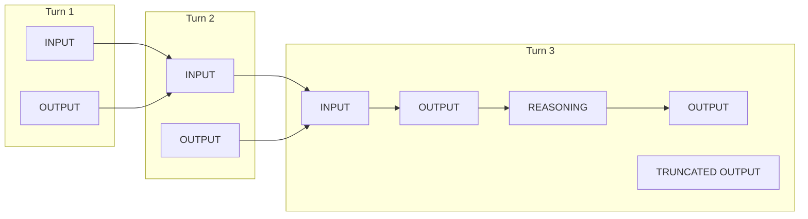
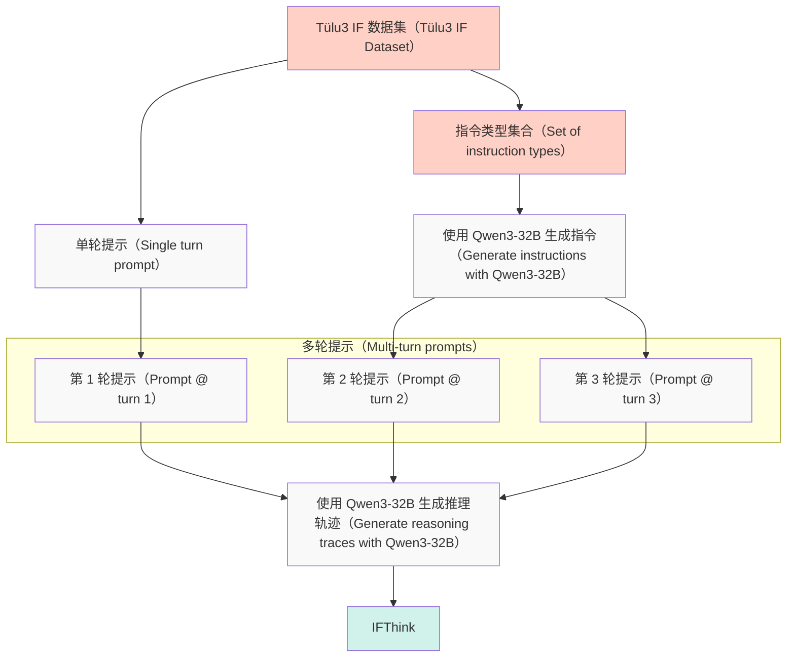

            - proportion_continued_words: percentage of words split into 2+ tokens (lower is better)
```

```python
    words = word_tokenizer.word_tokenize(text)
    tokens = tokenizer.batch_encode_plus(words, add_special_tokens=False)
    tokens_per_word = np.array(list(map(len, tokens["input_ids"])))
    
    fertility = np.mean(tokens_per_word).item()
    proportion_continued_words = (tokens_per_word >= 2).sum() / len(tokens_per_word)
    
    return fertility, proportion_continued_words
```

对于代码和数学等专业领域，除了生育率（fertility）之外，我们还需要更深入地研究分词器（tokenizer）处理领域特定模式的能力。大多数现代分词器会对单个数字进行拆分（例如将“123”拆分为[“1”, “2”, “3”]）（[Chowdhery et al., 2022](https://arxiv.org/abs/2204.02311)；[DeepSeek-AI et al., 2024](https://arxiv.org/abs/2405.04434)）。将数字拆分开来可能看起来有违直觉，但实际上这有助于模型更有效地学习算术模式。如果“342792”被编码为一个不可分割的token（词元），那么模型必须记住该特定token与其他所有数字token相加、相减或相乘的结果。但当它被拆分时，模型就能学习数字级别的运算规律。一些分词器（如Llama3，[Grattafiori et al., 2024](https://arxiv.org/abs/2407.21783)）会将1到999的数字编码为唯一token，其余数字则由这些token组合而成。

因此，我们可以通过测量目标领域的生育率（fertility）来评估分词器的优缺点。下表比较了不同流行分词器在多种语言和领域中的生育率。

评估分词器（Evaluating tokenizers）

为了比较不同语言的分词器，我们将采用[FineWeb2](https://arxiv.org/abs/2506.20920)分词器分析中的设置，使用维基百科文章作为评估语料库。对于每种语言，我们将采样100篇文章，以获得具有代表性的样本，同时保持计算量可控。

首先，安装依赖项并定义我们要比较的分词器和语言：

```
pip install transformers datasets sentencepiece 'datatrove[multilingual]'
```

## 我们需要 datatrove 来加载 word tokenizers（词元分析器）

```
tokenizers = [
    ("Llama3", "meta-llama/Llama-3.2-1B"),
    ("Gemma3", "google/gemma-3-1b-pt"),
    ("Mistral (S)", "mistralai/Mistral-Small-24B-Instruct-2501"),
    ("Qwen3", "Qwen/Qwen3-4B")
]

languages = [
    ("English", "eng_Latn", "en"),
    ("Chinese", "cmn_Hani", "zh"),
    ("French", "fra_Latn", "fr"),
    ("Arabic", "arb_Arab", "ar"),
]
```

现在加载 Wikipedia 样本，我们使用流式（streaming）方式以避免下载整个数据集：

```python
from datasets import load_dataset

wikis = {}
for lang_name, lang_code, short_lang_code in languages:
    wiki_ds = load_dataset("wikimedia/wikipedia", f"20231101.{short_lang_code}", streaming=True, split="train")
    wiki_ds = wiki_ds.shuffle(seed=42, buffer_size=10_000)
    # 每种语言采样 100 篇文章
    ds_iter = iter(wiki_ds)
    wikis[lang_code] = "\n".join([next(ds_iter)["text"] for _ in range(100)])
```

数据就绪后，即可评估每种 tokenizer（词元分析器）在各语言上的表现。对于每种组合，我们从 [datatrove](https://github.com/huggingface/datatrove) 加载相应的 word tokenizer（词元分析器）并计算两项指标：

```python
from transformers import AutoTokenizer
from datatrove.utils.word_tokenizers import load_word_tokenizer
import pandas as pd

results = []

for tokenizer_name, tokenizer_path in tokenizers:
    tokenizer = AutoTokenizer.from_pretrained(tokenizer_path, trust_remote_code=True)
    
    for lang_name, lang_code, short_lang_code in languages:
        word_tokenizer = load_word_tokenizer(lang_code)
        
        # 在 Wikipedia 上计算指标
        fertility, pcw = compute_tokenizer_metrics(tokenizer, word_tokenizer, wikis[lang_code])
        
        results.append({
            "tokenizer": tokenizer_name,
            "language": lang_name,
            "fertility": fertility,
            "pcw": pcw
        })

df = pd.DataFrame(results)
print(df)
```

```
tokenizer    language  fertility       pcw
0        Llama3     English   1.481715  0.322058
1        Llama3     Chinese   1.601615  0.425918
2        Llama3      French   1.728040  0.482036
3        Llama3     Spanish   1.721480  0.463431
4        Llama3  Portuguese   1.865398  0.491938
5        Llama3     Italian   1.811955  0.541326
6        Llama3      Arabic   2.349994  0.718284
7        Gemma3     English   1.412533  0.260423
8        Gemma3     Chinese   1.470705  0.330617
9        Gemma3      French   1.562824  0.399101
10       Gemma3     Spanish   1.586070  0.407092
11       Gemma3  Portuguese   1.905458  0.460791
12       Gemma3     Italian   1.696459  0.484186
13       Gemma3      Arabic   2.253702  0.700607
14  Mistral (S)     English   1.590875  0.367867
15  Mistral (S)     Chinese   1.782379  0.471219
16  Mistral (S)      French   1.686307  0.465154
17  Mistral (S)     Spanish   1.702656  0.456864
18  Mistral (S)  Portuguese   2.013821  0.496445
19  Mistral (S)     Italian   1.816314  0.534061
20  Mistral (S)      Arabic   2.148934  0.659853
21        Qwen3     English   1.543511  0.328073
22        Qwen3     Chinese   1.454369  0.307489
23        Qwen3      French   1.749418  0.477866
24        Qwen3     Spanish   1.757938  0.468954
25        Qwen3  Portuguese   2.064296  0.500651
26        Qwen3     Italian   1.883456  0.549402
27        Qwen3      Arabic   2.255253  0.660318
```

结果显示，根据你的优先级，存在一些优胜者和权衡取舍：

##### 生育力（tokens per word）

越低越好

##### 续词比例（%）

越低越好

Gemma3 分词器（tokenizer）在多种语言上实现了较低的“生育率”（fertility）和分词率，尤其在英语、法语和西班牙语上表现突出，这可以归因于其分词器训练数据以及高达 262k 的超大词表规模，约为 Llama3 128k 的两倍。Qwen3 分词器在中文上表现优异，但在英语、法语和西班牙语上落后于 Llama3 的分词器。Mistral Small 的分词器（[Mistral AI, 2025](https://mistral.ai/news/mistral-small-3-1)）在阿拉伯语上表现最佳，但在英语和中文上不及其他分词器。

在现有分词器与自定义分词器之间做选择目前，已有不少优秀的分词器可供选择。许多近期模型以 GPT4 的分词器（[OpenAI et al., 2024](https://arxiv.org/abs/2303.08774)）为起点，并额外扩充多语言词元（token）。如上表所示，Llama 3 的分词器在多语言文本和代码上的平均表现良好，而 Qwen 2.5 在中文及某些低资源语言上尤为出色。

*   何时使用现有分词器（tokenizer）： 如果我们的目标用例与上述最佳分词器（Llama、Qwen、Gemma）的语言或领域覆盖范围相匹配，那么它们都是经过实战检验的可靠选择。在 SmolLM3 的训练中，我们选择了 Llama3 的分词器：它在我们的目标语言（英语、法语、西班牙语、葡萄牙语、意大利语）上提供了具有竞争力的分词质量，且词汇表大小适中，非常适合我们这种小模型。对于更大的模型，当嵌入（embeddings）占总参数的比例较小时，Gemma3 的效率优势就更有吸引力。
*   何时训练自己的分词器： 如果我们要为低资源语言训练模型，或者数据混合比例非常不同，则很可能需要训练自己的分词器以确保良好的覆盖。在这种情况下，务必在与最终训练混合比例尽可能接近的数据集上训练分词器。这会带来“鸡生蛋还是蛋生鸡”的问题：我们需要一个分词器才能运行数据消融（data ablations）并确定混合比例。但我们可以在启动最终训练前重新训练分词器，并验证下游性能是否提升、 fertility（ fertility）指标是否仍然良好。

分词器的选择看似只是技术细节，却会波及模型性能的方方面面。因此，别怕花时间把它做对。

#### [SmolLM3](https://huggingfacetb-smol-training-playbook.hf.space/#smollm3)

在探索了架构版图并完成了系统性消融实验（ablations）之后，让我们看看这一切如何在 SmolLM3 这样的模型中落地。

SmolLM 系列致力于突破小模型的能力边界。SmolLM2 推出了 135M、360M 与 1.7B 三个参数规模的高效端侧模型。对于 SmolLM3，我们希望在保持手机可部署体积的同时进一步提升性能，并重点补足 SmolLM2 的短板：多语言（multilinguality）、超长上下文处理与强推理能力。我们最终选择 3B 参数作为兼顾性能与体积的最佳平衡点。

由于是对成熟方案进行放大，我们自然沿用了稠密（dense）Transformer 架构。此时 nanotron 尚未支持 MoE（Mixture of Experts，混合专家），而我们在训练小型稠密模型方面已具备成熟经验与基础设施。更重要的是，边缘设备部署受内存限制，即使 MoE 仅激活少量参数，仍需将全部专家加载进内存，这对我们的边缘部署目标并不友好，因此稠密模型更为实际。

消融实验： 我们以 SmolLM2 1.7B 的架构为起点，先用 Qwen2.5-3B 的排布训练了一个 3B 参数的消融模型，数据量为 100B token，作为测试各项改动的坚实基线。每一项架构变动必须要么在英语基准上降低损失并提升下游性能，要么在不影响质量的前提下带来可量化的收益（如推理加速）。

以下是我们最终敲定训练方案前所做的测试：

分词器（Tokenizer）： 在深入架构修改之前，我们需要选择一个分词器。我们找到了一组覆盖目标语言和领域的优秀分词器。基于我们的生育率（fertility）分析，Llama3.2 的分词器在 6 种目标语言之间提供了最佳权衡，同时将词汇表保持在 128k——足够大以实现多语言效率，但又不会大到让嵌入权重膨胀我们的 3B 参数量。

分组查询注意力（Grouped Query Attention, GQA）： 我们再次证实了此前的发现：在 3B 规模、100B token 的条件下，4 组 GQA 的性能与多头注意力（Multi-Head Attention）相当。KV 缓存的效率提升实在无法忽视，尤其是在内存宝贵的设备端部署场景。

用于长上下文的 NoPE： 我们通过在每第 4 层移除 RoPE 实现了 NoPE。我们的 3B 消融实验证实了上一节的发现：NoPE 在提升长上下文处理能力的同时，没有牺牲短上下文性能。

文档内注意力掩码（Intra-document attention masking）： 训练时我们阻止跨文档注意力，以在超长序列训练时提升训练速度与稳定性；再次发现这不会影响下游性能。

模型布局优化（Model layout optimization）： 我们比较了文献中近期 3B 模型的布局，有的优先深度，有的优先宽度。我们在自己的训练设置上测试了 Qwen2.5-3B（3.1B）、Llama3.2-3B（3.2B）和 Falcon3-H1-3B（3.1B）的布局，其中深度和宽度各不相同。结果很有趣：尽管 Qwen2.5-3B 的实际参数量更少，所有布局在损失和下游性能上几乎一致。但 Qwen2.5-3B 更深的架构与研究显示“网络深度有益于泛化”（[Petty et al., 2024](https://arxiv.org/abs/2310.19956)）相符。因此，我们选择了更深的布局，押注它在训练推进过程中会带来帮助。

文档内注意力掩码（Intra-document attention masking）： 训练时我们阻止跨文档注意力，以在超长序列训练时提升训练速度与稳定性；再次发现这不会影响下游性能。

稳定性改进：我们保留了 SmolLM2 的 tied embeddings（共享嵌入），但借鉴 OLMo2 的做法增加了一个新技巧——对 embeddings（嵌入）不再施加 weight decay（权重衰减）。我们的消融实验表明，这样做既不会损害性能，又能降低嵌入的范数，有助于防止训练发散。

这种系统性消融实验的美妙之处在于，我们可以放心地将所有这些改动组合在一起，因为每一项都经过了验证。

在实践中，我们增量地测试改动：一旦某个特性被验证，它就成为测试下一个特性的基线。测试顺序很重要：先采用那些久经考验的特性（共享嵌入 → GQA → 文档掩码 → NoPE → 移除权重衰减）。

#### [参与规则](https://huggingfacetb-smol-training-playbook.hf.space/#rules-of-engagement-1)

> 太长不看：你的用例驱动你的选择。

让部署目标指导架构决策。 在评估新的架构创新时，考虑模型实际运行的时间和地点。

在创新与务实之间取得平衡。 我们不能忽视重大架构进步——在今天仍使用 Multi-Head Attention（多头注意力）而 GQA（Grouped Query Attention，分组查询注意力）等更优方案已经存在，会是糟糕的技术选择。及时了解最新研究，采用那些在大规模场景下提供明确、已验证收益的技术。但要抵制追逐每一篇承诺边际提升的新论文的诱惑（除非你有资源这么做，或者你的目标就是架构研究）。

系统化优于直觉。 验证每一次架构改动，无论它在纸面上看起来多么有希望。在组合修改之前，先单独测试它们，以了解其影响。

规模效应真实存在——尽可能在目标规模重新消融。 不要假设小规模的消融结果在目标模型规模下完全成立。如果有算力，尽量重新确认它们。

在实际领域验证分词器效率。 在目标语言和领域上的 fertility（生育率）指标比追随最新模型使用的方案更重要。一个 50k 的英文分词器无法胜任严肃的多语言工作，但如果你并未覆盖那么多语言，也不需要 256k 的词表。

既然模型架构已定，接下来就该解决驱动学习过程的优化器与超参数了。

### [优化器与训练超参数](https://huggingfacetb-smol-training-playbook.hf.space/#optimiser-and-training-hyperparameters)

拼图逐渐完整。我们已经完成了消融实验（ablations），确定了架构，也选好了分词器（tokenizer）。但在真正启动训练之前，仍有几块关键拼图缺失：该用哪个优化器（optimizer）？学习率（learning rate）和批量大小（batch size）取多少？训练过程中如何调度学习率？

此时最诱人的做法，是直接照搬文献中某个强模型的数值。毕竟，大厂能成，我们也能成，对吧？如果借用的架构和模型规模相近，多数情况下确实可行。

然而，若不针对自身具体设置调优，就可能白白损失性能。文献里的超参数是为特定数据和约束优化的，有时那些约束甚至与性能无关。也许那个学习率早在开发初期就定下了，之后再没回头审视。即便作者做了彻底的超参数搜索，那些“最优”值也是针对他们当时的架构、数据与训练流程，而非我们的。文献值永远是好起点，但在附近再探一探，看能否找到更优值，总是明智之举。

本章我们将盘点最新优化器（看看老牌 AdamW（[Kingma, 2014](https://huggingfacetb-smol-training-playbook.hf.space/#bib-kingma2014adam)）是否仍[经得起时间考验](https://blog.iclr.cc/2025/04/14/announcing-the-test-of-time-award-winners-from-iclr-2015/) 🎉），深入超越标准余弦衰减（cosine decay）的学习率调度方案，并弄清楚如何根据模型和数据规模来调学习率与批量大小。

先从“优化器之战”说起。

#### [优化器：AdamW 及其之后](https://huggingfacetb-smol-training-playbook.hf.space/#optimizers-adamw-and-beyond)

优化器（optimizer）是整个大语言模型（LLM）训练流程的核心。它根据过去的更新、当前权重以及从损失（loss）计算出的梯度，为每个参数决定实际的更新步长。与此同时，它也是一个[内存和算力消耗大户](https://huggingface.co/spaces/nanotron/ultrascale-playbook?section=profiling_the_memory_usage)，因此会影响你需要多少张 GPU 以及训练速度。

我们不惜余力地梳理了当前用于 LLM 预训练的优化器格局：

| 模型 | 优化器 |
| --- | --- |
| Kimi K2, GLM 4.5 | Muon |
| 其他所有 | AdamW |

于是你可能会问：为什么大家都在用 AdamW？

撰写这部分博客的人认为是因为“人们太懒”（嗨，我是 [Elie](https://x.com/eliebakouch)），但更现实的人可能会说，AdamW 在不同规模下长期表现良好/更好，而且更改如此核心的组件总是有点吓人，尤其是如果很难（也就是昂贵）在超长训练中测试它的效果。

此外，公平地比较优化器比看起来更难。规模会以难以在小规模消融实验（ablations）中模拟的方式改变动态，因此超参数调优（hyperparameter tuning）很复杂。你可能会说：_“没关系，我已经花了几周调好 AdamW，可以直接复用同样的超参数来比较！”_——我们多么希望这是真的。但不幸的是，对于每个优化器，你都需要做适当的超参数搜索（1D？2D？3D？），这使得优化器研究既困难又昂贵。

那么，让我们从经典开始，也是 Durk Kingma 令人敬畏的 [Google Scholar](https://scholar.google.com/citations?user=yyIoQu4AAAAJ&hl=en) 统治力的基石：AdamW。

AdamW

Adam（Adaptive Momentum Estimation，自适应动量估计）是一种一阶（first order）优化技术。这意味着除了查看梯度本身，我们还会考虑权重在前几步中的变化量。这使得每个参数的学习率能够根据动量（momentum）自适应调整。

细心的读者可能会问：嘿，你是不是漏掉了一个 W？确实如此！我们特意加上 W（=weight decay，权重衰减）的原因如下。在标准 SGD 中，我们只需在损失函数里加上 $ \lambda \theta^2 $（其中 $ \theta $ 为权重）即可应用 L2 正则化。然而，如果在 Adam 中同样这么做，自适应学习率也会影响到 L2 正则化。这意味着正则化强度会变得依赖于梯度大小，从而削弱其效果。这不是我们想要的，因此 AdamW 将其与主优化循环解耦（decoupled）以解决这一问题。

细心的读者可能会问：嘿，你是不是漏掉了一个 W？确实如此！我们特意加上 W（=weight decay，权重衰减）的原因如下。在标准 SGD 中，我们只需在损失函数里加上 $\lambda \theta^2$（其中 $\theta$ 为权重）即可应用 L2 正则化。然而，如果在 Adam 中同样这么做，自适应学习率也会影响到 L2 正则化。这意味着正则化强度会变得依赖于梯度大小，从而削弱其效果。这不是我们想要的，因此 AdamW 将其与主优化循环解耦（decoupled）以解决这一问题。

有趣的是，在过去几年里，AdamW 的超参数几乎纹丝不动：

*   $\beta_1 = 0.9$，$\beta_2 = 0.95$  
*   grad norm clipping（梯度范数裁剪）= 1.0  
*   weight decay（权重衰减）= 0.1（Llama-3-405B 将其降至 0.01）

从 Llama 1、2、3 到 DeepSeek-V1、2、3 671B，这三元组几乎原封不动地复用。Durk Kingma 一直是对的吗？还是我们还能做得更好？

Muon 一句话总结

Adam 是一阶方法，因为它只使用梯度。Muon 是一个二阶优化器，它对参数张量的矩阵视图进行操作。

```latex
\begin{aligned}
G_t &= \nabla_{\theta}\mathcal{L}_t(\theta_{t-1}) \\
B_t &= \mu\, B_{t-1} + G_t \\
O_t &= \mathrm{NewtonSchulz5}(B_t) \ \approx\ U V^\top \quad \text{if } B_t = U\Sigma V^\top \text{ (SVD)} \\
\theta_t &= \theta_{t-1} - \eta\, O_t
\end{aligned}
```

看到这些公式，你可能会疑惑：这为什么是二阶方法？我只看到了梯度，没看到更高阶项。实际上，二阶优化发生在 Newton-Schulz 步骤内部，但这里不再深入展开。已经有高质量的博客深入解释了 Muon，因此这里只列出 Muon 的三个核心思想：

1. 矩阵级几何 vs. 参数级更新： AdamW 对每个参数（对角二阶矩）做预处理。Muon 把每个权重矩阵视为一个整体对象，并沿着 $G=U V^\top$ 更新，从而捕捉行/列子空间结构。
2. 通过正交化实现各向同性步长： 用奇异值分解（SVD）将 $G=U \Sigma V^\top$ 分解后，幅度（$\Sigma$）与方向（左右子空间 $U,V$）被分离。用 $U V^\top$ 替换 $G$ 会丢弃奇异值，使得步长在活跃子空间内各向同性。起初这有些反直觉——因为丢弃 $\Sigma$ 看似丢失信息——但它减少了轴对齐偏差，并鼓励探索那些因奇异值极小而被抑制方向。这种探索是否会在模型中植入仅凭损失无法察觉的不同能力，仍是一个开放问题。
3. 对大 batch size 的实证容忍度： 实践中，Muon 通常能容忍更大的 batch size。我们将在 batch size 章节深入讨论，但这可能是 Muon 被采用的关键点！

多年来，社区基本默认使用 AdamW（Adam with Weight decay，带权重衰减的 Adam），而前沿实验室的优化器配方往往秘而不宣（例如 Qwen 从未透露其方案）。不过最近，Muon 已在多个重磅发布中崭露头角（如 Kimi K2、GLM-4.5）。希望未来能看到更多开放且鲁棒的配方可供使用。

优化器堪称“狂野动物园”，研究者最富创意的并非把各种动量（momentum）和导数（derivative）组合个遍，而是给它们起名字：Shampoo、SOAP、PSGD、CASPR、DION、Sophia、Lion……就连 AdamW 也衍生出 NAdamW、StableAdamW 等变体。深入盘点这些优化器值得单独写一篇博客，我们留待下次。与此同时，推荐一篇由斯坦福 / Marin 团队撰写的精彩论文（[Wen et al., 2025](https://arxiv.org/abs/2509.02046)），他们系统评测了多种优化器，表明在做对比时超参数调优有多关键。

几乎伴随每个优化器的核心问题是：我们该以多大强度更新权重——这由学习率（learning rate）决定，它通常以标量形式出现在优化器公式中。接下来，我们就看看这个看似简单的主题究竟还有多少门道。

#### [学习率（Learning Rate）](https://huggingfacetb-smol-training-playbook.hf.space/#learning-rate)

学习率是我们必须设置的最重要超参数（hyperparameter）之一。在每一步训练中，它控制着我们根据计算出的梯度（gradients）调整模型权重的幅度。如果学习率选得太低，训练会变得极其缓慢，我们可能被困在糟糕的局部极小值（local minima）中。损失曲线（loss curves）看起来会很平坦，我们会在没有实质进展的情况下耗尽计算预算。另一方面，如果学习率设得太高，优化器（optimizer）会迈出过大的步伐，越过最优解且永远无法收敛，或者更糟——损失发散（loss diverges），损失值直冲云霄。

但最佳学习率甚至不是恒定的，因为学习动态在训练过程中会发生变化。在远离优质解的早期阶段，高学习率效果良好，但在接近收敛时会引起不稳定。这时就需要学习率调度（learning rate schedules）：从零开始预热（warmup）以避免早期混乱，然后衰减（decay）以稳定进入良好的极小值。这些模式（例如预热+余弦衰减）已在神经网络训练中验证多年。

大多数现代大语言模型（LLMs）使用固定数量的预热步数（例如2000步），无论模型大小和训练时长如何，如[表1](https://huggingfacetb-smol-training-playbook.hf.space/#llms-landscape-pretrain)所示。我们发现，对于长期训练，增加预热步数不会对性能产生影响，但对于非常短的训练，人们通常使用训练步数的1%到5%。

让我们看看常见的调度方式，然后讨论如何选择峰值。

学习率调度：超越余弦衰减

多年来人们已经知道，改变学习率（learning rate）有助于收敛（[Smith & Topin, 2018](https://arxiv.org/abs/1708.07120)），而余弦衰减（cosine decay）（[Loshchilov & Hutter, 2017](https://arxiv.org/abs/1608.03983)）一直是训练大语言模型（LLMs）的首选调度策略：在预热（warmup）后达到峰值学习率，然后沿余弦曲线平滑下降。它简单且效果良好。但其主要缺点是不灵活；我们必须提前知道总训练步数，因为余弦周期长度必须与总训练时长匹配。这在常见场景中会成为问题：模型尚未趋于平稳，或者你获得了更多算力想继续训练，又或者你在做扩展定律（scaling laws）研究，需要在不同 token 数量上训练同一模型。余弦衰减会迫使你从头开始。

如今许多团队采用无需在预热后立即开始衰减的调度策略。例如下图所示的 Warmup-Stable-Decay（WSD）（[Hu et al., 2024](https://arxiv.org/abs/2404.06395)）和 Multi-Step（[DeepSeek-AI 等, 2024](https://arxiv.org/abs/2401.02954)）变体。你在大部分训练时间内保持恒定的高学习率，然后在最后阶段（通常是最后 10–20% 的 token）对 WSD 进行急剧衰减，或者像 [DeepSeek LLM](https://arxiv.org/abs/2401.02954) 的 Multi-Step 调度那样，在训练 80% 和 90% 处进行离散下降（steps）以降低学习率。

这些调度方案相比余弦衰减（cosine decay）具有实际优势。我们可以在训练中途延长训练而无需重启，无论是因为我们打算比最初计划训练更久，还是提前衰减以便更好地衡量训练进展，并且我们可以通过一次主要训练运行在不同 token 数量下进行扩展定律（scaling law）实验。此外，研究表明，WSD 和 Multi-Step 都能与余弦衰减媲美（DeepSeek-AI, :, et al., 2024；Hägele et al., 2024[)](https://arxiv.org/abs/2401.02954)[](https://arxiv.org/abs/2405.18392)，同时在真实训练场景中更实用。

但你可能已经注意到，与余弦相比，这些调度方案引入了新的超参数：WSD 中的衰减阶段应该持续多久？Multi-Step 变体中的每一步又该持续多久？

*   对于 WSD：随着训练运行时间变长，匹配余弦性能所需的冷却（cooldown）持续时间会减少，建议将总 token 的 10–20% 分配给衰减阶段（[Hägele et al., 2024](https://arxiv.org/abs/2405.18392)）。我们将在下面的消融实验（ablations）中确认此设置与余弦相当。
*   对于 Multi-Step：DeepSeek LLM 的消融实验发现，虽然其基线 80/10/10 分割（稳定到 80%，第一步 80–90%，第二步 90–100%）与余弦匹配，但调整这些比例甚至可以超越余弦，例如使用 70/15/15 和 60/20/20 分割。

但我们还可以在这些调度方案上发挥更多创意。让我们看看 DeepSeek 模型家族各自使用的调度方案：

DeepSeek LLM 使用了基准的 Multi-Step 调度（80/10/10）。[DeepSeek V2](https://arxiv.org/abs/2405.04434) 将比例调整为 60/30/10，给第一个衰减步留出更多时间。[DeepSeek V3](https://arxiv.org/abs/2412.19437) 则采用了最具创意的方案：不再保持恒定学习率后接两次陡降，而是从恒定阶段过渡到余弦衰减（cosine decay，训练进度的 67%–97%），接着在最终陡降前加入一段短暂的恒定阶段。

DeepSeek-V2 与 V3 的技术报告中并未对这些调度变化做消融实验（ablation）。对于你的实验，建议先使用简单的 WSD 或 Multi-Step 调度，再通过消融调参。

exotic（奇异的）学习率调度就调研到这里，去烧点 GPU 小时，看看实践中什么有效吧！

消融实验 —— WSD 媲美 Cosine

是时候做消融了！我们验证 WSD 在实践中是否真的能与 cosine 性能持平。此处不展示 Multi-Step 的消融，但推荐参考 DeepSeek LLM 的实验，他们已证明 Multi-Step 在不同阶段划分下可与 cosine 匹配。本节将对比 cosine 衰减与 WSD，分别采用 10% 和 20% 的衰减窗口。

评估结果显示，三种配置的最终性能相近。观察损失与评估曲线（以 HellaSwag 为例），发现一个有趣现象：在稳定阶段（WSD 衰减开始前），cosine 的损失和评估分数更优；然而一旦 WSD 进入衰减阶段，损失与下游指标几乎线性改善，最终在训练结束时追平 cosine。

这证实 WSD 的 10–20% 衰减窗口足以匹配 cosine 的最终性能，同时保留中途延长训练的灵活性。我们在 SmolLM3 中选择了 10% 衰减的 WSD。

如果你在稳定阶段比较 cosine（余弦）和 WSD（Warm-Stable-Decay，预热-稳定-衰减）之间的中间检查点，请务必对 WSD 检查点施加衰减，以保证比较的公平性。

在了解了常用的学习率调度器之后，下一个问题是：峰值学习率到底应该设为多少？

寻找最优学习率（Learning Rate）

如何为特定的学习率调度器和训练配置选择合适的学习率？

我们可以像选择架构时那样，在短时的消融实验（ablation）上做学习率扫描（sweep）。但最优学习率与训练时长有关：在短时消融实验中收敛最快的学习率，未必适用于完整训练。而我们又无法承担为了测试不同学习率而多次运行昂贵、长达数周的训练。

我们先来看一些可以快速运行的简单扫描，它们能帮我们排除明显过高或过低的学习率；随后再讨论超参数的缩放定律（scaling laws）。

消融实验 - 学习率扫描

为了说明不同学习率的影响，我们来看一个在 1B 消融模型上、训练 45B token 的扫描实验。在完全相同的设置下，我们用 4 个不同的学习率训练同一模型：$1 \times 10^{-4}$、$5 \times 10^{-4}$、$5 \times 10^{-3}$、$5 \times 10^{-2}$。结果清晰地展示了两个极端的风险：

- 学习率 $5 \times 10^{-2}$ 几乎立即发散（diverge），损失（loss）早期飙升且从未恢复，模型完全不可用。
- 学习率 $1 \times 10^{-4}$ 过于保守，虽然训练稳定，但收敛速度远慢于其他学习率。
- 中间的 $5 \times 10^{-4}$ 和 $5 \times 10^{-3}$ 表现出更好的收敛性，且性能相当。

然而，为每个模型规模都运行扫描很快变得昂贵；更重要的是，如前所述，它并未考虑计划中的训练 token 数量。此时，缩放定律就显得尤为宝贵。

对于 SmolLM3，我们在 100B tokens 上训练了 3B 规模的模型，使用 AdamW（Adam with decoupled weight decay，解耦权重衰减的 Adam）优化器并采用 WSD（Warm-up, Steady, Decay，预热-稳定-衰减）学习率调度，比较了多个学习率。我们发现 $2 \times 10^{-4}$ 在损失和下游性能上都比 $1 \times 10^{-4}$ 收敛得快得多，而 $3 \times 10^{-4}$ 仅比 $2 \times 10^{-4}$ 略好。$3 \times 10^{-4}$ 带来的边际增益伴随着长训练过程中更高的不稳定风险，因此我们选择 $2 \times 10^{-4}$ 作为最佳平衡点。

这些扫描（sweeps）有助于我们排除明显过高（导致发散）或过低（收敛缓慢）的学习率，但为每个模型规模都运行扫描会迅速变得昂贵，更重要的是，它无法像我们之前所说的那样考虑计划的训练 token 数量。这正是 scaling laws（扩展规律）发挥巨大价值的地方。

但在深入探讨超参数的扩展规律之前，让我们先讨论另一个与学习率相互作用的关键超参数：batch size（批大小）。

#### [批大小（Batch size）](https://huggingfacetb-smol-training-playbook.hf.space/#batch-size)

批大小（batch size）是指在更新模型权重之前处理的样本数量。它直接影响训练效率和最终模型性能。如果你的硬件和训练栈在设备间扩展良好，增大批大小可以提高吞吐量。但超过某个点后，更大的批大小开始损害数据效率：模型需要更多总 token 才能达到相同的损失。这个转折点被称为临界批大小（critical batch size）（[McCandlish et al., 2018](https://arxiv.org/abs/1812.06162)）。

*   在低于临界值时增大批大小： 增大批大小并重新调整学习率后，你可以用与较小批大小运行相同的 token 数达到相同的损失，没有数据浪费。
*   在高于临界值时增大批大小： 更大的批大小开始牺牲数据效率；现在要达到相同的损失需要更多总 token（因此花费更多钱），即使因为更多芯片忙碌而墙钟时间下降。

让我们尝试给出一些直观理解，说明为什么需要重新调整学习率，以及如何估算临界批大小应该是多少。

当批大小增大时，每个小批梯度都是对真实梯度更好的估计，因此你可以安全地采取更大的步长（即增大学习率），并在更少的更新次数内达到目标损失。问题是如何缩放它。

对 $B$ 个样本取平均

*   批梯度：$\tilde{g}_{B} = \frac{1}{B}\sum_{i=1}^{B} \tilde{g}^{(i)}$
*   均值保持不变：$\mathbb{E}\!\left[\tilde{g}_{B}\right] = g$
*   但协方差缩小：$\mathrm{Cov}\!\left(\tilde{g}_{B}\right) = \frac{\Sigma}{B}$

SGD 参数更新为：

*   $\Delta w = -\,\eta \,\tilde{g}_{B}$

该更新的方差与以下成正比：

*   $\mathrm{Var}(\Delta w) \propto \eta^{2}\,\frac{\Sigma}{B}$

因此，为了保持更新方差大致不变，如果将批量大小（batch size）缩放 $k$ 倍，你就需要将学习率（learning rate）缩放 $\sqrt{k}$ 倍。假设你已经计算出了最优的批量大小和学习率，并且发现可以增加到临界批量大小（critical batch size）以提高吞吐量，那么你也需要相应地调整最优学习率。

$$B_{\text{critical}} \rightarrow kB_{\text{optimal}} \quad\Rightarrow\quad \eta_{\text{critical}} \rightarrow \sqrt{k}\eta_{\text{optimal}}$$

对于 AdamW 或 Muon 这类优化器（optimizers），一个实用的经验法则是：随着批量大小增长，采用 _平方根_ _学习率缩放（square-root LR scaling）_，但这也会因优化器而异。例如，使用 AdamW 时，`beta1` / `beta2` 之间可能存在交互，导致行为差异很大。另一种务实的做法是在短时间内并行训练：保留一个原始批量的运行，同时启动一个更大批量并重新缩放学习率的运行；只有当两条损失曲线在重新缩放后对齐时，才采用更大的批量（[Merrill et al., 2025](https://arxiv.org/abs/2505.23971)）。在该论文中，他们在切换批量大小时重新预热（re-warm up）学习率并重置优化器状态。他们还设定了容差和时间窗口来判断损失是否“匹配”，这两个参数都是凭经验选择的。他们发现，$B_{\text{simple}}$ 估计值——本身也有噪声——会低估“实际”的临界批量大小。这为你提供了一种快速、低风险的检查方式，确保新的批量/学习率组合能够保留训练动态。

关键批大小（critical batch size）并非一成不变，它会随着训练进程而增长。训练初期，模型迈出的梯度步幅很大，因此 $\|g\|^2$ 较大，这意味着 $B_{\text{simple}}$ 较小，于是模型的关键批大小也较小。随后，随着模型更新趋于稳定，更大的批变得更为有效。正因如此，一些大规模训练并不会把批大小固定，而是采用所谓的批大小热身（batch-size warmup）。例如，DeepSeek-V3 在前约 469 B 个 token 使用 12.6 M 的批大小，然后在剩余训练中提升到 62.9 M。这样的批大小热身调度与学习率热身（learning-rate warmup）目的相同：随着梯度噪声尺度（gradient noise scale）增大，让模型始终处于高效前沿，保持整个训练过程的稳定与高效。

另一种有趣的思路是把损失（loss）当作关键批大小的代理指标。Minimax01 就采用了这一策略，在最后阶段甚至用到了 128 M 的批大小！这略有不同，因为他们并未同步提高学习率，于是他们的批大小调度实际上起到了学习率衰减（learning-rate decay）的作用。

在实践中，可按如下方式选择批大小和学习率：

*   首先，根据扩展定律（scaling laws）（见后文！）或文献，选出你认为最优的批大小和学习率。  
*   接着，可微调批大小，看能否进一步提升训练吞吐量（training throughput）。

核心洞见在于：从初始批大小到关键批大小之间通常存在一个区间，你可以在此区间内增大批大小以提高硬件利用率，而无需牺牲数据效率；但必须相应地重新调节学习率。如果吞吐量提升不明显，或者测试更大的批大小（并重缩放学习率）后数据效率反而下降，那就沿用初始值即可。

如上文注释所述，选择批量大小（batch size）和学习率（learning rate）起始值的一种方法是借助扩展律（scaling laws）。下面我们来了解这些扩展律如何运作，以及它们如何根据你的计算预算（compute budget）预测这两个超参数（hyperparameters）。

#### [超参数缩放定律（Scaling laws for hyperparameters）](https://huggingfacetb-smol-training-playbook.hf.space/#scaling-laws-for-hyperparameters)

最优学习率（learning rate）和批量大小（batch size）不仅取决于模型架构和规模，还取决于我们的计算预算（compute budget），后者结合了模型参数数量和训练词元（token）数量。在实践中，这两个因素共同决定了我们的参数更新应该激进还是保守。这正是缩放定律（scaling laws）发挥作用的地方。

缩放定律建立了描述模型性能如何随训练规模提升而演进的经验关系，无论是通过更大的模型还是更多的训练数据（详见本章末尾的“缩放定律”部分了解完整历史）。但缩放定律也能帮助我们预测在扩大训练规模时如何调整关键超参数（如学习率和批量大小），正如 [DeepSeek](https://arxiv.org/abs/2401.02954) 和 [Qwen2.5](https://arxiv.org/abs/2412.15115) 最近的工作所做的那样。这为我们提供了有理论依据的默认值，而不必完全依赖超参数搜索（hyperparameter sweeps）。

要在此情境下应用缩放定律，我们需要一种量化训练规模的方法。标准指标是计算预算（compute budget），记为 $C$，以 FLOPs（floating-point operations，浮点运算次数）为单位，可近似为：

$$C \approx 6 \times N \times D$$

其中 $N$ 是模型参数数量（例如 1B = $1 \times 10^9$），$D$ 是训练词元数量。这通常以 FLOPs 衡量，是一种与硬件无关的量化实际计算量的方式。但如果 FLOPs 显得过于抽象，可以这样想：在 100B 词元上训练 1B 参数模型所消耗的 FLOPs，大约是在 100B 词元上训练 2B 参数模型，或在 200B 词元上训练 1B 参数模型的一半。

常数 6 来自对训练 Transformer 所需浮点运算次数的经验估计，大约为每个参数每个词元 6 次 FLOP。

那么，这与学习率（learning rate）有何关系？我们可以推导出扩展定律（scaling laws），用来预测最优学习率和批量大小（batch size）如何随总算力预算（$C$）变化。它们能回答如下问题：

*   当我把参数量从 1B 扩展到 7B 时，学习率该如何调整？  
*   如果训练数据量翻倍，我是否需要修改学习率？

让我们通过 DeepSeek 采用的方法来具体看看：  
首先，选定学习率调度策略，最好选用 WSD（Warm-up, Stable, Decay） 因其灵活。接着，在一系列算力预算（如 $1e17$, $5e17$, $1e18$, $5e18$, $1e19$, $2e19$ FLOPs）下，用不同的批量大小与学习率组合训练模型。简单说：用不同规模的模型、不同数量的 token 进行训练，并测试各种超参数设置。这正是 WSD 调度的优势——无需重启即可将同一次训练扩展到不同的 token 数量。

对每种设置，我们在学习率和批量大小上做网格搜索（sweep），找出那些接近最优的配置，通常定义为验证损失（validation loss）与最佳值差距很小（例如 $0.25\%$ 以内）。验证损失在独立验证集上计算，其分布与训练集类似。每个近优配置提供一个数据点——一个元组（算力预算 $C$，最优学习率 $\eta$）或（$C$，最优批量大小 $B$）。在双对数坐标（log-log scale）下，这些关系通常呈幂律（power-law）行为，近似为直线（如上图所示）。通过拟合这些数据点，我们就能提取出描述最优超参数如何随算力演化的扩展定律。

一个重要的发现是：在固定的模型规模（model size）和计算预算（compute budget）下，性能在很宽的超参数（hyperparameters）范围内都能保持稳定。这意味着存在一个宽阔的“甜点区”，而非狭窄的“最优点”。我们无需找到完美值，只需足够接近即可，这让整个过程更具实操性。

下图展示了 DeepSeek 推导出的缩放定律（scaling laws）结果，每个点代表一个接近最优的配置：


这些结果背后的核心直觉是：随着训练规模变大、时间变长，我们希望更新更稳定（因此学习率更小），同时梯度估计更高效（因此批量更大）。

这些缩放定律为我们提供了学习率（learning rate）和批量大小（batch size）的初始值。但目标并非“每次梯度更新的最优样本数”，而是“在时间和 GPU 数量（GPUd）约束下能达到的更低损失”，同时仍能从每个 token 中榨取全部信号。

实践中，你可以把批量大小提高到超出预测最优值，从而显著提升吞吐量，而数据效率不会受到明显损害——直到我们之前讨论过的临界批量大小（critical batch size）为止。

#### [SmolLM3](https://huggingfacetb-smol-training-playbook.hf.space/#smollm3-1)

那么，我们最终为 SmolLM3 选用了什么？在 SmolLM3 发布前的消融实验（ablations）阶段，我们在 1B 模型、100B token 的训练规模上比较了 AdamW、AdEMAMix 和 Muon。经过精细调参后，Muon 可以超越 AdamW，但对学习率敏感且容易发散；AdEMAMix 则不那么敏感，且能达到与 Muon 相近的 loss。AdamW 最稳定，但最终 loss 高于调优后的替代方案。

然而，当我们把规模扩大到 3B 时，Muon 和 AdEMAMix 出现更频繁的发散。这可能源于我们在完成消融实验后发现的一个并行性 bug（见“训练马拉松”章节），但我们尚未确认。我们最终决定使用 AdamW（beta1: 0.9，beta2: 0.95），权重衰减（weight decay）0.1，梯度裁剪（gradient clipping）1——整体是非常“香草”的配置。

对于学习率调度器（learning rate schedule），我们选择了 WSD。我们在 SmolLM2 中已成功使用过，事实证明这是我们在易用性、总训练时长灵活性以及中途衰减实验能力方面最明智的决策之一。我们做了学习率扫描，最终定为 $2e-4$。全局批次大小（global batch size）方面，我们测试了 $2M$ 到 $4M$ token 的范围，发现对 loss 或下游性能影响极小，于是选择了 $2.36M$ token——该大小带来了最佳吞吐。

#### [参与规则](https://huggingfacetb-smol-training-playbook.hf.space/#rules-of-engagement-2)

> 太长不看： 平衡探索与执行，完成比完美更重要。

我们已经谈了很多“做什么”（优化器 optimizer、学习率 learning rate、批次大小 batch size），但同样重要的是怎么做。我们如何判断哪些实验值得做？如何安排时间？何时停止探索、直接开训？

在探索与执行之间合理分配时间。 花几周时间把某种新方法带来的微小提升打磨到极致，不如把同样的算力投入到更好的数据整理 data curation 或更彻底的架构消融实验 architecture ablations 中。根据我们的经验——虽然这可能让架构爱好者失望——最大的性能提升通常来自数据整理。

犹豫不决时，选择灵活性与稳定性，而非峰值性能。 如果两种方法表现相当，就选那个更灵活、实现更成熟、更稳定的方法。像 WSD（Warm-up, Steady, Decay）这种可以随时延长训练或中途做实验的学习率策略，比那种收敛略好但死板得多的策略更有价值。

知道何时停止优化、开始训练。 总还有一个超参数 hyperparameter 可调，总还有一个优化器 optimizer 可试。给探索阶段设个截止日期并严格执行——真正完成训练的模型，永远胜过那个我们从未开始训练的“完美”模型。


“再来一次消融实验不会有事的”（剧透：真有事）。感谢 [sea_snell](https://huggingfacetb-smol-training-playbook.hf.space/[https://x.com/sea_snell/status/1905163154596012238](https://x.com/sea_snell/status/1905163154596012238))

完美是良好的敌人，尤其在算力预算和截止日期都有限的情况下。

### [扩展定律：需要多少参数，多少数据？](https://huggingfacetb-smol-training-playbook.hf.space/#scaling-laws-how-many-parameters-how-much-data)

在深度学习早期，语言模型（language models）及其训练集群尚未“变大”时，训练往往不受算力（compute）限制。那时只需在硬件可容纳范围内选最大的模型和批次大小，一直训练到模型开始过拟合（overfitting）或数据耗尽。然而，即便在当时，人们已隐约感到“规模”有益——例如，[Hestness 等人](https://arxiv.org/abs/1712.00409) 2017 年发表的一系列全面结果表明，用更长时间训练更大的模型会带来可预期的收益。

进入大语言模型（large language models）时代后，我们永远受算力限制。为何？早期关于可扩展性的直觉被 [Kaplan 等人关于神经语言模型扩展定律（Scaling Laws for Neural Language Models）的研究](https://arxiv.org/abs/2001.08361)正式化，该研究指出，语言模型的性能在多个数量级的规模范围内都表现出惊人的可预测性。这一发现引发了模型规模和训练时长的爆发式增长，因为它提供了一种准确预测性能随规模提升的方法。于是，打造更优语言模型的竞赛，演变为在日益增长的算力预算下，用更多数据训练更大模型的竞赛，语言模型的发展迅速陷入算力受限的局面。

当面临算力（compute）约束时，最关键的问题是：应该训练一个更大的模型，还是应该在更多数据上训练？令人惊讶的是，Kaplan 等人的扩展定律（scaling laws）表明，将更多算力分配给模型规模比之前的最佳实践更有利——这促使人们训练了庞大的（175B 参数）GPT-3 模型，却只用了相对适中的 token 预算（300B tokens）。重新审视后，[Hoffman 等人](https://arxiv.org/abs/2203.15556) 发现 Kaplan 等人的方法存在方法论问题，最终重新推导出的扩展定律建议将更多算力分配给训练时长，并指出例如对 175B 参数的 GPT-3 进行算力最优（compute-optimal）训练时，本应消耗 3.7T tokens！

这一发现将领域风向从“把模型做大”转变为“训练得更久、更好”。然而，大多数现代训练仍然并未严格遵循 Chinchilla 定律，因为它们有一个缺陷：这些定律旨在预测在给定算力预算下，训练阶段能达到最佳性能的模型规模和训练时长，却忽略了更大的模型在训练后推理成本更高的事实。换句话说，我们可能更愿意用给定的算力预算去训练一个更小的模型更长时间——即使这在“算力最优”意义上并非最优——因为这样能降低推理成本（[Sardana 等人](https://arxiv.org/abs/2401.00448)、[de Vries](https://www.harmdevries.com/post/model-size-vs-compute-overhead/)）。如果我们预期模型会经历大量推理调用（例如因为它将开源发布 🤗），这种情况就可能发生。最近，这种“过度训练”（overtraining）——即超出扩展定律建议的训练时长——已成为行业惯例，我们在开发 SmolLM3 时也采用了这一做法。

尽管扩展定律（scaling laws）为给定算力预算下的模型规模与训练时长提供了参考，但若选择过度训练（overtrain），你就得自行决定这些因素。对于 SmolLM3，我们首先将目标模型规模定为 30 亿（3B）参数。参考近期同量级模型，如 Qwen3 4B、Gemma 3 4B 与 Llama 3.2 3B，我们认为 3B 既足以具备有意义的能力（如推理与工具调用），又足够小，可实现超快推理与高效的本地部署。为确定训练时长，我们注意到近期模型已被极度过度训练——例如，前述 Qwen3 系列据称训练了 36T（36 万亿）token！因此，训练时长往往由可用算力决定。我们大约租到了 384 张 H100，为期一个月，按约 30% 的 MFU（Model FLOPs Utilization，模型浮点利用率）估算，可支持训练 11 万亿 token。

尽管存在这些偏离，扩展定律仍具实际价值：它们为实验设计提供基线，人们常用 Chinchilla-optimal（Chinchilla 最优）设置来获得消融实验的信号，并帮助预测某一模型规模能否达到目标性能。正如 de Vries 在[这篇博客](https://huggingfacetb-smol-training-playbook.hf.space/[https://www.harmdevries.com/post/model-size-vs-compute-overhead/](https://www.harmdevries.com/post/model-size-vs-compute-overhead/))中所指出的，通过缩小模型规模，你可以命中一个临界模型规模：达到给定损失所需的最小容量，低于此规模便会开始遭遇收益递减。

既然我们已经确定了模型架构、训练配置、模型规模和训练时长，接下来就必须准备两个关键组件：用于“教学”的数据配比，以及能够可靠完成训练的基础设施。SmolLM3 的参数量定为 3B，我们需要精心调配一份能在多语言、数学和代码方面带来强劲表现的数据配比，并搭建足够稳健、可支撑 11 万亿（trillion）个 token 训练的基础设施。把这些基础打牢至关重要——哪怕架构再优秀，也救不了糟糕的数据策划或不稳定的训练系统。

[数据策划的艺术（The art of data curation）](https://huggingfacetb-smol-training-playbook.hf.space/#the-art-of-data-curation)
-----------------------------------------------------------------------------------------------------------

想象一下：你花了数周打磨架构、调优超参数（hyperparameters），并搭建了最稳健的训练基础设施。模型收敛得非常漂亮，结果……它写不出连贯的代码，基本数学也搞不定，甚至一句话里还会中途切换语言。哪里出了问题？答案通常就在数据。我们痴迷于花哨的架构创新和超参数搜索，却常常忽略数据策划——它决定了模型最终是真正好用，还是又一场昂贵的实验。区别就在于：是随便拿网络爬来的数据训练，还是使用经过精心筛选、高质量、真正能教会模型所需技能的数据集。

如果模型架构（model architecture）定义了模型如何学习，那么数据就定义了它学什么；一旦训练内容选错，再多的算力或优化器调参都无法弥补。此外，把训练数据“做对”不仅仅是拥有优质数据集，更在于拼出正确的混合比例（mixture）：在彼此冲突的目标之间（如强英语能力 vs. 多语言鲁棒性）取得平衡，并按我们的性能目标调整各类数据的比例。这一过程与其说是寻找放之四海而皆准的“最佳配方”，不如说是提出正确的问题，并制定可落地的方案去回答它们：

*   我们希望模型擅长什么？
*   每个领域该用哪些数据集，又如何混合？
*   针对目标训练规模，我们是否有足够的高质量数据？

本节将带你用一套兼顾原理的方法、消融实验（ablation experiments）以及一点点“炼金术”，把一堆出色的数据集炼成一份出色的训练混合料。

### [什么是好的数据配比，以及它为何至关重要](https://huggingfacetb-smol-training-playbook.hf.space/#whats-a-good-data-mixture-and-why-it-matters-most)

我们对语言模型（language models）寄予厚望：它们应该能帮我们写代码、提供建议、回答几乎任何问题、使用工具完成任务等等。像网络这样丰富的预训练（pre-training）数据来源并不能完全覆盖这些任务所需的全部知识与能力。因此，最近的模型还会额外依赖更具针对性的预训练数据集，这些数据集专注于数学、编程等特定领域。我们过去在数据集策划（dataset curation）方面做了大量工作，但对于 SmolLM3，我们主要使用了已有的数据集。若想深入了解数据集策划，请查看我们关于构建 [FineWeb 和 FineWeb-Edu](https://huggingface.co/spaces/HuggingFaceFW/blogpost-fineweb-v1)、[FineWeb2](https://arxiv.org/abs/2506.20920)、[Stack-Edu 和 FineMath](https://arxiv.org/abs/2502.02737) 的报告。

#### [数据混合的反直觉特性](https://huggingfacetb-smol-training-playbook.hf.space/#the-unintuitive-nature-of-data-mixtures)

如果你刚开始训练语言模型（language model），找到一个好的数据混合（data mixture）方案似乎很简单：确定目标能力，为每个领域收集高质量数据集，然后把它们组合起来。现实却更复杂，因为某些领域可能会相互争夺训练预算。当专注于某项特定能力（如编程）时，你可能会忍不住提高相关任务数据（如源代码）的权重。然而，提高某一数据源的权重会间接降低其他所有数据源的权重，从而损害语言模型在其他场景下的能力。因此，在多种不同来源的数据上进行训练，需要在下游能力之间取得某种平衡。

此外，在所有这些来源和领域中，往往存在一部分“高质量”数据，对提升语言模型能力特别有帮助。为什么不干脆扔掉所有低质量数据，只训练最高质量的数据呢？对于 SmolLM3 高达 11T tokens 的大规模训练预算，如此极端的过滤会导致数据被重复多次。已有研究表明，这种重复可能有害（[Muennighoff et al., 2025](https://arxiv.org/abs/2305.16264)），因此我们理想的做法是，在同时利用高、低质量数据的前提下，仍然最大化模型性能。

为了在数据源之间取得平衡并充分利用高质量数据，我们需要精心设计混合比例（mixture）：即每个来源的训练文档所占的相对比例。由于语言模型在某一特定任务或领域上的表现，很大程度上取决于它见过多少与该任务相关的数据，因此调整混合权重（mixing weights）可以直接平衡模型在各领域的能力。由于这些权衡具有模型依赖性且难以预测，消融实验（ablations）至关重要。

但混合比例不必在整个训练过程中保持不变。通过在训练过程中动态调整混合比例——我们称之为多阶段训练（multi-stage training）或课程学习（curriculum）——可以更好地同时利用高质量和较低质量的数据。

#### [训练课程表的演进](https://huggingfacetb-smol-training-playbook.hf.space/#the-evolution-of-training-curricula)

在大语言模型（large language model, LLM）训练的早期，标准做法是在整个训练过程中固定单一的数据混合比例。像 GPT3 和早期版本的 Llama 都是从始至终使用静态数据混合进行训练。近年来，领域已转向多阶段训练（multi-stage training）（[Allal et al., 2025](https://arxiv.org/abs/2502.02737)），即在训练过程中动态调整数据混合比例。其主要动机在于，语言模型的最终行为强烈受到训练末期所见数据的影响（[Y. Chen et al., 2025b](https://arxiv.org/abs/2410.08527)）。这一洞察带来了一种实用策略：在训练早期提高更丰富数据源的权重，而在接近结束时引入规模较小但质量更高的数据源。

一个常见问题是：如何决定何时更换混合比例？虽然没有放之四海而皆准的规则，但我们通常遵循以下原则：

1. 性能驱动的干预：监控关键基准上的评估指标，并针对特定能力瓶颈调整数据集混合比例。例如，若数学性能出现平台期，而其他能力仍在提升，这就是引入更高质量数学数据的信号。
2. 将高质量数据留到后期：小规模、高质量的数学与代码数据集在退火阶段（annealing phase，即学习率衰减的最后阶段）引入时最具影响力。

既然我们已经明确了混合比例为何重要以及课程表如何运作，接下来讨论如何对两者进行调优。

### [消融实验设置：如何系统地测试数据配方](https://huggingfacetb-smol-training-playbook.hf.space/#ablation-setup-how-to-systematically-test-data-recipes)

在测试数据混合比例时，我们的方法与架构消融（ablation）类似，但有一个区别：我们尽量在目标模型规模下进行实验。小模型和大模型的容量不同，例如非常小的模型可能难以处理多种语言，而较大的模型可以在不牺牲其他性能的情况下吸收它们。因此，在过小的规模下进行数据消融实验可能会得出关于最佳混合比例的错误结论。

对于 SmolLM3，我们直接在 3B 模型上进行了主要的数据消融实验，使用较短的训练过程，分别为 50B 和 100B 个 token。我们还使用了另一种消融实验设置：退火实验（annealing experiments）。我们不是从头开始使用不同的数据混合比例进行训练，而是从主训练过程中的一个中间检查点（例如在 7T 个 token 时）开始，继续使用修改后的数据组成进行训练。这种方法允许我们测试数据混合比例的变化，以进行多阶段训练（即在训练中期改变训练混合比例），并在 SmolLM2、Llama3 和 Olmo2 等近期工作中得到了应用。在评估方面，我们扩展了基准测试套件，除了标准的英文评估外，还包括了多语言任务，确保我们能够正确评估不同语言比例之间的权衡。

近期工作提出了自动寻找最佳数据比例的方法，包括：

*   DoReMi（[Xie et al., 2023](https://arxiv.org/abs/2305.10429)）：利用一个小型代理模型（proxy model）学习域权重（domain weights），以最小化验证损失（validation loss）  
*   Rho Loss（[Mindermann et al., 2022](https://arxiv.org/abs/2206.07137)）：基于留出损失（holdout loss）挑选单个训练样本，优先选择模型可学习、与任务相关且尚未学会的样本  
*   RegMix（[Q. Liu et al., 2025](https://arxiv.org/abs/2407.01492)）：通过带正则化的回归（regularized regression）确定最优数据混合比例，在多个评估目标（evaluation objectives）和数据域（data domains）之间平衡性能  

我们在以往项目中实验了 DoReMi 和 Rho Loss，但发现它们往往收敛到大致反映数据集自然规模分布的权重，本质上就是“有什么就用更多什么”。虽然理论上很吸引人，但在我们的场景下并未胜过细致的人工消融（manual ablations）。最新的 SOTA 模型仍依赖通过系统性消融（systematic ablations）和退火实验（annealing experiments）进行人工混合调优，这也是我们在 SmolLM3 中采用的方法。

### [SmolLM3：策划数据混合（web、多语言、数学、代码）](https://huggingfacetb-smol-training-playbook.hf.space/#smollm3-curating-the-data-mixture-web-multilingual-math-code)

对于 SmolLM3，我们希望模型既能处理英语，也能处理多种其他语言，并在数学和代码方面表现优异。这些领域——网页文本、多语言内容、代码和数学——在大多数 LLM（大语言模型）中都很常见，但这里描述的过程同样适用于训练低资源语言或金融、医疗等特定领域。方法是一样的：识别优质候选数据集，进行消融实验（ablations），并设计一个平衡所有目标域的混合方案。

本文不会介绍如何构建高质量数据集，因为我们已在先前的工作中详细阐述（FineWeb、FineWeb2、FineMath 和 Stack-Edu）。相反，本节重点介绍如何将这些数据集组合成一个有效的预训练（pretraining）混合。

#### [在成熟基础上构建](https://huggingfacetb-smol-training-playbook.hf.space/#building-on-proven-foundations)

在预训练数据方面，好消息是我们很少需要从零开始。开源社区已经为大多数常见领域构建了强大的数据集。有时我们确实需要创建新数据集——正如我们在 Fine 系列（FineWeb、FineMath 等）所做的那样——但更多时候，挑战在于选择和组合现有资源，而非重新发明它们。

这正是 SmolLM3 面临的情况。SmolLM2 已在 1.7B 参数规模上为英语网页数据确立了强有力的配方，并找出了我们所能获取的最佳数学和代码数据集。我们的目标是将这一成功扩展到 3B 参数，同时增加以下能力：稳健的多语言性、更强的数学推理能力，以及更优的代码生成能力。

#### [英文网页数据：基础层](https://huggingfacetb-smol-training-playbook.hf.space/#english-web-data-the-foundation-layer)

网页文本是任何通用大语言模型（LLM, Large Language Model）的支柱，但质量与数量同样重要。

在 SmolLM3 阶段，我们已知 FineWeb-Edu 和 DCLM 是当时最强的开放英文网页数据集。两者合计为我们提供了 5.1 T tokens 的高质量英文网页数据。问题在于：最优的混合比例是多少？FineWeb-Edu 有助于教育和 STEM（科学、技术、工程、数学）基准测试，而 DCLM 则能提升常识推理能力。

沿用 SmolLM2 的方法论，我们在 3B 模型上、以 100 B tokens 的规模进行扫描，测试了 20/80、40/60、50/50、60/40 和 80/20（FineWeb-Edu/DCLM）的比例。将两者混合（约 60/40 或 50/50）可获得最佳权衡。我们在 3B 模型上重新运行了与 [SmolLM2 论文](https://arxiv.org/abs/2502.02737v1) 相同的消融实验（ablations），训练 100 B tokens 后得出了相同结论。

使用 60/40 或 50/50 的比例在各项基准测试中提供了最佳平衡，与我们的 SmolLM2 发现一致。我们在第一阶段采用了 50/50 的比例。

我们还加入了其他数据集，如 [Pes2o](https://huggingface.co/datasets/allenai/dolmino-mix-1124/tree/main/data/pes2o)、[维基百科与维基教科书](https://huggingface.co/datasets/allenai/dolmino-mix-1124/tree/main/data/wiki) 以及 [StackExchange](https://huggingface.co/datasets/HuggingFaceTB/stackexchange_2025_md)。这些数据集对性能没有显著影响，但我们仍将其纳入以提高多样性。

#### [多语言网络数据](https://huggingfacetb-smol-training-playbook.hf.space/#multilingual-web-data)

为了获得多语言能力，我们额外瞄准了 5 种语言：法语（French）、西班牙语（Spanish）、德语（German）、意大利语（Italian）和葡萄牙语（Portuguese）。这些语料选自 FineWeb2-HQ，总计 628B 个 token。我们还按较小比例加入了另外 10 种语言，如中文（Chinese）、阿拉伯语（Arabic）和俄语（Russian），目的并非在这些语言上达到最先进性能，而是方便用户后续在 SmolLM3 上轻松进行持续预训练（continual pretraining）。对于 FineWeb2-HQ 不覆盖的语言，我们使用 FineWeb2 作为来源。

关键问题在于：我们的网络数据里应该有多少是非英语的？我们知道，模型在某种语言或领域上见到的数据越多，其在该语言或领域上的表现就越好。然而，由于计算预算固定，为某一语言增加数据量就意味着要减少包括英语在内的其他语言的数据量。

通过对 3B 模型的消融实验（ablations），我们发现网络混合语料中 12% 的多语言内容能够达到最佳平衡：在提升多语言性能的同时，不降低英语基准测试的表现。这也符合 SmolLM3 的预期使用场景——英语仍是主要语言。值得注意的是，非英语数据仅有 628B token，而英语数据高达 5.1T token；若进一步提高多语言比例，就必须对多语言数据进行更多重复。

#### [代码数据](https://huggingfacetb-smol-training-playbook.hf.space/#code-data)

我们在第一阶段使用的代码来源提取自 [The Stack v2 与 StarCoder2](https://arxiv.org/abs/2402.19173) 训练语料：

*   以 [The Stack v2](https://huggingface.co/datasets/bigcode/the-stack-v2)（16 种语言）为基础，并按 StarCoder2Data 的方式过滤。
*   StarCoder2 GitHub Pull Request，用于真实场景的代码审查推理。
*   Jupyter 与 [Kaggle notebooks](https://huggingface.co/datasets/HuggingFaceTB/issues-kaggle-notebooks)，提供可执行的逐步工作流。
*   [GitHub issues](https://huggingface.co/datasets/HuggingFaceTB/issues-kaggle-notebooks) 与 [StackExchange](https://huggingface.co/datasets/HuggingFaceTB/stackexchange_2025_md) 讨论串，围绕代码的上下文讨论。

[Aryabumi 等（2024）](https://arxiv.org/abs/2408.10914)指出，代码能提升语言模型在编程之外的表现，例如自然语言推理（natural language reasoning）与世界知识（world knowledge），并建议在训练混合数据中保留 25% 的代码。受此启发，我们最初在混合数据中尝试 25% 的代码比例。然而，我们观察到英语基准（HellaSwag、ARC-C、MMLU）显著下降。将代码比例降至 10% 后，与 0% 代码相比，英语基准套件未见提升，但我们仍保留了代码，因为代码能力对模型极为重要。

我们遵循“在训练后期才引入高质量数据以最大化影响”的原则，将 Stack-Edu（StarCoder2Data 中经教育场景过滤的子集）推迟到后续阶段再加入。

#### [数学数据](https://huggingfacetb-smol-training-playbook.hf.space/#math-data)

数学（Math）遵循了与代码类似的理念。早期，我们使用了更大、更通用的 FineMath3+ 和 InfiWebMath3+ 数据集，随后对 FineMath4+ 和 InfiWebMath4+ 进行了上采样（upsampled），并引入了新的高质量数据集：

*   MegaMath（[Zhou 等，2025](https://arxiv.org/abs/2504.02807)）
*   指令与推理数据集，如 OpenMathInstruct（[Toshniwal 等，2024](https://arxiv.org/abs/2402.10176)）和 OpenMathReasoning（[Moshkov 等，2025](https://arxiv.org/abs/2504.16891)）

在第 1 阶段（Stage 1），我们使用 3% 的数学数据，平均分配在 FineMath3+ 和 InfiWebMath3+ 之间。由于仅有 54B 个可用 token，而第 1 阶段预计为 8T 到 9T 个 token，若使用超过 3% 的数学数据，将需要在该数据集上训练超过 5 个 epoch。

#### [为新阶段找到合适的配比](https://huggingfacetb-smol-training-playbook.hf.space/#finding-the-right-mixture-for-new-stages)

虽然我们是从零开始跑消融实验（ablations）来确定阶段 1 的配比，但在测试新阶段的新数据集时（本例中新增了两个阶段），我们采用了退火消融（annealing ablations）：在阶段 1 后期、约 7T tokens 处取一个检查点（checkpoint），然后跑 50B tokens 的退火实验，设置如下：

*   40% 基线配比：我们当时正在训练的确切阶段 1 配比  
*   60% 新数据集：想要评估的候选数据集  

例如，为了验证 MegaMath 能否提升数学能力，我们跑了 40% 阶段 1 配比（保持 75/12/10/3 的域切分）+ 60% MegaMath。

3 个阶段的具体构成可在下一节找到。

数据已精心策划，配比也通过消融实验验证，我们即将踏上真正的训练之旅。接下来的章节讲述了 SmolLM3 为期一个月的训练历程：准备工作、意外挑战以及一路走来的经验教训。

[训练马拉松](https://huggingfacetb-smol-training-playbook.hf.space/#the-training-marathon)
-----------------------------------------------------------------------------------------------------

你已经走到这里，恭喜！真正的乐趣即将开始。

此时，我们已万事俱备：经过验证的架构、最终敲定的数据配比、调优的超参数。只剩搭建基础设施，然后按下“训练”按钮。

对于 SmolLM3，我们在 384 张 H100 GPU（48 个节点）上训练了近一个月，共处理了 11 万亿（trillion）个 token。本节将带你了解一次长时间训练运行中真正发生的事情：起飞前的检查、不可避免的意外，以及我们如何保持稳定。你将亲眼看到扎实的消融（ablation）实践和可靠的基础设施为何同样重要。我们在[最后一章](https://huggingfacetb-smol-training-playbook.hf.space/#infrastructure---the-unsung-hero)中详细介绍了 GPU 硬件、存储系统以及优化吞吐量的技术基础设施细节。

我们的团队已经历过多次这样的过程：从 StarCoder 和 StarCoder2，到 SmolLM、SmolLM2，再到如今的 SmolLM3。每一次运行都各不相同。即使你已训练过十几个模型，每一次新运行仍会找到新的方式给你惊喜。本节旨在帮你把胜算堆高，让你为这些意外做好准备。

### [起飞前检查清单：点击“训练”之前要验证什么](https://huggingfacetb-smol-training-playbook.hf.space/#pre-flight-checklist-what-to-verify-before-hitting-train)

在点击“训练”之前，我们会逐项检查，确保端到端流程一切正常：

基础设施就绪：

*   如果你的集群支持 Slurm 预留（reservation），就用它。对于 SmolLM3，我们整段训练都固定预留了 48 个节点，这意味着没有排队延迟、吞吐量稳定，还能持续追踪节点健康。
*   启动前对 GPU 做压力测试（我们用 [GPU Fryer](https://github.com/huggingface/gpu-fryer) 和 [DCGM Diagnostics](https://docs.nvidia.com/datacenter/dcgm/latest/user-guide/dcgm-diagnostics.html)），提前发现降频或性能衰退。SmolLM3 训练前我们找到两块 GPU 在降频，及时更换后才开跑。
*   避免存储膨胀：我们的系统会把每个 checkpoint 上传到 S3，并在保存下一个 checkpoint 后立即删除本地副本，因此高速本地 GPU SSD 上永远只存一份。评估（evaluation）配置： 评估其实非常耗时。即使代码都写好了，每次手动跑、记录结果、画图仍可能花掉数小时。因此务必完全自动化，并在训练开始前确认它们能正确运行并记录。对于 SmolLM3，每保存一个 checkpoint 都会自动在集群上触发评估任务，结果记录到 Wandb 和 [Trackio](https://github.com/gradio-app/trackio)。

Checkpoint 与自动恢复系统： 确认 checkpoint 能正确保存，且训练任务无需人工干预即可从最新 checkpoint 恢复。在 Slurm 上，我们使用 `--requeue` 选项，作业失败后会自动重新提交，并从最近的 checkpoint 继续训练。

指标记录（Metrics logging）： 确认你正在记录所有关心的指标：评估分数（evaluation scores）、吞吐量（throughput，tokens/sec）、训练损失（training loss）、梯度范数（gradient norm）、节点健康状态（node health，GPU 利用率、温度、内存占用）以及任何针对本次运行的自定义调试指标。

训练配置完整性检查（Training configuration sanity check）： 再次核对训练配置、启动脚本以及 Slurm 提交命令。

有关 GPU 测试、存储基准测试、监控搭建以及构建高可用训练系统的详细指南，请参阅 [基础设施章节](https://huggingfacetb-smol-training-playbook.hf.space/#infrastructure---the-unsung-hero)。

### [扩展中的意外](https://huggingfacetb-smol-training-playbook.hf.space/#scaling-surprises)

在为 SmolLM3 进行了广泛的消融实验（ablations）后，我们准备进行全规模训练。我们在 100B tokens 上进行的 3B 模型消融实验看起来很有前景。与 SmolLM2 相比，架构上的变化（详见[架构选择](https://huggingfacetb-smol-training-playbook.hf.space/#architecture-choices)：GQA、NoPE、文档掩码、分词器）要么提升了性能，要么保持了性能，并且我们找到了一个很好的数据混合比例，能够平衡英语、多语言、代码和数学性能（参见[数据策划的艺术](https://huggingfacetb-smol-training-playbook.hf.space/#smollm3-curating-the-data-mixture-web-multilingual-math-code)）。我们针对 384 个 GPU（48 个节点）上约 30% 的 MFU（Model FLOPs Utilization，模型浮点运算利用率）优化了我们的配置。

我们准备好了迎接真正的挑战：11T tokens。就在这时，现实开始给我们出难题了。

#### [谜题 #1 —— 消失的吞吐量](https://huggingfacetb-smol-training-playbook.hf.space/#mystery-1--the-vanishing-throughput)

上线仅数小时，吞吐量（throughput）便直线下跌。先是大幅跃升，随后接连出现断崖式下降。

吞吐量衡量的是系统在训练期间每秒能处理多少个 token，它直接影响训练时长；吞吐量下降 50%，原本一个月的实验就要拖到两个月。在“基础设施”章节，我们会展示如何在正式开跑前为 SmolLM3 优化吞吐量。

此前的消融实验（ablation run）从未出现这种现象，到底哪里变了？有三点：

1. 硬件状态会随时间变化。消融阶段表现良好的 GPU 可能在持续负载下失效，网络连接也可能劣化。
2. 训练数据集的规模。我们不再使用消融实验的小规模子集，而是启用了完整的约 24 TB 训练集，尽管数据来源本身相同。
3. 训练步数。我们把真实步数设为 11 T token，而非消融实验的 100 B token 短程 horizon。

其余一切——节点数量、dataloader 配置、模型布局、并行策略——都与吞吐量消融实验完全一致……

直观上，数据集大小和步数都不该导致吞吐量下跌，于是我们首先怀疑硬件。查看节点监控指标后，我们发现吞吐量的大幅跳升与磁盘读取延迟飙升高度相关，这直接把矛头指向了数据存储。

我们的集群为训练数据准备了三级存储：

*   FSx：网络附加存储（Network-attached storage），采用 [Weka](https://www.weka.io/)，一种“保持热”缓存模型，会将频繁访问的文件本地保存，并在容量不足时将不活跃的“冷”文件逐出至 S3。
*   Scratch（本地 NVMe RAID）：每个节点上的高速本地存储（8×3.5 TB NVMe 硬盘组成 RAID），速度优于 FSx，但仅限本地节点访问。
*   S3：用于冷数据与备份的远程对象存储（Remote object storage）。

更多细节见 [Infrastructure 章节](https://huggingfacetb-smol-training-playbook.hf.space/#infrastructure---the-unsung-hero)。

对于 SmolLM3 的 24 TB 数据集，我们最初将数据存放在 FSx（Weka）中。24 TB 的训练数据，再加上其他团队已占用的空间，我们把 Weka 的存储逼到了极限。于是它在训练中途开始逐出数据集分片（dataset shards），迫使我们重新拉回，造成停顿，也就解释了吞吐量的陡增。更糟的是，没有办法在整个训练期间把我们的数据集文件夹“钉”在热区。

修复方案 #1——更换数据存储

我们没找到在 Weka 里把数据集文件夹全程锁定为热区的方法，于是尝试更换存储方式。直接从 S3 流式读取太慢，于是决定把数据存到每个节点的本地存储 `/scratch` 中。

但这有个隐患：如果某个节点宕机并被替换，新的 GPU 节点上没有数据。用 `s5cmd` 从 S3 下载 24 TB 需要 3 小时。我们通过 `fpsync` 从另一台健康节点复制，而不是走 S3，把时间缩短到 1.5 小时——毕竟所有节点都在同一数据中心，速度更快。

即便如此，每次节点故障仍要停机 1.5 小时，还得立即手动把数据拷到新节点，非常痛苦。最终让这事可忍受的“黑科技”是：在 Slurm 预留资源里保留一台已预载数据集的备用节点。一旦有节点宕机，我们立即用备用节点替换，恢复延迟为零。空闲时，这台备用节点跑评估或开发任务，不会浪费。

这就解开了谜团 #1……至少我们当时是这么认为的。

#### [谜题 #2 – 持续出现的吞吐量下降](https://huggingfacetb-smol-training-playbook.hf.space/#mystery-2--the-persisting-throughput-drops)

即便迁移到了本地高速盘（scratch），单个 GPU 的吞吐量仍会间歇性骤降，而硬件监控指标却一切正常。下图橙色曲线为修复存储问题后的吞吐量，蓝色曲线为消融实验（ablations）期间的吞吐量；可见骤降变得更加尖锐。

我们仍怀疑硬件，于是决定减少节点再做测试。384 张 GPU 的规模下，任何部件都可能出故障。令人惊讶的是，无论选哪一台节点，单节点就能复现完全相同的吞吐量骤降，从而排除了硬件问题。

还记得与消融实验相比改动的三处吗？  
1. 数据存储——已通过迁到本地节点存储解决；  
2. 硬件——已排除；  
3. 步数（step count）——成为仅剩的变量。  

我们把训练步数从 3 M 回退到 32 k，骤降幅度立刻变小；步数越大，骤降越尖锐、越频繁。

为验证这一点，我们保持其余配置完全一致，仅把训练步数从 32 k 调到 3.2 M。所用配置见[此处](https://huggingface.co/datasets/HuggingFaceTB/ablations-training-configs/tree/main/throughput_debugging)：

## 短跑 (32k steps)
- "lr_decay_starting_step": 2560000
- "lr_decay_steps": 640000
- "train_steps": 3200000

## 长周期运行（3.2 M steps）
+ "lr_decay_starting_step": 26000
+ "lr_decay_steps": 6000
+ "train_steps": 32000

下图所示的结果一目了然：短周期运行只出现小幅吞吐下降，而步数越长，下降越剧烈、越频繁。因此问题不在硬件，而在软件瓶颈，很可能就在数据加载器（dataloader）！毕竟大多数其他训练组件对每个 batch 的处理与步数无关。

这时我们才意识到，我们从未用 nanotron 的数据加载器做过大规模预训练。SmolLM2 在训练时始终使用基于 Megatron-LM 的数据加载器（[TokenizedBytes](https://github.com/huggingface/nanotron/blob/7bc9923285a03069ebffe994379a311aceaea546/src/nanotron/data/tokenized_bytes.py#L80)），通过内部封装在 nanotron 上运行，吞吐稳定。到了 SmolLM3，我们切换到了 nanotron 内置的数据加载器（`nanosets`）。

深入源码后我们发现，它天真地在每一步训练时都构建一个随步数增长的巨型索引。步数极大时，这会导致更高的共享内存占用，从而触发吞吐骤降。

修复 #2——引入 TokenizedBytes 数据加载器

为了确认数据加载器就是罪魁祸首，我们用内部 SmolLM2 框架的 `TokenizedBytes` 数据加载器重新跑了一遍相同配置。没有下降。即便在 48 个节点、使用相同数据集的情况下也稳如老狗。

最快的解决方案：把该数据加载器直接搬进 nanotron。下降消失，吞吐回到目标值。

我们正准备重新启动……直到下一个 curveball 出现。

#### [谜题 #3 – 噪声损失](https://huggingfacetb-smol-training-playbook.hf.space/#mystery-3--the-noisy-loss)

换了新的数据加载器（dataloader）后，吞吐量不再下降，但损失曲线（loss curve）却变得更“嘈杂”。

`nanosets` 原本产生的损失曲线更平滑，这一差异让我们想起一场陈年调试大战：几年前，我们在预训练代码里发现一个洗牌（shuffling） bug——文档被洗牌了，但 batch 内的序列却没有，导致损失出现小尖峰。

检查新数据加载器后确认：它正按顺序从每个文档里读取序列。对短文件这没问题，可遇到代码这类领域时，一份又长又低质的文件就能填满整个 batch，造成损失尖峰。

修复 #3 – 在序列层面洗牌

我们有两个选择：

1.  改造数据加载器，实现随机访问（风险：内存占用更高）。
2.  离线提前把已分词的序列洗牌好。

时间紧迫，集群预约又正在跑，我们选了方案 #2，既安全又快。各节点上已有分词数据，本地重洗牌成本很低（约 1 小时）。我们还为每个 epoch 用不同种子生成洗牌后的序列，避免跨 epoch 重复洗牌模式。

面对紧急 deadline 时，采用经过验证的方案或快速变通，往往比死磕自己坏掉的实现更快。之前我们就直接用了 TokenizedBytes 数据加载器，而不是去修 nanosets 的索引实现；这里又选择离线预洗牌，而非改动数据加载器。但要知道何时该走捷径，否则最终会得到一个难以维护、难以优化的“补丁系统”。

#### [第二次启动](https://huggingfacetb-smol-training-playbook.hf.space/#launch-take-two)

至此，我们已经拥有：

*   稳定的吞吐（临时存储 + 备用节点策略）
*   无步数导致的掉速（`TokenizedBytes` 数据加载器）
*   干净、序列级洗牌（每轮离线预洗牌）

我们重新启动。这一次，一切正常。损失曲线平滑，吞吐稳定，终于可以专注训练，而不是四处救火。

谜题 #4 —— 性能不达标

修复吞吐和数据加载器问题后，我们再次启动训练，前两天一切顺利。吞吐稳定，损失曲线符合预期，日志中也没有任何异常。然而，在大约 1T token 时，评估结果出乎意料。

作为监控的一部分，我们会评估中间检查点，并与历史运行对比。例如，我们有在相似配方下训练的 SmolLM2（1.7B）[中间检查点](https://huggingface.co/HuggingFaceTB/SmolLM2-1.7B-intermediate-checkpoints)，因此可以比较两个模型在相同训练阶段的表现。结果令人困惑：尽管 3B 模型参数量更大、数据配比更优，但在同一训练节点上，其表现却逊于 1.7B。损失仍在下降，基准分数也在提升，但提升速度明显低于预期。

鉴于我们已彻底测试了 SmolLM3 相比 SmolLM2 引入的所有架构与数据变更，并验证了训练框架，两个训练设置之间仅剩少数未验证的差异。最明显的是张量并行（tensor parallelism，TP）。SmolLM2 可单卡放下，训练时未使用 TP；而 SmolLM3 需要 TP=2 才能装进显存。此前我们并未怀疑它，也未想到要测试，因为在 3B 的消融实验（ablations）中已使用 TP，且结果合理。

修复 #4 —— 最终修复

为了验证 TP（Tensor Parallelism，张量并行） bug 的假设，我们使用与 SmolLM3 完全相同的配置训练了一个 1.7B 模型——相同的架构改动（文档掩码、NoPE）、相同的数据混合、相同的超参数——分别开启和关闭 TP。差异立竿见影：开启 TP 的版本损失始终更高，下游性能也更低。这证实了我们面对的是与 TP 相关的 bug。

随后，我们详细检查了 TP 的实现，对比了开启与关闭 TP 时的权重。问题虽然微妙，却影响重大：我们在所有 TP rank 上使用了相同的随机种子，而每个 rank 本应使用不同的种子初始化。这导致分片之间的权重初始化出现相关性，影响了收敛。影响并非灾难性的——模型仍能训练并提升——但引入了足够的低效性，足以解释我们在规模上观察到的差距。以下是修复代码：

```diff
diff --git a/src/nanotron/trainer.py b/src/nanotron/trainer.py
index 1234567..abcdefg 100644
--- a/src/nanotron/trainer.py
+++ b/src/nanotron/trainer.py
@@ -185,7 +185,10 @@ class DistributedTrainer:
     ):
         # Set random states
-        set_random_seed(self.config.general.seed)
+        # Set different random seed for each TP rank to ensure diversity
+        tp_rank = dist.get_rank(self.parallel_context.tp_pg)
+        set_random_seed(self.config.general.seed + tp_rank)
```

一旦我们修复了随机种子（seed），使每个 TP rank 使用不同的种子后，我们重新进行了消融实验（ablation experiments），并确认 TP 和非 TP 的运行在损失曲线（loss curves）和下游性能（downstream performance）上现在完全一致。为了确保没有其他隐藏问题，我们额外做了几项健全性检查（sanity checks）：一次是 3B 参数规模的 SmolLM2 风格（架构和数据层面）运行，另一次是独立的 3B 参数规模 SmolLM3 运行，并将两者都与 SmolLM2 的 checkpoint 进行对比。结果现在符合预期：1.7B 的 SmolLM2 表现比 3B 的 SmolLM2 差，而 3B 的 SmolLM2 又低于 SmolLM3 的 3B 性能。

这次调试过程再次印证了我们早在博客中提出的核心原则之一：

> “一个扎实的消融设置（ablation setup）的真正价值，远不止于构建一个好模型。当主训练运行中不可避免地出现问题时（无论我们准备得多充分，问题都会出现），我们希望对自己做出的每一个决策都有信心，并能迅速识别哪些组件没有经过充分测试，可能是问题的根源。这种准备能节省调试时间，也让我们保持清醒。最糟糕的情况莫过于盯着神秘的训练失败，却完全不知道 bug 可能藏在哪里。”

由于训练中的其他所有组件都已验证，我们能在发现性能差距的当天就锁定 TP 是唯一可能的原因，并修复该 bug。

至此，我们解决了自启动以来接连出现的最后一个意外问题。第三次终于成功，从那之后，剩余一个月的训练相对风平浪静，只是稳定地将数万亿个 token 转化为最终模型，偶尔因节点故障而重启。

### [保持航向](https://huggingfacetb-smol-training-playbook.hf.space/#staying-the-course)

正如上一节所示，从消融实验（ablations）扩展到完整预训练（pretraining）并非“即插即用”。它带来了意想不到的挑战，但我们成功识别并解决了每一个问题。本节将介绍大规模训练运行所必需的监控设置与注意事项。我们将回答关键问题：遇到问题时何时应重启训练？运行深入阶段后如何处理浮现的问题？哪些指标才是真正重要的？是否应在整个训练过程中保持固定的数据混合比例？

#### [训练监控：超越损失曲线](https://huggingfacetb-smol-training-playbook.hf.space/#training-monitoring-beyond-loss-curves)

我们之所以能发现张量并行（tensor-parallelism） bug，并非因为损失曲线——它看起来正常——而是因为下游评估（downstream evaluations）的表现落后于预期。此外，拥有 SmolLM2 中间检查点（intermediate checkpoints）的评估结果至关重要：它们让我们及早确认 3B 模型并未走上正轨。因此，如果你正在训练大模型，请尽早开始运行下游评估；如果你在与开源模型对比，不妨询问作者能否提供中间检查点，这些检查点作为参考点可能价值连城。

在基础设施层面，最重要的指标是吞吐量（throughput），以每秒词元数（tokens per second）衡量。对于 SmolLM3，我们期望整个运行期间吞吐量稳定在 13,500–14,000 tokens/sec，任何持续的偏离都是危险信号。但仅凭吞吐量还不够：你还需要持续监控硬件健康，以预判并检测硬件故障。我们追踪的关键指标包括：GPU 温度、内存使用率与计算利用率。我们将它们记录到 Grafana 仪表板，并为硬件异常设置实时 Slack 警报。

#### [修复后重启 vs 运行时修复](https://huggingfacetb-smol-training-playbook.hf.space/#fix-and-restart-vs-fix-on-the-fly)

鉴于我们在 1T tokens 后重启了训练，一个重要的问题随之而来：出问题时是否总要重启？答案取决于问题的严重程度与根本原因。

在我们的案例中，TP（Tensor Parallelism，张量并行）种子 bug 意味着我们一开始就“起跑失误”，有一半权重未被正确初始化。模型表现与 SmolLM2 类似，并在相近位置趋于平缓，这意味着我们最终可能得到性能相同、但训练成本几乎翻倍的模型。此时重启是合理的。然而，许多问题可以在训练中途“纠偏”，避免浪费算力。最常见的情况涉及 loss spikes（损失尖峰）——训练损失突然跳升，可能只是小插曲，也可能预示模型发散。

正如 [Stas Bekman](https://media.istockphoto.com/id/486869012/fr/photo/ch%C3%A8vre-est-%C3%A0-nous.jpg?s=612x612&w=0&k=20&c=F26PCPZiy1P3FLZS23GWhKcQ8Buqfx8StHYoX85hq-s%3D) 在《[Machine Learning Engineering Open Book](https://github.com/stas00/ml-engineering/blob/master/training/instabilities/training-loss-patterns.md)》中所说：  
“训练损失曲线就像心跳图——有好的，有坏的，还有你该担心的。”

损失尖峰分为两类：

*   可恢复尖峰（Recoverable spikes）：模型能迅速（尖峰后立即）或缓慢（需再训练若干步）回到尖峰前的轨迹。通常可直接继续训练；若恢复过慢，可回退到更早的 checkpoint（检查点）跳过问题批次。
*   不可恢复尖峰（Non-recoverable spikes）：模型要么发散，要么在比尖峰前更差的性能平台停滞。这类情况需要比“回退 checkpoint”更激进的干预手段。

虽然我们尚未完全理解训练不稳定性（training instabilities），但已知它们在大规模训练中愈发频繁。在采用保守架构与优化器（optimizer）的前提下，常见元凶包括：

*   高学习率（learning rate）：会在训练早期引发不稳定，可通过降低学习率解决。  
*   劣质数据：通常是可恢复尖峰（recoverable spikes）的主因，尽管恢复可能缓慢。这种情况可能发生在训练后期，当模型遇到低质量数据时。  
*   数据–参数状态交互：PaLM（[Chowdhery et al., 2022](https://arxiv.org/abs/2204.02311)）观察到，尖峰往往源于特定数据批次与模型参数状态（parameter states）的组合，而不仅仅是“坏数据”。从不同检查点（checkpoint）训练同一批有问题的数据，并未复现尖峰。  
*   糟糕的初始化：OLMo2 的最新工作（[OLMo et al., 2025](https://arxiv.org/abs/2501.00656)）表明，将缩放初始化（scaled initialisation）改为简单正态分布（均值=0，标准差=0.02）可提升稳定性。  
*   精度问题：虽然已无人再用 FP16 训练，但 [BLOOM](https://arxiv.org/abs/2211.05100) 发现其相比 BF16 极不稳定。

在尖峰出现前，内置稳定性：

采用保守学习率与优质数据的小模型很少出现尖峰，但更大模型需主动采取稳定性措施。随着更多团队开展大规模训练，我们已积累一套防止训练不稳定的工具：

数据过滤与洗牌：读到这里，你已注意到我们反复回到数据。确保数据干净且充分洗牌，可预防尖峰。例如，OLMo2 发现移除包含重复 n-gram（1–13 个 token 片段重复 32 次以上）的文档，可显著降低尖峰频率。

训练修改：Z-loss 正则化（Z-loss regularisation）可在不影响性能的前提下，防止输出 logits 过大。此外，对嵌入（embeddings）排除权重衰减（weight decay）也有帮助。

架构调整：QKNorm（在注意力前对 query 和 key 投影做归一化）已被证明有效。OLMo2 及其他团队发现它有助于稳定性，有趣的是，[Marin 团队](https://wandb.ai/marin-community/marin/reports/Marin-32B-Work-In-Progress--VmlldzoxMzM1Mzk1NQ)发现甚至可以在训练中途引入该操作，直接修复发散问题。

当 spike 仍出现时——损失控制：

即使采取了上述预防措施，spike 仍可能发生。以下是几种修复方案：

*   跳过有问题的 batch：回退到 spike 之前，跳过导致问题的 batch。这是最常见的 spike 修复手段。Falcon 团队（[Almazrouei et al., 2023](https://arxiv.org/abs/2311.16867)）通过跳过 10 亿（1B）个 token 解决了他们的 spike，而 PaLM 团队（[Chowdhery et al., 2022](https://arxiv.org/abs/2204.02311)）发现跳过 spike 位置前后 200–500 个 batch 可防止复发。
*   收紧梯度裁剪：临时降低梯度范数阈值。
*   引入架构修复，如 Marin 所做的 QKNorm。

我们已经走过了扩展路上的种种挑战——从吞吐量下降到 TP bug，从早期发现问题所需的监控实践，到防止与修复 loss spike 的策略。让我们以多阶段训练（multi-stage training）如何提升模型最终性能的探讨，为本章画上句号。

### [中期训练](https://huggingfacetb-smol-training-playbook.hf.space/#mid-training)

现代大语言模型（LLM, Large Language Model）预训练通常包含多个阶段，每个阶段使用不同的数据混合（data mixture），最后往往还会增加一个扩展上下文长度的阶段。例如，Qwen3（[A. Yang, Li, et al., 2025](https://arxiv.org/abs/2505.09388)）采用三阶段方案：第一阶段在 30T token、4k 上下文长度上进行通用训练；第二阶段用 5T 更高质量的 token 重点强化 STEM 和编程；最后以数百亿 token、32k 上下文长度完成长上下文阶段。SmolLM3 遵循类似理念，计划性地引入更高质量的数据集并延长上下文，同时根据性能监控做出动态调整。

正如我们在数据策划（data curation）章节所述，训练全程不必固定数据混合比例。多阶段训练（Multi-stage training）让我们能够在训练进程中策略性地调整数据集比例。有些干预是预先规划的：SmolLM3 一开始就决定在第二阶段引入更高质量的 FineMath4+ 和 Stack-Edu，然后在最终衰减阶段加入精选的问答与推理数据。另一些干预则是反应式的，由训练过程中的性能监控驱动。例如，在 SmolLM2 中，当我们发现数学和代码性能落后于目标时，我们全新策划了 FineMath 和 Stack-Edu 数据集，并在训练中途引入。无论是按计划课程推进，还是针对新出现的问题灵活调整，这种灵活性都能让我们最大化计算预算的价值。

#### [阶段2和阶段3的混合数据](https://huggingfacetb-smol-training-playbook.hf.space/#stage-2-and-stage-3-mixtures)

下图展示了我们3个训练阶段以及在训练过程中 web/code/math 比例的演变。每个阶段的 SmolLM3 训练配置可在[此处](https://github.com/huggingface/smollm/tree/main/text/pretraining/smollm3)获取，包含精确的数据权重。有关每个阶段背后的原理和构成的更多详细信息，请参阅数据整理部分。

阶段1：基础训练（8T tokens，4k 上下文）  
基础阶段使用我们的核心预训练混合数据：web 数据（FineWeb-Edu、DCLM、FineWeb2、FineWeb2-HQ）、来自 The Stack v2 和 StarCoder2 的代码（code），以及来自 FineMath3+ 和 InfiWebMath3+ 的数学（math）数据。所有训练均在 4k 上下文长度下进行。

阶段2：高质量注入（2T tokens，4k 上下文）  
我们引入更高质量过滤后的数据集：用于代码的 Stack-Edu、用于数学的 FineMath4+ 和 InfiWebMath4+，以及用于高级数学推理的 MegaMath（我们添加了 Qwen Q&A 数据、合成重写以及文本-代码交错块）。

阶段3：带推理与 Q&A 数据的学习率衰减（1.1T tokens，4k 上下文）  
在学习率衰减阶段，我们进一步上采样高质量的代码和数学数据集，同时引入指令和推理数据，如 OpenMathReasoning、OpenCodeReasoning 和 OpenMathInstruct。Q&A 样本仅通过换行符拼接并分隔。

#### [长上下文扩展：从 4k 到 128k tokens](https://huggingfacetb-smol-training-playbook.hf.space/#long-context-extension-from-4k-to-128k-tokens)

上下文长度（context length）决定了模型一次能处理多少文本，对于分析长文档、维持多轮连贯对话或处理整个代码库等任务至关重要。SmolLM3 最初以 4k tokens 开始训练，但为了满足实际应用需求，我们需要将其扩展到 128k。

为何要在训练中途扩展上下文？

从一开始就训练长上下文计算开销巨大，因为注意力机制（attention mechanisms）的计算量随序列长度呈二次方增长。此外，研究表明，在训练末尾或持续预训练（continual pretraining）阶段，仅用几百亿到一千亿 tokens 进行长上下文扩展，就足以获得良好的长上下文性能（[Gao et al., 2025](https://arxiv.org/abs/2410.02660)）。

顺序扩展：4k→32k→64k

我们没有直接跳到 128k，而是分阶段逐步扩展上下文，让模型在每个长度上先适应，再进一步扩展。我们进行了两个长上下文阶段：首先从 4k 到 32k，然后从 32k 到 64k（128k 能力来自推理时的外推，而非训练）。我们发现，在每个阶段重新开始一个 50B tokens 的学习率调度（learning rate schedule），效果优于在主衰减阶段最后 100B tokens 内直接扩展上下文。在每个阶段，我们都会进行消融实验（ablations），寻找合适的长上下文数据配比和 RoPE theta 值，并在 Ruler 基准上评估。

在长上下文消融过程中，我们发现 [HELMET](https://arxiv.org/abs/2410.02694) 基准在基础模型上波动很大（相同训练、不同种子结果差异显著）。[Gao et al.](https://arxiv.org/abs/2410.02660) 建议在其基础上进行 SFT（Supervised Fine-Tuning，监督微调）以降低基准任务的方差。而我们选择了 RULER，因为它在基础模型层面给出的信号更稳定可靠。

在此阶段，通常会上采样（upsample）长上下文文档（如冗长网页和书籍），以提升长上下文性能（[Gao et al., 2025](https://arxiv.org/abs/2410.02660)）。我们进行了若干组消融实验（ablations），对书籍、文章乃至合成生成（synthetically generated）的文档进行上采样，用于检索和中间填充（fill-in-the-middle）等任务，参考了 Qwen2.5-1M 的方法（[A. Yang, Yu, et al., 2025](https://arxiv.org/abs/2501.15383)），使用了 FineWeb-Edu 和 Python-Edu。出乎意料的是，相比仅使用第 3 阶段的基线混合（baseline mixture），我们并未观察到任何提升；而该基线混合在 RULER 上已与 Llama 3.2 3B 和 Qwen2.5 3B 等最先进（state-of-the-art）模型相当。我们推测，这是因为基线混合天然包含了来自网页数据和代码的长文档（约占 10% 的 token），并且使用了 NoPE（No Positional Encoding，无位置编码） 起到了帮助。

RoPE ABF（RoPE with Adjusted Base Frequency，带调整基频的 RoPE）： 当上下文从 4k 扩展到 32k 时，我们将 RoPE theta（基频）提高到 2M；再从 32k 扩展到 64k 时，将其提高到 5M。我们发现，使用更大的值（如 10M）会略微提升 RULER 分数，但会损害 GSM8k 等短上下文任务，因此我们保留了不影响短上下文的 5M。在此上下文扩展阶段，我们还借机进一步上采样了数学、代码和推理问答数据，并以 ChatML 格式新增了数十万个样本。

YARN 外推：直达 128k  
即便已在 64k 上下文上完成训练，我们仍希望 SmolLM3 在推理时能处理 128k。与其在 128k 序列上继续训练（成本过高），我们采用了 YARN（Yet Another RoPE extensioN method，又一种 RoPE 扩展方法）（[B. Peng et al., 2023](https://arxiv.org/abs/2309.00071)），它允许模型在训练长度之外进行外推。理论上，YARN 可将序列长度提升四倍。我们发现，使用 64k 检查点在 128k 上的表现优于 32k 检查点，这证实了“训练长度越接近目标推理长度，效果越好”。然而，当继续外推到 256k（从 64k 再翻四倍）时，Ruler 指标出现下降，因此我们建议将模型使用上限控制在 128k。

至此，我们已完整回顾了 SmolLM3 的预训练之旅——从规划与消融实验，到最终训练运行，以及一路上的幕后挑战。

### [预训练收尾](https://huggingfacetb-smol-training-playbook.hf.space/#wrapping-up-pretraining)

我们已经走过了漫长的旅程。从帮助我们决定“为何训练、训练什么”的训练指南针，到战略规划、系统化的消融实验（ablations）验证每一个架构选择，再到真正的训练马拉松——在规模扩大时意外频出（吞吐量神秘暴跌、数据加载器瓶颈、以及一个微妙的张量并行（tensor parallelism）bug 迫使我们 1T tokens 时重启）。

那些光鲜技术报告背后的混乱现实如今已清晰可见：训练大语言模型（LLMs）既需要严谨的实验和快速调试，也离不开架构创新与数据整理。 规划指明值得测试的方向；消融验证每一步决策；监控及早发现问题；而当事情不可避免地崩溃时，系统化的风险降低（derisking）告诉你该往哪儿看。

具体到 SmolLM3，这一过程最终交付了我们最初的目标：一个 3B 参数、在 11T tokens 上训练的模型，在数学、代码、多语言理解和长上下文任务上具备竞争力，处于 Qwen3 模型的帕累托前沿（Pareto frontier）。

基础模型在以下基准上的胜率：HellaSwag、ARC、Winogrande、CommonsenseQA、MMLU-CF、MMLU Pro CF、PIQA、OpenBookQA、GSM8K、MATH、HumanEval+、MBPP+

保存好基础模型检查点（checkpoint）、训练完成、GPU 终于降温，我们或许会想就此收工。毕竟，我们得到了一个文本预测表现良好、基准分数亮眼、且具备目标能力的模型。

还没完。因为今天人们想要的是助手和编程代理，而不是原始的下一个 token 预测器。

于是，后训练（post-training）登场。和预训练一样，现实比论文里描述的更加凌乱。

[超越基础模型 —— 2025 年的后训练](https://huggingfacetb-smol-training-playbook.hf.space/#beyond-base-models--post-training-in-2025)
----------------------------------------------------------------------------------------------------------------------------------------------

> 预训练（pre-training）一结束，我们应该在一天内拿到 SFT 基线

选择你自己的（后训练）冒险。

预训练赋予了 SmolLM3 原始能力，但在 GPU 还没完全冷却之前，我们就进入了模型能力的下一个前沿：后训练（post-training）。这包括监督微调（supervised fine-tuning, SFT）、强化学习（reinforcement learning, RL）、模型合并（model merging）等——所有这些都是为了把“会预测文本的模型”变成“人们真正可以用的模型”。如果说预训练是把知识暴力塞进权重，那么后训练就是把这种原始能力雕刻成可靠且可控的形态。和预训练一样，光鲜的后训练论文也写不尽深夜的惊吓：GPU 过热、挑剔的数据配比，或者一个看似微不足道的聊天模板（chat template）决定如何在下游基准（benchmark）上掀起涟漪。本节将展示我们如何在后训练的混沌世界中航行，把 SmolLM3 从一个强大的基础模型变成最先进的混合推理模型。

混合推理模型（hybrid reasoning model）在两种截然不同的模式下运行：一种给出简洁直接的回答，另一种进行多步推理。通常，运行模式由用户在系统消息（system message）中设定。借鉴 Qwen3，我们用轻量级指令显式控制：`/think` 触发扩展推理，`/no_think` 强制简洁回答。这样，用户就能决定模型优先深度还是速度。

### [后训练指南针：为什么 → 做什么 → 怎么做](https://huggingfacetb-smol-training-playbook.hf.space/#post-training-compass-why--what--how)

与预训练（pre-training）一样，后训练（post-training）也需要一个清晰的指南针，以避免浪费研究和工程周期。以下是构建思路：

1. 为什么要后训练？  
   我们在[预训练指南针](https://huggingfacetb-smol-training-playbook.hf.space/#training-compass-why--what--how)中提到的三大训练动机——研究（research）、生产（production）和战略开源（strategic open-source）——同样适用于后训练。例如，你可能在探索强化学习（RL, Reinforcement Learning）能否在现有模型中解锁新的推理能力（研究），或者出于延迟原因需要将大模型蒸馏（distill）成小模型（生产），又或者你发现针对某一特定用例尚无强大的开放模型（战略开源）。区别在于，后训练是在已有能力之上进行构建，而非从零开始创造能力。然而，在动用 GPU 之前，请先自问：

   - 你真的需要后训练吗？如今许多开放权重模型在广泛任务上已能与专有模型媲美，有些甚至可通过量化（quantisation）在本地以适度算力运行。如果你只是想要一个通用助手，[Hugging Face Hub](https://huggingface.co/models) 上的现成模型可能已经满足需求。  
   - 你是否拥有高质量、领域特定的数据？后训练最有意义的情境是：你瞄准的特定任务或领域通用模型表现不佳。有了合适的数据，你就能将模型调优，使其在你最关心的应用上输出更准确的结果。  
   - 你能衡量成功吗？没有明确的评估标准，你就无法知道后训练是否真的有效。

2. 后训练应该达成什么？  
   这取决于你的优先级：

*   你想要一个指令遵循精准、几乎不跑题的模型吗？
    *   一个能按需切换语气和角色的多功能助手？
    *   一个能攻克数学、代码或代理（agentic）问题的推理引擎？
    *   一个能用多语言对话的模型？

3.   如何达成？这就轮到“配方”登场了。我们将涵盖：
    *   监督微调（Supervised Fine-Tuning, SFT）以灌输核心能力。
    *   偏好优化（Preference Optimisation, PO）直接学习人类或 AI 的偏好。
    *   强化学习（Reinforcement Learning, RL）在监督数据之外进一步打磨可靠性与推理能力。
    *   数据策展（Data Curation）在多样性与质量之间取得平衡。
    *   评估（Evaluation）追踪进展并及早发现回退。

这枚“指南针”让后训练（post-training）的混乱保持脚踏实地。_为什么_ 提供方向，_做什么_ 设定优先级，_怎么做_ 把雄心转化为可落地的训练循环。

接下来看看我们如何在 SmolLM3 上回答这些问题：

*   为什么？对我们来说，“为什么”很直接：我们有一个基座模型需要在发布前进行后训练。同时，像 Qwen3 这样的混合推理（hybrid reasoning）模型越来越火，却鲜有开源配方展示如何训练它们。SmolLM3 让我们一举两得：既准备好一个可投入实战的模型，又贡献一套完全开源的配方，与 Qwen3 的 1.7B 和 4B 模型一起站在帕累托前沿（Pareto front）。
*   做什么？我们立志训练一个针对 SmolLM3 优势量身定制的混合推理模型，首要目标是推理质量在英语之外的语言中依旧坚挺。既然现实场景越来越依赖工具调用（tool calling）和长上下文（long-context）工作流，它们也成了我们后训练配方的核心需求。
*   怎么做？这就是本章剩下的内容 😀。

就像预训练（pre-training）时一样，我们从基础开始：评估（evals）和基线（baselines），因为每一个大模型都始于一次小小的消融实验（ablation）。但我们在消融方式上有一个关键区别。在预训练阶段，“小”通常指更小的模型和数据集；而在后训练（post-training）阶段，“小”指更小的数据集和更简单的算法（simpler algorithms）。我们几乎从不会为了消融而换用不同的基础模型，因为行为与模型高度相关，且实验周期足够短，可以直接在目标模型上迭代。

让我们先从一个许多模型训练者直到项目后期才愿意面对的话题开始：评估（evals）。

### [首要之事：先搞评估，再做其他](https://huggingfacetb-smol-training-playbook.hf.space/#first-things-first-evals-before-everything-else)

后训练（post-training）的第一步——与预训练（pre-training）一样——是选定一套合适的评估（evals）。如今大多数大语言模型（LLM）都被用作助手，我们发现把目标定为“好用”比追逐[ARC-AGI](https://arcprize.org/arc-agi)这类抽象的“智能”基准更实际。那么，一个合格的助手至少需要做到：

*   处理模糊指令  
*   逐步规划  
*   编写代码  
*   适时调用工具  

这些行为综合了推理、长上下文处理，以及数学、代码和工具使用等技能。参数规模小到 3B 甚至更低的模型也能当好助手，不过一旦低于 1B，性能通常会急剧下降。

在 Hugging Face，我们采用分层评估套件，延续预训练原则（单调性、低噪声、高于随机的信号、排序一致性），这些原则在[消融实验章节](https://huggingfacetb-smol-training-playbook.hf.space/#every-big-model-starts-with-a-small-ablation)中已有详述。

随着模型能力不断提升，待评估的列表也在持续演进；下文提到的评估反映了我们 2025 年中期的关注点。详见[[评估手册](https://github.com/huggingface/evaluation-guidebook/blob/main/yearly_dives/2025-evaluations-for-useful-models.md)](https://github.com/huggingface/evaluation-guidebook/blob/main/yearly_dives/2025-evaluations-for-useful-models.md)，获取后训练评估的全面概览。

以下是评估后训练模型的多种方式：

1.   能力评估（Capability evals）

这类评估针对基础技能，如推理、竞赛级数学与编程。

*   知识（Knowledge）。我们目前使用 GPQA Diamond（Rein et al., 2024）作为科学知识的主要评测基准。该基准包含研究生水平的选择题。对于小模型而言，它远未饱和，比 MMLU 及其同类测试提供更强的信号，同时运行速度更快。另一个衡量事实性的好测试是 SimpleQA（Wei et al., 2024），不过小模型由于知识有限，在该基准上往往表现吃力。

*   数学（Math）。为了衡量数学能力，如今大多数模型都会在最新版 AIME（目前是 2025 版）上进行评估。MATH-500（Lightman et al., 2023）对小模型来说仍是一个有用的快速验证测试，但推理模型已基本将其饱和。如需更全面的数学评测，我们推荐使用 MathArena 提供的测试集。

*   代码（Code）。我们使用最新版 LiveCodeBench 来跟踪编程能力。尽管它面向的是竞赛编程题目，我们发现 LiveCodeBench 上的提升确实能转化为更优的代码模型，尽管仅限于 Python。SWE-bench Verified 是衡量编程技能更精细的指标，但对小模型来说通常太难，因此我们一般不将其纳入考量。

*   多语言（Multilinguality）。遗憾的是，测试模型多语言能力的选项并不多。我们目前依赖 Global MMLU（Singh et al., 2025）来覆盖我们模型应表现良好的主要语言，并辅以 MGSM（Shi et al., 2022）作为多语言数学能力的测试。

1.   综合任务评测（Integrated task evals）

这些评测测试的内容与我们即将发布的功能非常接近：多轮推理（multi-turn reasoning）、长上下文（long-context）使用，以及半真实场景下的工具调用（tool calls）。

*   长上下文（Long context）。 长上下文检索最常用的测试是“大海捞针”（Needle in a Haystack，NIAH）（[Kamradt, 2023](https://github.com/gkamradt/LLMTest_NeedleInAHaystack)），即在一份长文档（“草堆”）的某个位置插入一条随机事实（“针”），要求模型将其检索出来。然而，该基准过于表面，难以区分真正的长上下文理解能力，因此社区又提出了更全面的评测，如 RULER（[Hsieh et al., 2024](https://arxiv.org/abs/2404.06654)）和 HELMET（[Yen et al., 2025](https://arxiv.org/abs/2410.02694)）。最近，OpenAI 发布了 [MRCR](https://huggingface.co/datasets/openai/mrcr) 和 [GraphWalks](https://huggingface.co/datasets/openai/graphwalks) 基准，进一步提升了长上下文评测的难度。

*   指令遵循（Instruction following）。IFEval（[J. Zhou et al., 2023](https://arxiv.org/abs/2311.07911)）目前是衡量指令遵循能力最受欢迎的评估方法，它通过自动评分来验证“可验证指令”的执行情况。IFBench（[Pyatkin et al., 2025](https://arxiv.org/abs/2507.02833)）是 Ai2 推出的新扩展，相比 IFEval 包含更多样化的约束条件，并缓解了近期模型发布中出现的一些“刷榜（benchmaxxing）”现象。对于多轮指令遵循，我们推荐使用 Multi-IF（[He et al., 2024](https://arxiv.org/abs/2410.15553)）或 MultiChallenge（[Sirdeshmukh et al., 2025](https://arxiv.org/abs/2501.17399)）。
*   对齐（Alignment）。衡量模型与用户意图的对齐程度通常依赖人工标注者或公共排行榜（如 [LMArena](https://lmarena.ai/)）。这是因为自由形式生成、风格或整体有用性等品质难以用自动化指标量化。然而，在所有情况下，运行这些评估都非常昂贵，因此社区转而使用大语言模型（LLM）作为人类偏好的代理。此类最受欢迎的基准包括 AlpacaEval（[Dubois et al., 2025](https://arxiv.org/abs/2404.04475)）、ArenaHard（[T. Li et al., 2024](https://arxiv.org/abs/2406.11939)）和 MixEval（[Ni et al., 2024](https://arxiv.org/abs/2406.06565)），其中后者与 LMArena 上的人类 Elo 评分相关性最强。
*   工具调用（Tool calling）。[BFCL](https://gorilla.cs.berkeley.edu/leaderboard.html) 提供了全面的工具调用测试，尽管它往往很快就被“刷饱和”。TAU-Bench（[Barres et al., 2025](https://arxiv.org/abs/2506.07982)）则测试模型在模拟客服场景中使用工具并解决用户问题的能力，也已成为常被引用的热门基准。

1.   防过拟合评估（Overfitting-prevention evals）

为了测试模型是否对某项特定技能过拟合，我们在评估集中加入了一些鲁棒性或适应性评估，例如 GSMPlus（[Q. Li 等，2024](https://arxiv.org/abs/2402.19255)），它通过对 GSM8k（[Cobbe 等，2021](https://arxiv.org/abs/2110.14168)）中的题目进行扰动，来检验模型是否仍能解决难度相当的问题。

1. 内部评估（Internal evals）

尽管公开基准（public benchmarks）在模型开发过程中能提供一定参考，但它们无法替代针对特定能力自行实现的内部评估，也无法替代让内部专家直接与模型交互。

例如，针对 SmolLM3，我们需要一个基准来评估模型是否具备多轮推理（multi-turn reasoning）能力，于是我们实现了一个 Multi-IF 的变体来衡量这一点。

1. 氛围评估与竞技场（Vibe evaluations and arenas）

同样，我们发现对中间检查点进行“氛围测试”（vibe testing，即与模型交互）对于发现评估分数无法捕捉的模型行为中的细微怪癖至关重要。正如我们稍后讨论的，氛围测试曾发现数据处理代码中的一个 bug：所有系统消息（system messages）都从语料中被删除了！这也可以在大规模上进行，以衡量人类偏好，例如流行的 [LMArena](https://lmarena.ai/)。然而，众包人类评估往往不够稳定（倾向于讨好和华丽辞藻而非实际有用性），因此应将其视为低信号反馈。

依赖公开基准的一个风险是，模型很容易对它们过拟合，尤其是在使用合成数据（synthetic data）生成与目标基准相似的提示和响应时。因此，必须对训练数据进行去污染（decontaminate），以排除将用于指导模型开发的评估数据。你可以使用 N-gram 匹配来完成这一操作，例如使用 [Open-R1](https://github.com/huggingface/open-r1/blob/main/scripts/decontaminate.py) 中的脚本。

针对 SmolLM3，我们希望得到一个混合推理模型（hybrid reasoning model），它既能可靠地遵循指令，又能在数学和代码等热门领域进行良好推理。同时，我们还要确保保留基础模型的多语言能力（multilinguality）与长上下文检索（long-context retrieval）能力。

这促使我们设计了以下评测集：

| Benchmark | Category | Number of prompts | Metric |
| --- | --- | --- | --- |
| AIME25 | 竞技数学（Competitive mathematics） | 30 | avg@64 |
| LiveCodeBench（验证用 v4，最终发布用 v5） | 竞技编程（Competitive programming） | 100（268） | avg@16 |
| GPQA Diamond | 研究生级推理（Graduate-level reasoning） | 198 | avg@8 |
| IFEval | 指令遵循（Instruction following） | 541 | accuracy |
| MixEval Hard | 对齐（Alignment） | 1000 | accuracy |
| BFCL v3 | 工具使用（Tool use） | 4441 | mixed |
| Global MMLU（验证用 lite 版） | 多语言问答（Multilingual Q&A） | 590,000（6,400） | accuracy |
| GSMPlus（验证用 mini 版） | 鲁棒性（Robustness） | 10,000（2,400） | accuracy |
| RULER | 长上下文（Long context） | 6,500 | accuracy |

下面挑几道示例题，具体看看这些评测到底在测什么：

浏览上面的示例，即可了解各 benchmark 的题型。注意，评测领域足够多样，才能确保我们在消融实验（ablations）中全面检验模型的不同能力。

对于我们所做的 3B 规模模型，这些评测既能提供可操作的信号，运行速度也快于训练本身，还能让我们确信改进是真实有效，而非采样带来的噪声。我们还同步跟踪了预训练阶段的评测（完整列表见[消融实验章节](https://huggingfacetb-smol-training-playbook.hf.space/#every-big-model-starts-with-a-small-ablation)），以确保基础模型性能不会大幅回退。

上面的故事让人觉得我们整个团队先是一起确定了一套评测（evals），并在开始训练任何模型之前就已经准备就绪。现实却混乱得多：由于时间紧迫，我们在许多上述评测尚未实现的情况下就匆忙开始了模型训练（例如，RULER 直到模型发布前几天才可用 🙈）。事后看来，这是一个错误；我们本应与预训练团队讨论哪些核心评测需要在后训练阶段保留，并优先在基础模型完成训练前就实现它们。换句话说，要把评测置于一切之上！

#### [参与规则](https://huggingfacetb-smol-training-playbook.hf.space/#rules-of-engagement-3)

让我们用几条来之不易的经验来总结本节，这些经验来自对数千个模型（model）的评估：

*   在模型开发过程中，使用小规模子集来加速评估（evals）。例如，LiveCodeBench v4 与 v5 高度相关，但运行时间只需一半。或者，采用 tinyBenchmarks（[Polo et al., 2024](https://arxiv.org/abs/2402.14992)）等方法，寻找能与完整评估可靠匹配的最小提示子集。
*   对于推理模型（reasoning models），从被评分（scored）的输出中去掉思维链（chain-of-thought）。这能消除假阳性，也直接影响 IFEval 等基准，这些基准会惩罚违反“写一首少于 50 字的诗”等约束的回复。
*   如果评估使用LLM 评判器（LLM judges），请固定评判器及其版本，以便随时间进行苹果对苹果的比较。更好的是，使用开源权重模型，这样即使提供商弃用评判模型，评估仍可复现。
*   警惕基础模型中的污染（contamination）。例如，大多数在 AIME 2025 之前发布的模型在 AIME 2024 上表现差得多，表明可能存在刷榜（benchmaxxing）行为。
*   如果可能，将消融实验（ablations）中使用的任何数据视为验证集（validation），而非测试集（test）。这意味着为最终模型报告保留一组未使用的基准，类似于 Tulu3 评估框架（[Lambert et al., 2025](https://arxiv.org/abs/2411.15124)）。
*   始终在自己的数据和任务上加入一小套“氛围评估（vibe evals）”，以捕捉对公开基准的过拟合。
*   对于题目数量较少的评估（通常少于约 2k），采样 $k$ 次并报告 $\text{avg}@k$ 准确率。这对缓解噪声至关重要，否则可能在开发阶段导致错误决策。
*   实现新评估时，务必能复现若干已发布模型的结果（在误差范围内）。若做不到，后期修复实现并重新评估多个检查点将浪费大量时间。
*   有疑问时，务必回到评估数据本身，尤其要检查你向模型输入的提示内容。

有了评估（evals）之后，就该开始训练模型了！在此之前，我们首先需要选择一个后训练（post-training）框架。

### [行业工具](https://huggingfacetb-smol-training-playbook.hf.space/#tools-of-the-trade)

每个后训练（post-training）配方背后，都有一整套框架和库的工具箱，支持大规模实验。每个框架都自带一套支持的算法、微调（fine-tuning）方法和可扩展性特性。下表总结了从监督微调（supervised fine-tuning，SFT）到偏好优化（preference optimisation，PO）和强化学习（reinforcement learning，RL）等主要支持领域：

| Framework | SFT | PO | RL | Multi-modal | FullFT | LoRA | Distributed |
| --- | --- | --- | --- | --- | --- | --- | --- |
| [TRL](https://github.com/huggingface/trl) | ✅ | ✅ | ✅ | ✅ | ✅ | ✅ | ✅ |
| [Axolotl](https://github.com/axolotl-ai-cloud/axolotl) | ✅ | ✅ | ✅ | ✅ | ✅ | ✅ | ✅ |
| [OpenInstruct](https://github.com/allenai/open-instruct) | ✅ | ✅ | ✅ | ❌ | ✅ | ✅ | ✅ |
| [Unsloth](https://github.com/unslothai/unsloth) | ✅ | ✅ | ✅ | ✅ | ✅ | ✅ | ❌ |
| [vERL](https://github.com/volcengine/verl) | ✅ | ❌ | ✅ | ✅ | ✅ | ✅ | ✅ |
| [Prime RL](https://github.com/PrimeIntellect-ai/prime-rl) | ✅ | ❌ | ✅ | ❌ | ✅ | ✅ | ✅ |
| [PipelineRL](https://github.com/ServiceNow/PipelineRL) | ❌ | ❌ | ✅ | ❌ | ✅ | ✅ | ✅ |
| [ART](https://github.com/OpenPipe/ART/tree/main) | ❌ | ❌ | ✅ | ❌ | ❌ | ✅ | ❌ |
| [TorchForge](https://github.com/meta-pytorch/torchforge) | ✅ | ❌ | ✅ | ❌ | ✅ | ❌ | ✅ |
| [NemoRL](https://github.com/NVIDIA-NeMo/RL) | ✅ | ✅ | ✅ | ❌ | ✅ | ❌ | ✅ |
| [OpenRLHF](https://github.com/OpenRLHF/OpenRLHF) | ✅ | ✅ | ✅ | ❌ | ✅ | ✅ | ✅ |

这里的 _FullFT_ 指的是full fine-tuning（全参数微调），即在训练过程中更新模型的所有参数。_LoRA_ 代表 Low-Rank Adaptation（低秩适配），一种参数高效的方法，仅更新少量低秩矩阵，同时保持基础模型冻结。_Multi-modal（多模态）_ 指的是是否支持在文本之外的模态（如图像）上进行训练，而 _Distributed（分布式）_ 则表示是否可以在多个 GPU 上训练模型。

在 Hugging Face，我们开发并维护 TRL（Transformer Reinforcement Learning），因此它是我们的首选框架，也是我们用于对 SmolLM3 进行后训练的工具。

鉴于该领域发展迅猛，我们发现直接在 TRL 的内部 fork 上运行实验非常高效。这使我们能够快速添加新功能，随后再将其上游合并到主库中。如果你对自己所用框架的内部机制足够熟悉，采用类似的工作流程将是一种强大的快速迭代方法。

#### [我们到底为什么还要用框架？](https://huggingfacetb-smol-training-playbook.hf.space/#why-bother-with-frameworks-at-all)

有一类研究人员总爱哀叹使用训练框架，主张凡事都应从零手写。其潜台词是：只有亲手重实现每一种强化学习（Reinforcement Learning，RL）算法、手动编码每一个分布式训练原语，或者拼凑一次性评估工具，才算“真正”理解。

但这种立场忽视了现代科研与生产的现实。以 RL 为例，像 PPO（Proximal Policy Optimization）和 GRPO 这类算法出了名的难写对（[Huang et al., 2024](https://arxiv.org/abs/2403.17031)），归一化或 KL 惩罚里一个微小错误就能浪费数天算力与精力。

同样，虽然把某个算法写成单文件脚本很诱人，可同一套脚本能从 10 亿参数无缝扩展到 1000 亿以上吗？

框架之所以存在，正是因为底层原理早已成熟，反复造轮子纯属浪费时间。这并不是说底层折腾毫无价值：亲手实现一次 PPO 是极佳的学习经历；不用框架写个玩具级 transformer 能让你真正理解注意力机制。但在绝大多数场景下，挑个喜欢的框架，然后按需魔改即可。

牢骚发完，接下来看看我们通常从哪里开始一次训练。

### [为何（几乎）所有后训练流程都从 SFT 开始](https://huggingfacetb-smol-training-playbook.hf.space/#why-almost-every-post-training-pipeline-starts-with-sft)

如果你最近在 X 上花时间浏览，可能会以为强化学习（Reinforcement Learning, RL）是唯一的玩法。每天都有新的缩写、[算法微调](https://x.com/agarwl_/status/1981518825007853891)，以及关于 RL 能否激发新能力的热烈争论（[Chu et al., 2025](https://arxiv.org/abs/2501.17161)；[Yue et al., 2025](https://arxiv.org/abs/2504.13837)）。当然，RL 并非新鲜事物。OpenAI 和其他实验室早在早期模型对齐中就大量依赖基于人类反馈的强化学习（RLHF, Reinforcement Learning from Human Feedback）（[Lambert et al., 2022](https://huggingfacetb-smol-training-playbook.hf.space/#bib-rlhf)），但直到 DeepSeek-R1 发布（[DeepSeek-AI, Guo, et al., 2025](https://arxiv.org/abs/2501.12948)），基于 RL 的后训练才真正在开源生态中流行起来。

然而有一件事始终未变：几乎所有高效的后训练流程仍然以监督微调（Supervised Fine-Tuning, SFT）为起点。原因很直接：

*   成本低： 与 RL 相比，SFT 所需的算力非常有限。你通常无需烧掉一堆显卡就能获得显著提升，而且耗时仅为 RL 的一小部分。
*   稳定性高： 与对奖励设计和超参数极其敏感的 RL 不同，SFT“开箱即用”。
*   基准正确： 一个好的 SFT 检查点通常就能带来你想要的大部分收益，并且让后续方法（如 DPO 或 RLHF）事半功倍。

在实践中，这意味着 SFT 之所以成为第一步，并非仅仅因为它简单；而是因为它在尝试任何更复杂的方法之前，持续带来性能提升。这一点在使用基础模型（base models）时尤为明显。除少数例外，基础模型过于粗糙，难以直接从高级后训练方法中受益。

在前沿（frontier）阶段，通常选择从监督微调（SFT, Supervised Fine-Tuning）入手的理由并不总是成立：没有更强的模型可供蒸馏（distill），而像长链思维（long chain-of-thought）这类复杂行为的人类标注又过于嘈杂。正因如此，DeepSeek 直接跳过 SFT，用 R1-Zero 直奔强化学习（RL, Reinforcement Learning），以期发现（discover）那些标准监督无法教授的推理行为。

如果你正处于这种情境，从 RL 起步可能合情合理。不过，真到了那一步……你大概也不会在读这篇博客了 😀。

既然大多数流程仍从 SFT 开始，下一个问题就是：该微调什么？ 答案的第一步，是选对基座模型（base model）。

#### [选择基础模型](https://huggingfacetb-smol-training-playbook.hf.space/#picking-a-base-model)

在为后训练（post-training）选择基础模型（base model）时，有几个最实用的维度需要考虑：

*   模型大小（Model size）： 尽管小型（smol）模型近年来进步显著，但目前更大的模型依然泛化能力更强，且通常只需更少样本。请选择一个与你训练后计划使用或部署方式相符的模型规模。在 [Hugging Face Hub](https://huggingface.co/models?pipeline_tag=text-generation&num_parameters=min%3A0%2Cmax%3A32B&sort=trending) 上，你可以按模态和参数规模筛选模型，找到合适的候选：


*   架构（Architecture，MoE vs dense）： MoE（Mixture of Experts，混合专家）模型对每个 token 只激活部分参数，在单位计算量下提供更高容量，非常适合大规模服务，但在我们经验中微调更复杂。相比之下，dense（稠密）模型训练更简单，在较小规模下往往优于 MoE。
*   后训练履历（Post-training track record）： 基准（benchmarks）有用，但如果基础模型已经催生出一系列受社区认可的强后训练模型，那就更好了，这可以作为该模型是否易于训练的一个代理指标。

根据我们的经验，Qwen、Mistral 和 DeepSeek 的基础模型最易于后训练，其中 Qwen 尤为突出，因为每个系列通常覆盖广泛的参数范围（例如 Qwen3 模型从 0.6B 到 235B！）。这一特性让扩展变得更加直接。

一旦选定了符合部署需求的基础模型，下一步就是建立一个简单、快速的 SFT（Supervised Fine-Tuning，监督微调）基线，以探测其核心能力。

#### [训练简单基线模型](https://huggingfacetb-smol-training-playbook.hf.space/#training-simple-baselines)

对于 SFT（Supervised Fine-Tuning，监督微调），一个好的基线模型应当训练迅速、聚焦模型的核心能力，并且在某项能力不足时，能够简单地通过追加数据来扩展。为初始基线挑选数据集时，需要一定的品味，并熟悉那些可能高质量的数据集。总体而言，不要过度依赖在学术基准上得分很高的公开数据集，而应关注那些已被用于训练出色模型的数据集，例如 [OpenHermes](https://huggingface.co/datasets/teknium/OpenHermes-2.5)。例如，在开发 SmolLM1 时，我们最初使用 [WebInstruct](https://huggingface.co/datasets/TIGER-Lab/WebInstructFull) 进行 SFT，该数据集在纸面上看起来很棒。然而，在我们的“氛围测试”（vibe tests）中，我们发现它过于偏重科学，因为模型会对“你好吗？”这样的简单问候回复一堆方程式。

这促使我们创建了 [Everyday Conversations](https://huggingfacetb-smol-training-playbook.hf.space/2421384ebcac800cb22cdf0bb34c69f7) 数据集，结果证明该数据集对于向小模型灌输基本聊天能力至关重要。

对于 SmolLM3，我们着手训练一个混合推理（hybrid reasoning）模型，最初挑选了一小部分数据集，分别针对推理、指令遵循（instruction following）和可引导性（steerability）。下表展示了每个数据集的统计信息：[1](https://huggingfacetb-smol-training-playbook.hf.space/#user-content-fn-f1)

| 数据集 | 推理模式 | 样本数 | 样本占比 | 词元数（百万） | 词元占比 | 每样本平均词元数 | 上下文平均词元数 | 回复平均词元数 | 平均轮数 |
| --- | --- | --- | --- | --- | --- | --- | --- | --- | --- |
| Everyday Conversations | /no_think | 2,260 | 2.3 | 0.6 | 0.8 | 260.2 | 222.3 | 94.0 | 7.8 |
| SystemChats 30k | /no_think | 33,997 | 35.2 | 21.5 | 28.2 | 631.9 | 422.8 | 267.7 | 6.3 |
| Tulu 3 SFT Personas IF | /no_think | 29,970 | 31.0 | 13.3 | 17.5 | 444.5 | 119.8 | 380.7 | 2 |
| Everyday Conversations (Qwen3-32B) | /think | 2,057 | 2.1 | 3.1 | 4.1 | 1,522.4 | 376.8 | 1,385.6 | 4 |
| SystemChats 30k (Qwen3-32B) | /think | 27,436 | 28.4 | 29.4 | 38.6 | 1070.8 | 84.6 | 1,042.7 | 2 |
| s1k-1.1 | /think | 835 | 0.9 | 8.2 | 10.8 | 8,859.3 | 370.9 | 9,728.5 | 2 |
| 总计 | - | 96,555 | 100.0 | 76.1 | 100.0 | 2,131.5 | 266.2 | 2,149.9 | 4.0 |

混合推理基线的数据配比

在 SmolLM3 的整个开发过程中，我们认识到训练混合推理模型（hybrid reasoning models）比标准监督微调（SFT, Supervised Fine-Tuning）更棘手：你不能简单地把数据集混在一起，而必须成对组织不同模式的数据。每个样本都必须明确指示模型是进行扩展推理（extended reasoning）还是给出简洁回答（concise answer），理想情况下还应有平行样本，教会它何时切换模式。上表还提示了另一点：应按词元（tokens）而非样本数来平衡数据配比——例如，s1k-1.1 仅占总样本的约 1%，却因推理回复极长，占据了总词元的约 11%。

这为我们最关心的技能提供了基本覆盖，但也带来了新挑战：根据是否需要启用扩展思考，每个数据集必须采用不同的格式。为了统一这些格式，我们需要一个一致的对话模板（chat template）。

#### [挑选合适的聊天模板（chat template）](https://huggingfacetb-smol-training-playbook.hf.space/#picking-a-good-chat-template)

在选择或设计聊天模板时，并没有放之四海而皆准的答案。实践中，我们建议先问自己几个问题：

*   用户能否自定义系统角色（system role）？  
  如果用户应该能够定义自己的系统提示（例如“扮演海盗”），模板需要干净地支持这一点。

*   模型是否需要工具（tools）？  
  如果你的模型需要调用 API，模板必须能容纳工具调用及其响应的结构化输出。

*   它是否是推理模型（reasoning model）？  
  推理模型会使用类似 `<think> ... </think>` 的模板，把模型的“思考”与最终答案分开。有些模型在对话轮次中会丢弃推理 token，聊天模板需要处理这一逻辑。

*   能否与推理引擎（inference engines）兼容？  
  vLLM 和 SGLang 等推理引擎针对推理和工具提供了专用解析器[2](https://huggingfacetb-smol-training-playbook.hf.space/#user-content-fn-f2)。与这些解析器兼容能省去大量麻烦，尤其在需要一致工具调用的复杂智能体基准测试中至关重要。[3](https://huggingfacetb-smol-training-playbook.hf.space/#user-content-fn-f3)

下表列出了几种流行的聊天模板，并就上述关键考量点进行了对比：

| 对话模板（Chat template） | 系统角色自定义（System role customisation） | 工具（Tools） | 推理（Reasoning） | 推理兼容性（Inference compatibility） | 备注（Notes） |
| --- | --- | --- | --- | --- | --- |
| ChatML | ✅ | ✅ | ❌ | ✅ | 简单且适用于大多数场景。 |
| Qwen3 | ✅ | ✅ | ✅ | ✅ | 混合推理模板 |
| DeepSeek-R1 | ❌ | ❌ | ✅ | ✅ | 预填充 `<think>` 推理内容。 |
| Llama 3 | ✅ | ✅ | ❌ | ✅ | 内置 Python 代码解释器等工具。 |
| Gemma 3 | ✅ | ❌ | ❌ | ❌ | 系统角色自定义在首轮用户输入时定义。 |
| Command A Reasoning | ✅ | ✅ | ✅ | ❌ | 每个模型支持多种对话模板。 |
| GPT-OSS | ✅ | ✅ | ✅ | ✅ | 基于 [Harmony 响应格式](https://cookbook.openai.com/articles/openai-harmony)。复杂但通用。 |

在大多数情况下，我们发现 ChatML 或 Qwen 的对话模板是极佳的起点。对于 SmolLM3，我们需要一个支持混合推理的模板，而 Qwen3 是为数不多在我们关注的维度上取得良好平衡的模板之一。然而，它有一个我们不太满意的小问题：除最后一次对话外，其余轮次的推理内容都会被丢弃。如下图所示，这与 [OpenAI 的推理模型工作方式](https://platform.openai.com/docs/guides/reasoning/how-reasoning-works) 类似：



T3_Output2_Top -->|CONTEXT WINDOW ✂️| TruncatedOutput

    classDef input fill:#e8f5e8,stroke:#4caf50,stroke-width:2px
    classDef output fill:#e3f2fd,stroke:#2196f3,stroke-width:2px
    classDef reasoning fill:#f5f5f5,stroke:#999,stroke-width:1px
    classDef truncated fill:#ffebee,stroke:#f44336,stroke-width:3px
    classDef subgraphStyle fill:#f8f9fa,stroke:#dee2e6,stroke-width:1px
    classDef linkLabel fill:#f8f9fa,stroke:#dee2e6,stroke-width:1px
    
    class T1_Input,T2_Input,T3_Input input
    class T1_Output,T2_Output,T3_Output1,T3_Output2_Top output
    class Reasoning reasoning
    class TruncatedOutput truncated
    class Turn1,Turn2,Turn3 subgraphStyle
    linkStyle 4 stroke:#333,stroke-width:2px,fill:#f8f9fa

尽管这对于推理（inference）来说是有道理的（以避免上下文爆炸），但我们得出结论，对于训练（training）而言，保留所有轮次的推理（reasoning）token对于适当地条件化模型至关重要。

因此，我们决定设计自己的聊天模板，具备以下特性：

*   结构化的系统提示（system prompt），类似于 [Llama 3 的](https://huggingface.co/spaces/huggingfacejs/chat-template-playground?modelId=meta-llama%2FLlama-3.1-8B-Instruct)以及那些[从专有模型越狱而来的](https://github.com/elder-plinius/CL4R1T4S)。我们还希望提供完全覆盖系统提示的灵活性。
*   支持[代码代理（code agents）](https://huggingface.co/learn/agents-course/en/unit2/smolagents/code_agents)，它们执行任意 Python 代码而不是进行 JSON 工具调用。
*   通过系统消息（system message）对推理模式进行显式控制。

为了迭代聊天模板（chat template）的设计，我们使用了 [Chat Template Playground](https://huggingface.co/spaces/huggingfacejs/chat-template-playground)。这个方便的小应用由 Hugging Face 的同事们开发，能够轻松预览消息如何被渲染，并调试格式问题。下面嵌入了该 Playground，你可以直接上手体验：

从下拉菜单中选择不同示例，即可查看聊天模板在多轮对话、推理（reasoning）或工具调用（tool-use）场景下的表现。你甚至可以手动修改 JSON 输入，以启用不同的行为。例如，试试把 `enable_thinking: false` 写进去，或者在系统消息末尾追加 `/no_think`，看看会发生什么。

一旦确定了初始数据集和聊天模板，就该开始训练一些基线（baselines）模型了！

#### [Baby baselines（婴儿基线）](https://huggingfacetb-smol-training-playbook.hf.space/#baby-baselines)

在深入优化并榨干每一点性能之前，我们需要先建立一些“婴儿基线”。这些基线并不是为了立刻达到 state-of-the-art（SOTA，当前最优水平），而是为了验证 chat template（聊天模板）是否按预期工作，以及初始的超参数（hyperparameters）能否带来稳定的训练。只有打好这个基础，我们才能开始大力调整超参数和训练混合策略。

在训练 SFT（Supervised Fine-Tuning，监督微调）基线时，主要需要考虑以下几点：

*   你会使用全参数微调（FullFT）还是参数高效方法，如 LoRA 或 QLoRA？正如 Thinking Machines 的精彩[博客文章](https://thinkingmachines.ai/blog/lora/)所述，在某些条件下（通常由数据集大小决定），LoRA（Low-Rank Adaptation，低秩适配）可以达到与 FullFT 相当的效果。
*   你需要哪种类型的并行？对于小模型或使用 LoRA 训练的模型，通常数据并行（data parallel）就足够了。对于更大的模型，你需要 FSDP2 或 DeepSpeed ZeRO-3 来共享模型权重和优化器状态。对于使用长上下文训练的模型，请使用[上下文并行（context parallelism）](https://huggingface.co/docs/trl/v0.23.0/en/reducing_memory_usage#context-parallelism)等方法。
*   如果你的硬件支持，请使用 FlashAttention 和 Liger 等内核。其中许多内核托管在 [Hugging Face Hub](https://huggingface.co/models?other=kernel) 上，可以通过 TRL 中的[简单参数](https://huggingface.co/docs/trl/kernels_hub)进行设置，从而显著降低 VRAM 使用量。
*   屏蔽损失（mask the loss），使其[仅对助手 token 进行训练](https://huggingface.co/docs/trl/sft_trainer#train-on-assistant-messages-only)。如下文所述，这可以通过在聊天模板中使用特殊的 `` 关键字包裹助手回合来实现。
*   调整学习率；除了数据之外，这是决定模型表现“一般”还是“出色”的最重要因素。
*   [打包训练样本](https://huggingface.co/docs/trl/v0.23.0/en/reducing_memory_usage#packing)并调整序列长度以匹配数据分布。这将显著加快训练速度。TRL 提供了一个便捷的[应用](https://huggingface.co/docs/trl/v0.23.0/en/reducing_memory_usage#how-to-choose-the-maxlength-value)来帮你完成这一任务。

让我们看看其中一些选择在 SmolLM3 上的实际效果。作为首批基线实验，我们只想做一个简单的合理性检查：聊天模板（chat template）是否真的能够激发混合推理（hybrid reasoning）？为此，我们对比了来自[表格](https://huggingfacetb-smol-training-playbook.hf.space/#sft-datasets)的三种数据混合方式：

*   Instruct（指令）： 仅使用非推理样本进行训练。
*   Thinking（思考）： 仅使用推理样本进行训练。
*   Hybrid（混合）： 使用全部样本进行训练。

对每种混合方式，我们都在 [SmolLM3-3B-Base](https://huggingface.co/HuggingFaceTB/SmolLM3-3B-Base) 上执行了 SFT（Supervised Fine-Tuning，监督微调），采用 FullFT（全参数微调），学习率 1e-5，有效批次大小 128，训练 1 个 epoch。

由于这些数据集规模较小，我们没有使用 packing（打包），而是将序列长度上限设为：Instruct 子集 8,192 个 token，其余子集 32,768 个 token。在 8×H100 单节点上，这些实验运行很快，耗时 30–90 分钟不等，具体取决于子集。下图对比了各子集在对应推理模式下的表现：

这些结果迅速揭示，混合模型表现出一种“分裂脑”现象：某一推理模式的数据混合几乎不影响另一模式。这一点在大多数评测中显而易见——Instruct、Thinking 与 Hybrid 子集的得分相近，唯有 LiveCodeBench v4 和 IFEval 例外，在这两项评测中，混合数据显著提升了整体性能。

#### [给你的基线模型做“氛围测试”](https://huggingfacetb-smol-training-playbook.hf.space/#vibe-test-your-baselines)

尽管评估（evals）看起来还不错，当我们尝试让混合模型扮演不同角色（例如海盗）时，它始终忽略我们在系统消息（system message）中放置的任何内容。经过一番挖掘，我们发现问题出在我们格式化数据的方式上：


问题出在我们设计聊天模板（chat template）时，暴露了一个 `custom_instructions` 参数来存储系统提示（system prompts）。例如，下面是我们如何在对话中设置角色：

```python
from transformers import AutoTokenizer

tok = AutoTokenizer.from_pretrained("HuggingFaceTB/SmolLM3-3B")

messages = [
    {
        "content": "I'm trying to set up my iPhone, can you help?",
        "role": "user",
    },
    {
        "content": "Of course, even as a vampire, technology can be a bit of a challenge sometimes [TRUNCATED]",
        "role": "assistant",
    },
]
chat_template_kwargs = {
    "custom_instructions": "You are a vampire technologist",
    "enable_thinking": False,
}
rendered_input = tok.apply_chat_template(
    messages, tokenize=False, chat_template_kwargs
)
print(rendered_input)
## <|im_start|>system
### Metadata

## Knowledge Cutoff Date: June 2025
## Today Date: 28 October 2025
## Reasoning Mode: /no_think

### Custom Instructions

## You are a vampire technologist

## <|im_start|>user
## I'm trying to set up my iPhone, can you help?<|im_end|>
## <|im_start|>assistant
## <think>

## </think>
## 当然，即使是吸血鬼，技术有时也挺让人头疼的
```

问题在于，我们的数据样本长这样：

```json
{
    "messages": [
        {
            "content": "I'm trying to set up my iPhone, can you help?",
            "role": "user",
        },
        {
            "content": "Of course, even as a vampire, technology can be a bit of a challenge sometimes [TRUNCATED]",
            "role": "assistant",
        },
    ],
    "chat_template_kwargs": {
        "custom_instructions": null,
        "enable_thinking": false,
        "python_tools": null,
        "xml_tools": null,
    },
}
```

处理代码里有个 bug，把 `custom_instructions` 设成了 `null`，结果每一条训练样本的系统消息都被干掉了 🙈！于是这些样本没拿到我们想要的角色设定，而是 fallback 到了 SmolLM3 的默认系统提示：

```python
chat_template_kwargs = {"custom_instructions": None, "enable_thinking": False}
rendered_input = tok.apply_chat_template(messages, tokenize=False, chat_template_kwargs)
print(rendered_input)
```

输出：

```
<|im_start|>system
#### 元数据

## 知识截止日期：2025 年 6 月
## 今日日期：2025 年 10 月 28 日
## 推理模式：/no_think

#### 自定义指令

## 你是名叫 SmolLM 的贴心 AI 助手，由 Hugging Face 训练。

<|im_start|>user
I'm trying to set up my iPhone, can you help?<|im_end|>
<|im_start|>assistant
<think>

</think>
```

这在 SystemChats 子集中尤其成问题，因为所有角色（personas）都是通过 `custom_instructions` 定义的，因此模型很容易在对话中途随机切换角色。这就引出了以下规则：

即使评估指标（evals）看起来正常，也要始终对你的模型进行氛围测试（vibe-test）。通常情况下，你会在训练数据中发现一些微妙的错误。

修复这个错误对评估指标没有任何影响，但我们终于确信聊天模板（chat template）和数据集格式是正确的。一旦你的设置稳定下来，数据管道（data pipeline）也检查无误，下一步就是专注于开发特定的能力。

#### [针对特定能力](https://huggingfacetb-smol-training-playbook.hf.space/#targeting-specific-capabilities)

在开发 [Open-R1](https://github.com/huggingface/open-r1) 的过程中，我们发现仅在单轮推理（single-turn reasoning）数据上训练基础模型会导致其无法泛化到多轮（multi-turn）场景。这并不令人意外；缺乏此类示例时，模型会在训练分布之外接受测试。

为了对 SmolLM3 进行量化评估，我们借鉴了 Qwen3 的做法，他们开发了一项内部评估指标 _ThinkFollow_，随机插入 `/think` 或 `/no_think` 标签，以测试模型能否稳定切换推理模式。在我们的实现中，我们采用 Multi-IF 的提示，并检查模型是否在 `<think>` 和 `</think>` 标签内生成空或非空的思考块。不出所料，混合基线的结果显示，模型在第一轮之后几乎完全无法启用推理模式：

为了修复这一能力，我们构建了一个名为 IFThink 的新数据集。基于 Multi-IF 流程，我们使用 [Tulu 3 的指令遵循子集](https://huggingface.co/datasets/allenai/tulu-3-sft-personas-instruction-following) 中的单轮指令，并利用 Qwen3-32B 将其扩展为多轮对话，同时生成可验证的指令和推理轨迹。方法如下图所示：



将这部分数据纳入我们的基线混合后，带来了显著提升：

在通过 IFThink 修复了多轮推理问题后，我们的基线终于按预期工作；它能够在多轮对话中保持一致性、遵循指令并正确使用聊天模板。有了这一基础，我们重新回到根本：调整训练设置本身。

#### [哪些超参数才真正重要？](https://huggingfacetb-smol-training-playbook.hf.space/#which-hyperparameters-actually-matter)

在 SFT（Supervised Fine-Tuning，监督微调）中，真正重要的超参数（hyperparameters）只有几个。学习率（learning rate）、批次大小（batch size）和打包（packing）几乎决定了模型训练的效率以及泛化能力。在我们的 baby baselines 中，我们选择了合理的默认值，只是为了验证数据和聊天模板。现在设置已经稳定，我们重新审视这些选择，看看它们对基线有多大影响。

屏蔽用户轮次

聊天模板的一个微妙设计选择是，是否在训练期间屏蔽用户轮次。在大多数聊天风格的数据集中，每个训练样本由交替的用户和助手消息组成（可能穿插工具调用）。如果我们训练模型预测所有词元（tokens），它实际上会学习自动补全用户查询，而不是专注于生成高质量的助手回复。

如下图所示，屏蔽用户轮次可以防止这种情况，确保模型的损失（loss）仅基于助手输出计算，而不是用户消息：

在 TRL（Transformer Reinforcement Learning，Transformer 强化学习）中，对于可以返回助手词元掩码（assistant tokens mask）的聊天模板，会应用屏蔽。实际上，这需要在模板中包含 `` 关键字，如下所示：

```

  
    {{ "<|im_start|>" + message.role + "\n" + message.content + "<|im_end|>\n" }}
  

{{ "<|im_start|>assistant" + "\n" + message.content + "<|im_end|>\n" }}

  


  {{ "<|im_start|>assistant\n" }}

```

然后，当使用 `apply_chat_template()` 并设置 `return_assistant_tokens_mask=True` 时，聊天模板会标记对话中哪些部分需要被掩码。下面是一个简单示例，展示了如何将助手（assistant）标记赋予 ID 1，而用户（user）标记用 ID 0 掩码：

```
chat_template = '''

  
    {{ "<|im_start|>" + message.role + "\n" + message.content + "<|im_end|>\n" }}
  
    
    {{ "<|im_start|>assistant" + "\n" + message.content + "<|im_end|>\n" }}
    
  


  {{ "<|im_start|>assistant\n" }}

'''
rendered_input = tok.apply_chat_template(messages, chat_template=chat_template, return_assistant_tokens_mask=True, return_dict=True)
print(rendered_input)

{'input_ids': [128011, 882, 198, 40, 2846, 4560, 311, 743, 709, 856, 12443, 11, 649, 499, 1520, 30, 128012, 198, 257, 128011, 78191, 198, 2173, 3388, 11, 1524, 439, 264, 51587, 11, 5557, 649, 387, 264, 2766, 315, 264, 8815, 7170, 510, 2434, 12921, 9182, 60, 128012, 271], 'attention_mask': [1, 1, 1, 1, 1, 1, 1, 1, 1, 1, 1, 1, 1, 1, 1, 1, 1, 1, 1, 1, 1, 1, 1, 1, 1, 1, 1, 1, 1, 1, 1, 1, 1, 1, 1, 1, 1, 1, 1, 1, 1, 1, 1, 1, 1, 1], 'assistant_masks': [0, 0, 0, 0, 0, 0, 0, 0, 0, 0, 0, 0, 0, 0, 0, 0, 0, 0, 1, 1, 1, 1, 1, 1, 1, 1, 1, 1, 1, 1, 1, 1, 1, 1, 1, 1, 1, 1, 1, 1, 1, 1, 1, 1, 1, 1]}
```

在实践中，掩码（masking）对下游评估（downstream evals）的影响并不大，在大多数情况下通常只能带来几个百分点的提升。在使用 SmolLM3 时，我们发现它对 IFEval 的影响最大，这可能是因为模型不太倾向于重复提示，从而更严格地遵循各种约束条件。下面展示了用户掩码（user masking）如何影响每个评估和推理模式的对比：

是否要进行序列打包？

序列打包（Sequence packing）是一项对训练效率产生巨大影响的训练细节之一。在监督微调（SFT，Supervised Fine-Tuning）中，大多数数据集包含长度不一的样本，这意味着每个批次（batch）中包含大量填充（padding）标记，这些标记浪费计算资源并拖慢收敛速度。

打包通过将多个序列拼接在一起，直到达到所需的最大标记长度，从而解决这一问题。拼接方式有多种，TRL 采用了一种“最佳适配递减”（best-fit decreasing）策略（[Ding 等，2024](https://arxiv.org/abs/2404.10830)），即根据序列长度决定打包顺序。如下所示，该策略在最小化跨批次截断文档的同时，也减少了填充标记的数量：

在预训练（pre-training）阶段，这根本不算一个问题。当训练数据达到数万亿个 token 时，打包（packing）是必不可少的，否则大量算力会浪费在填充（padding）上。像 Megatron-LM 和 Nanotron 这样的预训练框架默认就实现了打包。后训练（post-training）则不同，因为运行时间更短，权衡点也随之变化。

为了直观感受打包对训练效率的提升，下面我们在基线数据集的一个 epoch 内，对比了“打包”与“不打包”的运行时间：

根据批次大小（batch size）的不同，打包可将吞吐量提升 3–5 倍！那么，你应该始终使用打包吗？某种程度上，答案取决于你的数据集规模，因为打包通过把更多 token 塞进每一步，会减少每个 epoch 的优化步数。在下图中，我们绘制了每批平均非填充 token 数：

启用打包后，每批 token 数随批次大小线性增长，与不打包相比，单个优化步最多可包含 33 倍的 token！然而，打包会轻微改变训练动态：虽然整体处理的数据更多，但梯度更新次数减少，这可能影响最终性能，尤其在小型数据集上，每个样本都更关键。例如，在有效批次大小同为 128 的条件下对比打包与不打包，我们发现某些评测（如 IFEval）的性能下降近 10 个百分点：

更一般地，我们发现一旦有效批次大小超过 32，对该特定模型和数据集而言，平均性能就会出现下降：

在实践中，对于大规模 SFT（Supervised Fine-Tuning，监督微调）且数据集极其庞大的场景，打包（packing）几乎总是有益的，因为节省的计算量远大于梯度频率上的微小差异。然而，对于较小或更多样化的数据集——例如领域特定微调或在有限人工策划数据上的指令微调——关闭打包可能更值得，以保留样本粒度并确保每个样本都能干净地贡献于优化。

最终，最佳策略是经验性的：先启用打包，监控吞吐量和下游评估指标，再根据速度提升是否转化为同等或更好的模型质量进行调整。

---

调整学习率

现在我们来看最后一个但仍十分重要的超参数：学习率（learning rate）。设得太高，训练可能发散；设得太低，收敛又会慢得痛苦。

在 SFT 中，最优学习率通常比预训练阶段小一个数量级（或更多）。这是因为我们从一个已具备丰富表征的模型初始化，过于激进的更新会导致灾难性遗忘（catastrophic forgetting）。

与预训练不同，后者在整个运行过程中做超参数搜索代价高昂，而后训练（post-training）运行时间足够短，我们完全可以做完整的学习率搜索。

在我们的实验中，发现“最佳”学习率随模型家族、规模以及是否使用打包而变化。由于高学习率可能导致梯度爆炸（exploding gradients），我们发现在启用打包时略微降低学习率通常更安全。如下所示，使用 $3\times10^{-6}$ 或 $1\times10^{-5}$ 这样的小学习率比大值能带来更好的整体性能：

虽然平均几分看起来不多，但如果你查看像 AIME25 这样的单个基准，会发现当学习率大于 $1\times10^{-5}$ 时性能会急剧下降。

---

扩展 epoch 数量

在我们的消融实验（ablations）中，我们通常只训练一个 epoch（轮次）以便快速迭代。一旦确定了合适的数据配比并调好了学习率（learning rate）等关键参数，下一步就是增加 epoch 数以进行最终训练。

例如，如果我们采用基线数据配比并训练五个 epoch，平均性能还能再挤出几个百分点：

正如我们在学习率扫描实验中看到的那样，平均性能掩盖了 epoch 数缩放对各个评测指标的影响：在 LiveCodeBench v4（带扩展思考）上，我们把性能几乎翻了一倍！

当你迭代完 SFT（Supervised Fine-Tuning，监督微调）数据配比，且模型达到合理性能后，下一步通常是探索更高级的方法，如 [偏好优化](#from-sft-to-preference-optimisation:-teaching-models-what- _better-_ means) 或 [强化学习](https://huggingfacetb-smol-training-playbook.hf.space/#going-online-and-beyond-supervised-labels)。然而，在深入这些方法之前，值得考虑是否将额外算力用于通过 _持续预训练（continued pretraining）_ 来增强基座模型更为划算。

我们在预训练部分提到的另一个重要组件是优化器（optimiser）。同样，AdamW 仍是后训练的默认选择。一个尚未解决的问题是：如果用 Muon 等替代优化器进行预训练，是否应在后训练阶段继续使用 _同一_ 优化器。Kimi 团队发现，对 [Moonlight](https://arxiv.org/abs/2502.16982) 模型而言，预训练与后训练使用同一优化器可获得最佳性能。

#### [通过继续预训练提升推理能力](https://huggingfacetb-smol-training-playbook.hf.space/#boosting-reasoning-through-continued-pretraining)

继续预训练（continued pretraining）——如果你想听起来更高级，也可以叫中期训练（mid-training）——指的是在 SFT（Supervised Fine-Tuning，监督微调）之前，先用大量领域相关的 token 对基础模型进行进一步训练。当 SFT 的目标能力共享一个核心技能（如编程或推理）时，中期训练尤其有用。在实践中，这种方法会把模型推向一个更支持推理、特定语言或任何你关心的能力的分布。从一个已经掌握该核心技能的模型开始 SFT，可以让模型更专注于 SFT 数据中的具体主题，而不是把算力浪费在从零学习核心技能上。

中期训练的思路可以追溯到 ULMFit（[Howard & Ruder, 2018](https://arxiv.org/abs/1801.06146)），它开创了“通用预训练 → 中期训练 → 后训练”的三阶段流程，如今已成为现代 LLM（Large Language Model，大语言模型）的常见做法，例如 FAIR 的 Code World Model（[team et al., 2025](https://arxiv.org/abs/2510.02387)）：

Phi-4-Mini-Reasoning（[Xu et al., 2025](https://arxiv.org/abs/2504.21233)）的训练也采用了这一思路，但有一个变化：作者没有在网络数据上做继续预训练，而是用 DeepSeek-R1 蒸馏出的推理 token 作为中期训练语料。结果令人信服，多阶段训练带来了持续且显著的提升：

| Model | AIME24 | MATH-500 | GPQA Diamond |
| --- | --- | --- | --- |
| Phi-4-Mini | 10.0 | 71.8 | 36.9 || + Distill Mid-training | 30.0 | 82.9 | 42.6 |
| + Distill Fine-tuning | 43.3 | 89.3 | 48.3 |
| + Roll-Out DPO | 50.0 | 93.6 | 49.0 |
| + RL (Phi-4-Mini-Reasoning) | 57.5 | 94.6 | 52.0 |

这些结果促使我们尝试类似的方法。凭借在 Open-R1 中创建和评估推理数据集（reasoning datasets）的经验，我们有三个主要候选数据集：

*   [Mixture of Thoughts](https://huggingface.co/datasets/open-r1/Mixture-of-Thoughts)： 从 DeepSeek-R1 蒸馏出的 35 万条推理样本，涵盖数学、代码和科学领域。
*   [Llama-Nemotron-Post-Training-Dataset:](https://huggingface.co/datasets/nvidia/Llama-Nemotron-Post-Training-Dataset) NVIDIA 的大规模数据集，从 Llama3 和 DeepSeek-R1 等多种模型蒸馏而来。我们筛选出其中 DeepSeek-R1 的输出，共得到约 364 万条样本，合 187 亿个 token。
*   [OpenThoughts3-1.2M:](https://huggingface.co/datasets/open-thoughts/OpenThoughts3-1.2M) 最高质量的推理数据集之一，包含 120 万条从 QwQ-32B 蒸馏的样本，共计 165 亿个 token。

由于我们计划在最终的 SFT（Supervised Fine-Tuning，监督微调）混合中加入推理数据，决定将 Mixture of Thoughts 留到该阶段，其余两个用于中期训练（mid-training）。我们采用 ChatML 作为对话模板，避免过早“固化” SmolLM3。训练共进行 5 个 epoch，学习率设为 2e-5，使用 8 个节点加速，有效 batch size 为 128。

你可能会疑惑，为什么我们在做了一些 SFT 实验之后才讨论中期训练。按时间顺序，中期训练确实发生在基础模型的 SFT 之前。但只有在你运行了初始 SFT 实验并发现性能缺口后，才会明确是否需要进行中期训练。实践中，你常常会迭代：先跑 SFT 找出薄弱点，再做有针对性的中期训练，然后再跑 SFT。可以把本节看作是 “当仅靠 SFT 不够时该怎么办”。

GPU 熔化的谜团

在我们的集群上运行这些实验竟然成了一个出人意料的挑战：老化的 GPU 会在不同阶段被降频，导致硬件故障，每次运行都被迫重启。为了让你们感受一下当时的情景，下面是一次运行中的日志，每种颜色代表一次重启：


起初我们怀疑是 DeepSpeed（深度加速）的问题，因为该加速器针对吞吐量做了高度优化。为了验证，我们切换到了 DP（Data Parallelism，数据并行），情况略有改善，但损失值却出现了巨大差异！


后来我们发现，Accelerate 中的 DP 存在一个 bug，导致权重和梯度以模型原生精度（此处为 BF16）存储，在累积和优化过程中造成数值不稳定，梯度精度也随之丧失。

于是我们切回 DeepSpeed，并加入了激进的 checkpointing（检查点保存），以尽量减少 GPU 过热“掉线”所浪费的时间。这一策略最终奏效，也是我们普遍推荐的：

正如我们在预训练阶段所强调的，在训练过程中要频繁保存模型检查点，并最好推送到 Hugging Face Hub，以防意外覆盖。同时，让你的训练框架具备容错能力，能够自动重启。这两项策略都会为你节省时间，尤其是在像“中期训练”这种长时间任务中。

在“盯娃式”地守了这些运行大约一周后，我们终于得到了结果：

总体而言，我们发现 NVIDIA 的后训练数据集比 OpenThoughts 表现更好，但两者组合的效果最佳。

现在，让我们看看选取其中一个 checkpoint 并应用我们相同的基线数据配比所带来的效果：

使用一个中期训练（mid-training）过的推理模型，而非仅经过预训练的模型，其效果是显著的：通过延长思考时间，我们在 AIME25 和 LiveCodeBench v4 上的性能几乎翻了三倍，而 GPQA-D 则获得了整整 10 分的提升。令人稍感意外的是，这种推理核心能力也部分迁移到了 `/no_think` 推理模式，在推理基准测试上带来了约 4–6 分的提升。这些结果为我们提供了明确的证据：对于推理模型，如果基础模型在预训练阶段尚未接触大量推理数据，那么进行一定程度的中期训练几乎总是值得的。

当你的模型必须学习一项全新的核心技能时，中期训练大放异彩；而当基础模型已具备该技能，或你只是想引出诸如风格或闲聊等浅层能力时，中期训练的作用就小得多。在这些情况下，我们建议跳过中期训练，将算力分配给其他方法，如偏好优化（preference optimisation）或强化学习（reinforcement learning）。

一旦你对 SFT（Supervised Fine-Tuning，监督微调）数据配比以及模型的广泛能力充满信心，重点自然会从“学习技能”转向“精炼技能”。在大多数情况下，最有效的下一步就是偏好优化。

### [从 SFT 到偏好优化：教会模型什么是“更好”](https://huggingfacetb-smol-training-playbook.hf.space/#from-sft-to-preference-optimisation-teaching-models-what-better-means)

尽管你可以通过增加数据量继续扩展 SFT（Supervised Fine-Tuning，监督微调），但在某个阶段你会观察到收益递减，或者出现模型无法修复自身错误代码等失效模式。为什么？因为 SFT 是一种模仿学习（imitation learning），模型只能学会复现训练数据中的模式。如果数据中本身就不包含好的修复示例，或者期望的行为难以通过蒸馏（distillation）引出，模型就无法获得“更好”的明确信号。

这时就需要偏好优化（preference optimisation）。与单纯复制演示不同，我们给模型提供比较性反馈，例如“响应 A 优于响应 B”。这些偏好为质量提供了更直接的训练信号，使模型性能能够突破仅靠 SFT 的天花板。

偏好优化的另一个好处是，通常所需的数据量远少于 SFT，因为起点已经是一个相当不错的模型，能够遵循指令并具备先前训练阶段的知识。

接下来，我们看看这些数据集是如何创建的。

#### [创建偏好数据集](https://huggingfacetb-smol-training-playbook.hf.space/#creating-preference-datasets)

传统上，偏好数据集（preference datasets）是通过向人类标注员提供成对的模型回复，并要求他们判断哪一条更好（可能按等级打分）来创建的。大型语言模型（Large Language Model，LLM）提供商至今仍采用这种方式收集人类偏好（human preference）标签，但成本极高且难以扩展。近年来，LLM 已能生成高质量回复，且通常成本更低。这些进展使得用 LLM 生成偏好在许多应用中变得可行。实践中，有两种常见做法：

强模型 vs. 弱模型

1.  取一组固定的提示 $x$（通常经过筛选，兼顾覆盖度与难度）。
2.  用一个较弱或基线模型生成一条回复，再用高性能模型生成另一条。
3.  将强模型的输出标记为被选回复 $y_c$，弱模型的输出标记为被拒回复 $y_r$。

这样就得到了一组“强 vs. 弱”的对比数据 $\lbrace x,y_c,y_r \rbrace$，构建简单，因为我们假设强模型的回复总是更好。

下面是一个来自 Intel 的热门示例：他们取了一个由 gpt-3.5 和 gpt-4 回复组成的 SFT 数据集，把 gpt-4 的回复作为被选，gpt-3.5 的作为被拒，从而将其转换成偏好数据集：

带评分的同策略（On-policy with grading）

1. 使用你将要训练的同一个模型（same model）为同一提示生成多个候选回复。这样产生的数据是“on-policy（同策略）”的，因为它反映了模型自然输出时的分布。  
2. 不再依赖更强的模型作为参考，而是引入一个外部评分器（external grader）：可以是验证器（verifier）或奖励模型（reward model），沿一个或多个质量维度（例如有用性或事实准确性）给回复打分。  
3. 评分器随后在候选回复之间分配偏好标签，从而生成一个更细致、更灵活的偏好数据集。

随着模型不断改进，这种方法可以持续自举（bootstrapping）偏好数据，但其质量在很大程度上取决于评估器的可靠性与校准程度。

一个不错的数据集示例来自 SnorkelAI：他们选取了流行偏好数据集 [UltraFeedback](https://huggingface.co/datasets/openbmb/UltraFeedback) 中的提示，将其划分为 3 组，然后迭代应用上述流程来改进自己的模型：

在 SmolLM3 开发时，尚不存在带推理轨迹（reasoning traces）的偏好数据，因此我们决定采用“强 vs 弱”方法自行生成。我们使用 Ai2 的 Tulu 3 偏好混合数据集中的提示，让 Qwen3-0.6B 和 Qwen3-32B 以 `/think` 模式生成回复。最终得到了一个[包含 25 万余条 LLM 生成偏好的大规模数据集](https://huggingface.co/datasets/HuggingFaceTB/smoltalk2/viewer/Preference/tulu_3_8b_pref_mix_Qwen3_32B_Qwen3_0.6B_think)，可随时利用偏好优化算法（preference optimisation algorithms）在多个维度上同步改进我们的 SFT 检查点。

#### [我该选哪种算法？](https://huggingfacetb-smol-training-playbook.hf.space/#which-algorithm-do-i-pick)

Direct Preference Optimization（DPO，直接偏好优化）（[Rafailov et al., 2024](https://arxiv.org/abs/2305.18290)）是首个在开源社区获得广泛采用的偏好优化算法。

其吸引力在于实现简单、实践中稳定，并且即使在偏好数据量有限的情况下也有效。因此，在转向更复杂的技术（如 RL，强化学习）之前，DPO 已成为改进 SFT（Supervised Fine-Tuning，监督微调）模型的默认方法。

但研究人员很快发现，有许多方法可以改进 DPO，如今已有大量替代方案可供探索。下面我们列出一些我们认为最有效的：

*   Kahneman-Tversky Optimisation（KTO，卡尼曼-特沃斯基优化）[Ethayarajh et al. (2024)](https://arxiv.org/abs/2402.01306)： 不依赖偏好对，而是借鉴人类决策理论，判断单个回复是否“可取”。如果你没有成对的偏好数据（例如只有终端用户给出的 👍 或 👎 等原始反馈），这是不错的选择。
*   Odds Ratio Preference Optimisation（ORPO，优势比偏好优化）[Hong et al. (2024)](https://arxiv.org/abs/2403.07691)： 通过在交叉熵损失中引入优势比，将偏好优化直接融入 SFT，因此无需参考模型或单独的 SFT 阶段，计算效率更高。
*   Anchored Preference Optimisation（APO，锚定偏好优化）[D’Oosterlinck et al. (2024)](https://arxiv.org/abs/2408.06266)： 这是一个更可控的目标，显式正则化模型对“被选”与“被拒”输出概率的偏移程度，而不仅仅是优化它们的差异。APO 有两种变体（APO-zero 和 APO-down），选择哪一种取决于你的模型与偏好数据之间的关系，即被选输出是优于模型还是劣于模型。

幸运的是，这些选择中的许多只需在 TRL 的 `DPOTrainer` 中改一行代码即可，因此我们的初始基线如下：

*   使用 Ai2 的 [Tülu3 Preference Personas IF dataset](https://huggingface.co/datasets/allenai/tulu-3-pref-personas-instruction-following) 中的提示（prompts）和补全（completions），在 IFEval 上以 `/no_think` 推理模式衡量指令遵循能力的提升。
*   复用上述提示，但现在用 Qwen3-32B 与 Qwen3-0.6B 生成“强 vs 弱”偏好对，从而获得 `/think` 推理模式的偏好数据。
*   训练 1 个 epoch，测量 IFEval 上的域内（in-domain）提升，以及对 AIME25 等其他评测的域外（out-of-domain）影响，这些评测与指令遵循能力直接相关。

如下图所示，两种推理模式在域内提升均显著：在 IFEval 上，APO-zero 相比 SFT 检查点提高了 15–20 个百分点！

由于 APO-zero 在域外表现也最佳，我们决定将其用于后续的消融实验。

如上结果所示，偏好优化（preference optimisation）不仅能让模型更有用或更对齐，还能教会它们更好地推理。如果你想快速改进推理模型，不妨尝试生成强-弱偏好对，并对不同损失函数进行消融：你可能会发现相比 vanilla DPO 有显著提升！

#### [哪些超参数对偏好优化最重要？](https://huggingfacetb-smol-training-playbook.hf.space/#which-hyperparameters-matter-most-for-preference-optimisation)

对于偏好优化（preference optimisation），通常只有三个超参数会影响训练动态：

*   学习率（learning rate），通常比用于 SFT（Supervised Fine-Tuning，监督微调）的学习率小 10–100 倍。
*   β 参数，通常控制偏好对之间的 margin（间隔）大小。
*   批次大小（batch size）。

让我们看看这些超参数在 SmolLM3 中是如何发挥作用的，从我们在整个 `smoltalk2` 上训练的 [SFT checkpoint](https://huggingface.co/HuggingFaceTB/SmolLM3-3B-checkpoints/tree/it-SFT) 开始。

使用较小的学习率以获得最佳性能

我们运行的第一个消融实验（ablation）是检查学习率对模型性能的影响。我们进行了实验，以确定学习率相对于 SFT 学习率（2e-5）在约 200 倍更小（1e-7）到约 2 倍更小（1e-5）之间的影响。之前的项目如 Zephyr 7B 已经告诉我们，偏好优化方法的最佳学习率大约是 SFT 学习率的 1/10，而我们为 SmolLM3 运行的消融实验也证实了这一经验法则。

如下图所示，约 10 倍更小的学习率在两种推理模式下都能提升 SFT 模型的性能，但超过 10 倍这一界限的所有学习率都会导致扩展思考模式（extended thinking mode）的性能下降：

对于 `/no_think` 推理模式，趋势更加稳定，最佳学习率为 5e-6。这主要由单个基准测试（LiveCodeBench v4）驱动，因此我们在 SmolLM3 的运行中选择使用 1e-6。

我们建议你在训练运行中，对学习率进行扫描，范围设定为比 SFT 学习率小 5 倍到 20 倍之间。你极有可能在该范围内找到最佳性能！

调节你的 β

我们为 ß 参数（beta parameter）进行的实验范围从 0.01 到 0.99，以探索鼓励与参考模型（reference model）不同程度对齐的取值。再次提醒，较低的 beta 值鼓励模型贴近参考模型，而较高的值则允许模型更紧密地匹配偏好数据。当 β=0.1 时，模型在两种推理模式下的性能均达到最高，并且相较于 SFT 检查点（SFT checkpoint）的指标有所提升。使用过低的 beta 值会损害模型性能，导致模型表现比 SFT 检查点更差；而在多个 ß 取值下，性能在没有扩展思考的情况下保持稳定。

这些结果表明，在偏好优化（preference optimisation）中，大于 0.1 的取值更为可取；与偏好数据对齐比贴近参考模型更有益。然而，我们仍建议在 0.01 到 0.5 的范围内探索 ß 值。更高的取值可能会抹去 SFT 检查点中的某些能力，而这些能力在图中展示的评估中可能未被捕捉到。

扩展偏好数据

