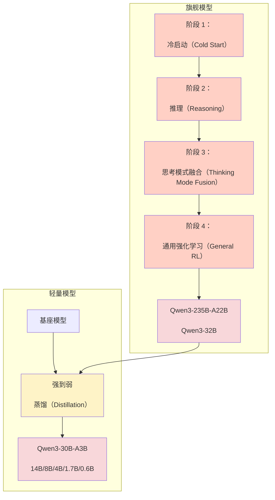

我们还进行了实验，以确定数据集规模如何影响结果，测试了从 2k 到 340k 条偏好对（preference pairs）的取值。在这一范围内，性能保持稳定。当数据集超过 100k 偏好对时，扩展思考模式下的性能会下降，但下降幅度不如我们在不同学习率（learning rate）值下观察到的那样明显。用于 SmolLM3 训练运行的数据集为 169k 偏好对，但结果表明，更小的数据集也能带来相对于 SFT 检查点的提升。对于未来的项目，我们知道可以在迭代阶段尝试更小的数据集，因为快速尝试多种想法并识别最有前景的配置至关重要。

整合所有要素

将所有这些线索整合在一起，最终诞生了 SmolLM3-3B 模型：同尺寸下性能最佳，并与 Qwen 自家的混合推理模型一起位于帕累托前沿（Pareto front）。

几周的工作就能做到这样，已经相当不错了！

#### [参与规则](https://huggingfacetb-smol-training-playbook.hf.space/#rules-of-engagement-4)

为了总结我们在偏好优化（preference optimisation）方面的发现，这些发现可能对你未来的项目有所帮助：

*   不要害怕创建你自己的偏好数据！随着推理（inference）变得“便宜到可以忽略不计”，如今通过各种[推理提供商](https://huggingface.co/docs/inference-providers/en/index)生成大语言模型（LLM）偏好数据既简单又具有成本效益。
*   选择 DPO（Direct Preference Optimization，直接偏好优化）作为你的初始基线，并在此基础上进行迭代。我们发现，根据偏好数据的类型，其他算法如 ORPO（Odds Ratio Preference Optimization，优势比偏好优化）、KTO（Kahneman-Tversky Optimization，卡尼曼-特沃斯基优化）或 APO（Alternating Preference Optimization，交替偏好优化）相比 DPO 可以带来显著的提升。
*   使用比 SFT（Supervised Fine-Tuning，监督微调）小约 10 倍的学习率。
*   扫描 β 值，通常在 0.01 到 0.5 的范围内。
*   由于大多数偏好算法在一个 epoch 后就会过拟合，因此请划分你的数据并进行迭代训练以获得最佳性能。

偏好优化通常是简单性与性能之间的最佳平衡点，但它仍然继承了一个关键限制：它的效果仅取决于你能收集到的离线偏好数据。在某些时候，静态数据集的信号会耗尽，你需要能够在模型与提示和环境交互时在线生成新鲜训练反馈的方法。这就是偏好优化与更广泛的在线策略（on-policy）和基于强化学习（RL-based）方法家族的交汇点。

### [走向在线策略并超越监督标签](https://huggingfacetb-smol-training-playbook.hf.space/#going-on-policy-and-beyond-supervised-labels)

如果你想让模型持续解决数学问题、生成可执行代码或进行多步骤规划，你通常需要一个奖励信号（reward signal），而不仅仅是“A 比 B 好”。

这正是强化学习（Reinforcement Learning, RL）发挥作用的地方。与其用偏好来监督模型，不如让它与环境（可以是数学验证器、代码执行器，甚至是真实用户反馈）交互，并直接从结果中学习。RL 在以下情况下表现出色：

*   你可以自动检查正确性，例如单元测试、数学证明、API 调用，或者拥有高质量的验证器或奖励模型。
*   任务需要多步推理或规划，局部偏好可能无法捕捉长期成功。
*   你希望优化超越偏好标签的目标，比如让代码通过单元测试或最大化某个目标。

对于大语言模型（LLMs），RL 主要有两种形式：

*   基于人类反馈的强化学习（Reinforcement Learning from Human Feedback, RLHF）：这种方法由 OpenAI 的 InstructGPT 论文（[Ouyang et al., 2022](https://arxiv.org/abs/2203.02155)）推广，是 gpt-3.5 和许多现代 LLM 的基础。在这里，人类标注者比较模型输出（例如“A 比 B 好”），并训练一个奖励模型来预测这些偏好。然后，策略（policy）通过 RL 进行微调，以最大化学习到的奖励。

*   基于可验证奖励的强化学习（Reinforcement Learning with Verifiable Rewards, RLVR）：这种方法由 DeepSeek-R1 推广，使用验证器检查模型输出是否满足某些明确定义的正确性标准（例如代码是否编译并通过所有测试，或数学答案是否正确？）。然后，策略通过 RL 进行微调，以产生更多可验证正确的输出。

RLHF（Reinforcement Learning from Human Feedback，人类反馈强化学习）和 RLVR（Reinforcement Learning from Verifiable Rewards，可验证奖励强化学习）都定义了模型被优化的目标，但它们并未告诉我们优化应如何执行。在实践中，基于 RL 的训练效率与稳定性在很大程度上取决于学习算法是 on-policy（同策略） 还是 off-policy（异策略）。

诸如 GRPO（Group Relative Policy Optimization，群组相对策略优化）等方法通常属于 on-policy 优化算法，即生成补全的模型（策略）与被优化的模型是同一个。尽管 GRPO 大体上属于 on-policy 算法，但仍有一些注意事项。首先，为了优化生成步骤，可能会采样若干批生成结果，然后对模型进行 $k$ 次更新；其中第一批是 on-policy，接下来的几批则略微 off-policy。

为了弥补用于生成的模型与当前被优化模型之间的策略滞后（policy-lag），会采用重要性采样（importance sampling）和裁剪（clipping）来重新加权 token 概率并限制更新幅度。

由于从 LLM（Large Language Model，大语言模型）进行自回归生成速度较慢，许多框架如 [verl](https://github.com/volcengine/verl) 和 [PipelineRL](https://github.com/ServiceNow/PipelineRL) 已引入异步生成补全以及模型权重的“飞行中”更新，以最大化训练吞吐量。这些方法需要更复杂且谨慎的实现，但可将训练速度提升至同步训练方法的 4–5 倍。稍后我们将看到，这些训练效率的提升在推理模型（reasoning models）上尤为显著，因为推理模型具有长尾 token 分布。

对于 SmolLM3，我们完全跳过了 RL，主要是受时间限制，并且模型已通过离线偏好优化（offline preference optimisation）达到了同类最佳。然而，自发布以来，我们重新审视了这一主题，并将在后训练章节的结尾分享我们将 RLVR 应用于混合推理模型（hybrid reasoning models）时的一些经验教训。

#### [将 RLVR 应用于混合推理模型](https://huggingfacetb-smol-training-playbook.hf.space/#applying-rlvr-to-hybrid-reasoning-models)

混合推理模型（hybrid reasoning models）为 RLVR（Reinforcement Learning from Verifiable Rewards，可验证奖励强化学习）带来了额外的复杂性，因为生成长度会根据推理模式的不同而显著变化。例如，在下图中，我们绘制了 SmolLM3 的 [最终 APO 检查点](https://huggingface.co/HuggingFaceTB/SmolLM3-3B-checkpoints/tree/it-soup-APO) 在 AIME25 上的 token 长度分布：

如你所见，`/no_think` 模式生成的解长度中位数约为 2k tokens，而 `/think` 模式则大得多，达到 16k tokens，并且具有长尾分布。理想情况下，我们希望通过 RLVR 提升两种模式的整体性能，同时不过度改变它们各自的长度分布。

为了探索这一点，我们首先专注于优化 `/no_think` 模式，并从 [Big-Math](https://huggingface.co/datasets/SynthLabsAI/Big-Math-RL-Verified) 数据集中选取了一部分提示，该数据集包含超过 25 万个带验证答案的数学问题。

令我们惊讶的是，简单地应用 GRPO（Group Relative Policy Optimization，群体相对策略优化）会导致一种 奖励黑客（reward hacking） 现象：尽管从未被提示生成长链式思维（Chain-of-Thought，CoT），模型却学会了利用其基础推理能力来提高奖励。如下图所示，不仅奖励上升，生成内容的长度也随之增加：

简单地将 RLVR 应用于 SmolLM3 可以获得高奖励并提升下游性能，但代价是生成长度爆炸式增长。

换句话说，使用 GRPO 的 RLVR 将我们推理模型的 `/no_think` 模式转变成了看起来与 `/think` 模式非常相似的模式！

当我们检查模型的生成内容时，发现模型现在会生成长链式思维，甚至包含一些推理模型特有的认知行为（如 [Gandhi 等人，2025](https://arxiv.org/abs/2503.01307) 所述），例如 “Wait, …” 等。下面是一个示例：

然而，由于慢跑者和火车同向行驶，它们之间的相对速度是两者速度之差：
$$ v_{\text{rel}} = v_t - v_j = 12.7778 - 2.7778 = 10 \text{ m/s} $$

等等，让我重新核对一下计算：

等等，46 km/hr 换算成 m/s：
46 * 1000 m / 3600 s = (46 * 10)/36 = 460/36 ≈ 12.7778 m/s（正确）
10 km/hr 是：
10 * 1000 / 3600 = 10000 / 3600 ≈ 2.7778 m/s（正确）
差值：12.7778 - 2.7778 = 10 m/s（精确，因为 46-10=36 km/hr → 36*(1000/3600)=10 m/s 恰好）

慢跑者位于火车车头前方 340 米处。当火车超过慢跑者时，火车相对于慢跑者需要行驶的距离是 340 米加上火车的长度？等等，实际上，让我再重新思考一下这个问题。

等等，实际上，当题目说火车用了 46 秒“通过”慢跑者时，通常指的是从火车头到火车尾完全通过慢跑者所需的时间。那么火车的长度就等于相对速度乘以时间。

但首先，初始位置：慢跑者位于车头前方 340 米。所以车头在慢跑者后方 340 米。等等，不对，原文说“340 m ahead of the engine”，所以慢跑者领先 340 米。因此当慢跑者沿着轨道奔跑时，火车车头在慢跑者后方 340 米？等等，也许我需要澄清一下。

等等，题目说：“A jogger running at 10 km/hr alongside a railway track is 340 m ahead of the engine of a train running at 46 km/hr in the same direction. The train takes 46 seconds to pass the jogger. How long is the train in meters?”

嗯，所以慢跑者沿着轨道方向在火车车头前方 340 米处。由于他们同向行驶，火车在慢跑者后方 340 米。要超过慢跑者，火车必须行驶这 340 米再加上火车自身的长度？

通过过长惩罚缓解奖励黑客（reward hacking）

这一问题可以通过引入超长完成惩罚（overlong completion penalty）来缓解，该惩罚对超过特定长度的完成进行惩罚。该惩罚由两个参数定义：最大完成长度 $L_{\text{max}}$ 和软惩罚缓存 $L_{\text{cache}}$。这一惩罚是 DAPO 论文（[Yu et al., 2025](https://arxiv.org/abs/2503.14476)）中提出的改进之一，其本质上是应用如下奖励函数：

$$
R_{\text{length}}(y) = 
\begin{cases} 
0, & |y| \le L_{\text{max}} - L_{\text{cache}} \\ 
\frac{(L_{\text{max}} - L_{\text{cache}} - |y|)}{L_{\text{cache}}}, & L_{\text{max}} - L_{\text{cache}} < |y| \le L_{\text{max}} \\ 
-1, & L_{\text{max}} < |y| 
\end{cases}
$$

借助该惩罚，我们可以直接控制模型的输出分布，并衡量增加响应长度与性能之间的权衡。下图展示了一个示例，其中我们将超长惩罚从 1.5k 逐步调整到 4k，步长为 512 个 token：

应用超长惩罚会限制每次 roll-out 的长度，同时降低平均奖励。

当我们考察在 AIME25 上的提升时，响应长度与性能之间的权衡更加明显：

Smollm3 在 AIME25 上使用 RLVR 的下游性能。

现在我们可以清楚地看到超长惩罚如何影响下游性能：2–4k 范围内的惩罚带来了显著提升，同时控制了 token 分布。如下图所示，如果我们取第 400 步的 checkpoint，可以比较初始策略与最终模型在不同惩罚下的输出 token 分布：

总结

我们发现，将长度惩罚设置在 2.5–3k 范围内，可在性能与响应长度之间取得最佳权衡。下图显示，GRPO 在 AIME 2025 上的性能几乎是离线方法（如 APO）的两倍：

既然我们已经知道如何在 `/no_think` 推理模式下提升性能，RL 训练流程的下一步就是联合训练（joint training），让模型同时学习两种推理模式。然而，我们发现这相当棘手：每种模式都需要各自的长度惩罚（length penalty），而两者的交互至今导致训练不稳定。这凸显了在混合推理模型上应用强化学习（Reinforcement Learning, RL）的主要挑战，也能从模型开发者（如 Qwen）的新趋势中窥见一斑——他们选择分别发布 [instruct](https://huggingface.co/Qwen/Qwen3-4B-Instruct-2507) 与 [reasoning](https://huggingface.co/Qwen/Qwen3-4B-Thinking-2507) 两种变体。

我们的实验表明，RLVR（Reinforcement Learning from Verifiable Rewards）确实能有效引导推理行为，但前提是必须精心设计奖励塑形（reward shaping）并辅以稳定性机制。鉴于其复杂性，我们不禁要问：强化学习是否是唯一可行的前进道路？事实上，近期文献已提出若干更轻量的 on-policy 优化策略，却令人惊讶地未被开源社区充分探索。让我们在本章结尾快速浏览其中几种方案。

#### [RL 是唯一的选择吗？](https://huggingfacetb-smol-training-playbook.hf.space/#is-rl-the-only-game-in-town)

其他 on-policy（同策略）学习方法将偏好优化（preference optimisation）与蒸馏（distillation）扩展为迭代循环，在模型演进过程中持续刷新训练信号：

*   Online DPO（在线直接偏好优化）：不再一次性地在固定偏好数据集上训练，而是让模型持续采样新回复，收集新的偏好标签（来自 reward model（奖励模型）或 LLM graders（大语言模型评分器）），并自我更新。这使得优化始终 _on-policy_，并减少训练数据与模型当前行为之间的漂移（[Guo et al., 2024](https://arxiv.org/abs/2402.04792)）。
*   On-policy distillation（同策略蒸馏）：信号并非来自偏好，而是来自更强的 teacher model（教师模型）。学生在每一步训练时采样回复，学生与教师在这些样本上的 logits 之间的 KL divergence（KL 散度）即为学习信号。这使得学生能够持续吸收教师的能力，而无需显式的偏好标签或验证器（[Agarwal et al., 2024](https://arxiv.org/abs/2306.13649)）。

这些方法模糊了静态偏好优化与完整 RL（强化学习）之间的界限：你仍然可以获得适应模型当前分布的好处，却无需面对设计并稳定强化学习循环的全部复杂性。

#### [我该选哪种方法？](https://huggingfacetb-smol-training-playbook.hf.space/#which-method-do-i-pick)

尽管关于哪种 on-policy（同策略）方法“最好”的研究论文汗牛充栋，实践中做决策时主要看下表列出的几个因素：

| 算法 | 何时使用 | 权衡 | 最适合的模型规模 |
| --- | --- | --- | --- |
| Online DPO（在线 DPO） | 你能廉价获得偏好标签；最适合让行为与不断变化的分布对齐。 | 易于迭代扩展，比 RL（强化学习）更稳定，但依赖标签质量与覆盖度；支持的训练框架较少。 | 任意规模，只要偏好能捕捉超越模仿的改进。 |
| On-policy distillation（同策略蒸馏） | 你有一个更强的教师模型，想高效迁移其能力。 | 实现简单、运行便宜，继承教师偏差，上限受教师限制；仅在 TRL 和 NemoRL 中支持。 | 对小型到中型模型（<30B）最有效。 |
| Reinforcement learning（强化学习） | 最佳场景：有可验证的奖励，或需要多步推理/规划的任务。可与奖励模型配合使用，但存在 reward-hacking（奖励破解）等挑战，即模型利用奖励模型的弱点。 | 灵活且强大，但成本高、难稳定，需仔细设计奖励。大多数后训练框架均支持。 | 中型到大型模型（20B+），额外容量使其能利用结构化奖励信号。 |

在开源生态中，GRPO 和 REINFORCE 等强化学习方法最为常用，不过 Qwen3 技术报告（[A. Yang, Li, et al., 2025](https://arxiv.org/abs/2505.09388)）强调了使用 on-policy distillation（同策略蒸馏）来训练 32B 以下参数的模型：




小模型采用同策略蒸馏（on-policy distillation）的一个有趣特性是：它通常只需强化学习（RL）方法几分之一的算力，就能取得更好效果。原因在于，我们无需对每个提示生成多条轨迹，而只需采样一条，再由教师模型通过一次前向-反向传播即可完成打分。正如 Qwen3 技术报告所示，相比 GRPO 的提升非常显著：

| 方法 | AIME’24 | AIME’25 | MATH500 | LiveCodeBench v5 | MMLU-Redux | GPQA-Diamond | GPU 小时 |
| --- | --- | --- | --- | --- | --- | --- | --- |
| 离策略蒸馏（Off-policy Distillation） | 55.0 | 42.8 | 92.4 | 42.0 | 86.4 | 55.6 | - |
| + 强化学习（Reinforcement Learning） | 67.6 | 55.5 | 94.8 | 52.9 | 86.9 | 61.3 | 17,920 |
| + 同策略蒸馏（On-policy Distillation） | 74.4 | 65.5 | 97.0 | 60.3 | 88.3 | 63.3 | 1,800 |

最近，[Thinking Machines](https://thinkingmachines.ai/blog/on-policy-distillation/) 进一步证明，同策略蒸馏还能有效缓解灾难性遗忘（catastrophic forgetting）：当模型在某个新领域继续训练后，其原有性能会退化。下表显示，尽管 Qwen3-8b 在内部数据上微调后，其对话性能（IFEval）大幅下降，但通过低成本的蒸馏即可恢复表现：


我们对同策略蒸馏（on-policy distillation）感到非常兴奋，因为目前已经有大量能力强大、权重开放的 LLM（Large Language Models，大语言模型）可以被蒸馏成更小的、面向特定任务的模型。然而，所有同策略蒸馏方法的一个共同弱点是：教师模型和学生模型必须共享同一个分词器（tokenizer）。为了解决这一问题，我们提出了一种新方法——通用同策略 Logit 蒸馏（General On-Policy Logit Distillation，GOLD），它允许将任意教师模型蒸馏到任意学生模型。如果你对这些话题感兴趣，建议阅读我们的[技术文档](https://huggingface.co/spaces/HuggingFaceH4/on-policy-distillation)。

同样，FAIR 的研究人员也比较了 DPO（Direct Preference Optimization，直接偏好优化）在完全离策略（off-policy）与同策略（on-policy）下的效果，并表明可以用更少的计算量达到与 GRPO（Group Relative Policy Optimization，群组相对策略优化）相当的性能（[Lanchantin et al., 2025](https://arxiv.org/abs/2506.21495)）：

如他们的论文所示，在线 DPO（online DPO）在数学任务上表现良好，即使是半同策略变体（semi-on-policy variant）也能在多次离策略的情况下取得可比性能：

| 训练方法 | Math500 | NuminaMath | AMC23 |
| --- | --- | --- | --- |
| 种子模型（Llama-3.1-8B-Instruct） | 47.4 | 33.9 | 23.7 |
| 离线 DPO（s = ∞） | 53.7 | 36.4 | 28.8 |
| 半在线 DPO（s = 100） | 58.9 | 39.3 | 35.1 |
| 半在线 DPO（s = 10） | 57.2 | 39.4 | 31.4 |
| 在线 DPO（s = 1） | 58.7 | 39.6 | 32.9 |
| GRPO | 58.1 | 38.8 | 33.6 |

总体而言，我们认为在有效扩展强化学习（scaling RL）（[Khatri et al., 2025](https://arxiv.org/abs/2510.13786)）以及探索其他计算效率更高的方法方面，仍有许多工作要做。确实是一个令人兴奋的时代！

### [收尾：后训练阶段](https://huggingfacetb-smol-training-playbook.hf.space/#wrapping-up-post-training)

如果你已经读到这里，恭喜你：你现在已掌握了在后训练（post-training）阶段取得成功所需的所有核心要素。接下来，你可以运行大量实验并测试不同算法，以获得 SOTA（state-of-the-art，最先进）结果。

但你可能已经意识到，知道如何训练出优秀的模型只是故事的一半。要让这些模型真正“活”起来，你还需要合适的基础设施（infrastructure）。让我们以这位 LLM 训练的无名英雄来结束这部“巨作”。

[基础设施——无名英雄](https://huggingfacetb-smol-training-playbook.hf.space/#infrastructure---the-unsung-hero)
---------------------------------------------------------------------------------------------------------------------------

既然我们已经把关于模型创建与训练的全部知识都告诉了你，现在就来谈谈那个关键却常被低估、足以决定项目成败（以及你的银行账户余额）的要素：基础设施。无论你关注的是框架（frameworks）、架构（architecture）还是数据整理（data curation），掌握基础设施的基础知识都能帮助你识别训练瓶颈、优化并行策略并调试吞吐问题。（最起码，它还能让你跟基础设施团队沟通得更顺畅 😉）。

大多数人训练模型时非常关注架构（architecture）和数据，却鲜有人了解底层基础设施（infrastructure）的细节。基础设施的专业知识通常掌握在框架开发者和集群工程师手中，其他人则把它当作“已解决的问题”：租几块 GPU，装上 PyTorch，就能开干。我们在 384 张 H100 上训练 SmolLM3，历时近一个月，共处理了 11 万亿个 token……但这一路绝非风平浪静！期间我们遭遇了节点故障、存储问题以及训练重启（见[训练马拉松章节](https://huggingfacetb-smol-training-playbook.hf.space/#the-training-marathon)）。你必须为这些状况制定完善的应急预案和策略，才能让训练平稳、低维护地推进。

本章旨在弥合这一知识鸿沟。可把它视为一份面向训练场景的硬件层实践指南，聚焦真正关键的问题。（注意：每小节开头都有 TL;DR，可按需选择阅读深度。）

前两节夯实硬件基础：GPU 到底由什么组成？内存层级（memory hierarchy）如何运作？CPU 与 GPU 如何通信？我们还会讨论采购 GPU 时的考量，以及如何在长期训练跑之前对 GPU 进行测试。最重要的是，每一步我们都会演示如何亲自测量和诊断这些系统。后续章节则更偏实战，我们将探讨如何让基础设施具备故障容错能力，并最大化训练吞吐（throughput）。

本章的核心任务只有一句：找到瓶颈并干掉它！

可以把这看作是在培养你对“为何某些设计决策至关重要”的直觉。当你意识到模型的激活值（activations）需要流经多级缓存（cache），而每一级的带宽与延迟特性各不相同时，你自然会开始思考如何组织训练流程以最小化数据搬运。当你发现节点间（inter-node）通信比节点内（intra-node）慢几个数量级时，就会明白为何并行策略如此关键。

让我们先“拆开”一块 GPU，看看里面到底有什么。

### [GPU 内部：内部架构](https://huggingfacetb-smol-training-playbook.hf.space/#inside-a-gpu-internal-architecture)

GPU（Graphics Processing Unit，图形处理器）本质上是一种大规模并行处理器，针对吞吐量（throughput）而非延迟（latency）进行了优化。与擅长快速执行少量复杂指令流的 CPU（Central Processing Unit，中央处理器）不同，GPU 通过同时执行成千上万个简单操作来实现性能。

理解 GPU 性能的关键在于认识到，这不仅仅是关于原始计算能力，而是关于计算与数据移动之间的相互作用。一个 GPU 可以拥有数万亿次浮点运算（teraflops）的理论计算能力，但如果数据无法足够快地到达计算单元，这种潜力就会被浪费。这就是为什么我们需要同时理解内存层次结构（memory hierarchy，数据如何移动）和计算流水线（compute pipelines，工作如何完成）。

在最高层次上，GPU 因此执行两项基本任务：

1. 移动和存储数据（内存系统）
2. 用数据完成有用的工作（计算流水线）

#### [计算单元与 FLOPs](https://huggingfacetb-smol-training-playbook.hf.space/#compute-units-and-flops)

TL;DR： GPU 以 FLOPs（floating-point operations per second，每秒浮点运算次数）衡量性能。现代 GPU（如 H100）在低精度下可提供极高的吞吐：BF16 精度下 990 TFLOPs，而 FP32 仅 67 TFLOPs。然而，受内存瓶颈限制，实际性能仅为理论峰值的 70–77%。最先进的训练端到端效率可达 20–41%，又称模型 FLOPs 利用率（MFU，model flops utilization）。规划训练任务时，请使用真实数据，而非营销规格。

GPU 计算性能以 FLOPs（floating-point operations per second，每秒浮点运算次数）计量。一个 FLOP 指一次算术运算，通常是浮点数加法，如 `$a + b$`；现代 GPU 每秒可执行数万亿次这样的运算（TFLOPs）。

GPU 计算的基本单元是 Streaming Multiprocessors（SMs，流式多处理器）——彼此独立的处理单元，可并行执行指令。每个 SM 包含两类 cores（核心）：用于标准浮点运算的 CUDA cores，以及专为矩阵乘法优化的 Tensor Cores（张量核心），后者是深度学习（对 Transformer 性能至关重要）的运算主力。

现代 GPU 在芯片上集成数百个 SM！例如，我们集群使用的 [H100](https://developer.nvidia.com/blog/nvidia-hopper-architecture-in-depth/) SXM5 版本就有 132 个 SM。每个 SM 独立运行，以 warps（线程束） 为单位执行 32 线程组，且步调一致。为此，SM 依赖另一组件——warp schedulers（线程束调度器）：通过在不同 warps 间平衡指令，它们可在某一 warp 受阻时切换至另一 warp，从而“隐藏延迟”。这种 SIMT（Single Instruction, Multiple Thread，单指令多线程）执行模型意味着，warp 内所有线程同时对不同数据执行同一条指令。

单个 GPU 内的多个 SM（Streaming Multiprocessors，流式多处理器）——[来源](https://www.youtube.com/watch?v=ZQKMZIP3Fzg)

每个 GPU 拥有数百个 SM，而每个 SM 又同时执行多个 warp（线程束），因此单个 GPU 可以同时运行数万个线程。正是这种大规模并行性，使 GPU 在深度学习工作负载中占主导地位的矩阵运算上表现出色！

在讨论 FLOPs（Floating Point Operations Per Second，每秒浮点运算次数）时，精度至关重要。Tensor Cores（张量核心）可以以不同精度运行（FP64、FP32、FP16/BF16、FP8、FP4——参见[此处关于浮点数的回顾](https://en.wikipedia.org/wiki/Floating-point_arithmetic)）。因此，根据数据类型的不同，实际可达的吞吐量可能相差数个数量级。较低精度格式由于数据移动量更少、在相同硅片面积上可封装更多运算，从而带来更高吞吐量；但过去因训练不稳定而被回避。如今，得益于一系列新技术，训练与推理都正加速向更低精度推进，已降至 FP8 与 FP4。

下表展示了不同 NVIDIA GPU 代际在各精度下的理论峰值性能：

| Precision\GPU Type | A100 | H100 | H200 | B100 | B200 |
| --- | --- | --- | --- | --- | --- |
| FP64 | 9.7 | 34 | 34 | 40 | 40 |
| FP32 | 19.5 | 67 | 67 | 80 | 80 |
| FP16/BF16 | 312 | 990 | 990 | 1750 | 2250 |
| FP8 | - | 3960 | 3960 | 4500 | 5000 |
| FP4 | - | - | - | 9000 | 10000 |

_表格显示不同精度与 GPU 代际下的理论 TFLOPs（TeraFLOPs，万亿次浮点运算每秒）。来源：Nvidia、SemiAnalysis_

吞吐量的显著提升并不仅仅是“跑得快”，它反映了我们看待数值计算方式的根本转变。FP8（8 位浮点）和 FP4（4 位浮点）让模型在每 瓦特（watt） 、每 秒（second） 内完成更多运算，因而成为大规模训练与推理的关键。H100 在 FP8 下达到 3960 TFLOPs，比 FP16/BF16 提升 4 倍；而 B200 在 FP4 下冲到 10,000 TFLOPs，更进一步刷新上限。

理解这些数字：这些理论峰值 FLOPs 代表在理想条件下所能实现的_最大计算吞吐量_，即所有计算单元满载且数据随时就绪。实际性能则高度取决于你的工作负载能否持续“喂饱”计算单元，以及你的运算能否高效映射到可用硬件。

对于 SmolLM3，我们打算在 NVIDIA H100 80 GB HBM3 GPU 上进行训练，因此首先想验证 H100 的理论 TFLOPs 指标与真实世界性能是否一致。为此，我们使用了 [SemiAnalysis 的 GEMM 基准测试](https://www.ray.so/#theme=prisma&darkMode=false&code=IyBBTUQgVklQIGltYWdlCmFsaWFzIGRydW49InN1ZG8gZG9ja2VyIHJ1biAtLXByaXZpbGVnZWQgLS1uZXR3b3JrPWhvc3QgLS1kZXZpY2U9L2Rldi9rZmQgLS1kZXZpY2U9L2Rldi9kcmkgLS1ncm91cC1hZGQgdmlkZW8gLS1jYXAtYWRkPVNZU19QVFJBQ0UgLS1zZWN1cml0eS1vcHQgc2VjY29tcD11bmNvbmZpbmVkIC0taXBjPWhvc3QgLS1zaG0tc2l6ZT0xOTI2IC0tcm0gLWl0IgpkcnVuIHNlbWlhbmFseXNpc3dvcmsvYW1kLW1hdG11bDpsYXRlc3QKRElTQUJMRV9BREROX0hJUF9MVD0wIFBZVE9SQ0hfVFVOQUJMRV9PUF9FTkFCTEVEPTEgcHl0aG9uIG1hdG11bC5weQoKIyBBTUQgcHlwaSBuaWdodGx5CmRydW4gYW1kLWxhdGVzdC1weXBpLW5pZ2h0bHktbWF0bXVsClBZVE9SQ0hfVFVOQUJMRV9PUF9FTkFCTEVEPTEgcHl0aG9uIG1hdG11bC5weQoKIyBBTUQgcHlwaSBzdGFibGUgUHlUb3JjaCAyLjUuMQpkcnVuIHNlbWlhbmFseXNpc3dvcmsvYW1kLWxhdGVzdC1weXBpLXN0YWJsZS1tYXRtdWwKUFlUT1JDSF9UVU5BQkxFX09QX0VOQUJMRUQ9MSBweXRob24gbWF0bXVsLnB5CgojIE52aWRpYSBzdGFibGUgMjQuMDkKYWxpYXMgZHJ1bj0iZG9ja2VyIHJ1biAtLXJtIC1pdCAtLWdwdXMgYWxsIC0taXBjPWhvc3QgLS1uZXQ9aG9zdCAtLXNobS1zaXplPTE5MjYiCmRydW4gc2VtaWFuYWx5c2lzd29yay9udmlkaWEtbWF0bXVsOmxhdGVzdApweXRob24gbWF0bXVsLnB5Cgo&language=shell)：该基准使用 Meta Llama 70B 训练中的真实矩阵乘法形状来测试吞吐。

| 形状 (M, N, K) | FP64 torch.matmul | FP32 torch.matmul | FP16 torch.matmul | BF16 torch.matmul | FP8 TE.Linear（autocast，bias=False） | FP8 torch._scaled_mm（e5m2/e4m3fn） | FP8 torch._scaled_mm（e4m3） |
| --- | --- | --- | --- | --- | --- | --- | --- |
| (16384, 8192, 1280) | 51.5 TFLOPS | 364.5 TFLOPS | 686.5 TFLOPS | 714.5 TFLOPS | 837.6 TFLOPS | 1226.7 TFLOPS | 1209.7 TFLOPS |
| (16384, 1024, 8192) | 56.1 TFLOPS | 396.1 TFLOPS | 720.0 TFLOPS | 757.7 TFLOPS | 547.3 TFLOPS | 1366.2 TFLOPS | 1329.7 TFLOPS |
| (16384, 8192, 7168) | 49.5 TFLOPS | 356.5 TFLOPS | 727.1 TFLOPS | 752.9 TFLOPS | 1120.8 TFLOPS | 1464.6 TFLOPS | 1456.6 TFLOPS |
| (16384, 3584, 8192) | 51.0 TFLOPS | 373.3 TFLOPS | 732.2 TFLOPS | 733.0 TFLOPS | 952.9 TFLOPS | 1445.7 TFLOPS | 1370.3 TFLOPS |
| (8192, 8192, 8192) | 51.4 TFLOPS | 372.7 TFLOPS | 724.9 TFLOPS | 729.4 TFLOPS | 1029.1 TFLOPS | 1404.4 TFLOPS | 1397.5 TFLOPS |

上表展示了在 Llama 70B 训练负载下，根据精度和矩阵形状在 H100 80GB 上实测的 TFLOPS。

验证理论性能：实验揭示了理论峰值与可达成性能之间的差距。

对于 FP64 Tensor Core 运算，我们达到了 49–56 TFLOPS，相当于理论峰值（67 TFLOPS）的 74–84%。对于 TF32（TensorFloat-32，PyTorch 在 Tensor Core 上处理 FP32 张量时的默认精度），我们达到了 356–396 TFLOPS，相当于理论峰值（约 495 TFLOPS 稠密）的 72–80%。虽然硬件利用率已非常出色，但这些精度在现代深度学习训练中很少使用：FP64 因计算成本过高，而 TF32 则因 BF16、FP8 等更低精度能带来更佳性能。

对于 BF16 运算，我们在不同矩阵形状下持续达成 714–758 TFLOPS，约为 H100 理论峰值 990 TFLOPS 的 72–77%。在实际工作负载中，这已是极佳的利用率！

虽然内核基准测试衡量的是原始 TFLOPS，但端到端训练效率由模型 FLOPs 利用率（Model FLOPs Utilization，MFU）来体现：即有用模型计算与理论峰值硬件性能的比率。

我们的 BF16 矩阵乘法（matmul）基准测试显示，我们达到了 H100 理论峰值的 72–77%。这代表了在我们的设置下，内核层面可实现的性能上限。由于更复杂的非矩阵乘法操作、通信开销以及其他辅助计算，端到端训练的 MFU 必然会低于这一数值。

训练中的最先进 MFU：Meta 在训练 Llama 3 405B 时达到了 38–41%，而 DeepSeek-v3 在 GPU 上因 MoE（Mixture of Experts）架构带来的更紧通信瓶颈，仅达到约 20–30%。对于 SmolLM3，我们稍后可以看到，我们实现了约 30% 的 MFU。大部分差距来自分布式训练中的节点间通信开销。鉴于我们的内核级上限约为 77%，这些端到端数字相对于可实现的矩阵乘法性能而言，大致代表了 50–55% 的效率。推理工作负载可以达到更高的 MFU（>70%），更接近原始矩阵乘法性能，不过来自生产部署的公开结果很少。

FP8 的结果则更为微妙。让我们看看我们在 3 种不同矩阵乘法方法/内核上的结果。

使用 PyTorch 的 `torch._scaled_mm` 内核，采用 e4m3 精度，我们实现了 1,210–1,457 TFLOPs，具体取决于矩阵形状，大约占理论峰值 3,960 TFLOPs 的 31–37%。😮 为什么？这种较低的利用率百分比（在 FP8 下）实际上并不表示性能差；相反，它反映了随着计算吞吐量增加，这些操作越来越受内存带宽限制。[Tensor Cores](https://www.nvidia.com/en-us/data-center/tensor-cores/) 处理 FP8 数据的速度比内存系统提供数据的速度更快，使得内存带宽成为限制因素。

[Transformer Engine](https://github.com/NVIDIA/TransformerEngine) 的 `TE.Linear` 在不同形状下达到了 547–1,121 TFLOPs，而 `torch._scaled_mm` 则始终提供更高的吞吐。这揭示了一个重要教训：_kernel 实现至关重要_，即使针对同一硬件能力，API 的选择也可能带来 2–3 倍的性能差异。

在 SmolLM3 的训练中，这些实测数据帮助我们设定了现实的吞吐预期。规划你自己的训练任务时，请使用这些可达数值，而非理论峰值，来设定预期。

除了选择合适的 kernel API，我们还需确保这些 kernel 针对正确的硬件世代编译。Compute Capability（CC，计算能力）是 NVIDIA 的版本控制体系，它将物理 GPU 细节与 PTX 指令集解耦，决定了你的 GPU 支持哪些指令与特性。

为什么这很重要：为特定计算能力编译的 kernel 可能无法在旧硬件上运行；若代码未针对目标 GPU 的 CC 编译，你可能错过优化。更糟的是，框架可能静默选择次优 kernel——我们发现 PyTorch 在 H100 上却选用了 sm_75 kernel（计算能力 7.5，为 Turing GPU 设计），导致神秘减速。这与 [PyTorch 社区记录的问题](https://discuss.pytorch.org/t/performance-issue-torch-matmul-selecting-cutlass-sm75-kernel-for-a100/220682/3) 类似：框架往往默认兼容旧 kernel，而非最优 kernel。这个看似微不足道的细节，可能让同一硬件的算力从 720 TFLOPS 跌到 500 TFLOPS。

使用预编译库或自定义 kernel 时，务必验证它们是否针对你硬件的计算能力构建，以确保兼容性与最佳性能。例如，`sm90_xmma_gemm_…_cublas` 表示该 kernel 为 SM 9.0（计算能力 9.0，H100 所用）编译。

你可以通过 `nvidia-smi —query-gpu=compute_cap` 查看 GPU 的计算能力（compute capability），或在 [NVIDIA CUDA C Programming Guide 的计算能力章节](https://docs.nvidia.com/cuda/cuda-c-programming-guide/index.html#compute-capabilities) 中查阅技术规格。

如前所述，当低精度下的计算速度过快时，GPU 内存似乎会成为瓶颈（bottleneck）。接下来，让我们深入了解 GPU 内存的工作原理，以及究竟是什么导致了瓶颈的出现！#### [GPU 存储层级：从寄存器到 HBM](https://huggingfacetb-smol-training-playbook.hf.space/#gpu-memory-hierarchy-from-registers-to-hbm)

为了完成计算，GPU 需要读写存储器，因此了解这些传输的速度至关重要。理解 GPU 存储层级（GPU memory hierarchy）是编写高性能 kernel 的前提。

长话短说： GPU 将存储器按层级组织，从快而小（寄存器（registers）、共享存储器（shared memory））到慢而大（HBM 主存）。理解这一层级至关重要，因为现代 AI 往往是存储受限（memory-bound）：瓶颈在于搬运数据，而非计算本身。算子融合（Operator fusion）（如 Flash Attention）通过将中间结果保留在快速的片上存储器而非写入慢速 HBM，可实现 2–4× 加速。实测表明，H100 的 HBM3 在实际大带宽传输中可达约 3 TB/s，与理论规格一致。

为了直观感受 GPU 上存储操作的实际流向，我们先来看 [NVIDIA Nsight Compute 的 Memory Chart](https://docs.nvidia.com/nsight-compute/ProfilingGuide/index.html#memory-chart)，这是一张性能剖析图，可图形化展示任意 kernel 在不同存储单元之间的数据流动：


Memory Chart：H100 上 FP64 矩阵乘法期间数据流经 GPU 存储层级

通常，Memory Chart 同时显示逻辑单元（绿色），如 Global、Local、Texture、Surface 和 Shared memory，以及物理单元（蓝色），如 L1/TEX Cache、Shared Memory、L2 Cache 和 Device Memory。单元之间的连线表示指令数（Inst）或请求数（Req），颜色表示峰值利用率百分比：从闲置（0%）到满负荷（100%）。

你可以使用 [NVIDIA Nsight Compute](https://docs.nvidia.com/nsight-compute/ProfilingGuide/index.html) 为任意 kernel（内核）生成该内存图表：

```
## 使用内存负载分析剖析特定内核
ncu --set full --kernel-name "your_kernel_name" --launch-skip 0 --launch-count 1 python your_script.py

## 性能剖析完成后，在 Nsight Compute GUI 中打开结果以查看 Memory Chart（内存图表）
```

它提供了几项关键洞察：

*   瓶颈识别：饱和链路（以红/橙色显示）指出数据移动受限的位置  
*   缓存效率：L1/TEX 与 L2 缓存的命中率（hit rate）揭示内核利用内存层次结构的优劣  
*   内存访问模式：逻辑单元与物理单元之间的数据流显示内核是否具备良好的空间/时间局部性（spatial/temporal locality）  
*   端口利用率：即使总带宽看似未饱和，单个内存端口也可能已饱和

在上面的具体示例中，可以看到内核指令如何流经内存层次结构（在我们硬件上进行 FP64 矩阵乘法的情况）：全局加载指令向 L1/TEX 缓存发起请求，可能命中或缺失，并进一步向 L2 发起请求；L2 若再次缺失，最终访问设备内存（HBM）。单元内的彩色矩形表示端口利用率；即使单个链路低于峰值运行，共享数据端口也可能已饱和。

为获得最佳性能，应尽量减少对较慢内存层级（HBM）的访问，同时最大化较快层级（共享内存、寄存器）的利用率。

现在，让我们了解使该图表得以呈现的底层内存层次结构。现代 GPU 按速度、容量与成本平衡的层次结构组织内存，这一设计由基础物理与电路约束决定。


H100（SXM5）GPU 的内存层次结构。[来源](https://www.aleksagordic.com/blog/matmul)

在该层次结构的最底层是 HBM（High Bandwidth Memory，高带宽内存）：GPU 的主内存，也称全局内存（global memory）或设备内存（device memory）。H100 配备 HBM3，理论带宽达 3.35 TB/s。HBM 是内存层次结构中容量最大但速度最慢的层级。

沿着层级向上靠近计算单元，我们会遇到速度越来越快但容量越来越小的存储层级：

*   L2 cache（L2 缓存）：一个基于 SRAM（静态随机存取存储器）的大型缓存，由整个 GPU 共享，通常为几十兆字节。在 H100 上，容量为 50 MB，带宽约 13 TB/s。
*   L1 cache and Shared Memory (SMEM)：每个 Streaming Multiprocessor（SM，流式多处理器）都有自己的 L1 缓存和可由程序员管理的共享内存（Shared Memory），二者共用同一块物理 SRAM。在 H100 上，这一合并空间每 SM 为 256 KB，每 SM 带宽约 31 TB/s。
*   Register File (RMEM，寄存器文件)：位于层级顶端，寄存器是最快的存储，紧邻计算单元。寄存器对每个线程私有，每 SM 带宽可达数百 TB/s。

之所以存在这样的层级，是因为 SRAM（用于缓存和寄存器）速度快，但物理面积大、成本高；而 DRAM（用于 HBM，高带宽内存）密度高、便宜，却更慢。结果是：快速内存只能以小容量靠近计算单元，背后由容量越来越大但速度越来越慢的内存池支撑。

为什么这很重要：理解这一层级对 kernel（内核）优化至关重要。核心洞见在于，受内存限制的操作瓶颈在于数据搬运速度，而非计算速度。正如 [Horace He](https://upload.wikimedia.org/wikipedia/commons/b/b2/Hausziege_04.jpg) 在 [Making Deep Learning Go Brrrr From First Principles](https://horace.io/brrr_intro.html) 中所说，_“从内存加载” → “自乘两次” → “写回内存”_ 与 _“从内存加载” → “自乘一次” → “写回内存”_ 耗时几乎相同：与内存访问相比，计算几乎“免费”。

正因如此，operator fusion（算子融合）才如此强大：通过将多个操作合并进单个 kernel，可把中间结果留在快速的 SRAM 中，而无需在操作之间写回缓慢的 HBM。Flash Attention 正是这一原则的完美示例。

标准注意力实现是内存受限的，因为它们需要在 HBM 中实例化完整的注意力矩阵：

1. 计算 `Q @ K^T` → 将 $N \times N$ 的注意力得分写入 HBM  
2. 应用 softmax → 从 HBM 读取、计算、再写回 HBM  
3. 乘以 V → 再次从 HBM 读取注意力得分  

Flash Attention 通过融合这些操作并将中间结果保留在 SRAM 中，实现了 2–4× 的加速：

* 不再一次性计算完整的注意力矩阵，而是将注意力切分成适合 SRAM 的 tile（瓦片）进行处理  
* 中间注意力得分始终不会离开高速片上内存  
* 仅将最终输出写回 HBM  

结果：Flash Attention 将 HBM 访问次数从 $O(N^2)$ 降至 $O(N)$，把一个内存受限的操作转变为更能发挥 GPU 计算能力的操作。这正是高效 kernel（内核）设计的精髓：_最小化缓慢的内存搬运，最大化快速的计算_。

---

示例：在实践中验证我们的 HBM3 带宽

既然已经了解了内存层级结构，接下来就把理论付诸实践，在 H100 GPU 上验证实际带宽！此时，基准测试工具就显得至关重要。

NVBandwidth 是 NVIDIA 开源的基准测试工具，专门用于测量 GPU 系统间的带宽与延迟。它通过 copy engine（拷贝引擎）和基于 kernel（内核）的方法，评估多种内存拷贝模式的数据传输速率——包括 host-to-device（主机到设备）、device-to-host（设备到主机）以及 device-to-device（设备到设备）操作。该工具尤其适用于评估多 GPU 环境下的 GPU 间通信（例如 [NVLink](https://en.wikipedia.org/wiki/NVLink) 和 [PCIe](https://fr.wikipedia.org/wiki/PCI_Express)，两种连接器类型），并验证系统性能。

你可以从 [NVIDIA 的 GitHub 仓库](https://github.com/NVIDIA/nvbandwidth) 安装 NVBandwidth。该工具会输出详细的带宽矩阵（bandwidth matrices），展示不同设备间数据传输的效率，非常适合诊断性能瓶颈或验证 GPU 互连是否健康。

我们用 `device_local_copy` 测试来测量 H100 的本地内存带宽，该测试测量 `cuMemcpyAsync` 在 GPU 本地设备缓冲区之间、不同消息大小下的带宽。

```
$ ./nvbandwidth -t device_local_copy -b 2048
memcpy local GPU(column) bandwidth (GB/s)
           0         1         2         3         4         5         6         7
 0   1519.07   1518.93   1519.07   1519.60   1519.13   1518.86   1519.13   1519.33
```

实测 H100 本地内存带宽

结果揭示了内存系统的一个重要特性：对于小消息（< 1 MB），我们受限于延迟（latency-bound） 而非带宽。启动内存传输的开销主导了性能，使我们无法达到峰值带宽。然而，对于大消息（≥ 1 MB），读和写操作都能持续达到约 1,500 GB/s 的带宽。

由于 HBM 带宽同时计入读写，我们将两者相加得到 3 TB/s 的总双向带宽（1,519 读 + 1,519 写），这与 H100 理论上的 3.35 TB/s HBM3 规格非常接近。

#### [Roofline 模型](https://huggingfacetb-smol-training-playbook.hf.space/#roofline-model)

判断你的 kernel 是 计算受限（compute-bound）还是 内存受限（memory-bound），决定了该采用哪些优化手段。

有两种情况：

*   如果你处于 内存受限（大部分时间花在数据搬运上），那么提升计算吞吐（compute throughput）无济于事：需要通过 算子融合（operator fusion）等技术减少内存流量。
*   如果你处于 计算受限（大部分时间花在 FLOPs 上），那么优化内存访问模式也无济于事：需要更强的算力或更优的算法。

_roofline 模型_ 提供了一种可视化框架，用于理解这些性能特征并发现优化机会。

让我们把它应用到一次真实的 kernel 分析中。在我们之前提到的 NSight Compute 性能分析工具里就能找到（在 “roofline analysis view” 下）。结果如下：

我们来看看如何阅读这张图，它有两个坐标轴：

*   纵轴（FLOP/s）：展示已实现的浮点运算每秒，使用对数刻度以容纳巨大的数值范围。
*   横轴（Arithmetic Intensity，算术强度）：表示工作量（FLOPs）与内存流量（bytes）的比值，单位是 FLOPs/byte，同样使用对数刻度。

roofline 本身由两条边界组成：

*   内存带宽边界（Memory Bandwidth Boundary，斜线）：由 GPU 的内存传输速率（HBM bandwidth）决定。沿这条线的性能受限于数据搬运速度。
*   峰值性能边界（Peak Performance Boundary，水平线）：由 GPU 的最大计算吞吐决定。沿这条线的性能受限于计算执行速度。

两条边界交汇的 ridge point（脊点） 标志着从内存受限到计算受限的过渡区域。

我们可以通过观察图表被划分的两个区域来解读性能：

*   Memory Bound（位于斜线边界下方）：处于该区域的 kernel 受限于内存带宽。GPU 正在等待数据，此时再提升算力也无济于事。优化应聚焦于减少内存流量，可通过算子融合（operator fusion）、改善内存访问模式或提高算术强度（arithmetic intensity）等手段实现。  
*   Compute Bound（位于水平边界下方）：处于该区域的 kernel 受限于计算吞吐。GPU 数据充足，但处理速度跟不上。优化应聚焦于算法改进，或利用 Tensor Cores 等专用硬件。

achieved value（图中绘制的点）展示了你的 kernel 当前所处的位置。该点到 roofline 边界的距离即为优化空间，越靠近边界，kernel 性能越接近最优。

在我们的示例中，kernel 位于 memory-bound 区域，表明通过优化内存流量仍有提升空间！

若想深入了解 GPU 内部机制，包括 CUDA cores、Tensor Cores、内存层级（memory hierarchies）及底层优化技巧的详细说明，请查看 [Ultrascale Playbook](https://huggingface.co/spaces/nanotron/ultrascale-playbook)！现在我们已经了解了 GPU“内部”发生了什么，接下来让我们把视角拉远，探索 GPU 如何与外部世界通信。

### [GPU 之外：GPU 如何与外界通信](https://huggingfacetb-smol-training-playbook.hf.space/#outside-a-gpu-how-gpus-talk-to-the-world)

我们已经了解了 GPU 如何利用其内部存储层级进行计算，现在必须面对一个关键现实：GPU 并非孤立运行。在任何计算发生之前，数据必须先加载到 GPU 内存中；CPU 需要调度 kernel（内核）并协调任务；在分布式训练中，GPU 之间还必须不断交换激活值（activations）、梯度（gradients）和模型权重（model weights）。


DGX H100。来源：NVIDIA

此时，外部通信基础设施就变得至关重要。无论 GPU 的计算单元多么强大，如果数据无法及时到达——无论是从 CPU、存储还是其他 GPU——昂贵的硬件就只能闲置。理解这些通信路径及其带宽（bandwidth）特性，对于最大化硬件利用率、最小化瓶颈至关重要。

本节将介绍连接 GPU 与外界的四大关键通信链路：

*   GPU-CPU：CPU 如何调度任务并向 GPU 传输数据  
*   GPU-GPU 节点内（intra-node）：同一台机器上的 GPU 如何通信  
*   GPU-GPU 节点间（inter-node）：不同机器上的 GPU 如何通过网络通信  
*   GPU-存储：数据如何从存储流向 GPU 内存  

每条链路的带宽和延迟（latency）特性各不相同，理解它们有助于定位训练管线中的瓶颈。为方便理解，我们绘制了一张简化示意图，突出最重要的组件与通信链路：

带宽上限 
CPU → GPU  
-  
GB/s

AWS p5 实例设置中关键组件与通信链路的简化示意图

如果这看起来令人望而生畏，别担心。我们将逐一深入探讨这些连接，并测量它们的实际带宽，以了解每条链路的性能特征。

#### [GPU-to-CPU](https://huggingfacetb-smol-training-playbook.hf.space/#gpu-to-cpu)

TL;DR：CPU 通过 PCIe 连接来调度 GPU 工作，但在我们的 p5 实例中，CPU→GPU 传输带宽瓶颈约为 14.2 GB/s（PCIe Gen4 x8）。CPU-GPU 延迟约 1.4 微秒，会为包含大量小 kernel 的任务带来 kernel 启动开销。CUDA Graphs 可通过批量操作降低该开销。在多路系统中，NUMA 亲和性至关重要；若 GPU 进程跑在错误的 CPU socket 上，会显著增加延迟。Grace Hopper 等现代架构通过 NVLink-C2C（900 GB/s 对 128 GB/s）消除了 PCIe 瓶颈。

CPU 是 GPU 计算的“指挥者”，负责启动 kernel、管理内存分配并协调数据传输。但 CPU 与 GPU 之间的通信到底有多快？这取决于二者之间的 PCIe（Peripheral Component Interconnect Express，外围组件互连快速通道） 链路。

理解这条链路至关重要，因为它直接影响：

*   Kernel 启动延迟：CPU 能多快地把任务调度到 GPU 上
*   数据传输速度：CPU 与 GPU 内存之间搬数据的快慢
*   同步开销：CPU-GPU 协同点的代价

在现代 GPU 服务器中，CPU-GPU 连接已大幅演进。早期系统采用直连 PCIe，而像 DGX H100 这样的现代高性能系统则使用更复杂的拓扑，通过 PCIe _交换机_ 高效管理多 GPU。在最新的 [GB200 架构](https://newsletter.semianalysis.com/p/nvidias-blackwell-reworked-shipment) 中，NVIDIA 更进一步，将 CPU 与 GPU 置于同一块印刷电路板上，彻底省去了外部交换机。

接下来，我们用 `lstopo` 查看 p5 实例的物理拓扑，并实测这条关键链路的性能，以识别潜在瓶颈。

```
$ lstopo -v
...
HostBridge L#1 (总线=0000:[44-54])
    PCIBridge L#2 (busid=0000:44:00.0 id=1d0f:0200 class=0604(PCIBridge) link=15.75GB/s 总线=0000:[45-54] PCISlot=64)
        PCIBridge L#3 (busid=0000:45:00.0 id=1d0f:0200 class=0604(PCIBridge) link=15.75GB/s 总线=0000:[46-54] PCISlot=1-1)
            ...
            PCIBridge L#12 (busid=0000:46:01.4 id=1d0f:0200 class=0604(PCIBridge) link=63.02GB/s 总线=0000:[53-53])
                PCI L#11 (busid=0000:53:00.0 id=10de:2330 class=0302(3D) link=63.02GB/s PCISlot=86-1)
                    Co-Processor(CUDA) L#8 (Backend=CUDA GPUVendor="NVIDIA Corporation" GPUModel="NVIDIA H100 80GB HBM3" CUDAGlobalMemorySize=83295872 CUDAL2CacheSize=51200 CUDAMultiProcessors=132 CUDACoresPerMP=128 CUDASharedMemorySizePerMP=48) "cuda0"
                    GPU(NVML) L#9 (Backend=NVML GPUVendor="NVIDIA Corporation" GPUModel="NVIDIA H100 80GB HBM3" NVIDIASerial=1654922006536 NVIDIAUUID=GPU-ba136838-6443-7991-9143-1bf4e48b2994) "nvml0"
            ...
...
```

从 `lstopo` 输出中，我们可以看到系统中两个关键的 PCIe 带宽值：

*   15.75GB/s：对应 PCIe Gen4 x8 链路（CPU 到 PCIe 交换机）
*   63.02GB/s：对应 PCIe Gen5 x16 链路（PCIe 交换机到 GPU）

为了更全面地理解整个拓扑结构，我们可以使用以下命令进行可视化：

```
$ lstopo --whole-system lstopo-diagram.png
```


该图展示了系统的层级结构：

*   它包含两个 NUMA（Non-Uniform Memory Access，非统一内存访问）节点（NUMA 指每个 CPU 插槽对应的内存区域）
*   每个 CPU socket（CPU 插槽）通过 PCIe Gen4 x8 链路（15.75 GB/s）连接四个 PCIe switch（PCIe 交换机）
*   每个 PCIe switch 通过 PCIe Gen5 x16 链路（63.02 GB/s）连接一块 H100 GPU
*   …（我们将在后续章节探讨 NVSwitch、EFA 网卡和 NVMe 驱动器等其他组件。）

PCIe 各代规范在传输速率上逐代翻倍。注意，Transfer Rate（传输速率）以 GT/s（GigaTransfers per second，十亿次传输/秒）计量，表示原始信号速率；而 Throughput（吞吐量）以 GB/s（Gigabytes per second，千兆字节/秒）计量，已考虑编码开销，代表实际可用带宽：

| PCIe Version | Transfer Rate (per lane) | Throughput (GB/s) |
| --- | --- | --- |
| ×1 | ×2 | ×4 |
| 1.0 | 2.5 GT/s | 0.25 |
| 2.0 | 5.0 GT/s | 0.5 |
| 3.0 | 8.0 GT/s | 0.985 |
| 4.0 | 16.0 GT/s | 1.969 |
| 5.0 | 32.0 GT/s | 3.938 |
| 6.0 | 64.0 GT/s | 7.563 |
| 7.0 | 128.0 GT/s | 15.125 |

理论 PCIe 带宽。来源：https://en.wikipedia.org/wiki/PCI_Express

CPU 到 GPU 通信路径。

从拓扑图与 PCIe 带宽表可见，CPU 到 GPU 的路径需经过两次 PCIe 跳转：先从 CPU 经 PCIe Gen4 x8（15.754 GB/s）到 PCIe 交换机，再从交换机经 PCIe Gen5 x16（63.015 GB/s）到 GPU。_这意味着 CPU-GPU 通信的瓶颈在于第一跳的 15.754 GB/s_。让我们用另一个工具 `nvbandwidth` 来验证！

`host_to_device_memcpy_ce` 命令利用 GPU 的复制引擎，测量从主机（CPU）内存到设备（GPU）内存的 `cuMemcpyAsync` 带宽。

```
./nvbandwidth -t host_to_device_memcpy_ce -b <message_size> -i 5
```

实测 CPU→GPU 带宽

使用 nvbandwidth 的 host_to_device 测试测得的 CPU-to-GPU（CPU 到 GPU）带宽，显示在大块数据传输时 PCIe Gen4 x8 的瓶颈约为 14.2 GB/s。

结果确实表明，对于小消息我们受限于延迟（latency），而对于大消息则能达到 ~14.2 GB/s，约为 PCIe Gen4 x8 理论带宽 15.754 GB/s 的 90%。这证实了在 CPU-GPU 通信中，CPU 到 PCIe 交换机的链路确实是瓶颈。

除了带宽，延迟对 CPU-GPU 通信同样重要，因为它决定了我们调度 kernel（内核）的速度。为此，我们使用 `nvbandwidth` 的 `host_device_latency_sm` 测试，该测试通过 pointer-chase kernel（指针追踪内核）测量往返延迟。`host_device_latency_sm` 测试在主机（CPU）上分配缓冲区，并由 GPU 通过 pointer-chase kernel 访问，以模拟真实场景下 CPU-GPU 通信的延迟。

```
./nvbandwidth -t host_device_latency_sm -i 5
```

CPU-> GPU 测得延迟

使用 nvbandwidth 的 host_device_latency_sm 测试测得的 CPU-to-GPU 延迟（已适配为可变缓冲区大小），往返延迟约为 1.4 微秒。

结果显示 延迟 约为 1.4 微秒。这解释了我们在 ML 工作负载中经常观察到的几微秒 kernel 启动开销。对于需要频繁启动大量小 kernel 的工作负载，增加的延迟可能成为瓶颈；否则，该开销可通过与执行重叠而被隐藏。

CUDA Graphs（CUDA 图）可以通过捕获一系列操作并将其作为单个单元重放，显著降低内核启动开销，从而消除每次内核启动时微秒级的 CPU-GPU 往返延迟。这对于包含大量小内核或频繁 CPU-GPU 同步的工作负载尤其有益。有关理解和优化启动开销的更多细节，请参阅 [Understanding the Visualization of Overhead and Latency in NVIDIA Nsight Systems](https://developer.nvidia.com/blog/understanding-the-visualization-of-overhead-and-latency-in-nsight-systems/)。

某些 Mixture-of-Experts (MoE)（混合专家）模型的实现需要在每次迭代中进行 CPU-GPU 同步，以便为选中的专家调度合适的内核。这会引入内核启动开销，在 CPU-GPU 连接较慢时尤其影响吞吐量。例如，在 [MakoGenerate 对 DeepSeek MOE 内核的优化](https://www.mako.ai/blog/mako-generate-achieves-1-83x-performance-over-torch-compile-on-deepseek-moe-kernels) 中，参考实现每次前向传递会分发 1,043 个内核，并产生 67 个 CPU-GPU 同步点。通过重构专家路由机制，他们将这一数字减少到 533 次内核启动和仅 3 个同步点，实现了同步开销 97% 的降低和端到端延迟 44% 的降低。请注意，并非所有 MoE 实现都需要 CPU-GPU 同步（现代实现通常将路由完全保留在 GPU 上），但对于那些确实需要的实现而言，高效的 CPU-GPU 通信对性能至关重要。

NVIDIA 的 Grace Hopper superchips（Grace Hopper 超级芯片）在 CPU-GPU 通信方面采取了与传统 x86+Hopper 系统根本不同的方法。关键改进包括：

*   1:1 GPU 与 CPU 配比（对比 x86+Hopper 的 4:1），为每块 GPU 提供 3.5 倍更高的 CPU 内存带宽  
*   NVLink-C2C 取代 PCIe Gen5 通道，提供 900 GB/s 对 128 GB/s 的带宽（GPU-CPU 互连带宽提升 7 倍）  
*   NVLink Switch System 相比通过 PCIe Gen4 连接的 InfiniBand NDR400 网卡，GPU-GPU 互连带宽提升 9 倍  

更多细节请参阅 [NVIDIA Grace Hopper Superchip Architecture Whitepaper](https://download.deltacomputer.com/NVIDIA%20Grace%20Hopper%20Superchip%20Architecture%20Whitepaper.pdf)（第 11 页）。

⚠️ NUMA 亲和性：多路系统性能的关键

在我们采用 AMD EPYC 7R13 节点（2 路，每路 48 核）这类多路系统上， NUMA 亲和性（NUMA affinity）对 GPU 性能至关重要。它指的是将进程运行在与其目标设备（如 GPU）位于同一插槽的 CPU 核心上。当你的 GPU 进程在与其所连 GPU 不同 NUMA 节点的 CPU 上运行时，所有操作都必须穿越 CPU 互连（AMD Infinity Fabric），这会引入显著延迟并带来带宽瓶颈。

首先，让我们查看 NUMA 拓扑与节点距离，以理解其对性能的影响：

```
$ numactl --hardware
node distances:
node   0   1 
  0:  10  32 
  1:  32  10
```

距离值表明，访问同一 NUMA 节点上的内存（距离 10）比跨到另一 NUMA 节点（距离 32）快得多。这种 3.2 倍的内存访问延迟（latency）差异 会在进程被绑定到错误 NUMA 节点时，显著影响 GPU 性能。

有关诊断并解决 NUMA 相关性能问题的详细步骤，请参见“排查互连性能问题”章节。

#### [GPU-to-GPU Intranode](https://huggingfacetb-smol-training-playbook.hf.space/#gpu-to-gpu-intranode)

在分布式训练（distributed training）中，GPU 必须频繁交换梯度（gradients）、权重（weights）和激活值（activations），每次迭代往往涉及数 GB 数据。如此庞大的数据量要求对通信环节格外小心。虽然 H100 的内部 HBM 读取速度可达约 3 TB/s，但一不小心用错标志位，就可能让 GPU 间通信带宽彻底崩盘！

让我们通过梳理同一节点内 GPU 通信的所有方式（以及你应该或不应该设置的所有标志位）来看看为什么会这样 🙂

TL;DR： 节点内的 GPU 有三种通信路径：经 CPU（最慢，约 3 GB/s，受 PCIe 瓶颈限制）、通过 EFA NIC 的 GPUDirect RDMA（约 38 GB/s），或经 NVLink 的 GPUDirect RDMA（双向约 786 GB/s）。NVLink 快 9–112 倍，且完全绕过 CPU/PCIe。NCCL 在可用时会自动优先选择 NVLink。NVLink SHARP（NVLS）提供硬件加速的集合通信，可将 allreduce 性能提升 1.3 倍至 480 GB/s；但 alltoall 操作（340 GB/s）无法从 NVLS 加速中受益。

#### [通过 CPU](https://huggingfacetb-smol-training-playbook.hf.space/#through-cpu)

朴素的做法使用主机内存（SHM）：数据从 GPU1 出发，经 PCIe 交换机到达 CPU，进入主机内存，再折返经过 CPU、再次穿过 PCIe 交换机，最终抵达 GPU2。虽然不被推荐，但可以通过 NCCL 的 `NCCL_P2P_DISABLE=1` 和 `FI_PROVIDER=tcp` 环境变量启用此模式。激活后，可设置 `NCCL_DEBUG=INFO` 进行验证，此时会打印类似信息：

```
NCCL INFO Channel 00 : 1[1] -> 0[0] via SHM/direct/direct
```

带宽上限

GPU 经由 CPU 和主内存的通信路径，展示了绕经 PCIe 交换机与 CPU 的低效往返。

这条绕路涉及多次内存拷贝，同时挤占 PCIe 与 CPU 内存总线，造成拥塞。在我们的拓扑中，4 张 H100 共享同一组 CPU 内存总线，当多张 GPU 同时通信时，它们会争夺有限的 CPU 内存带宽，问题更加严重… 😢

在这种由 CPU 介入的方案里，我们从根本上被 CPU 与 PCIe 交换机之间的 PCIe Gen4 x8 链路限制在约 16 GB/s。幸运的是，GPU 之间还有更优的通信方式，无需 CPU 参与：GPUDirect RDMA（GPUDirect 远程直接内存访问）。

#### [通过 Libfabric EFA](https://huggingfacetb-smol-training-playbook.hf.space/#through-libfabric-efa)

GPUDirect RDMA（Remote Direct Memory Access，远程直接内存访问，简称 GDRDMA）是一项允许 NVIDIA GPU 之间直接通信的技术，它让 GPU 内存可被直接访问。这样数据无需经过系统 CPU，也避免了通过系统内存的缓冲区拷贝，相比传统由 CPU 介入的传输方式，性能可提升高达 10 倍。GPUDirect RDMA 基于 PCIe 工作，可在节点内（如本例）以及跨节点（后续章节将介绍，需具备 RDMA 能力的 NICs（network interface cards，网络接口卡））实现高速 GPU 到 GPU 通信。更多细节请参考 [NVIDIA GPUDirect](https://developer.nvidia.com/gpudirect)。

回顾我们的拓扑图，可以看到每个 PCIe switch（PCIe 交换机）连接了 4 块 EFA（Elastic Fabric Adapter）网卡，也就是说每张 GPU 都能访问 4 个 EFA 适配器。EFA 是 AWS 为云实例定制的超高性能网络接口，旨在提供低延迟、高吞吐的实例间通信。在 p5 实例上，EFA 向外暴露 libfabric 接口（一种面向高性能计算的专用通信 API），应用程序可直接使用，并提供类似 RDMA 的能力，使得跨节点也能通过 GPUDirect RDMA 实现 GPU 到 GPU 的直接通信。

```
$ lstopo -v

## 我们可以在每个 PCIe 交换机上看到 4 个这样的 EFA 设备
PCIBridge L#8 (busid=0000:46:01.0 id=1d0f:0200 class=0604(PCIBridge) link=15.75GB/s buses=0000:[4f-4f] PCIVendor="Amazon.com, Inc.")
PCI L#6 (busid=0000:4f:00.0 id=1d0f:efa1 class=0200(Ethernet) link=15.75GB/s PCISlot=82-1 PCIVendor="Amazon.com, Inc.")
    OpenFabrics L#4 (NodeGUID=cd77:f833:0000:1001 SysImageGUID=0000:0000:0000:0000 Port1State=4 Port1LID=0x0 Port1LMC=1 Port1GID0=fe80:0000:0000:0000:14b0:33ff:fef8:77cd) "rdmap79s0"

fi_info --verbose
fi_link_attr:
    address: EFA-fe80::14b0:33ff:fef8:77cd
    mtu: 8760            # 最大数据包大小为 8760 字节
    speed: 100000000000  # 每个 EFA 链路提供 100 Gbps 带宽
    state: FI_LINK_UP
    network_type: Ethernet
```

每个 EFA 链路（EFA link） 提供 100 Gbps（12.5 GB/s）带宽。每个 GPU 配备 4 个 EFA 网卡（EFA NICs），每节点 8 块 GPU，因此每节点总带宽为 $100 \times 4 \times 8 = 3200$ Gbps（400 GB/s）。

为确保通过 EFA 启用 GPUDirect RDMA，需设置环境变量 `FI_PROVIDER=efa` 和 `NCCL_P2P_DISABLE=1`。激活该模式后，可通过设置 `NCCL_DEBUG=INFO` 验证其运行状态，日志将显示类似信息：

```
NCCL INFO Channel 01/1 : 1[1] -> 0[0] [receive] via NET/Libfabric/0/GDRDMA/Shared
```

带宽上限

通过 Libfabric EFA 的 GPU 到 GPU 通信路径。注意，对于节点内通信，其效率低于使用 NVLink。

尽管通过 EFA 的 GPUDirect RDMA 相比 CPU 中介传输有显著提升，每 GPU 配备 4 张 EFA 卡时可达约 50 GB/s，但我们能否更进一步？这就要引入 NVLink。

#### [通过 NVLink](https://huggingfacetb-smol-training-playbook.hf.space/#through-nvlink)

NVLink（NVIDIA 高速直连 GPU 互连技术）是 NVIDIA 的高速、GPU 到 GPU 直连互连技术，可在服务器内部实现多 GPU 间快速通信。H100 采用第四代 NVLink（NVLink 4.0），通过 18 条链路为每块 GPU 提供 900 GB/s 的双向带宽，每条链路双向速率为 50 GB/s（[NVIDIA H100 Tensor Core GPU 数据手册](https://resources.nvidia.com/en-us-hopper-architecture/nvidia-h100-tensor-c)）。

在 DGX H100 架构中，4 颗第三代 NVSwitch 通过分层拓扑连接 8 块 GPU，每块 GPU 在交换机之间分别使用 5+4+4+5 条链路。该配置确保任意两块 GPU 之间有多条直连路径，且仅需经过 1 颗 NVSwitch，整体 NVLink 网络双向带宽达 3.6 TB/s。

| NVLink 2.0 (Volta) | NVLink 3.0 (Ampere) | NVLink 4.0 (Hopper) | NVLink 5.0 (Blackwell) |
| --- | --- | --- | --- |
| 带宽 | 300 GB/s | 600 GB/s | 900 GB/s |

_表：各代 NVLink 带宽对比，列出理论规格_

默认情况下，NCCL 在可用时会优先使用 NVLink 进行节点内 GPU 通信，因为它在同一台机器上的 GPU 之间提供最低延迟和最高带宽。然而，如果未正确设置相关标志，你可能会阻止 NVLink 的使用！😱

NVLink 允许 GPU 直接访问另一块 GPU 的内存，无需经过 CPU 或系统内存。当 NVLink 不可用时，NCCL 会回退到通过 PCIe 的 GPUDirect P2P，或在跨插槽 PCIe 传输性能不佳时使用共享内存（SHM）传输。

要确认正在使用 NVLink，可设置 `NCCL_DEBUG=INFO` 并查找类似以下信息：

```
NCCL INFO Channel 00/1 : 0[0] -> 1[1] via P2P/CUMEM
```

下图展示了使用 NVLink 时数据所走的直连路径：

带宽上限

通过 NVLink 的 GPU 到 GPU 通信路径。

凭借 NVLink 4.0 900 GB/s 的理论带宽，相比 EFA（Elastic Fabric Adapter） 约 50 GB/s，我们预期节点内通信可获得 18 倍优势。为验证这一理论，我们运行了 [NCCL 的 SendRecv 性能测试](https://github.com/NVIDIA/nccl-tests/blob/master/src/sendrecv.cu) 以测量不同通信路径下的实际带宽：

```
$ FI_PROVIDER=XXX NCCL_P2P_DISABLE=X sendrecv_perf -b 8 -e 8G -f 2 -g 1 -c 1 -n 100
```

GPU→GPU 实测带宽（NCCL SendRecv 测试，H100 GPU，1 节点，2 颗 GPU）

结果无疑表明 NVLink 的效率之高：它达到 364.93 GB/s，而 EFA 仅 38.16 GB/s（单向快 9 倍，双向则快 18 倍），对比 CPU 基线的 3.24 GB/s 更是快了 112.6 倍。这些数据印证了 NCCL 为何优先使用 NVLink 进行节点内 GPU 通信。为进一步检验 NVLink 性能，我们使用 `nvbandwidth` 测量所有 GPU 对之间的双向带宽，通过双向同时拷贝进行测试：

```
./nvbandwidth -t device_to_device_bidirectional_memcpy_write_ce -b <message_size> -i 5
memcpy CE GPU(row) <-> GPU(column) Total bandwidth (GB/s)
           0         1         2         3         4         5         6         7
 0       N/A    785.81    785.92    785.90    785.92    785.78    785.92    785.90
 1    785.83       N/A    785.87    785.83    785.98    785.90    786.05    785.94
 2    785.87    785.89       N/A    785.83    785.96    785.83    785.96    786.03
 3    785.89    785.85    785.90       N/A    785.96    785.89    785.90    785.96
 4    785.87    785.96    785.92    786.01       N/A    785.98    786.14    786.08
 5    785.81    785.92    785.85    785.89    785.89       N/A    786.10    786.03
 6    785.94    785.92    785.99    785.99    786.10    786.05       N/A    786.07
 7    785.94    786.07    785.99    786.01    786.05    786.05    786.14       N/A

SUM device_to_device_bidirectional_memcpy_write_ce_total 44013.06
```

实测双向带宽 786 GB/s 已达到 NVLink 4.0 理论规格 900 GB/s 的 85%。借助 NVLink，（GPU 到 GPU 通信）彻底绕过了 CPU 瓶颈！

但这在集合通信（collective communication）模式中表现如何？我们用 NCCL tests 中的 `all_reduce_perf` [基准测试](https://github.com/NVIDIA/nccl-tests/blob/master/src/all_reduce.cu) 来测量单节点内的 `allreduce` 性能：

```bash
./all_reduce_perf -b 8 -e 16G -f 2 -g 1 -c 1 -n 100
```

NCCL 单节点 All-Reduce 性能测试

等等……我们居然跑出了 480 GB/s，超过了 NVLink 4.0 理论单向带宽 450 GB/s 😮 这是什么“魔法”，怎么可能？

翻阅文档后发现，答案藏在 NVLink SHARP（NVLS） 里——NVIDIA 的硬件加速集合通信技术。在单节点 H100 GPU 上，它能为 allreduce 操作带来约 1.3 倍加速！


有关 NVSwitch 如何支持这些硬件加速集合通信的技术细节，可参考 [NVSwitch 架构演讲](https://hc34.hotchips.org/assets/program/conference/day2/Network%20and%20Switches/NVSwitch%20HotChips%202022%20r5.pdf)。

它还能在其他场景帮忙吗？我们来看看 [alltoall 性能](https://github.com/NVIDIA/nccl-tests/blob/master/src/alltoall.cu)：

```bash
./all_to_all_perf -b 8 -e 16G -f 2 -g 1 -c 1 -n 100
```

NCCL 单节点 All-to-All 性能测试

我们在 alltoall（全对全）操作中实现了 340 GB/s 的带宽，这与已发布的基准测试结果一致，这些测试表明配备 NVLink 4.0 的 H100 系统具有类似的性能特征（[来源](https://juser.fz-juelich.de/record/1019178/files/02-NCCL_NVSHMEM.pdf#page=20.00)）。与 allreduce（全归约）不同，alltoall 操作无法从 NVLS（NVIDIA 集合通信服务）硬件加速中受益，这解释了为何此处仅达到 340 GB/s，而 allreduce 可达 480 GB/s。alltoall 模式需要在所有 GPU 对之间进行更复杂的点对点数据交换，完全依赖 NVLink 的基础带宽，而非 NVSwitch 的集合加速功能。

一些经过优化的 kernel（内核）会通过分配专门的 warp（线程束）来处理传输，从而将 NVLink 通信与计算分离。例如，ThunderKittens 采用 warp 级设计，特定 warp 负责发起 NVLink 传输并等待完成，而其他 warp 继续执行计算任务。这种 SM（流式多处理器）计算与 NVLink 通信的细粒度重叠可以隐藏大部分 GPU 间通信延迟。有关实现细节，请参阅 [ThunderKittens 多 GPU kernel 博客文章](https://hazyresearch.stanford.edu/blog/2025-09-22-pgl#fine-grained-overlap-of-sm-compute-and-nvlink-communication-with-thunderkittens)。

尽管 NVLink 在单节点内提供卓越的带宽，训练前沿模型仍需跨多节点扩展。

这引入了新的潜在瓶颈：节点间网络互连，其带宽远低于 NVLink。

#### [GPU-to-GPU Internode（GPU 节点间通信）](https://huggingfacetb-smol-training-playbook.hf.space/#gpu-to-gpu-internode)

TL;DR 多节点 GPU 通信依赖 InfiniBand（400 Gbps）或 RoCE（100 Gbps）等高速网络。Allreduce 扩展性良好（跨节点稳定 320–350 GB/s），可支撑超大规模训练集群；Alltoall 因算法复杂度下降更显著。延迟从节点内 ~13 μs 跃升至节点间 55 μs+。对于需要频繁 all-to-all 的 MoE（Mixture of Experts，混合专家）工作负载，NVSHMEM 提供异步 GPU 发起的通信，性能显著优于 CPU  orchestrated 传输。

当模型规模超出单节点承载能力时，训练需通过高速网络将计算分布到多节点。在查看基准前，先了解多节点 GPU 集群中常见的 3 种节点互联技术：

*   Ethernet（以太网） 已从 1 Gbps 演进至 100+ Gbps，在 HPC（High-Performance Computing，高性能计算）与数据中心集群中仍广泛使用。
*   RoCE（RDMA over Converged Ethernet，融合以太网上的远程直接内存访问） 将 RDMA 能力引入以太网，使用 ECN（Explicit Congestion Notification，显式拥塞通知）而非传统 TCP 机制进行拥塞控制。
*   InfiniBand 是 NVIDIA 的行业标准交换网络，提供高达 400 Gbps 带宽与亚微秒级延迟，支持 RDMA 并通过 GPUDirect RDMA 绕过主机 CPU，实现 GPU 到 GPU 的内存直接访问。

总结如下：

| 名称 | Ethernet（25–100 Gbps） | Ethernet（200–400 Gbps） | RoCE | Infiniband |
| --- | --- | --- | --- | --- |
| 制造商 | 多家 | 多家 | 多家 | NVIDIA/Mellanox |
| 单向带宽（Gbps） | 25–100 | 200–400 | 100 | 400 |
| 端到端延迟（μs） | 10–30 | N/A | ~1 | <1 |
| RDMA | 否 | 否 | 是 | 是 |

表：互联技术对比。来源：https://www.sciencedirect.com/science/article/pii/S2772485922000618对于 AWS p5 实例，我们使用 [Elastic Fabric Adapter（](https://docs.aws.amazon.com/AWSEC2/latest/UserGuide/efa.html)[EFA](https://docs.aws.amazon.com/AWSEC2/latest/UserGuide/efa.html)[）](https://docs.aws.amazon.com/AWSEC2/latest/UserGuide/efa.html) 作为 NIC（Network Interface Card，网络接口卡），每个 GPU 通过 PCIe Gen5 x16 通道连接到四块 100 Gbps 的 EFA 网卡，这一点我们之前已经介绍过。

带宽上限

通过 Libfabric EFA 的节点间 GPU 到 GPU 通信路径

如上图所示，当 GPU 和网卡连接到同一个 PCIe 交换机时，GPUDirect RDMA 使它们仅通过该交换机即可完成通信。这种配置可以充分利用 PCIe Gen5 x16 的带宽，而不会涉及其他 PCIe 交换机或 CPU 内存总线。理论上，每节点 8 个 PCIe 交换机 × 每个交换机 4 块 EFA 网卡 × 每块 EFA 网卡 100 Gbps，可提供 3200 Gbps（400 GB/s）的带宽，这与 [AWS p5 规格](https://aws.amazon.com/ec2/instance-types/p5/) 中的数据一致。那么实际表现如何？让我们在之前相同的基准测试基础上，跨不同节点运行，一探究竟！

带宽分析

点对点发送/接收操作在 2–4 个节点时可达约 42–43 GB/s，但在 5 个及以上节点时降至约 21 GB/s。性能下降的原因是，当规模超过 4 个节点时，NCCL 会自动将每个对端的点对点通道数从 2 条减少到 1 条，使得可用带宽利用率减半，而理论最大值仍为 ~50 GB/s（4 块 EFA 网卡 × 每块 12.5 GB/s）。我们通过设置 `NCCL_NCHANNELS_PER_NET_PEER=2` 成功地在 5 个以上节点恢复了完整吞吐量，不过该标志需谨慎使用，因为它可能会降低 all-to-all 等操作的性能（详见 [GitHub issue #1272](https://github.com/NVIDIA/nccl/issues/1272)）。

all-reduce 操作在单节点内表现出极佳性能，可实现 480 GB/s 的总线带宽。扩展到 2 节点时，带宽几乎保持不变，为 479 GB/s；随后，在 3–16 节点范围内稳定在约 320–350 GB/s。这一模式揭示了一个重要特性：虽然跨越节点边界时由于从 NVLink 切换到节点间网络（inter-node network fabric）会出现初始下降，但 _随后带宽在继续增加节点时几乎保持恒定。_

这种超过 2 节点后近乎恒定的扩展行为，对大规模训练而言实际上非常鼓舞人心。在 3–16 节点范围内相对稳定的 320–350 GB/s 表明，依赖 all-reduce 操作的并行策略（例如数据并行（data parallelism））可以扩展到数百甚至数千个 GPU，而不会出现显著的每 GPU 带宽下降。这种对数级扩展特性是采用 8-rail 优化的胖树（fat tree）等多层网络拓扑的典型表现，其中 8 个 GPU 各自连接到独立的交换机 rail，以最大化对分带宽（bisection bandwidth）。现代前沿训练集群通常运行 100,000+ 个 GPU，正是这种稳定的扩展行为使得如此大规模的部署成为可能。

在使用不同带宽链路（节点内的 NVLink 与节点间网络）时，应考虑针对每个带宽层级调整并行策略，以充分利用所有可用带宽。详见 [Ultrascale playbook](https://huggingfacetb-smol-training-playbook.hf.space/[https://huggingface.co/spaces/nanotron/ultrascale-playbook](https://huggingface.co/spaces/nanotron/ultrascale-playbook))，获取针对异构网络拓扑优化并行配置的详细指导。

全对全（all-to-all）操作展现出更为显著的扩展挑战：在单节点时带宽为 344 GB/s，到 2 节点时骤降至 81 GB/s，并在更大集群中继续下滑至约 45–58 GB/s。这种更陡峭的衰减反映了全对全模式对网络的极高需求——每个 GPU 必须与跨节点的所有其他 GPU 通信，产生的网络拥塞远高于全归约（all-reduce）操作。

延迟分析

延迟（Latency） 测量揭示了跨越节点边界的基本代价。发送/接收（send/receive）操作在所有多节点配置中保持 40–53 μs 的相对稳定延迟，表明点对点通信延迟主要由基础网络往返时间决定，而非集群规模；不过部分波动仍说明网络拓扑与路由效应仍在起作用。

全归约操作在单节点内延迟最低为 12.9 μs，但增至 2 节点时跃升至 55.5 μs，并随集群规模几乎线性增长，在 16 节点时达到 235 μs。这一趋势既反映了通信距离的增加，也体现了跨更多节点时归约树复杂度的上升。

全对全操作呈现类似趋势：单节点通信延迟为 7.6 μs，到 2 节点升至 60 μs，并在 16 节点时达到 621 μs。全对全延迟的超线性增长表明，随着更多节点参与集合通信，网络拥塞与协调开销会相互叠加。

随着混合专家（Mixture of Experts，MoE）架构的兴起——其需要频繁的全对全通信模式来完成专家路由——优化的 GPU 通信库变得愈发关键。

[NVSHMEM](https://developer.nvidia.com/nvshmem) 正迅速成为一款高性能通信库，它将多块 GPU 的内存聚合成一个分区全局地址空间（Partitioned Global Address Space，PGAS）。与传统的、依赖 CPU 协调数据传输的 MPI 方案不同，NVSHMEM 支持由 GPU 异步发起操作，彻底消除 CPU-GPU 同步开销。

NVSHMEM 在 GPU 通信方面具备多项关键优势：借助 GPUDirect Async 等技术，GPU 在发起跨节点通信时可完全绕过 CPU，对小消息（<1 KiB）可实现高达 9.5 倍的吞吐提升。这对需要密集网络通信模式的集合通信尤其有益。

该库目前支持 InfiniBand/RoCE（需 Mellanox CX-4 及以上网卡）、Slingshot-11（Libfabric CXI）以及 Amazon EFA（Libfabric EFA）。对于需要强扩展且通信粒度极细的应用，NVSHMEM 的低开销单边通信原语相比传统 CPU 代理方法可显著提升性能。

更多信息请参阅 [NVSHMEM 文档](https://developer.nvidia.com/nvshmem) 以及这篇详述 [GPUDirect Async 的博客](https://developer.nvidia.com/blog/improving-network-performance-of-hpc-systems-using-nvidia-magnum-io-nvshmem-and-gpudirect-async/)。

当实测带宽低于预期时，可能存在多种限制性能的因素。理解这些潜在瓶颈对于实现最佳互连利用率至关重要。

#### [排查互连问题](https://huggingfacetb-smol-training-playbook.hf.space/#troubleshooting-interconnect)

如果实际带宽低于预期，请按顺序检查以下方面：

库版本

过时的 NCCL、EFA 或 CUDA 库可能缺少关键性能优化或错误修复。务必确认你运行的是所有通信库的最新兼容版本。例如，AWS 会定期为其硬件更新 Deep Learning AMI（深度学习镜像），内含优化后的库版本。同时建议为重要实验记录这些库的版本号。

CPU 亲和性配置

错误的 CPU 亲和性设置会因不必要的跨 NUMA 流量显著影响 NCCL 性能。每张 GPU 应绑定到同一 NUMA 节点上的 CPU，以最小化内存访问延迟。实践中，[这个 GitHub issue](https://github.com/NVIDIA/nccl/issues/1017#issuecomment-1751385723) 展示了使用 `NCCL_IGNORE_CPU_AFFINITY=1` 和 `--cpu-bind none` 如何显著降低容器延迟。[可在此阅读更多细节。](https://enterprise-support.nvidia.com/s/article/understanding-numa-node-for-performance-benchmarks#Mapping-between-PCI-device-driver-port-and-NUMA)

网络拓扑与放置

理解网络拓扑对诊断性能问题至关重要。云放置组（placement group）虽有帮助，但无法保证实例间网络跳数最少。在现代数据中心的 fat-tree（胖树）拓扑中，位于不同顶层交换机下的实例会因路由路径中的额外网络跳数而遭遇更高延迟，并可能降低带宽。

对于 AWS EC2 用户，[Instance Topology API](https://docs.aws.amazon.com/AWSEC2/latest/UserGuide/how-ec2-instance-topology-works.html) 提供了对网络节点放置的清晰视图。共享底层（与实例直接相连）同一网络节点的实例在物理上最接近，彼此通信的延迟也最低。

```mermaid
graph TD
    %% Single Level 1 node
    L1["Level 1

nn-4aed5..."]:::level1

    %% Single Level 2 node
    L2["Level 2

nn-48b0a..."]:::level2

    %% 12 nodes of Level 3
    L3_1["Level 3

nn-d2ad4..."]:::level3
    L3_2["Level 3

nn-2d36a..."]:::level3
    L3_3["Level 3

nn-65fc9..."]:::level3
    L3_4["Level 3

nn-fbb73..."]:::level3
    L3_5["Level 3

nn-65290..."]:::level3
    L3_6["Level 3

nn-27373..."]:::level3
    L3_7["Level 3

nn-5adeb..."]:::level3
    L3_8["Level 3

nn-dbe4f..."]:::level3
    L3_9["Level 3

nn-fde84..."]:::level3
    L3_10["Level 3

nn-3c5c0..."]:::level3
    L3_11["Level 3

nn-94247..."]:::level3
    L3_12["Level 3

nn-8f3c1..."]:::level3

    %% L1 -> L2
    L1 --> L2

    %% L2 -> L3 (12 arrows)
    L2 --> L3_1
    L2 --> L3_2
    L2 --> L3_3
    L2 --> L3_4
    L2 --> L3_5
    L2 --> L3_6
    L2 --> L3_7
    L2 --> L3_8
    L2 --> L3_9
    L2 --> L3_10
    L2 --> L3_11
    L2 --> L3_12

    %% Distribution Level 3 -> Leaf nodes (instance info)
    %% 1st Level 3 has 2 leaves
    L3_1 --> L4_1["ID: 02e1b4f9

ip-26-0-171-102

p5.48xlarge"]:::level4
    L3_1 --> L4_2["ID: 05388ebf

ip-26-0-171-230

p5.48xlarge"]:::level4

    %% 2nd, 3rd, 4th have 1 each
    L3_2 --> L4_3["ID: 03bfac00

ip-26-0-168-30

p5.48xlarge"]:::level4
    L3_3 --> L4_4["ID: d92bab46

ip-26-0-168-95

p5.48xlarge"]:::level4
    L3_4 --> L4_5["ID: 97a542e4

ip-26-0-163-158

p5.48xlarge"]:::level4

    %% 5th has 3
    L3_5 --> L4_6["ID: e2c87e43

ip-26-0-167-9

p5.48xlarge"]:::level4
    L3_5 --> L4_7["ID: afa887ea

ip-26-0-168-120

p5.48xlarge"]:::level4
    L3_5 --> L4_8["ID: 66c12e70

ip-26-0-167-177

p5.48xlarge"]:::level4

    %% 第 6、7、8 个各 1 台
    L3_6 --> L4_9["ID: 9412bdf3

ip-26-0-168-52

p5.48xlarge"]:::level4
    L3_7 --> L4_10["ID: 87bd4dc8

ip-26-0-167-111

p5.48xlarge"]:::level4
    L3_8 --> L4_11["ID: b001549b

ip-26-0-166-244

p5.48xlarge"]:::level4

    %% 第 9 个有 2 台
    L3_9 --> L4_12["ID: 10ed8172

ip-26-0-107-245

p5.48xlarge"]:::level4
    L3_9 --> L4_13["ID: 7c1d0a09

ip-26-0-168-238

p5.48xlarge"]:::level4

    %% 第 10、11、12 个各 1 台
    L3_10 --> L4_14["ID: 925ce932

ip-26-0-167-217

p5.48xlarge"]:::level4
    L3_11 --> L4_15["ID: c9bc34db

ip-26-0-171-168

p5.48xlarge"]:::level4
    L3_12 --> L4_16["ID: 328d5d04

ip-26-0-167-127

p5.48xlarge"]:::level4

    %% 样式
    classDef level1 fill:#c8e6c9
    classDef level2 fill:#e1f5fe
    classDef level3 fill:#fff9c4
    classDef level4 fill:#ffcdd2
```



网络拓扑可视化，展示实例（instance）放置情况。

最小化通信节点之间的网络跳数（hop）可直接转化为更优的互连性能。对于小规模和消融实验，确保实例位于同一网络交换机上，可在延迟和带宽利用率两方面带来可量化的提升。

正确的环境变量

网络适配器的环境变量缺失或错误，会严重限制带宽利用率。通信库（如 NCCL）依赖特定的配置标志，才能启用自适应路由、GPU 发起传输和适当缓冲区大小等最佳性能特性。

例如，使用 AWS EFA（Elastic Fabric Adapter，弹性结构适配器）时，请确保为你的实例类型设置推荐的 NCCL 和 EFA 环境变量。[AWS EFA 速查表](https://github.com/aws-samples/awsome-distributed-training/blob/main/1.architectures/efa-cheatsheet.md)针对不同场景提供了全面的最优标志配置指南。

容器相关注意事项

使用容器（Docker/Enroot）时，以下几个配置步骤对获得最佳 NCCL 性能至关重要：

*   共享与锁定内存（Shared and Pinned Memory）：Docker 容器默认的共享内存和锁定内存资源有限。启动容器时请加上 `-shm-size=1g --ulimit memlock=-1`，以避免初始化失败。
*   NUMA 支持（NUMA Support）：Docker 默认关闭 NUMA 支持，可能导致 cuMem 主机分配无法正常工作。通过 `-cap-add SYS_NICE` 启用 NUMA 支持。
*   PCI 拓扑发现（PCI Topology Discovery）：确保 `/sys` 正确挂载，以便 NCCL 能够发现 GPU 和网卡的 PCI 拓扑。若 `/sys` 暴露的是虚拟 PCI 拓扑，可能导致性能次优。

我们正在以社区协作的方式汇总故障排查经验。如果你遇到过性能问题或发现了有效的调试方法，请前往 [Discussion Tab](https://huggingface.co/spaces/HuggingFaceTB/smol-training-playbook/discussions) 分享你的经验，帮助他人优化互连利用率。

既然你已了解如何调试 GPU-CPU 与 GPU-GPU 通信中的瓶颈，接下来让我们看看一个通常较少被关注的 GPU 通信环节——与存储层的通信！

#### [GPU 到存储](https://huggingfacetb-smol-training-playbook.hf.space/#gpu-to-storage)

GPU 与存储系统之间的连接常被忽视，却可能显著影响训练效率。训练期间，GPU 需要持续从存储读取数据（数据加载，尤其是包含大图像/视频文件的多模态数据），并定期将模型状态写回存储（即 checkpointing）。对于现代大规模训练任务，如果这些 I/O 操作未经妥善优化，就可能成为瓶颈。

TL;DR： GPU-存储 I/O 通过数据加载和 checkpointing 影响训练。GPUDirect Storage（GDS，GPU 直连存储）允许 GPU 与存储直接传输数据，绕过 CPU 以获得更好性能。即使我们的集群未启用 GDS，本地 NVMe RAID（8×3.5 TB 硬盘组成 RAID 0）也能提供 26.59 GiB/s 和 337 K IOPS（比网络存储快 6.3 倍），非常适合用于 checkpoint。

理解存储拓扑

GPU 与存储设备之间的物理连接遵循与 GPU 互连类似的层级结构。存储设备通过 PCIe 桥连接，理解这一拓扑有助于解释性能特征和潜在瓶颈。

通过 `lstopo` 查看系统拓扑，可以看到 NVMe 驱动器如何连接到系统。在我们的 p5 实例中，每块 GPU 对应 1 块 NVMe SSD：

```
PCIBridge L#13 (busid=0000:46:01.5 id=1d0f:0200 class=0604(PCIBridge) link=15.75GB/s buses=0000:[54-54] PCIVendor="Amazon.com, Inc.")
PCI L#11 (busid=0000:54:00.0 id=1d0f:cd01 class=0108(NVMExp) link=15.75GB/s PCISlot=87-1 PCIVendor="Amazon.com, Inc." PCIDevice="NVMe SSD Controller")
    Block(Disk) L#9 (Size=3710937500 SectorSize=512 LinuxDeviceID=259:2 Model="Amazon EC2 NVMe Instance Storage" Revision=0 SerialNumber=AWS110C9F44F9A530351) "nvme1n1"
```

一个自然的问题是：GPU 能否在不涉及 CPU 的情况下直接访问 NVMe 驱动器？答案是肯定的，通过 GPUDirect Storage（GDS，GPU 直连存储）。

GPUDirect Storage（GDS） 是 NVIDIA [GPUDirect](https://developer.nvidia.com/gpudirect) 技术家族的一员，可在存储（本地 NVMe 或远程 NVMe-oF）与 GPU 内存之间建立直接数据通路。它通过让靠近存储控制器的 DMA 引擎直接将数据移入或移出 GPU 内存，消除了经由 CPU 反弹缓冲区（CPU bounce buffers）的不必要内存拷贝。这降低了 CPU 开销、减少了延迟，并显著提升了面向大型多模态数据集训练等数据密集型工作负载的 I/O 性能。

要验证系统上的 GPUDirect Storage 是否已正确配置，可检查 GDS 配置文件并使用提供的诊断工具：

```
$ /usr/local/cuda/gds/tools/gdscheck.py -p
 =====================
 DRIVER CONFIGURATION:
 =====================
 NVMe               : Supported   
 NVMeOF             : Unsupported
 SCSI               : Unsupported
 ScaleFlux CSD      : Unsupported
 NVMesh             : Unsupported
 DDN EXAScaler      : Unsupported
 IBM Spectrum Scale : Unsupported
 NFS                : Unsupported
 BeeGFS             : Unsupported
 WekaFS             : Unsupported
 Userspace RDMA     : Unsupported
 --Mellanox Peerdirect : Enabled
 --rdma library        : Not Loaded (libcufile_rdma.so)
 --rdma devices        : Not configured
 --rdma_device_status  : Up: 0 Down: 0
 =====================
```

其中 `NVMe: Supported` 表示 GDS 当前已配置为支持 NVMe 驱动器；其他所有存储类型均显示为 Unsupported，说明尚未正确配置。如果 GDS 未针对您的存储类型正确配置，请参阅 [NVIDIA GPUDirect Storage Configuration Guide](https://docs.nvidia.com/gpudirect-storage/configuration-guide/index.html)，了解如何修改位于 `/etc/cufile.json` 的配置文件。

Block Storage Devices（块存储设备）

要了解系统上可用的存储设备，可使用 `lsblk` 显示块设备层级：

```
$ lsblk --fs -M
    NAME        FSTYPE            LABEL                   UUID                                 FSAVAIL FSUSE% MOUNTPOINT
...
    nvme0n1
    └─nvme0n1p1 ext4              cloudimg-rootfs         24ec7991-cb5c-4fab-99e5-52c45690ba30  189.7G    35% /
┌┈▶ nvme1n1     linux_raid_member ip-26-0-164-236:MY_RAID d0795631-71f0-37e5-133b-e748befec126
├┈▶ nvme2n1     linux_raid_member ip-26-0-164-236:MY_RAID d0795631-71f0-37e5-133b-e748befec126
├┈▶ nvme3n1     linux_raid_member ip-26-0-164-236:MY_RAID d0795631-71f0-37e5-133b-e748befec126
├┈▶ nvme8n1     linux_raid_member ip-26-0-164-236:MY_RAID d0795631-71f0-37e5-133b-e748befec126
├┈▶ nvme5n1     linux_raid_member ip-26-0-164-236:MY_RAID d0795631-71f0-37e5-133b-e748befec126
├┈▶ nvme4n1     linux_raid_member ip-26-0-164-236:MY_RAID d0795631-71f0-37e5-133b-e748befec126
├┈▶ nvme6n1     linux_raid_member ip-26-0-164-236:MY_RAID d0795631-71f0-37e5-133b-e748befec126
└┬▶ nvme7n1     linux_raid_member ip-26-0-164-236:MY_RAID d0795631-71f0-37e5-133b-e748befec126
 └┈┈md0         xfs                                       dddb6849-e5b5-4828-9034-96da65da27f0   27.5T     1% /scratch
```

This output shows the block device hierarchy on the system. The key observations:

*   `nvme0n1p1` is the root [Amazon EBS](https://aws.amazon.com/ebs/) filesystem mounted at `/` , using 35% of its full ~300GB capacity
*   Eight NVMe drives ( `nvme1n1` through `nvme8n1` ) are configured as a RAID array named `MY_RAID`
*   The RAID array is exposed as `/dev/md0` , formatted with XFS, and mounted at `/scratch` with 28TB available (8x3.5TB)

The arrows (┈▶) indicate that multiple NVMe devices are members of the same RAID array, which then combines into the single `md0` device.

Network Storage

In addition to local NVMe storage, the system has access to network-attached storage systems:

```
$ df -h
Filesystem                                         Size  Used Avail Use% Mounted on
/dev/root                                          291G  101G  190G  35% /
weka-hopper.hpc.internal.huggingface.tech/default  393T  263T  131T  67% /fsx
10.53.83.155@tcp:/fg7ntbev                         4.5T  2.9T  1.7T  63% /admin
/dev/md0                                            28T  206G   28T   1% /scratch
```

输出显示：

*   `/dev/root`（291GB [Amazon EBS](https://aws.amazon.com/ebs/)）是根文件系统，已使用 35%
*   `/fsx`（393TB WekaFS）已使用 67%，剩余 131TB 可用
*   `/admin`（4.5TB FSx Lustre）已使用 63%，剩余 1.7TB 可用
*   `/dev/md0`（28TB 本地 NVMe RAID）仅使用 1%，在 `/scratch` 剩余 28TB 可用。这是我们用 8 块 3.5TB SSD NVMe 实例存储盘组成的 RAID。

本地 NVMe RAID 阵列（`/scratch`）提供最快的 I/O 性能，而网络文件系统则为共享数据提供更大容量。

RAID（Redundant Array of Independent Disks，独立磁盘冗余阵列）：通过数据条带、校验或镜像将多块硬盘组合，以提升性能和/或可靠性。

NVMe（Non-Volatile Memory Express，非易失性内存标准）：面向 SSD 的高性能存储协议，直接接入 PCIe，提供比 SATA/SAS 更高的吞吐量和更低的延迟。

WekaFS：面向 AI/ML 负载的高性能并行文件系统，可在多节点间提供低延迟访问和高吞吐。

FSx Lustre：面向 HPC 的并行文件系统，将元数据与数据服务分离到不同服务器以实现并行访问。对大文件有效，但在涉及大量小文件的元数据密集型 AI/ML 负载中可能表现不佳。

存储带宽基准测试

为了了解各存储系统的性能特征，我们可以使用 GPUDirect Storage（GDS）测试其读写速度。下面是一个全面的参数化基准脚本，用于测试不同配置：

```
gdsio -f /<disk_path>/gds_test.dat -d 0 -w <n_threads> -s 10G -i <io_size> -x 1 -I 1 -T 10
```

该基准测试不仅评估存储系统在吞吐量（Throughput）、延迟（Latency）、IOPS 方面的性能，还包括：

可扩展性（Scalability）：性能如何随线程数和 I/O 大小变化。这揭示了不同负载模式下的最优配置：

*   小 I/O 大小（64K 到 256K）通常最大化 IOPS，但可能无法饱和带宽  
*   大 I/O 大小（2M 到 8M）通常最大化吞吐量，但会降低 IOPS  
*   线程数同时影响两者：更多线程可在硬件极限内提升总 IOPS 和吞吐量  

传输方式效率（Transfer Method Efficiency）：对比 GPU_DIRECT vs CPU_GPU vs CPUONLY，展示绕过 CPU 内存带来的收益：

*   GPU_DIRECT：使用 RDMA（Remote Direct Memory Access，远程直接内存访问）直接将数据传输到 GPU 内存，完全绕过 CPU（延迟最低、效率最高、小操作 IOPS 最佳）  
*   CPU_GPU：传统路径，数据先进入 CPU 内存，再拷贝到 GPU（增加 CPU 开销和内存带宽争用，降低有效 IOPS）  
*   CPUONLY：基线，仅 CPU 参与 I/O，无 GPU 介入  

IOPS 是每秒完成的单个 I/O 操作数，由 gdsio 输出中的 `ops / total_time` 计算得出。IOPS 对以下场景尤为关键：

*   小 I/O 大小的随机访问模式  
*   大量小文件或分散数据访问的负载  
*   类数据库操作，此时每操作延迟比裸带宽更重要  

*   更高的 IOPS 表示系统更能应对并发、细粒度的数据访问  

基准测试结果对比了不同线程数和 I/O 大小下的存储系统性能。热力图可视化吞吐量（GiB/s）与 IOPS 模式，揭示各存储层的最优配置。  
注：当前集群配置暂不支持 GPUDirect Storage (GDS)。

基准测试显示，我们的四种存储系统之间存在显著性能差异：

/scratch（本地 NVMe RAID） 以 26.59 GiB/s 的吞吐量和 337K IOPS 遥遥领先，吞吐量是 FSx 的 6.3 倍，IOPS 是 6.6 倍。该本地 RAID 阵列由 8 块 3.5 TB NVMe 盘组成，延迟最低（在峰值 IOPS 时为 190 μs），并随线程数线性扩展，在 64 线程、1 M I/O 大小时达到峰值性能。

/fsx（WekaFS） 提供稳健的网络存储性能，达到 4.21 GiB/s 和 51K IOPS，是需要合理性能的共享数据的最佳选择。FSx 在使用 CPUONLY 传输时获得最佳吞吐量（4.21 GiB/s），而在 GPUD 传输类型下达到最佳 IOPS（51K）。

/admin（FSx Lustre） 与 /root（EBS） 文件系统的吞吐量相近，均在 1.1 GiB/s 左右，但 IOPS 能力差异显著。Admin 在使用 GPUD 传输时达到峰值吞吐量（1.13 GiB/s），并在 CPU_GPU 传输下达到 17K IOPS 的峰值（是 Root 的 24 倍），更适合大量小操作的工作负载。Root 的 IOPS 表现较差（730），证实其仅适用于大顺序操作。

关于 GPU_DIRECT 结果的说明： 我们的集群当前未启用 GPUDirect Storage（GDS），这解释了为何 NVMe 存储（Scratch 和 Root）的 GPUD 结果不如 CPUONLY 传输。若正确配置 GDS，我们预期 GPUD 在直接 GPU 到存储的传输中将展现显著优势，尤其是对高性能 NVMe 阵列。

最优配置模式： 在所有存储类型中，最大吞吐量出现在 1 M I/O 大小，而最大 IOPS 出现在最小测试大小（64 K）。这一经典权衡意味着需根据工作负载特性在原始带宽（大 I/O）与操作并发（小 I/O）之间做出选择。对于使用大 checkpoint 文件的 ML 训练，在 Scratch 上使用 1 M–8 M 范围可获得最佳性能。

#### [总结](https://huggingfacetb-smol-training-playbook.hf.space/#summary)

如果你已经读到这里，恭喜你！你现在对存储层级（storage hierarchy）以及不同组件在我们训练基础设施中的交互方式有了全面的理解。但我们希望你记住的关键洞察是：识别瓶颈（bottlenecks）是将理论知识转化为实际优化的分水岭。

在本指南中，我们测量了栈中每一层的实际带宽：单 GPU 内 HBM3 的 3 TB/s、节点内 GPU 间 NVLink 的 786 GB/s、CPU-GPU 传输 PCIe Gen4 x8 的 14.2 GB/s、节点间网络点对点通信的 42 GB/s，以及从 26.59 GB/s（本地 NVMe）到 1.1 GB/s（共享文件系统）的存储系统。这些数据揭示了训练管道将在何处变慢，对于实现高 Model FLOPs Utilization（MFU，模型 FLOPs 利用率）至关重要。

然而，仅凭原始带宽数字并不能说明全部。现代训练系统可以将计算与通信重叠（overlap computation with communication）， effectively 把通信成本隐藏在计算操作之后。即使互连（interconnects）较慢，这种并行化也能缓解瓶颈。关于如何通过重叠计算与通信来最大化吞吐量的详细策略，请参阅 Ultra-Scale Playbook。

下图将所有基准测量结果综合为单一视图，展示了随着距离 GPU 变远，带宽如何急剧下降：

Bandwidth Max

既然我们已经知道如何在硬件和软件设置中识别瓶颈，接下来让我们更进一步，确保拥有一个能够稳定运行数月的弹性系统（resilient system）。

### [构建弹性训练系统](https://huggingfacetb-smol-training-playbook.hf.space/#building-resilient-training-systems)

拥有高速硬件只是获得良好且稳定的 LLM（大语言模型）训练基础设施的入场券。要从训练新手进阶为专业人士，我们需要跳出对裸速度的追求，关注那些不那么光鲜却至关重要的基础设施环节，让整个训练过程更顺畅、停机时间最短。

本节我们将视角从硬件与软件优化转向生产就绪（production readiness）：构建足够鲁棒（robust）以承受不可避免故障的系统，足够自动化（automated）以无需持续人工值守，并足够灵活（flexible）以在出现问题时迅速适应。

#### [节点健康监控与替换](https://huggingfacetb-smol-training-playbook.hf.space/#node-health-monitoring-and-replacement)

拥有足够的高速 GPU 对训练至关重要，但由于 LLM（大语言模型，Large Language Model）训练往往持续数周甚至数月，而非短短几天，因此长期跟踪 GPU 健康状态变得尤为关键。通过初始基准测试的 GPU 在长时间训练过程中仍可能出现热节流（thermal throttling）、显存错误或性能衰减。本节将分享我们应对这一挑战的思路与所用工具。

前置测试： 在启动 SmolLM3 之前，我们使用多种工具对 GPU 进行了全面诊断。我们使用了 [GPU Fryer](https://github.com/huggingface/gpu-fryer)——一款内部工具，可对 GPU 进行压力测试，检测热节流、显存错误及性能异常。我们还运行了 [NVIDIA 的 DCGM 诊断工具](https://docs.nvidia.com/datacenter/dcgm/latest/user-guide/dcgm-diagnostics.html)（DCGM，Data Center GPU Manager），这是一款广泛使用的 GPU 硬件验证、性能监控与故障根因定位工具，通过深度诊断测试覆盖计算、PCIe 连通性、显存完整性及热稳定性。前置测试共发现 2 颗存在问题的 GPU，避免了训练期间的潜在故障。

下表展示了 DCGM 诊断工具可执行的测试项目：

| 测试级别 | 时长 | 软件 | PCIe + NVLink | GPU 显存 | 显存带宽 | 诊断 | 定向压力 | 定向功耗 | NVBandwidth | 显存压力 | Input EDPp |
| --- | --- | --- | --- | --- | --- | --- | --- | --- | --- | --- | --- |
| r1（短） | 秒级 | ✓ | ✓ | ✓ |  |  |  |  |  |  |  |
| r2（中） | < 2 分钟 | ✓ | ✓ | ✓ | ✓ | ✓ |  |  |  |  |  |
| r3（长） | < 30 分钟 | ✓ | ✓ | ✓ | ✓ | ✓ | ✓ | ✓ | ✓ |  |  |
| r4（超长） | 1–2 小时 | ✓ | ✓ | ✓ | ✓ | ✓ | ✓ | ✓ | ✓ | ✓ | ✓ |

_DCGM 诊断运行级别。来源：_[_NVIDIA DCGM 文档_](https://docs.nvidia.com/datacenter/dcgm/latest/user-guide/dcgm-diagnostics.html#run-levels-and-tests)

```
$ dcgmi diag -r 2 -v -d VERB
Successfully ran diagnostic for group.
+---------------------------+------------------------------------------------+
| Diagnostic | Result |
+===========================+================================================+
| -----  Metadata  ----------+------------------------------------------------ |
| DCGM Version | 3.3.1 |
| Driver Version Detected | 575.57.08 |
| GPU Device IDs Detected | 2330,2330,2330,2330,2330,2330,2330,2330 |
| -----  Deployment  --------+------------------------------------------------ |
| Denylist | Pass |
| NVML Library | Pass |
| CUDA Main Library | Pass |
| Permissions and OS Blocks | Pass |
| Persistence Mode | Pass |
| Environment Variables | Pass |
| Page Retirement/Row Remap | Pass |
| Graphics Processes | Pass |
| Inforom | Pass |

+-----  Integration  -------+------------------------------------------------+
| PCIe | Pass - All |
| Info | GPU 0 GPU to Host bandwidth:  14.26 GB/s, GPU |
| 0 Host to GPU bandwidth:  8.66 GB/s, GPU 0 b |
| idirectional bandwidth: 10.91 GB/s, GPU 0 GPU |
| to Host latency:  2.085 us, GPU 0 Host to GP |
| U latency:  2.484 us, GPU 0 bidirectional lat |
| ency:  3.813 us |

...
+-----  Hardware  ----------+------------------------------------------------+
| GPU Memory | Pass - All |
| Info | GPU 0 Allocated 83892938283 bytes (98.4%) |
| Info | GPU 1 Allocated 83892938283 bytes (98.4%) |
| Info | GPU 2 Allocated 83892938283 bytes (98.4%) |
| Info | GPU 3 Allocated 83892938283 bytes (98.4%) |
| Info | GPU 4 Allocated 83892938283 bytes (98.4%) |
| Info | GPU 5 Allocated 83892938283 bytes (98.4%) |
| Info | GPU 6 Allocated 83892938283 bytes (98.4%) |
| Info | GPU 7 Allocated 83892938283 bytes (98.4%) |

+-----  Stress  ------------+------------------------------------------------+
```

